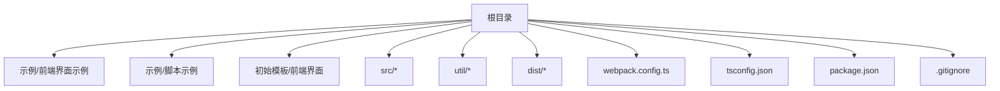
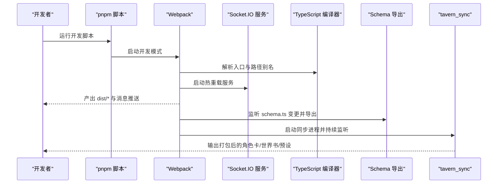
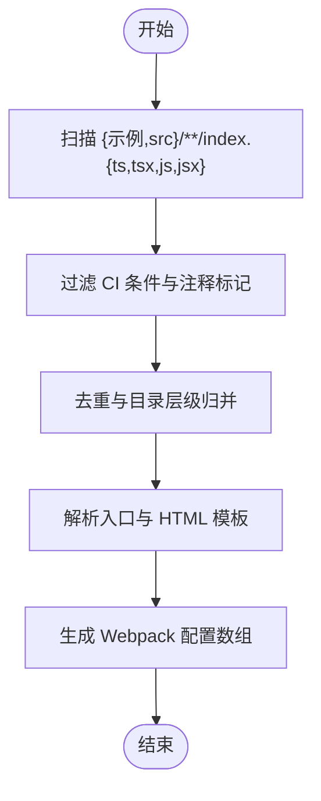
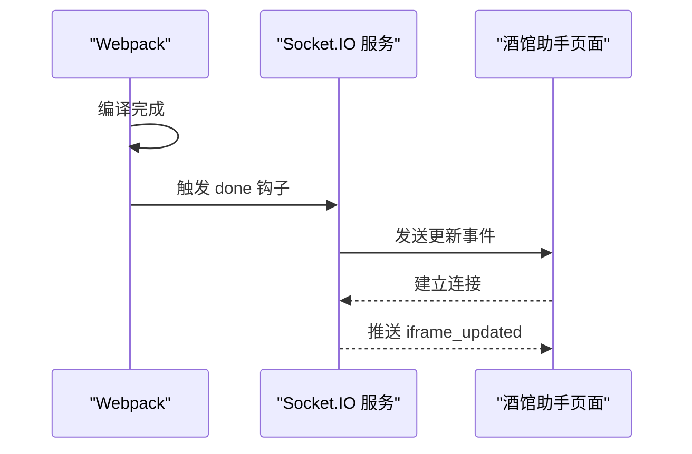
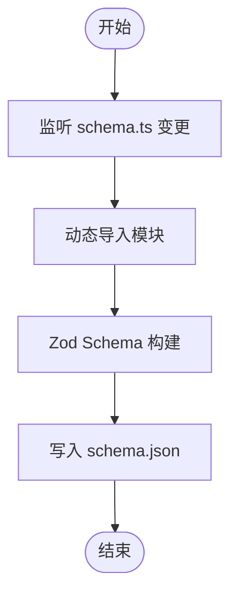
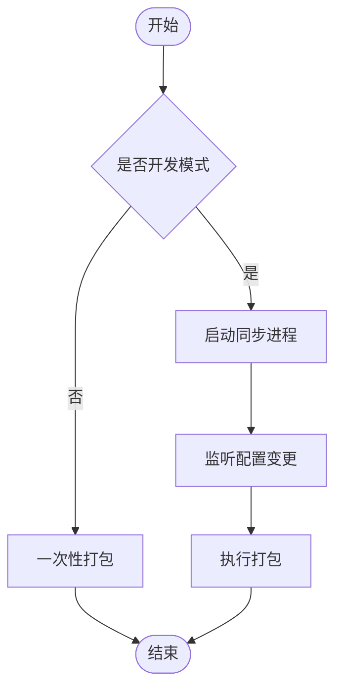
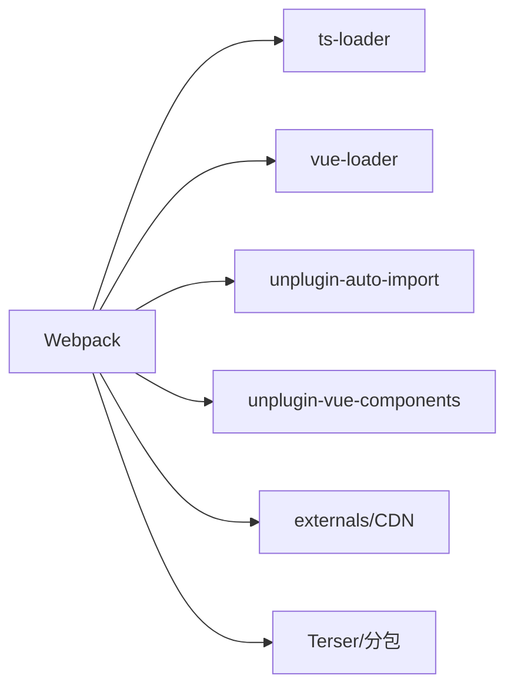

# 本地部署

<cite>
**本文引用的文件**
- [package.json](file://package.json)
- [webpack.config.ts](file://webpack.config.ts)
- [tsconfig.json](file://tsconfig.json)
- [eslint.config.mjs](file://eslint.config.mjs)
- [postcss.config.js](file://postcss.config.js)
- [README.md](file://README.md)
- [dump_schema.ts](file://dump_schema.ts)
- [tavern_sync.yaml](file://tavern_sync.yaml)
- [.gitignore](file://.gitignore)
- [初始模板/前端界面/新建为src文件夹中的文件夹/index.html](file://初始模板/前端界面/新建为src文件夹中的文件夹/index.html)
- [初始模板/前端界面/新建为src文件夹中的文件夹/index.ts](file://初始模板/前端界面/新建为src文件夹中的文件夹/index.ts)
- [示例/前端界面示例/index.html](file://示例/前端界面示例/index.html)
- [示例/前端界面示例/index.ts](file://示例/前端界面示例/index.ts)
- [示例/前端界面示例/界面.vue](file://示例/前端界面示例/界面.vue)
- [示例/前端界面示例/日记.vue](file://示例/前端界面示例/日记.vue)
- [示例/脚本示例/index.ts](file://示例/脚本示例/index.ts)
- [示例/脚本示例/设置界面.vue](file://示例/脚本示例/设置界面.vue)
</cite>

## 目录
1. [简介](#简介)
2. [项目结构](#项目结构)
3. [核心组件](#核心组件)
4. [架构总览](#架构总览)
5. [详细组件分析](#详细组件分析)
6. [依赖分析](#依赖分析)
7. [性能考虑](#性能考虑)
8. [故障排查指南](#故障排查指南)
9. [结论](#结论)
10. [附录](#附录)

## 简介
本指南面向希望在本地开发与部署“酒馆助手”相关前端界面与脚本的开发者。项目采用 TypeScript + Vue 3 + Webpack 构建体系，并通过 pnpm 管理依赖；同时集成自动打包、Schema 导出与“酒馆同步”（tavern_sync）能力，便于在本地快速迭代并在目标环境中生效。

## 项目结构
项目采用“示例/初始模板/src/util + dist 输出”的组织方式，核心入口由 Webpack 根据脚本文件自动扫描并生成多入口配置，支持：
- 前端界面（含 HTML 模板与 Vue 单文件组件）
- 脚本模块（TS/JS 入口，按需注入 HTML 模板）
- 角色卡/世界书/预设的本地配置与打包

图表来源
- [webpack.config.ts:77-80](file://webpack.config.ts#L77-L80)
- [tsconfig.json:41-52](file://tsconfig.json#L41-L52)

章节来源
- [README.md:45-47](file://README.md#L45-L47)
- [webpack.config.ts:51-75](file://webpack.config.ts#L51-L75)
- [tsconfig.json:16-23](file://tsconfig.json#L16-L23)

## 核心组件
- 构建系统与入口发现
  - Webpack 多入口：根据脚本文件自动扫描并生成入口，支持带 HTML 模板与纯脚本两类产物。
  - 开发/生产模式切换：通过脚本命令与参数控制。
- 类型与路径配置
  - TypeScript 路径别名与严格类型检查，确保跨模块引用稳定。
- 代码质量与样式管线
  - ESLint（Flat Config）、Prettier、PostCSS（Autoprefixer、Tailwind、Minify）。
- 自动化辅助
  - Schema 导出（dump_schema.ts）、tavern_sync（tavern_sync.yaml）与 Socket.IO 热重载推送。

章节来源
- [package.json:2-11](file://package.json#L2-L11)
- [webpack.config.ts:185-569](file://webpack.config.ts#L185-L569)
- [tsconfig.json:2-40](file://tsconfig.json#L2-L40)
- [eslint.config.mjs:14-81](file://eslint.config.mjs#L14-L81)
- [postcss.config.js:1-7](file://postcss.config.js#L1-L7)
- [dump_schema.ts:8-28](file://dump_schema.ts#L8-L28)
- [tavern_sync.yaml:1-28](file://tavern_sync.yaml#L1-L28)

## 架构总览
本地开发与部署的关键流程包括：依赖安装 → 启动开发构建 → 热重载监听 → 自动打包与同步 → 产物输出至 dist。

图表来源
- [package.json:2-11](file://package.json#L2-L11)
- [webpack.config.ts:83-107](file://webpack.config.ts#L83-L107)
- [webpack.config.ts:115-129](file://webpack.config.ts#L115-L129)
- [webpack.config.ts:137-183](file://webpack.config.ts#L137-L183)
- [dump_schema.ts:8-28](file://dump_schema.ts#L8-L28)
- [tavern_sync.yaml:6-27](file://tavern_sync.yaml#L6-L27)

## 详细组件分析

### 本地开发环境准备
- Node.js 与 pnpm
  - 使用 pnpm 管理依赖，推荐使用与项目锁定一致的 pnpm 版本，确保二进制依赖一致性。
  - 项目声明了仅构建期依赖的白名单，避免不必要的全局安装。
- 依赖安装
  - 安装命令：使用 pnpm 安装所有依赖（含 devDependencies），随后即可执行构建与开发脚本。
- 开发服务器与热重载
  - 开发模式通过 Webpack 监听文件变化并触发编译；同时内置 Socket.IO 服务向“酒馆助手”推送更新事件，实现热重载。
  - 端口默认值在配置中定义，若端口冲突可在运行时覆盖或调整配置。

章节来源
- [package.json:108-118](file://package.json#L108-L118)
- [webpack.config.ts:77-80](file://webpack.config.ts#L77-L80)
- [webpack.config.ts:83-107](file://webpack.config.ts#L83-L107)

### 依赖安装与开发脚本
- 安装依赖
  - 使用 pnpm 安装全部依赖，确保类型与构建插件可用。
- 常用脚本
  - 开发构建：构建开发版本，便于本地调试。
  - 监视构建：开发模式下监视文件变化并增量编译。
  - 生产构建：构建压缩后的产物。
  - 格式化与校验：Prettier 与 ESLint，保证代码风格与质量。
  - Schema 导出：将 schema.ts 转换为 schema.json。
  - tavern_sync：打包并同步角色卡/世界书/预设到本地或目标路径。

章节来源
- [package.json:2-11](file://package.json#L2-L11)
- [dump_schema.ts:8-28](file://dump_schema.ts#L8-L28)
- [tavern_sync.yaml:6-27](file://tavern_sync.yaml#L6-L27)

### 入口发现与多入口配置
- 自动入口发现
  - Webpack 会扫描示例与 src 目录下的 index.{ts,tsx,js,jsx} 文件，去重并生成对应入口。
  - 若存在同级 index.html，则自动注入 HTML 模板，否则生成纯脚本产物。
- 入口与输出
  - 输出目录为 dist，按入口所在目录层级组织；chunk 文件名包含 contenthash，便于缓存管理。
  - library 类型为 ES Module，适配外部模块导入。

图表来源
- [webpack.config.ts:51-75](file://webpack.config.ts#L51-L75)
- [webpack.config.ts:185-569](file://webpack.config.ts#L185-L569)

章节来源
- [webpack.config.ts:51-75](file://webpack.config.ts#L51-L75)
- [webpack.config.ts:191-226](file://webpack.config.ts#L191-L226)

### 热重载与 Socket.IO 集成
- 热重载机制
  - 开发模式下启动 Socket.IO 服务，监听编译完成事件并向“酒馆助手”推送更新消息。
  - 若存在 HtmlWebpackPlugin，则推送 message_iframe_updated；否则推送 script_iframe_updated。
- 跨域与 CORS
  - 服务端允许任意来源访问，便于本地调试与浏览器扩展通信。

图表来源
- [webpack.config.ts:83-107](file://webpack.config.ts#L83-L107)

章节来源
- [webpack.config.ts:83-107](file://webpack.config.ts#L83-L107)

### Schema 导出与数据模型
- 自动导出
  - 监听 src/**/schema.ts 变更，使用 Zod 将 Schema 转换为 JSON 并写入同目录 schema.json。
- 使用场景
  - 为角色卡/世界书/预设提供输入校验与文档化。

图表来源
- [dump_schema.ts:8-28](file://dump_schema.ts#L8-L28)

章节来源
- [dump_schema.ts:8-28](file://dump_schema.ts#L8-L28)

### tavern_sync 与角色卡/世界书打包
- 功能概述
  - 开发模式下启动同步进程，监听配置变更并打包角色卡/世界书/预设；非开发模式则一次性执行。
- 配置文件
  - 通过 tavern_sync.yaml 定义导出路径、本地文件路径与目标名称，支持相对/绝对路径。
- 进程生命周期
  - 监听编译启动、关闭与信号，确保资源释放。

图表来源
- [webpack.config.ts:137-183](file://webpack.config.ts#L137-L183)
- [tavern_sync.yaml:6-27](file://tavern_sync.yaml#L6-L27)

章节来源
- [webpack.config.ts:137-183](file://webpack.config.ts#L137-L183)
- [tavern_sync.yaml:6-27](file://tavern_sync.yaml#L6-L27)

### TypeScript 与路径别名
- 路径映射
  - @/* 映射至 src/*，@util/* 映射至 util/*，便于跨模块引用。
- 编译选项
  - ESNext 目标与模块，开启严格模式与 JSX 支持，配合 Vue 单文件组件与 Pinia 状态管理。

章节来源
- [tsconfig.json:2-40](file://tsconfig.json#L2-L40)
- [tsconfig.json:16-23](file://tsconfig.json#L16-L23)

### 代码质量与样式管线
- ESLint（Flat Config）
  - 使用 Vue、TypeScript、Import-X、Pinia 等插件，结合 Prettier 关闭冲突规则，统一风格。
- PostCSS
  - Autoprefixer、Tailwind、Minify 插件链，确保样式兼容与体积优化。

章节来源
- [eslint.config.mjs:14-81](file://eslint.config.mjs#L14-L81)
- [postcss.config.js:1-7](file://postcss.config.js#L1-L7)

### 示例与初始模板
- 前端界面示例
  - 包含基础 HTML 结构、路由与 Vue 组件，演示消息读取与渲染。
- 初始模板
  - 提供最小可运行的 Vue 应用入口与挂载逻辑，便于快速复制与扩展。
- 脚本示例
  - 展示事件绑定、设置界面与消息处理等常见模式。

章节来源
- [示例/前端界面示例/index.html:1-5](file://示例/前端界面示例/index.html#L1-L5)
- [示例/前端界面示例/index.ts:1-3](file://示例/前端界面示例/index.ts#L1-L3)
- [示例/前端界面示例/界面.vue:1-4](file://示例/前端界面示例/界面.vue#L1-L4)
- [示例/前端界面示例/日记.vue:1-107](file://示例/前端界面示例/日记.vue#L1-L107)
- [初始模板/前端界面/新建为src文件夹中的文件夹/index.html:1-5](file://初始模板/前端界面/新建为src文件夹中的文件夹/index.html#L1-L5)
- [初始模板/前端界面/新建为src文件夹中的文件夹/index.ts:1-9](file://初始模板/前端界面/新建为src文件夹中的文件夹/index.ts#L1-L9)
- [示例/脚本示例/index.ts:1-7](file://示例/脚本示例/index.ts#L1-L7)
- [示例/脚本示例/设置界面.vue:1-36](file://示例/脚本示例/设置界面.vue#L1-L36)

## 依赖分析
- 构建与打包
  - Webpack 与 ts-loader、vue-loader、unplugin-auto-import、unplugin-vue-components 等插件协同，实现类型解析、自动导入与组件解析。
- 外部依赖策略
  - 大部分依赖通过 CDN 引入（如 sass、vue、vue-router 等），减少打包体积；部分库通过 externals 注入全局变量。
- 优化策略
  - 生产模式启用 Terser 压缩与分包策略，限制最大并发请求，提升加载效率。

图表来源
- [webpack.config.ts:227-409](file://webpack.config.ts#L227-L409)
- [webpack.config.ts:470-520](file://webpack.config.ts#L470-L520)
- [webpack.config.ts:521-568](file://webpack.config.ts#L521-L568)

章节来源
- [webpack.config.ts:227-409](file://webpack.config.ts#L227-L409)
- [webpack.config.ts:470-520](file://webpack.config.ts#L470-L520)
- [webpack.config.ts:521-568](file://webpack.config.ts#L521-L568)

## 性能考虑
- 分包与懒加载
  - 异步分块与 vendor 缓存组，降低首屏体积与重复依赖。
- 压缩与 SourceMap
  - 生产模式启用压缩与 source-map；开发模式使用 eval-source-map 提升调试体验。
- 样式与资源
  - PostCSS 与 Minify 减少样式体积；raw/url 查询参数用于内联或内嵌资源，平衡网络与体积。

章节来源
- [webpack.config.ts:470-520](file://webpack.config.ts#L470-L520)
- [webpack.config.ts:195](file://webpack.config.ts#L195)
- [postcss.config.js:1-7](file://postcss.config.js#L1-L7)

## 故障排查指南
- 端口占用
  - 若默认端口被占用，可通过运行参数或环境变量调整；确认 Socket.IO 服务未被防火墙拦截。
- 依赖缺失
  - 确保 pnpm 安装完成且版本与锁定文件一致；检查 onlyBuiltDependencies 是否影响特定二进制。
- 热重载无效
  - 检查浏览器控制台是否存在跨域错误；确认 Socket.IO 服务已启动并推送事件。
- Schema 导出失败
  - 确认 schema.ts 导出名为 Schema 的 Zod 模式；检查 dump_schema.ts 的动态导入路径。
- tavern_sync 无法打包
  - 检查 tavern_sync.yaml 的路径配置；确认同步进程未被意外终止。

章节来源
- [webpack.config.ts:77-80](file://webpack.config.ts#L77-L80)
- [package.json:108-118](file://package.json#L108-L118)
- [webpack.config.ts:83-107](file://webpack.config.ts#L83-L107)
- [dump_schema.ts:8-28](file://dump_schema.ts#L8-L28)
- [tavern_sync.yaml:6-27](file://tavern_sync.yaml#L6-L27)

## 结论
本项目提供了从依赖安装、开发构建、热重载到自动打包与同步的一体化本地开发体验。通过合理的入口发现、外链依赖策略与自动化工具，开发者可以高效迭代前端界面与脚本，并在目标环境中稳定运行。

## 附录

### 本地开发工作流程
- 安装依赖
  - 使用 pnpm 安装全部依赖。
- 启动开发
  - 运行开发脚本，进入监视模式；打开浏览器并连接 Socket.IO 服务。
- 编写与调试
  - 修改示例/初始模板/src 中的文件，保存后自动编译并推送热重载。
- 导出与同步
  - 观察 Schema 导出与 tavern_sync 的输出，确认产物正确生成。

章节来源
- [package.json:2-11](file://package.json#L2-L11)
- [webpack.config.ts:83-107](file://webpack.config.ts#L83-L107)
- [dump_schema.ts:8-28](file://dump_schema.ts#L8-L28)
- [tavern_sync.yaml:6-27](file://tavern_sync.yaml#L6-L27)

### 本地测试与构建验证
- 本地测试
  - 在浏览器中打开生成的 HTML（若存在）或通过“酒馆助手”加载脚本产物。
- 构建验证
  - 运行生产构建脚本，检查 dist 目录产物与分包情况；确认 SourceMap 与压缩效果。
- 代码质量
  - 运行格式化与 ESLint 校验，修复警告与错误。

章节来源
- [package.json:2-11](file://package.json#L2-L11)
- [eslint.config.mjs:14-81](file://eslint.config.mjs#L14-L81)

### 部署前检查清单
- 依赖安装完整
- 开发构建无错误
- 热重载正常
- Schema 导出成功
- tavern_sync 打包成功
- 生产构建产物符合预期
- 代码风格与质量检查通过

章节来源
- [package.json:2-11](file://package.json#L2-L11)
- [webpack.config.ts:83-107](file://webpack.config.ts#L83-L107)
- [dump_schema.ts:8-28](file://dump_schema.ts#L8-L28)
- [tavern_sync.yaml:6-27](file://tavern_sync.yaml#L6-L27)

### 不同操作系统下的注意事项
- Windows
  - 注意路径分隔符与动态导入的 file:// 前缀处理；确保 pnpm 与 Node 版本兼容。
- macOS/Linux
  - 默认行为与 Windows 一致；注意符号链接与权限问题（如需要）。
- 跨平台差异
  - CDN 与 externals 依赖在各平台表现一致；注意本地路径大小写敏感性。

章节来源
- [dump_schema.ts:12-13](file://dump_schema.ts#L12-L13)
- [webpack.config.ts:521-568](file://webpack.config.ts#L521-L568)