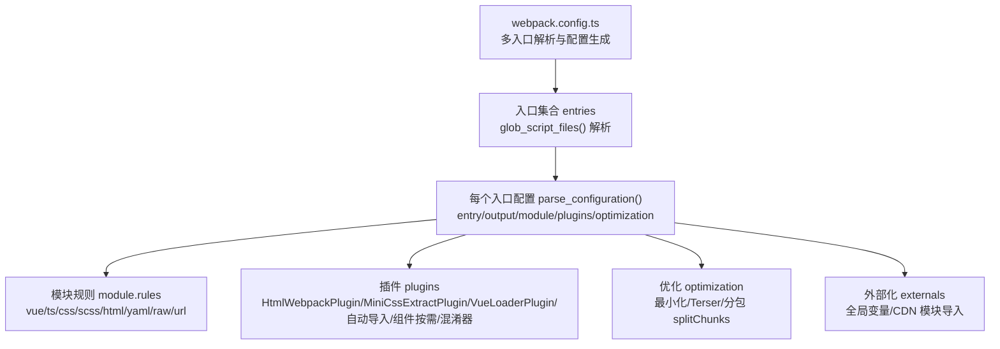
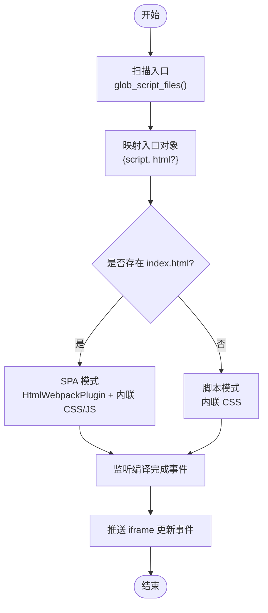
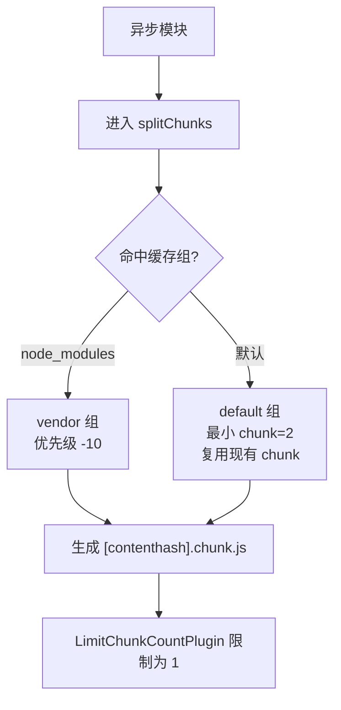
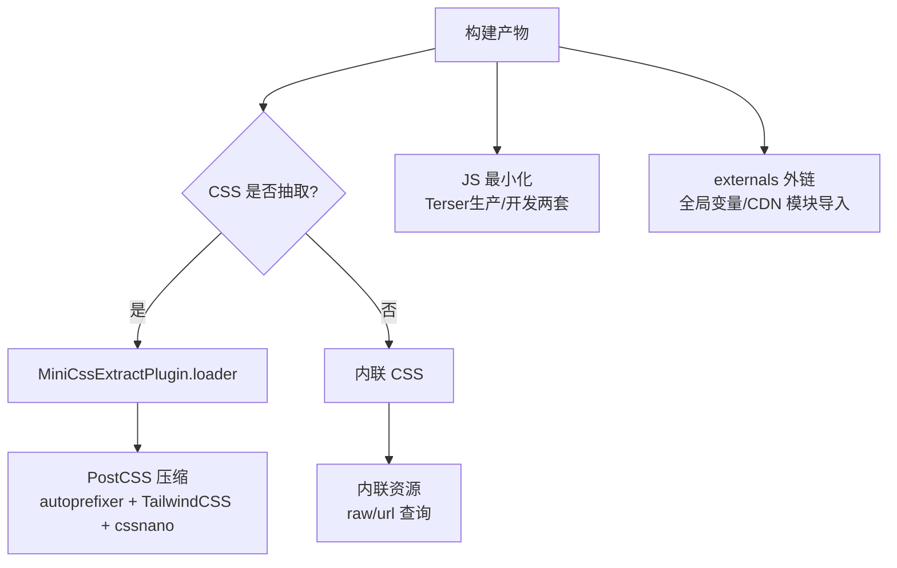
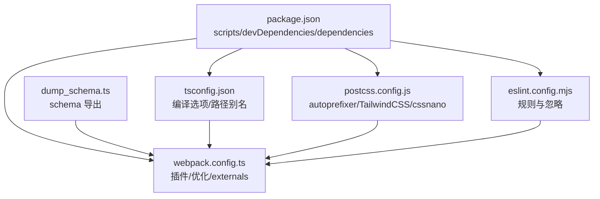

# 构建优化

<cite>
**本文引用的文件**   
- [webpack.config.ts](file://webpack.config.ts)
- [package.json](file://package.json)
- [tsconfig.json](file://tsconfig.json)
- [postcss.config.js](file://postcss.config.js)
- [eslint.config.mjs](file://eslint.config.mjs)
- [dump_schema.ts](file://dump_schema.ts)
- [tavern_sync.yaml](file://tavern_sync.yaml)
- [README.md](file://README.md)
- [示例/前端界面示例/index.ts](file://示例/前端界面示例/index.ts)
- [示例/前端界面示例/index.html](file://示例/前端界面示例/index.html)
- [初始模板/前端界面/新建为src文件夹中的文件夹/index.ts](file://初始模板/前端界面/新建为src文件夹中的文件夹/index.ts)
- [src/快速情节编排/index.ts](file://src/快速情节编排/index.ts)
</cite>

## 目录
1. [简介](#简介)
2. [项目结构](#项目结构)
3. [核心组件](#核心组件)
4. [架构总览](#架构总览)
5. [详细组件分析](#详细组件分析)
6. [依赖分析](#依赖分析)
7. [性能考量](#性能考量)
8. [故障排查指南](#故障排查指南)
9. [结论](#结论)
10. [附录](#附录)

## 简介
本指南聚焦于本项目的构建优化策略，涵盖多入口点配置、热重载机制、代码分割、TypeScript 编译与类型检查优化、生产环境构建与资源压缩、CDN 集成、构建时间分析与性能监控，以及开发与生产的差异化最佳实践。目标是在保证构建稳定性的同时，显著提升开发体验与产物性能。

## 项目结构
本项目采用多入口点的单页应用（SPA）与脚本混合模式：  
- 入口由扫描规则动态发现，支持示例与 src 目录下的 index.ts/html 组合作为独立构建单元。  
- 每个入口可选择是否生成 HTML 模板，若无模板则内联 CSS；若有模板，则抽取 CSS 并注入 HTML。  
- 构建产物输出至 dist 下对应子目录，chunk 文件名包含 contenthash，便于浏览器缓存优化。



图表来源
- [webpack.config.ts:51-75](file://webpack.config.ts#L51-L75)
- [webpack.config.ts:185-568](file://webpack.config.ts#L185-L568)

章节来源
- [webpack.config.ts:51-80](file://webpack.config.ts#L51-L80)
- [webpack.config.ts:185-568](file://webpack.config.ts#L185-L568)

## 核心组件
- 多入口点解析与生成
  - 动态扫描示例与 src 下的 index.{ts,tsx,js,jsx}，去重并映射到入口对象，支持带 HTML 模板的 SPA 与纯脚本两种模式。
- 模块与加载器
  - Vue 单文件组件、TypeScript/TSX、CSS/SCSS、HTML、Markdown、YAML、raw/url 资源处理，以及内联与抽取两类 CSS 输出策略。
- 插件体系
  - HTML 注入与内联、CSS 抽取、Vue Loader、自动导入与组件按需、DefinePlugin、分包限制、代码混淆。
- 优化与外部化
  - 生产/开发双套 Terser 配置、异步分包、vendor/default 缓存组、externals 将依赖外链至 CDN 或全局变量。
- 开发辅助
  - 监听 tavern_helper 事件推送、schema.json 导出、tavern_sync 打包流程联动。

章节来源
- [webpack.config.ts:51-80](file://webpack.config.ts#L51-L80)
- [webpack.config.ts:227-408](file://webpack.config.ts#L227-L408)
- [webpack.config.ts:440-483](file://webpack.config.ts#L440-L483)
- [webpack.config.ts:484-520](file://webpack.config.ts#L484-L520)
- [webpack.config.ts:521-567](file://webpack.config.ts#L521-L567)

## 架构总览
下图展示从入口到产物的关键流程：入口解析 → 配置生成 → 模块解析 → 插件执行 → 优化与外部化 → 产物输出。

```mermaid
sequenceDiagram
participant CLI as "命令行"
participant WPC as "webpack.config.ts"
participant CFG as "parse_configuration()"
participant MOD as "module.rules"
participant PLG as "plugins"
participant OPT as "optimization"
participant OUT as "output"
CLI->>WPC : 运行 webpack --mode [development|production]
WPC->>WPC : glob_script_files() 解析入口
WPC->>CFG : 为每个入口生成配置
CFG->>MOD : 应用各类型资源规则
CFG->>PLG : 注册插件含 HtmlWebpackPlugin/MiniCssExtractPlugin/VueLoaderPlugin/自动导入/组件按需/混淆
CFG->>OPT : 配置最小化与分包策略
OPT->>OUT : 产出 JS/CSS/HTML含 contenthash chunk
```

图表来源
- [webpack.config.ts:51-80](file://webpack.config.ts#L51-L80)
- [webpack.config.ts:185-568](file://webpack.config.ts#L185-L568)

## 详细组件分析

### 多入口点配置与热重载
- 入口解析
  - 通过 glob 匹配示例与 src 下的 index.ts/js，过滤 CI 环境标记文件，去重公共前缀目录，确保每个顶层目录仅保留一个入口。
- HTML 模板与内联策略
  - 若入口存在同目录 index.html，则启用 HtmlWebpackPlugin 并内联 CSS/JS；否则仅内联 CSS，适合脚本直出场景。
- 热重载与推送
  - 监听编译完成事件，向 tavern_helper 推送 iframe 更新消息，实现浏览器端自动刷新。
- 开发体验增强
  - DefinePlugin 禁用 hydration mismatch 详细信息，开启生产 DevTools（非 CI），限制 chunk 数量以减少并发。



图表来源
- [webpack.config.ts:51-80](file://webpack.config.ts#L51-L80)
- [webpack.config.ts:421-438](file://webpack.config.ts#L421-L438)
- [webpack.config.ts:83-107](file://webpack.config.ts#L83-L107)

章节来源
- [webpack.config.ts:51-80](file://webpack.config.ts#L51-L80)
- [webpack.config.ts:83-107](file://webpack.config.ts#L83-L107)
- [webpack.config.ts:421-438](file://webpack.config.ts#L421-L438)

### 代码分割策略与分包优化
- 异步分包
  - splitChunks.chunks 设为 async，仅对异步 chunk 生效，降低首屏体积。
- 缓存组
  - vendor：优先级 -10，命中 node_modules 的依赖单独分包；default：优先级 -20，复用现有 chunk，最小 chunk 数为 2。
- 产物命名
  - chunkFilename 使用 contenthash，有利于长缓存与增量更新。
- 分包限制
  - LimitChunkCountPlugin 限制最大 chunk 数为 1，适用于单页应用或脚本直出场景，减少网络并发与管理复杂度。



图表来源
- [webpack.config.ts:500-520](file://webpack.config.ts#L500-L520)
- [webpack.config.ts:463](file://webpack.config.ts#L463)

章节来源
- [webpack.config.ts:500-520](file://webpack.config.ts#L500-L520)
- [webpack.config.ts:463](file://webpack.config.ts#L463)

### TypeScript 编译与类型检查优化
- 编译选项
  - 目标与模块：ESNext；严格模式开启；允许未使用局部变量/参数可关闭；sourceMap 开启；路径别名与 tsconfig-paths 插件配合。
- 加载器配置
  - ts-loader 使用 transpileOnly 与 onlyCompileBundledFiles，加速编译；对 /raw/ 与 /url/ 查询的资源走 asset/source 与 asset/inline，避免重复解析。
- 类型检查
  - 本仓库未内置 ESLint 类型检查插件，建议在 CI 中启用类型检查任务，或在本地使用独立的 tsc --noEmit 命令进行全量校验，避免与构建速度冲突。

章节来源
- [tsconfig.json:2-40](file://tsconfig.json#L2-L40)
- [webpack.config.ts:234-316](file://webpack.config.ts#L234-L316)
- [eslint.config.mjs:14-81](file://eslint.config.mjs#L14-L81)

### 生产环境构建与资源压缩
- 最小化
  - 生产模式使用 TerserPlugin，保留部分保留字；开发模式禁用压缩与混淆，提高可读性。
- CSS 压缩
  - PostCSS 集成 autoprefixer、TailwindCSS 与 cssnano（通过 postcss-minify），在抽取 CSS 时一并压缩。
- 资源内联
  - 对 raw/url 查询的资源直接内联，减少请求；对普通资源采用抽取策略，结合 contenthash 实现长效缓存。
- 外部化与 CDN
  - externals 将常见依赖映射为全局变量或 CDN 模块导入，显著减小包体；对 sass 提供 CDN 源，其余依赖默认走 JSDelivr ESM。



图表来源
- [webpack.config.ts:388-406](file://webpack.config.ts#L388-L406)
- [webpack.config.ts:487-498](file://webpack.config.ts#L487-L498)
- [postcss.config.js:2-4](file://postcss.config.js#L2-L4)
- [webpack.config.ts:521-567](file://webpack.config.ts#L521-L567)

章节来源
- [webpack.config.ts:388-406](file://webpack.config.ts#L388-L406)
- [webpack.config.ts:487-498](file://webpack.config.ts#L487-L498)
- [postcss.config.js:2-4](file://postcss.config.js#L2-L4)
- [webpack.config.ts:521-567](file://webpack.config.ts#L521-L567)

### 开发与生产差异化策略
- 开发模式
  - eval-source-map 提升调试体验；禁用压缩与混淆；禁用 hydration mismatch 详细信息；开启生产 DevTools（非 CI）。
- 生产模式
  - source-map；启用压缩与混淆；抽取 CSS；externals 外链；contenthash chunk。
- 脚本混淆开关
  - 依据入口脚本是否包含特定标记决定是否启用混淆器，避免不必要的体积与兼容性问题。

章节来源
- [webpack.config.ts:195](file://webpack.config.ts#L195)
- [webpack.config.ts:487-498](file://webpack.config.ts#L487-L498)
- [webpack.config.ts:464-468](file://webpack.config.ts#L464-L468)
- [webpack.config.ts:186-188](file://webpack.config.ts#L186-L188)

### 构建时间分析与性能监控
- 分析方法
  - 使用 webpack-bundle-analyzer 生成可视化报告，定位大体积模块与重复依赖。
  - 结合 --stats 选项输出详细统计，关注 chunk 体积、模块数量与重复率。
- 监控要点
  - 关注 splitChunks 命中率与 vendor 分包大小；检查 externals 命中情况；观察 CSS 抽取与内联策略对首屏的影响。
- 工具推荐
  - webpack-bundle-analyzer、speed-measure-webpack-plugin（测量各插件耗时）、webpack-chart（交互式图表）。

[本节为通用指导，无需具体文件引用]

### 开发与生产最佳实践
- 开发
  - 使用 --watch 与进度条；启用 eval-source-map；避免过度分包；优先使用 externals 减少本地依赖体积。
- 生产
  - 启用最小化与混淆；抽取 CSS；使用 contenthash；合理设置 splitChunks；验证 CDN 外链可用性。
- 代码组织
  - 将第三方依赖集中在 node_modules，确保 vendor 分包命中；对业务代码进行模块化拆分，提升缓存命中。

[本节为通用指导，无需具体文件引用]

## 依赖分析
- 构建工具链
  - webpack、webpack-cli、terser-webpack-plugin、vue-loader、ts-loader、postcss 系列、html-webpack-plugin、mini-css-extract-plugin、unplugin-auto-import、unplugin-vue-components、webpack-obfuscator。
- 运行时依赖
  - vue、vue-router、@vueuse/*、pinia、jquery、lodash、yaml、zod 等，通过 externals 映射为全局变量或 CDN。
- 脚本与自动化
  - dump_schema.ts 将 schema.ts 转换为 schema.json；tavern_sync.yaml 配置角色卡/世界书/预设打包与导出路径。



图表来源
- [package.json:2-119](file://package.json#L2-L119)
- [tsconfig.json:2-40](file://tsconfig.json#L2-L40)
- [postcss.config.js:2-4](file://postcss.config.js#L2-L4)
- [eslint.config.mjs:14-81](file://eslint.config.mjs#L14-L81)
- [dump_schema.ts:8-28](file://dump_schema.ts#L8-L28)

章节来源
- [package.json:2-119](file://package.json#L2-L119)
- [tsconfig.json:2-40](file://tsconfig.json#L2-L40)
- [postcss.config.js:2-4](file://postcss.config.js#L2-L4)
- [eslint.config.mjs:14-81](file://eslint.config.mjs#L14-L81)
- [dump_schema.ts:8-28](file://dump_schema.ts#L8-L28)

## 性能考量
- 编译性能
  - ts-loader 使用 transpileOnly 与 onlyCompileBundledFiles；减少类型检查负担；必要时在 CI 中单独执行 tsc。
- 分包与缓存
  - 异步分包 + contenthash + externals，最大化缓存命中；LimitChunkCountPlugin 控制并发。
- 资源体积
  - raw/url 内联策略减少请求；抽取 CSS 并压缩；CDN 外链第三方库。
- 开发体验
  - eval-source-map 与生产 DevTools；自动导入与组件按需减少样板代码；tavern_helper 推送实现热更新。

[本节为通用指导，无需具体文件引用]

## 故障排查指南
- 构建失败或模块解析错误
  - 检查 tsconfig.json 的 paths 与 moduleResolution；确认 tsconfig-paths-webpack-plugin 已启用。
- CSS 未正确抽取或内联
  - 确认入口是否包含 index.html；无模板时仅内联 CSS；有模板时启用 MiniCssExtractPlugin。
- 外链依赖未生效
  - 检查 externals 映射表；确认 CDN 可达；对 sass 等特殊包使用指定 CDN。
- schema.json 未生成
  - 确认 dump_schema.ts 脚本执行；检查 schema.ts 文件与 Zod Schema 定义。
- tavern_sync 打包异常
  - 检查 tavern_sync.yaml 配置项；确认导出路径与本地路径格式正确；CI 环境下注意权限与网络可达性。

章节来源
- [tsconfig.json:16-23](file://tsconfig.json#L16-L23)
- [webpack.config.ts:421-438](file://webpack.config.ts#L421-L438)
- [webpack.config.ts:521-567](file://webpack.config.ts#L521-L567)
- [dump_schema.ts:8-28](file://dump_schema.ts#L8-L28)
- [tavern_sync.yaml:7-27](file://tavern_sync.yaml#L7-L27)

## 结论
本项目通过动态多入口、灵活的模块与插件配置、完善的优化与外部化策略，在开发体验与产物性能之间取得平衡。建议在实际工程中结合 bundle 分析与缓存策略持续迭代，进一步提升构建效率与运行性能。

## 附录
- 入口示例
  - 示例前端界面入口与模板：[示例/前端界面示例/index.ts](file://示例/前端界面示例/index.ts)，[示例/前端界面示例/index.html](file://示例/前端界面示例/index.html)
  - 初始模板入口：[初始模板/前端界面/新建为src文件夹中的文件夹/index.ts](file://初始模板/前端界面/新建为src文件夹中的文件夹/index.ts)
  - 主要业务脚本入口：[src/快速情节编排/index.ts](file://src/快速情节编排/index.ts)
- 构建脚本与说明
  - 构建脚本与 browserslist 配置：[package.json:2-14](file://package.json#L2-L14)
  - 仓库使用与自动更新说明：[README.md:49-68](file://README.md#L49-L68)