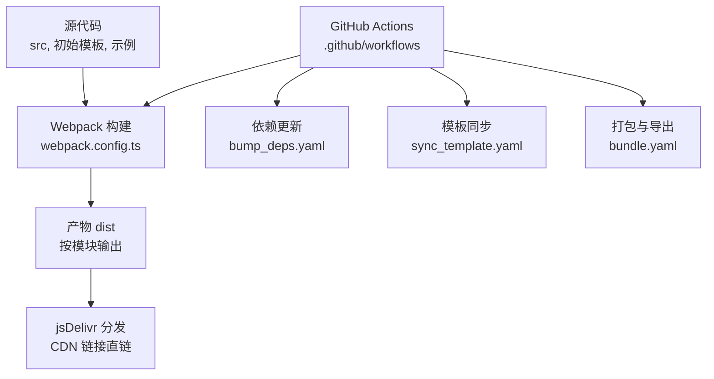
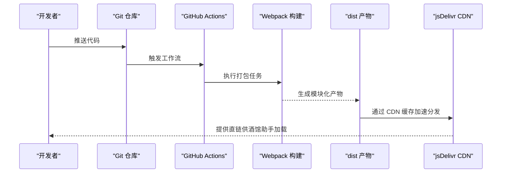
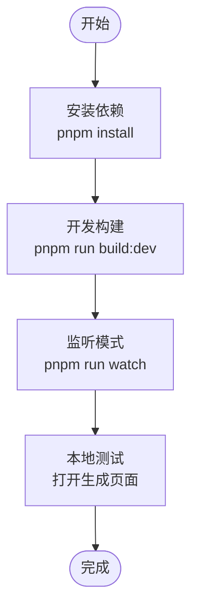
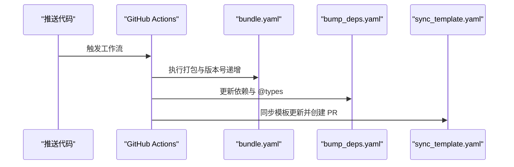
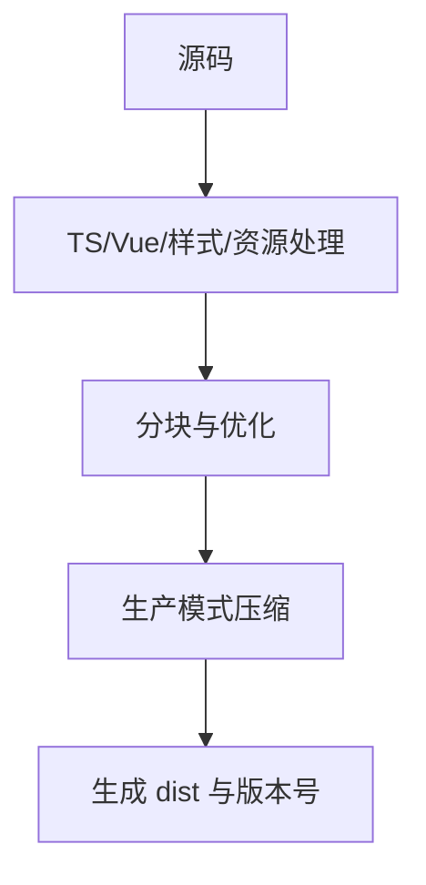
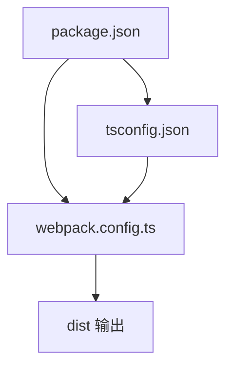

# 部署指南

<cite>
**本文引用的文件**
- [README.md](file://README.md)
- [package.json](file://package.json)
- [webpack.config.ts](file://webpack.config.ts)
- [tsconfig.json](file://tsconfig.json)
- [tavern_sync.yaml](file://tavern_sync.yaml)
- [tavern_sync.mjs](file://tavern_sync.mjs)
- [dump_schema.ts](file://dump_schema.ts)
- [.gitignore](file://.gitignore)
- [eslint.config.mjs](file://eslint.config.mjs)
</cite>

## 目录
1. [简介](#简介)
2. [项目结构](#项目结构)
3. [核心组件](#核心组件)
4. [架构总览](#架构总览)
5. [详细组件分析](#详细组件分析)
6. [依赖关系分析](#依赖关系分析)
7. [性能考虑](#性能考虑)
8. [故障排除指南](#故障排除指南)
9. [结论](#结论)
10. [附录](#附录)

## 简介
本指南面向希望将“酒馆助手模板”项目部署到生产环境的用户，覆盖以下目标：
- 本地部署与开发调试
- 基于 GitHub Actions 的 CI/CD 自动化
- jsDelivr CDN 集成与分发
- 构建优化与版本管理策略
- 部署后验证、监控与故障排除
- 不同部署方式的优缺点与适用场景

本项目提供两类主要使用路径：仅本地使用（不启用 jsDelivr 自动更新）与作为新仓库使用（启用 CI/CD 自动打包、模板同步与依赖更新）。

**章节来源**
- [README.md:1-105](file://README.md#L1-L105)

## 项目结构
项目采用“模板 + 自动化”的组织方式：
- 源代码位于 src 与 初始模板、示例 等目录
- 构建系统由 webpack 驱动，支持 TypeScript/Vue/样式/资源打包
- CI/CD 通过 GitHub Actions 工作流实现自动打包、依赖更新与模板同步
- jsDelivr 作为外部 CDN 用于分发 dist 输出，便于在酒馆助手环境中按需加载

**图表来源**
- [webpack.config.ts:1-572](file://webpack.config.ts#L1-L572)
- [README.md:71-89](file://README.md#L71-L89)

**章节来源**
- [webpack.config.ts:51-75](file://webpack.config.ts#L51-L75)
- [tsconfig.json:1-54](file://tsconfig.json#L1-L54)

## 核心组件
- 构建与打包
  - 使用 webpack 配置解析多入口（index.ts），自动扫描 src 与示例目录下的入口文件，生成对应 dist 输出；支持 Vue 单文件组件、样式、Markdown、YAML 等资源处理。
  - 生产模式启用代码压缩与分块策略，开发模式启用热更新与源码映射。
- 自动化同步与打包
  - tavern_sync.mjs 提供角色卡/世界书/预设的打包与监听能力，配合 webpack 插件在构建过程中触发。
  - dump_schema.ts 将 schema.ts 转换为 schema.json，便于运行时校验。
- CI/CD 工作流
  - README 中描述了 bundle、bump_deps、sync_template 三类工作流，分别负责打包、依赖更新与模板同步。
- 依赖与类型
  - package.json 定义了开发与运行时依赖，tsconfig.json 提供 TypeScript 编译配置与路径别名。

**章节来源**
- [webpack.config.ts:185-569](file://webpack.config.ts#L185-L569)
- [tavern_sync.mjs:1-800](file://tavern_sync.mjs#L1-L800)
- [dump_schema.ts:1-29](file://dump_schema.ts#L1-L29)
- [package.json:1-120](file://package.json#L1-L120)
- [tsconfig.json:1-54](file://tsconfig.json#L1-L54)

## 架构总览
下图展示从源码到生产分发的整体流程，包括本地开发、CI 构建与 jsDelivr CDN 分发：

**图表来源**
- [README.md:71-89](file://README.md#L71-L89)
- [webpack.config.ts:185-569](file://webpack.config.ts#L185-L569)

## 详细组件分析

### 本地部署与开发
- 环境准备
  - 安装 Node.js 与 pnpm（项目使用 pnpm 管理依赖）
  - 克隆仓库后安装依赖
- 启动开发服务器
  - 使用开发模式构建与监听，支持热更新与源码映射
  - 若存在入口对应的 index.html，将生成内联脚本的 HTML 页面
- 本地验证
  - 在浏览器中打开生成的页面进行界面调试
  - 使用 tavern_sync.mjs 的监听模式观察角色卡/世界书/预设的打包变化

**图表来源**
- [package.json:2-11](file://package.json#L2-L11)
- [webpack.config.ts:77-80](file://webpack.config.ts#L77-L80)

**章节来源**
- [package.json:2-11](file://package.json#L2-L11)
- [webpack.config.ts:77-80](file://webpack.config.ts#L77-L80)

### GitHub Actions 自动化部署
- 工作流概览
  - bundle.yaml：自动打包 src 与示例目录，生成 dist，并递增版本号以利于 CDN 缓存刷新
  - bump_deps.yaml：周期性更新第三方依赖与 @types
  - sync_template.yaml：同步模板仓库更新，必要时创建 PR
- 权限配置
  - 需要在仓库 Settings -> Actions -> General 中开启 Workflow 权限并允许创建/批准 PR
- 触发方式
  - README 指出可在 Actions 页面手动运行工作流，亦可通过推送触发

**图表来源**
- [README.md:71-89](file://README.md#L71-L89)

**章节来源**
- [README.md:20](file://README.md#L20)
- [README.md:71-89](file://README.md#L71-L89)

### jsDelivr CDN 集成
- 分发机制
  - 项目将打包产物上传至仓库，jsDelivr 通过直链提供 CDN 加速
  - README 展示了如何在前端界面或脚本中直接加载 CDN 链接
- 版本与缓存
  - bundle 工作流会递增版本号，有助于 CDN 快速刷新缓存
- 注意事项
  - 仅本地使用时无法享受 jsDelivr 自动更新能力

**图表来源**
- [README.md:49-69](file://README.md#L49-L69)
- [README.md:77-78](file://README.md#L77-L78)

**章节来源**
- [README.md:49-69](file://README.md#L49-L69)
- [README.md:77-78](file://README.md#L77-L78)

### 构建优化与版本管理
- 代码压缩与混淆
  - 生产模式启用 Terser 压缩与分块，按需引入混淆插件
- 外部依赖处理
  - 通过 externals 将部分库映射为全局变量或通过 jsDelivr CDN 引入，减少打包体积
- 分块与缓存
  - splitChunks 将 node_modules 等拆分为独立 chunk，提升缓存命中率
- 版本号递增
  - bundle 工作流中递增版本号，配合 CDN 缓存刷新策略

**图表来源**
- [webpack.config.ts:484-520](file://webpack.config.ts#L484-L520)
- [webpack.config.ts:521-567](file://webpack.config.ts#L521-L567)

**章节来源**
- [webpack.config.ts:484-520](file://webpack.config.ts#L484-L520)
- [webpack.config.ts:521-567](file://webpack.config.ts#L521-L567)

### 部署前准备
- 仓库设置
  - 创建新仓库或 fork 后启用 Actions 权限
  - 如需本地使用，可下载 ZIP 包离线使用
- 依赖安装
  - 使用 pnpm 安装依赖
- 配置文件
  - 修改 tavern_sync.yaml 以定义角色卡/世界书/预设的导出路径
  - 如需自定义打包范围，可在 webpack.config.ts 中调整扫描路径

**章节来源**
- [README.md:13-31](file://README.md#L13-L31)
- [tavern_sync.yaml:1-28](file://tavern_sync.yaml#L1-L28)
- [webpack.config.ts:51-75](file://webpack.config.ts#L51-L75)

### 部署后验证与监控
- 验证步骤
  - 在酒馆助手环境中加载 jsDelivr 直链，确认界面/脚本正常渲染
  - 检查 dist 产物是否包含预期模块
- 监控建议
  - 关注 Actions 工作流运行状态与日志
  - 使用 ESLint/Prettier 保持代码质量
- 常见问题排查
  - 构建失败：检查 tsconfig.json 与 webpack.config.ts 的路径与规则
  - CDN 加载异常：确认直链 URL 与仓库分支一致，等待 CDN 缓存刷新

**章节来源**
- [README.md:49-69](file://README.md#L49-L69)
- [eslint.config.mjs:1-82](file://eslint.config.mjs#L1-L82)

## 依赖关系分析
- 开发依赖与运行时依赖
  - package.json 明确列出开发与运行时依赖，确保本地与 CI 环境一致性
- TypeScript 配置
  - tsconfig.json 提供严格类型检查与路径别名，避免路径解析问题
- 构建插件生态
  - webpack.config.ts 集成了 Vue、样式、资源、自动导入、组件解析、混淆等插件，形成完整的前端工程化流水线

**图表来源**
- [package.json:1-120](file://package.json#L1-L120)
- [tsconfig.json:1-54](file://tsconfig.json#L1-L54)
- [webpack.config.ts:185-569](file://webpack.config.ts#L185-L569)

**章节来源**
- [package.json:1-120](file://package.json#L1-L120)
- [tsconfig.json:1-54](file://tsconfig.json#L1-L54)
- [webpack.config.ts:185-569](file://webpack.config.ts#L185-L569)

## 性能考虑
- 代码分割与懒加载
  - splitChunks 将第三方库独立拆分，降低重复打包
- 压缩与混淆
  - 生产模式启用压缩与符号混淆，减小传输体积
- 外部依赖 CDN 化
  - 通过 externals 将常用库交由 jsDelivr 提供，进一步降低包体
- 构建缓存与增量更新
  - dist 冲突策略与版本号递增配合 CDN 刷新，保证更新及时性

**章节来源**
- [webpack.config.ts:484-520](file://webpack.config.ts#L484-L520)
- [webpack.config.ts:521-567](file://webpack.config.ts#L521-L567)

## 故障排除指南
- 本地构建失败
  - 检查 tsconfig.json 的 include/exclude 与路径别名
  - 确认 webpack.config.ts 的入口扫描逻辑与资源规则
- CDN 加载失败
  - 核对直链 URL 与仓库分支，等待 jsDelivr 缓存刷新
  - 确认 dist 产物已成功上传
- Actions 工作流异常
  - 查看工作流日志，确认权限配置与触发条件
  - 如需同步模板更新，留意 PR 创建与批准流程
- 依赖更新问题
  - bump_deps 工作流定期执行，若失败可手动运行或检查网络与权限

**章节来源**
- [README.md:71-89](file://README.md#L71-L89)
- [webpack.config.ts:51-75](file://webpack.config.ts#L51-L75)

## 结论
本指南提供了从本地开发到生产部署的完整路径，结合 GitHub Actions 自动化与 jsDelivr CDN 分发，能够稳定地交付前端界面与脚本。建议优先采用“作为新仓库使用”的方式，以获得自动打包、依赖更新与模板同步的能力；仅在无需自动更新的场景下考虑“仅本地使用”。

## 附录

### 部署步骤清单
- 准备阶段
  - 创建仓库并启用 Actions 权限
  - 安装 pnpm 与依赖
- 本地开发
  - 使用开发模式构建与监听
  - 通过 tavern_sync.mjs 观察打包变化
- 自动化部署
  - 推送代码触发 bundle 工作流
  - 定期运行 bump_deps 与 sync_template
- 生产分发
  - 使用 jsDelivr 直链在酒馆助手加载
  - 关注版本号递增与 CDN 缓存刷新

**章节来源**
- [README.md:20](file://README.md#L20)
- [README.md:71-89](file://README.md#L71-L89)
- [package.json:2-11](file://package.json#L2-L11)