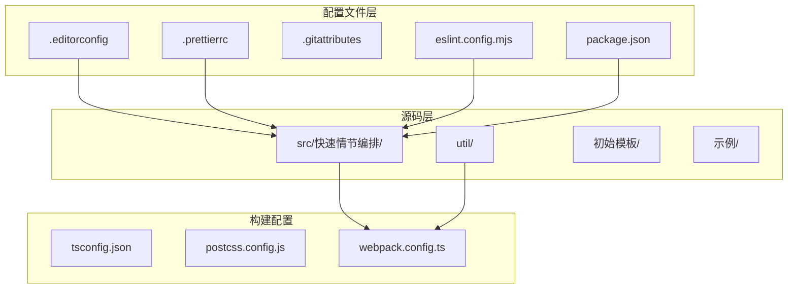
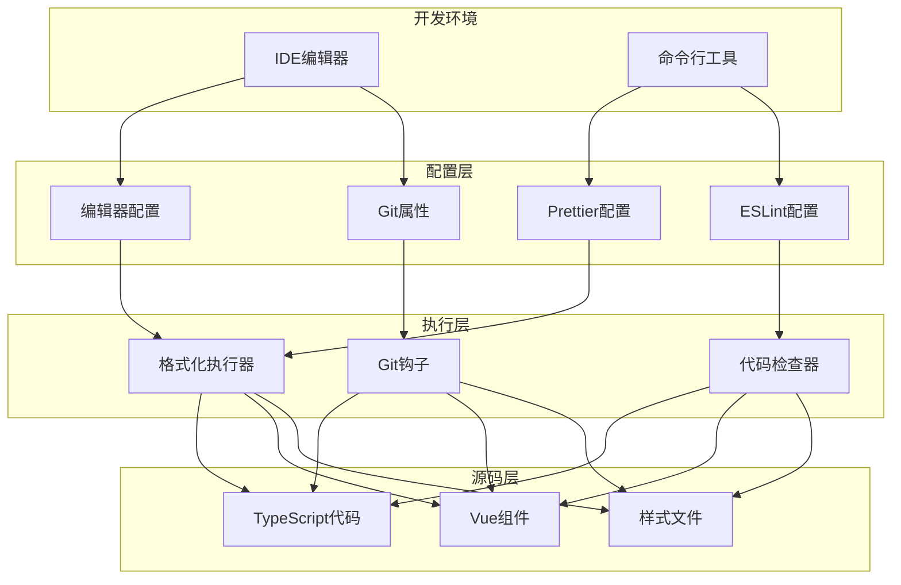
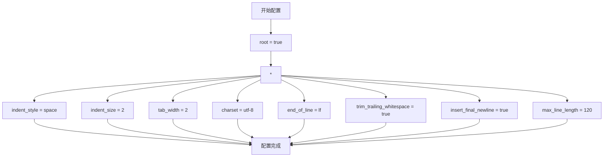
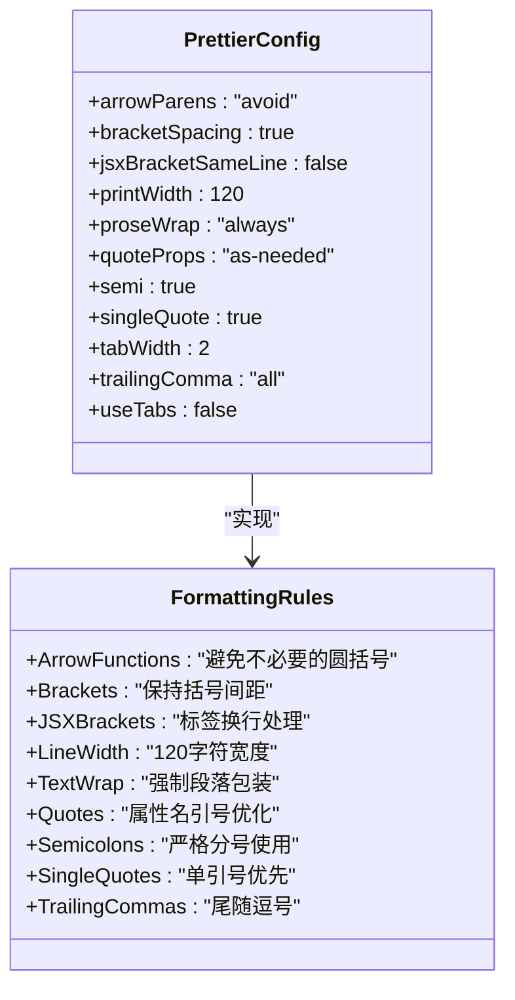
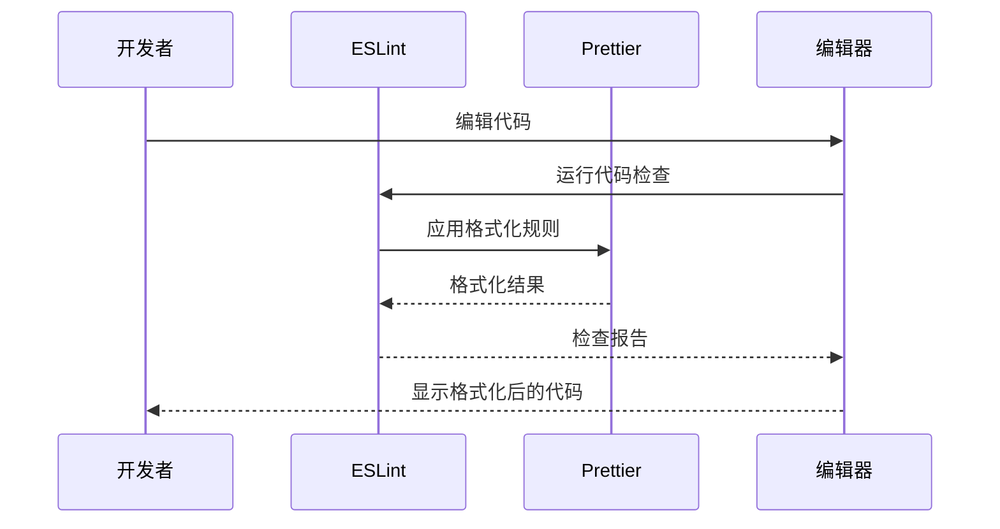
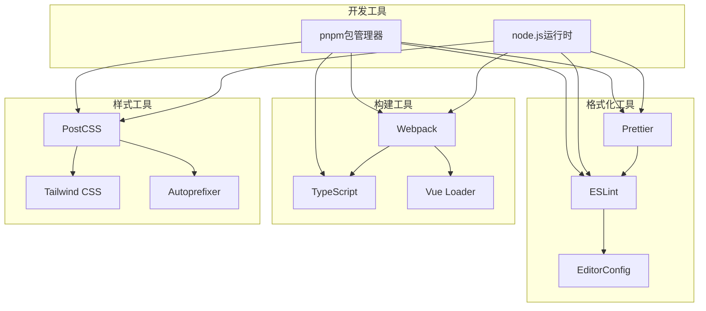
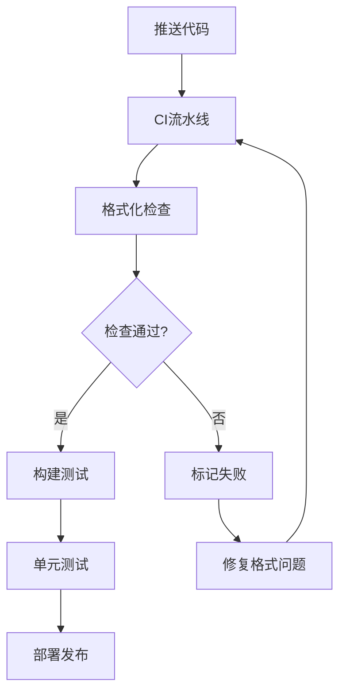

# 代码格式化配置

<cite>
**本文档引用的文件**
- [.editorconfig](file://.editorconfig)
- [.prettierrc](file://.prettierrc)
- [.gitattributes](file://.gitattributes)
- [package.json](file://package.json)
- [eslint.config.mjs](file://eslint.config.mjs)
- [tsconfig.json](file://tsconfig.json)
- [postcss.config.js](file://postcss.config.js)
- [webpack.config.ts](file://webpack.config.ts)
- [src/快速情节编排/index.ts](file://src/快速情节编排/index.ts)
- [util/common.ts](file://util/common.ts)
- [初始模板/前端界面/新建为src文件夹中的文件夹/App.vue](file://初始模板/前端界面/新建为src文件夹中的文件夹/App.vue)
</cite>

## 目录
1. [简介](#简介)
2. [项目结构](#项目结构)
3. [核心组件](#核心组件)
4. [架构概览](#架构概览)
5. [详细组件分析](#详细组件分析)
6. [依赖分析](#依赖分析)
7. [性能考虑](#性能考虑)
8. [故障排除指南](#故障排除指南)
9. [结论](#结论)
10. [附录](#附录)

## 简介

本项目采用统一的代码格式化配置体系，确保团队协作中代码风格的一致性和可维护性。该配置体系涵盖了编辑器基础配置、Prettier代码格式化、ESLint代码质量检查以及Git文件属性管理等多个方面。

项目使用现代前端技术栈，包括TypeScript、Vue.js、Webpack等，通过完善的配置体系确保代码质量和开发体验。

## 项目结构

项目采用模块化的组织方式，主要包含以下结构：



**图表来源**
- [.editorconfig](file://.editorconfig)
- [.prettierrc](file://.prettierrc)
- [package.json](file://package.json)
- [eslint.config.mjs](file://eslint.config.mjs)

**章节来源**
- [package.json](file://package.json)
- [tsconfig.json](file://tsconfig.json)

## 核心组件

### 编辑器配置系统

项目使用.editorconfig作为基础编辑器配置标准，定义了统一的编码规范：

- **缩进设置**: 使用空格缩进，缩进宽度为2个字符
- **字符编码**: UTF-8编码，确保多语言支持
- **行尾符**: LF（Unix风格），避免跨平台问题
- **行长度**: 最大120字符，平衡可读性和代码紧凑性
- **空白处理**: 自动移除行尾空白，确保代码整洁

### 代码格式化引擎

Prettier作为主要的代码格式化工具，提供了以下配置：

- **括号换行**: 采用智能换行策略，提升可读性
- **箭头函数圆括号**: 避免不必要的圆括号，保持简洁
- **对象属性逗号**: 使用尾随逗号，便于版本控制
- **单引号优先**: 统一字符串表示方式
- **分号使用**: 严格遵循分号规范

### Git文件属性管理

.gitattributes文件定义了Git仓库的文件处理策略：

- **文本文件自动识别**: 智能识别不同类型的文本文件
- **行尾符转换**: 统一LF格式，避免Windows/Linux差异
- **特殊文件处理**: 批处理文件使用CRLF格式
- **合并策略**: dist目录使用ours策略，防止意外覆盖

**章节来源**
- [.editorconfig](file://.editorconfig)
- [.prettierrc](file://.prettierrc)
- [.gitattributes](file://.gitattributes)

## 架构概览

整个代码格式化配置体系采用分层架构设计，各组件协同工作：



**图表来源**
- [.editorconfig](file://.editorconfig)
- [.prettierrc](file://.prettierrc)
- [eslint.config.mjs](file://eslint.config.mjs)
- [.gitattributes](file://.gitattributes)

## 详细组件分析

### 编辑器配置详解

.editorconfig文件定义了基础的编辑器行为规范：



**图表来源**
- [.editorconfig](file://.editorconfig)

#### 关键配置说明

- **缩进策略**: 使用空格而非制表符，确保在不同编辑器中显示一致性
- **字符集**: UTF-8支持国际化开发需求
- **行尾符**: LF格式避免跨平台兼容性问题
- **行长度限制**: 120字符的合理限制，平衡代码可读性

**章节来源**
- [.editorconfig](file://.editorconfig)

### Prettier配置分析

.prettierrc文件提供了详细的代码格式化规则：



**图表来源**
- [.prettierrc](file://.prettierrc)

#### 核心规则解读

- **箭头函数圆括号**: `"avoid"`策略避免不必要的括号，提升代码简洁性
- **对象属性逗号**: `"all"`模式使用尾随逗号，便于版本控制和代码维护
- **单引号优先**: 统一字符串表示，减少转义字符
- **分号使用**: 严格遵循分号规范，避免自动分号插入问题

**章节来源**
- [.prettierrc](file://.prettierrc)

### Git属性配置

.gitattributes文件定义了Git仓库的文件处理策略：

```mermaid
flowchart TD
START[Git属性配置] --> TEXT[* text=auto eol=lf]
START --> CMD[*.{cmd,[cC][mM][dD]} text eol=crlf]
START --> BAT[*.{bat,[bB][aA][tT]} text eol=crlf]
START --> DIST[dist/** merge=ours]
TEXT --> AUTO[自动识别文本文件]
TEXT --> LF[LF行尾符]
CMD --> CRLF1[CRLF行尾符]
BAT --> CRLF2[CRLF行尾符]
DIST --> OURS[ours合并策略]
AUTO --> END[Git配置完成]
LF --> END
CRLF1 --> END
CRLF2 --> END
OURS --> END
```

**图表来源**
- [.gitattributes](file://.gitattributes)

#### 文件类型处理

- **通用文本文件**: 自动识别并统一使用LF行尾符
- **批处理文件**: 特殊处理CRLF格式，确保Windows兼容性
- **构建产物**: dist目录使用ours策略，防止意外覆盖

**章节来源**
- [.gitattributes](file://.gitattributes)

### ESLint配置集成

eslint.config.mjs文件整合了Prettier配置，确保格式化一致性：



**图表来源**
- [eslint.config.mjs](file://eslint.config.mjs)
- [package.json](file://package.json)

#### 配置特点

- **Prettier集成**: 通过eslint-config-prettier消除冲突规则
- **TypeScript支持**: 完整的TypeScript语法检查
- **Vue.js支持**: Vue组件的专门规则配置
- **插件生态**: 丰富的ESLint插件扩展

**章节来源**
- [eslint.config.mjs](file://eslint.config.mjs)
- [package.json](file://package.json)

## 依赖分析

### 工具链依赖关系



**图表来源**
- [package.json](file://package.json)
- [tsconfig.json](file://tsconfig.json)
- [postcss.config.js](file://postcss.config.js)
- [webpack.config.ts](file://webpack.config.ts)

### 版本兼容性

项目工具链采用兼容性设计，确保各组件间的稳定协作：

- **TypeScript版本**: 6.0.0-dev.20250807，支持最新特性
- **ESLint版本**: 9.39.4，提供强大的代码检查能力
- **Prettier版本**: 3.8.1，稳定的格式化工具
- **Webpack版本**: 5.105.4，成熟的构建工具

**章节来源**
- [package.json](file://package.json)
- [tsconfig.json](file://tsconfig.json)

## 性能考虑

### 格式化性能优化

项目在格式化性能方面采用了多项优化措施：

- **增量格式化**: 仅对修改的文件进行格式化处理
- **缓存机制**: 利用编辑器缓存减少重复计算
- **并行处理**: 多文件格式化时充分利用多核CPU
- **智能忽略**: 自动忽略node_modules等不需要格式化的目录

### 构建时格式化

webpack配置中集成了格式化流程，确保构建过程中的代码质量：


**图表来源**
- [webpack.config.ts](file://webpack.config.ts)
- [package.json](file://package.json)

## 故障排除指南

### 常见问题及解决方案

#### 编辑器配置不生效

**问题症状**: 编辑器不按照.editorconfig规则格式化

**解决步骤**:
1. 确认编辑器安装了EditorConfig插件
2. 检查文件是否位于项目根目录
3. 验证文件编码为UTF-8
4. 重启编辑器应用配置

#### Prettier格式化冲突

**问题症状**: Prettier与其他格式化工具产生冲突

**解决步骤**:
1. 安装eslint-config-prettier消除冲突
2. 确保ESLint配置中包含prettier规则
3. 检查VS Code中Prettier扩展的优先级
4. 清理编辑器缓存重新加载

#### Git文件属性异常

**问题症状**: Git提交时行尾符不一致导致冲突

**解决步骤**:
1. 检查.gitattributes文件语法
2. 确认文件类型匹配模式正确
3. 重新添加文件到Git索引
4. 验证本地Git配置

**章节来源**
- [.editorconfig](file://.editorconfig)
- [.prettierrc](file://.prettierrc)
- [.gitattributes](file://.gitattributes)
- [eslint.config.mjs](file://eslint.config.mjs)

## 结论

本项目的代码格式化配置体系体现了现代前端开发的最佳实践，通过统一的配置标准确保了团队协作的一致性和代码质量的稳定性。

### 主要优势

- **统一标准**: 编辑器、格式化工具、Git配置形成完整的标准体系
- **自动化程度高**: 通过脚本和配置实现大部分格式化自动化
- **团队协作友好**: 明确的规范减少了代码审查中的格式争议
- **可维护性强**: 集中的配置文件便于维护和升级

### 实践建议

1. **定期更新**: 随着工具链版本更新及时调整配置
2. **团队培训**: 确保所有成员理解并遵守格式化规范
3. **CI集成**: 在持续集成中加入格式化检查环节
4. **工具支持**: 为常用编辑器配置相应的格式化插件

## 附录

### IDE集成指南

#### VS Code集成

1. **安装必要扩展**:
   - EditorConfig for VS Code
   - Prettier - Code formatter
   - ESLint
   - Vue Language Features (Volar)

2. **配置VS Code设置**:
   ```json
   {
     "editor.formatOnSave": true,
     "editor.codeActionsOnSave": {
       "source.fixAll.eslint": true
     },
     "editor.defaultFormatter": "esbenp.prettier-vscode"
   }
   ```

#### WebStorm/IntelliJ集成

1. **启用EditorConfig插件**
2. **配置Prettier**:
   - Settings → Tools → Actions on Save
   - Enable "Reformat code" and "Optimize imports"
3. **配置ESLint**:
   - Settings → Languages and Frameworks → JavaScript → Code Quality Tools
   - ESLint → Automatic ESLint configuration

#### 其他编辑器

- **Sublime Text**: 安装EditorConfig和Prettier插件
- **Atom**: 安装editorconfig和atom-beautify插件
- **Vim/Neovim**: 配置vim-prettier和editorconfig插件

### 团队协作最佳实践

#### 代码审查要点

1. **格式一致性**: 检查是否符合项目格式化规范
2. **命名约定**: 确保变量、函数、文件命名符合团队标准
3. **注释规范**: 保持注释的完整性和一致性
4. **导入顺序**: 遵循统一的导入语句排序规则

#### 版本控制建议

1. **提交前格式化**: 在提交前运行格式化脚本
2. **分支策略**: 在功能分支上保持格式化一致性
3. **合并冲突**: 使用格式化工具解决合并冲突
4. **历史记录**: 避免在历史记录中混杂格式化变更

#### 持续集成配置



**图表来源**
- [package.json](file://package.json)
- [eslint.config.mjs](file://eslint.config.mjs)