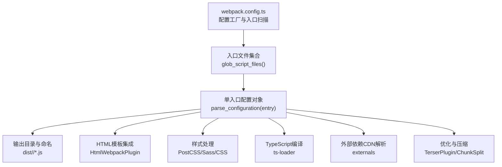
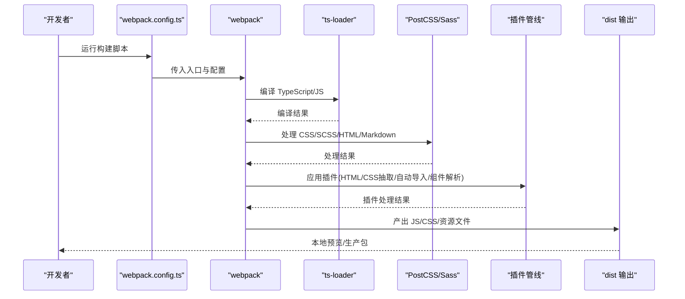
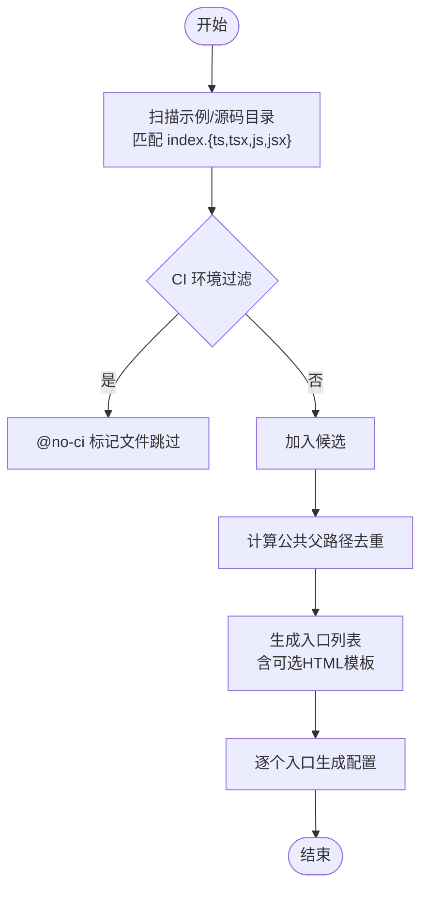
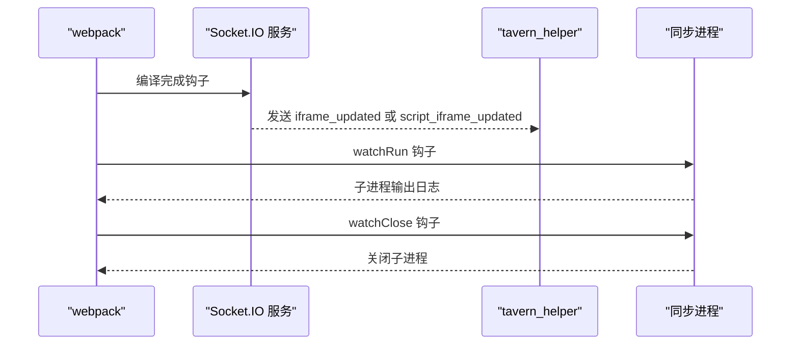
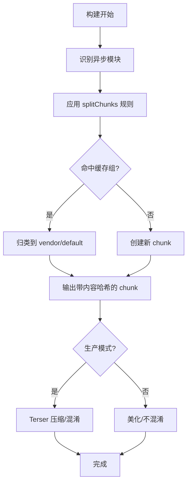
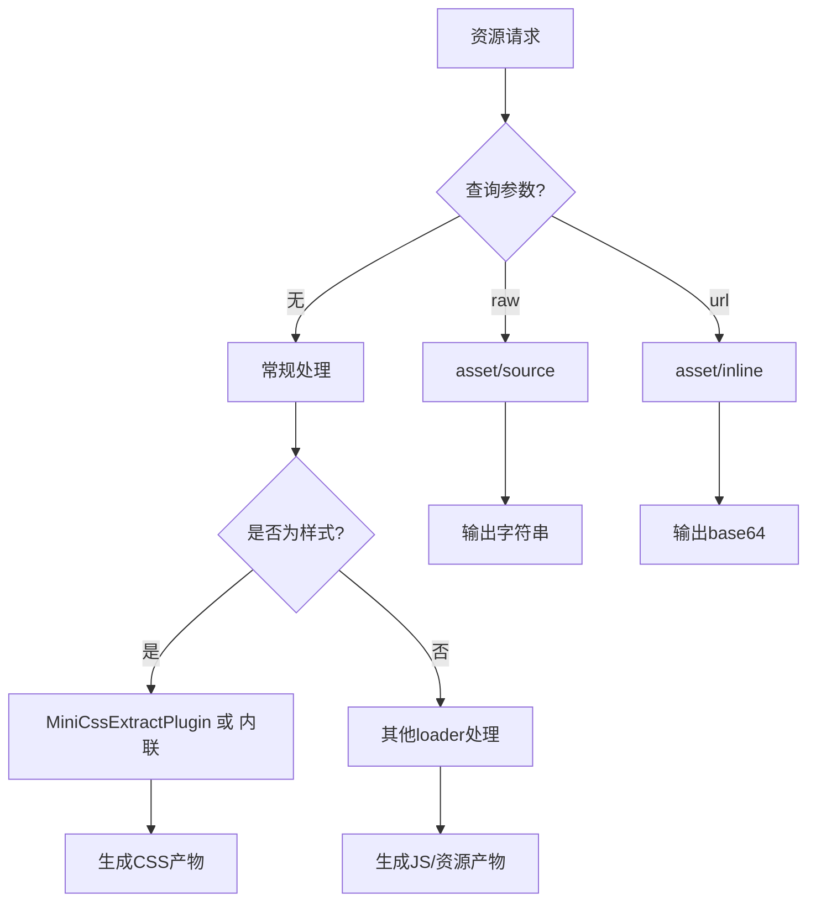
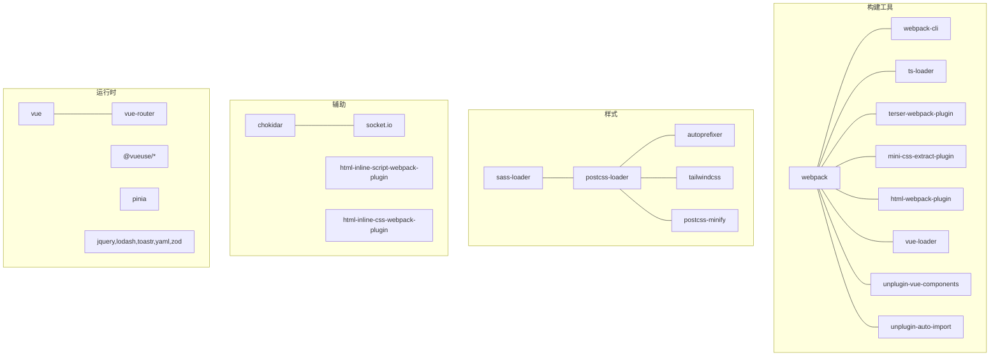

# 构建配置

<cite>
**本文档引用的文件**
- [webpack.config.ts](file://webpack.config.ts)
- [tsconfig.json](file://tsconfig.json)
- [package.json](file://package.json)
- [postcss.config.js](file://postcss.config.js)
- [global.d.ts](file://global.d.ts)
- [util/common.ts](file://util/common.ts)
- [util/mvu.ts](file://util/mvu.ts)
- [初始模板/前端界面/新建为src文件夹中的文件夹/index.html](file://初始模板/前端界面/新建为src文件夹中的文件夹/index.html)
- [示例/前端界面示例/index.html](file://示例/前端界面示例/index.html)
- [示例/角色卡示例/界面/状态栏/index.html](file://示例/角色卡示例/界面/状态栏/index.html)
- [示例/前端界面示例/index.ts](file://示例/前端界面示例/index.ts)
- [示例/角色卡示例/界面/状态栏/index.ts](file://示例/角色卡示例/界面/状态栏/index.ts)
- [示例/流式楼层界面示例/index.ts](file://示例/流式楼层界面示例/index.ts)
</cite>

## 目录
1. [简介](#简介)
2. [项目结构](#项目结构)
3. [核心组件](#核心组件)
4. [架构总览](#架构总览)
5. [详细组件分析](#详细组件分析)
6. [依赖分析](#依赖分析)
7. [性能考虑](#性能考虑)
8. [故障排除指南](#故障排除指南)
9. [结论](#结论)

## 简介
本文件系统化梳理本项目的构建配置，重点覆盖以下方面：
- 多入口点配置：自动扫描示例与源码目录下的入口文件，生成对应构建条目
- 开发与生产模式差异：源码映射、压缩器行为、插件启用策略
- 热重载与同步：监听与推送机制、Schema转换与打包同步
- 代码分割与优化：异步分块、缓存组、最小化策略
- TypeScript 编译与路径解析：严格类型检查、路径映射、模块解析
- 资源处理与CDN：CSS/样式抽取、内联、外链依赖解析
- 性能优化与调试：构建速度、体积控制、调试工具链

## 项目结构
本项目采用“多入口点 + 单配置工厂”的方式组织构建，通过扫描示例与源码目录中的 index.{ts,tsx,js,jsx} 文件，动态生成每个入口对应的 webpack 配置。每个入口可选地关联一个 HTML 模板，用于生成独立的页面产物。

图表来源
- [webpack.config.ts:51-75](file://webpack.config.ts#L51-L75)
- [webpack.config.ts:185-568](file://webpack.config.ts#L185-L568)

章节来源
- [webpack.config.ts:51-80](file://webpack.config.ts#L51-L80)
- [webpack.config.ts:185-572](file://webpack.config.ts#L185-L572)

## 核心组件
- 入口点扫描与解析
  - 自动扫描示例与源码目录，过滤 CI 环境标记文件，去重公共父路径，生成入口列表
  - 每个入口包含脚本路径与可选的 HTML 模板路径
- 配置工厂
  - 针对每个入口返回完整的 webpack 配置，包含模块规则、解析、插件、优化等
- 开发与生产差异化
  - 源码映射策略、压缩器参数、插件启用与禁用
- 热重载与同步
  - Socket.IO 监听与推送、Schema 转换与打包同步
- 代码分割与优化
  - 异步分块、缓存组、最小化策略
- TypeScript 与路径解析
  - tsconfig.json 提供编译选项、路径映射、模块解析策略
- 资源处理与 CDN
  - CSS 抽取与内联、资源查询参数支持、外部依赖解析到 CDN

章节来源
- [webpack.config.ts:32-38](file://webpack.config.ts#L32-L38)
- [webpack.config.ts:51-75](file://webpack.config.ts#L51-L75)
- [webpack.config.ts:185-568](file://webpack.config.ts#L185-L568)
- [tsconfig.json:1-54](file://tsconfig.json#L1-L54)

## 架构总览
下图展示从入口到产物的构建全链路，包括资源加载、编译、样式处理、优化与输出。

图表来源
- [webpack.config.ts:191-568](file://webpack.config.ts#L191-L568)
- [postcss.config.js:1-7](file://postcss.config.js#L1-L7)

## 详细组件分析

### 多入口点配置与扫描
- 扫描范围与过滤
  - 扫描示例与源码目录下的 index.{ts,tsx,js,jsx} 文件
  - CI 环境下跳过包含特定标记的文件
  - 基于公共父路径去重，避免重复构建同一子树
- 入口解析
  - 若存在同目录下的 index.html，则作为模板参与 HTML 产物生成
  - 动态生成每个入口的配置对象
- 输出布局
  - 输出目录基于入口所在相对路径，文件名保留原名，chunk 使用内容哈希

图表来源
- [webpack.config.ts:51-75](file://webpack.config.ts#L51-L75)
- [webpack.config.ts:32-38](file://webpack.config.ts#L32-L38)

章节来源
- [webpack.config.ts:51-80](file://webpack.config.ts#L51-L80)
- [webpack.config.ts:191-226](file://webpack.config.ts#L191-L226)

### 开发与生产模式差异
- 源码映射
  - 生产：使用 source-map
  - 开发：使用 eval-source-map，提升增量编译速度
- 压缩器行为
  - 生产：启用 Terser，保留部分全局标识符，开启混淆
  - 开发：美化、关闭压缩与混淆，便于调试
- 插件启用策略
  - 开发：启用热重载相关插件与监听器
  - 生产：限制 chunk 数量，减少运行时开销
- 目标与实验特性
  - 目标浏览器：browserslist 默认配置
  - 实验特性：outputModule 启用 ES Module 输出

章节来源
- [webpack.config.ts:195](file://webpack.config.ts#L195)
- [webpack.config.ts:484-499](file://webpack.config.ts#L484-L499)
- [webpack.config.ts:463-468](file://webpack.config.ts#L463-L468)
- [package.json:12-14](file://package.json#L12-L14)

### 热重载与同步机制
- 酒馆助手监听
  - 启动 Socket.IO 服务器，监听编译完成事件并向页面推送更新
  - 根据是否使用 HtmlWebpackPlugin 决定推送的消息类型
- Schema 转换与打包同步
  - 非 watch 模式直接执行转换与打包
  - watch 模式下通过 chokidar 监听 schema.ts 变更，防抖触发转换
  - 启动同步进程，监听文件变更并输出日志

图表来源
- [webpack.config.ts:83-107](file://webpack.config.ts#L83-L107)
- [webpack.config.ts:115-129](file://webpack.config.ts#L115-L129)
- [webpack.config.ts:137-183](file://webpack.config.ts#L137-L183)

章节来源
- [webpack.config.ts:83-183](file://webpack.config.ts#L83-L183)

### 代码分割与优化策略
- 异步分块
  - asyncChunks 启用，仅对异步 chunk 进行拆分
  - chunkFilename 包含内容哈希，利于缓存
- 缓存组
  - vendor：node_modules 下的第三方库
  - default：复用现有 chunk，避免重复
- 最小化
  - 生产：启用 Terser，自定义保留标识符
  - 开发：关闭压缩与混淆，美化输出
- Chunk 限制
  - LimitChunkCountPlugin 限制最大 chunk 数量，降低运行时复杂度

图表来源
- [webpack.config.ts:500-520](file://webpack.config.ts#L500-L520)
- [webpack.config.ts:484-499](file://webpack.config.ts#L484-L499)
- [webpack.config.ts:463](file://webpack.config.ts#L463)

章节来源
- [webpack.config.ts:500-520](file://webpack.config.ts#L500-L520)
- [webpack.config.ts:484-499](file://webpack.config.ts#L484-L499)

### TypeScript 编译与路径解析
- 编译目标与模块
  - 目标与模块均为 ESNext，便于现代浏览器特性利用
  - 输出目录 dist，baseUrl 为项目根
- 路径映射
  - @/* 映射至 src/*
  - @util/* 映射至 util/*
- 类型与严格性
  - 启用严格模式，检查未使用局部变量与参数
  - 支持 JSX，允许 JavaScript 与检查 JS
- 模块解析
  - 使用 bundler 解析策略，结合 tsconfig-paths-webpack-plugin
- 类型声明
  - 通过 global.d.ts 声明资源模块与全局变量，支持 ?raw 与 ?url 查询

章节来源
- [tsconfig.json:12-40](file://tsconfig.json#L12-L40)
- [tsconfig.json:16-23](file://tsconfig.json#L16-L23)
- [tsconfig.json:41-53](file://tsconfig.json#L41-L53)
- [webpack.config.ts:411-420](file://webpack.config.ts#L411-L420)
- [global.d.ts:1-45](file://global.d.ts#L1-L45)

### 资源处理与 CDN 引入
- 样式处理
  - 无 HTML 模板时：使用 MiniCssExtractPlugin 抽取 CSS
  - 有 HTML 模板时：使用 HtmlWebpackPlugin 生成页面，配合 CSS 内联
- 资源查询参数
  - ?raw：以字符串形式内联
  - ?url：以内联 base64 形式内联
- 外部依赖解析
  - 优先解析为全局变量（如 jQuery、Lodash、Vue 等）
  - 无法解析的依赖通过 CDN 引入（默认使用 jsDelivr 的 ESM 版本）

图表来源
- [webpack.config.ts:227-408](file://webpack.config.ts#L227-L408)
- [webpack.config.ts:521-567](file://webpack.config.ts#L521-L567)

章节来源
- [webpack.config.ts:227-408](file://webpack.config.ts#L227-L408)
- [webpack.config.ts:521-567](file://webpack.config.ts#L521-L567)

### HTML 模板与入口组织
- HTML 模板
  - 若入口脚本所在目录存在 index.html，则作为模板参与构建
  - 模板中通过 HtmlWebpackPlugin 注入模块化脚本
- 入口组织
  - 示例与源码中的 index.ts/index.js 作为入口
  - Vue 项目入口通常包含 App.vue 与全局样式

章节来源
- [webpack.config.ts:421-438](file://webpack.config.ts#L421-L438)
- [初始模板/前端界面/新建为src文件夹中的文件夹/index.html:1-5](file://初始模板/前端界面/新建为src文件夹中的文件夹/index.html#L1-L5)
- [示例/前端界面示例/index.html](file://示例/前端界面示例/index.html)
- [示例/角色卡示例/界面/状态栏/index.html](file://示例/角色卡示例/界面/状态栏/index.html)
- [示例/前端界面示例/index.ts:1-3](file://示例/前端界面示例/index.ts#L1-L3)
- [示例/角色卡示例/界面/状态栏/index.ts:1-10](file://示例/角色卡示例/界面/状态栏/index.ts#L1-L10)
- [示例/流式楼层界面示例/index.ts:1-8](file://示例/流式楼层界面示例/index.ts#L1-L8)

## 依赖分析
- 构建工具链
  - webpack、webpack-cli：核心打包工具
  - ts-loader：TypeScript 编译
  - terser-webpack-plugin：生产压缩
  - mini-css-extract-plugin：CSS 抽取
  - html-webpack-plugin：HTML 生成
  - vue-loader、unplugin-vue-components、unplugin-auto-import：Vue 生态增强
- 样式与预处理
  - postcss-loader、sass-loader、autoprefixer、@tailwindcss/postcss、postcss-minify
- 辅助与监听
  - chokidar、socket.io、html-inline-script-webpack-plugin、html-inline-css-webpack-plugin
- 运行时依赖
  - vue、vue-router、@vueuse/*、pinia、jquery、lodash、toastr、yaml、zod 等

图表来源
- [package.json:15-77](file://package.json#L15-L77)
- [postcss.config.js:1-7](file://postcss.config.js#L1-L7)

章节来源
- [package.json:15-118](file://package.json#L15-L118)
- [postcss.config.js:1-7](file://postcss.config.js#L1-L7)

## 性能考虑
- 构建速度
  - 开发模式使用 eval-source-map 与较轻的压缩策略
  - 通过 LimitChunkCountPlugin 控制 chunk 数量，减少运行时开销
  - 使用 ts-loader transpileOnly，仅编译被打包的文件
- 体积控制
  - splitChunks 缓存组分离第三方库与共享模块
  - 生产模式启用 Terser 并保留必要标识符
- 资源优化
  - ?raw 与 ?url 查询参数用于内联小资源，减少请求数
  - CSS 抽取与内联策略按是否存在 HTML 模板自动切换
- 外部依赖
  - 通过 externals 将常用库解析为全局变量或 CDN，减小包体

章节来源
- [webpack.config.ts:195](file://webpack.config.ts#L195)
- [webpack.config.ts:463](file://webpack.config.ts#L463)
- [webpack.config.ts:272-284](file://webpack.config.ts#L272-L284)
- [webpack.config.ts:521-567](file://webpack.config.ts#L521-L567)

## 故障排除指南
- 构建失败或模块解析错误
  - 确认 tsconfig.json 中的 baseUrl 与 paths 是否正确
  - 检查 tsconfig-paths-webpack-plugin 是否正确指向 tsconfig.json
- 样式未生效或 CSS 抽取异常
  - 若存在 HTML 模板，确认 HtmlWebpackPlugin 是否启用
  - 检查 CSS/SCSS 加载器顺序与 url 处理选项
- 外部依赖未加载或 CDN 404
  - 检查 externals 规则与 CDN 映射
  - 确认网络可达性与 jsDelivr 的 ESM 版本可用性
- 热重载无效
  - 确认 Socket.IO 服务端口与 CORS 配置
  - 检查 watch 模式与编译完成钩子是否触发
- Schema 转换未执行
  - 非 watch 模式会直接执行转换；watch 模式需确保 chokidar 监听生效
  - 查看同步进程输出日志定位问题

章节来源
- [webpack.config.ts:411-420](file://webpack.config.ts#L411-L420)
- [webpack.config.ts:421-438](file://webpack.config.ts#L421-L438)
- [webpack.config.ts:521-567](file://webpack.config.ts#L521-L567)
- [webpack.config.ts:83-183](file://webpack.config.ts#L83-L183)

## 结论
本构建配置通过“多入口点 + 配置工厂”的方式，实现了对示例与源码的统一管理；结合开发/生产模式差异、热重载与同步机制、代码分割与优化策略、TypeScript 路径解析与资源处理，形成了高效且可维护的构建体系。建议在团队协作中遵循统一的入口组织规范与资源查询参数约定，以最大化构建效率与产物质量。