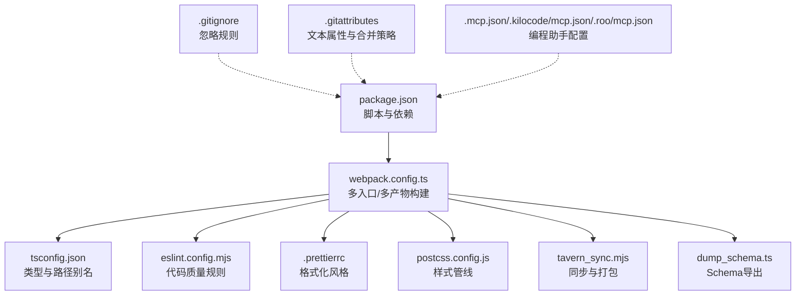
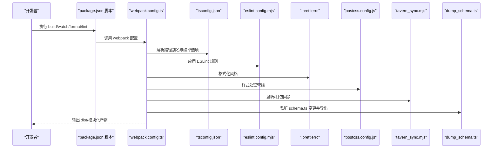
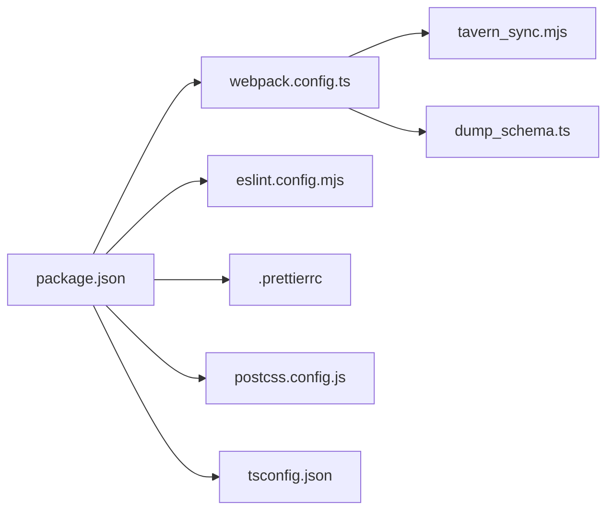

# 环境配置

<cite>
**本文引用的文件**
- [.mcp.json](file://.mcp.json)
- [.kilocode\mcp.json](file://.kilocode\mcp.json)
- [.roo\mcp.json](file://.roo\mcp.json)
- [.gitignore](file://.gitignore)
- [.gitattributes](file://.gitattributes)
- [package.json](file://package.json)
- [tsconfig.json](file://tsconfig.json)
- [eslint.config.mjs](file://eslint.config.mjs)
- [.prettierrc](file://.prettierrc)
- [postcss.config.js](file://postcss.config.js)
- [webpack.config.ts](file://webpack.config.ts)
- [.editorconfig](file://.editorconfig)
- [tavern_sync.yaml](file://tavern_sync.yaml)
- [dump_schema.ts](file://dump_schema.ts)
- [tavern_sync.mjs](file://tavern_sync.mjs)
</cite>

## 目录
1. [简介](#简介)
2. [项目结构](#项目结构)
3. [核心组件](#核心组件)
4. [架构总览](#架构总览)
5. [详细组件分析](#详细组件分析)
6. [依赖关系分析](#依赖关系分析)
7. [性能考虑](#性能考虑)
8. [故障排查指南](#故障排查指南)
9. [结论](#结论)
10. [附录](#附录)

## 简介
本文件面向开发者与维护者，系统化梳理本项目的环境配置与工程化配置，覆盖以下主题：
- 环境变量与版本控制配置
- 依赖管理与构建工具链
- 编程助手与规则配置（.mcp.json）
- 版本控制忽略规则（.gitignore）与属性（.gitattributes）
- 包管理与脚本命令（package.json）
- 开发环境搭建建议（Node.js、包管理器、IDE/编辑器）
- 版本控制最佳实践与发布流程

## 项目结构
本项目采用“多入口、多产物”的前端工程化组织方式，结合 TypeScript、Webpack、Prettier、ESLint、PostCSS/TailwindCSS 等工具链，支持在 SillyTavern/TavernHelper 生态中进行脚本与界面的开发与同步。

图表来源
- [package.json:1-120](file://package.json#L1-L120)
- [webpack.config.ts:1-572](file://webpack.config.ts#L1-L572)
- [tsconfig.json:1-54](file://tsconfig.json#L1-L54)
- [eslint.config.mjs:1-82](file://eslint.config.mjs#L1-L82)
- [.prettierrc:1-14](file://.prettierrc#L1-L14)
- [postcss.config.js:1-7](file://postcss.config.js#L1-L7)
- [tavern_sync.mjs:1-800](file://tavern_sync.mjs#L1-L800)
- [dump_schema.ts:1-29](file://dump_schema.ts#L1-L29)
- [.gitignore:1-14](file://.gitignore#L1-L14)
- [.gitattributes:1-6](file://.gitattributes#L1-L6)
- [.mcp.json:1-1](file://.mcp.json#L1-L1)
- [.kilocode\mcp.json:1-1](file://.kilocode\mcp.json#L1-L1)
- [.roo\mcp.json:1-1](file://.roo\mcp.json#L1-L1)

章节来源
- [package.json:1-120](file://package.json#L1-L120)
- [webpack.config.ts:1-572](file://webpack.config.ts#L1-L572)
- [.gitignore:1-14](file://.gitignore#L1-L14)
- [.gitattributes:1-6](file://.gitattributes#L1-L6)
- [.mcp.json:1-1](file://.mcp.json#L1-L1)

## 核心组件
- 构建与打包：Webpack 多入口、按需外链、资源内联、分包与混淆
- 类型与路径：TypeScript 配置、路径别名、严格模式
- 代码质量：ESLint 平台化配置、Prettier 统一风格
- 样式管线：PostCSS + TailwindCSS 自动前缀与压缩
- 同步与打包：tavern_sync.mjs 支持监听与批量打包
- Schema 导出：dump_schema.ts 将 Zod Schema 转 JSON
- 版本控制：.gitignore/.gitattributes 控制忽略与属性
- 助手配置：.mcp.json/.kilocode/mcp.json/.roo/mcp.json 指向 Cursor 的 MCP 配置

章节来源
- [webpack.config.ts:185-572](file://webpack.config.ts#L185-L572)
- [tsconfig.json:1-54](file://tsconfig.json#L1-L54)
- [eslint.config.mjs:1-82](file://eslint.config.mjs#L1-L82)
- [postcss.config.js:1-7](file://postcss.config.js#L1-L7)
- [tavern_sync.mjs:1-800](file://tavern_sync.mjs#L1-L800)
- [dump_schema.ts:1-29](file://dump_schema.ts#L1-L29)
- [.gitignore:1-14](file://.gitignore#L1-L14)
- [.gitattributes:1-6](file://.gitattributes#L1-L6)
- [.mcp.json:1-1](file://.mcp.json#L1-L1)
- [.kilocode\mcp.json:1-1](file://.kilocode\mcp.json#L1-L1)
- [.roo\mcp.json:1-1](file://.roo\mcp.json#L1-L1)

## 架构总览
下图展示从开发到部署的关键流程：开发者通过 npm/pnpm 脚本触发 Webpack 构建；构建过程中联动 tavern_sync.mjs 实时同步至目标应用，并在非 CI 环境下自动导出 Schema 与触发 Socket 通知。

图表来源
- [package.json:2-11](file://package.json#L2-L11)
- [webpack.config.ts:185-572](file://webpack.config.ts#L185-L572)
- [tsconfig.json:16-22](file://tsconfig.json#L16-L22)
- [eslint.config.mjs:14-81](file://eslint.config.mjs#L14-L81)
- [.prettierrc:1-14](file://.prettierrc#L1-L14)
- [postcss.config.js:1-7](file://postcss.config.js#L1-L7)
- [tavern_sync.mjs:137-183](file://tavern_sync.mjs#L137-L183)
- [dump_schema.ts:8-28](file://dump_schema.ts#L8-L28)

## 详细组件分析

### 编程助手与规则配置（.mcp.json 与派生）
- .mcp.json 指向 Cursor 的 MCP 配置文件，用于在 Cursor 中启用特定规则与助手行为。
- .kilocode/mcp.json 与 .roo/mcp.json 作为符号链接或代理，指向同一配置，确保多工作区一致性。
- 建议在 Cursor 中打开仓库根目录，以便正确加载 MCP 规则。

章节来源
- [.mcp.json:1-1](file://.mcp.json#L1-L1)
- [.kilocode\mcp.json:1-1](file://.kilocode\mcp.json#L1-L1)
- [.roo\mcp.json:1-1](file://.roo\mcp.json#L1-L1)

### 版本控制忽略与属性（.gitignore 与 .gitattributes）
- .gitignore
  - 忽略 node_modules 与常见系统文件（.DS_Store、Thumbs.db）
  - 忽略各类日志文件（npm/yarn/pnpm）
  - 忽略自动生成的类型声明文件（auto-imports.d.ts、components.d.ts）
- .gitattributes
  - 统一文本换行（LF），Windows 批处理脚本使用 CRLF
  - dist/** 使用合并策略 ours，避免误合并二进制/构建产物

章节来源
- [.gitignore:1-14](file://.gitignore#L1-L14)
- [.gitattributes:1-6](file://.gitattributes#L1-L6)

### 包管理与脚本命令（package.json）
- 脚本命令
  - build: 生产模式打包
  - build:dev: 开发模式打包
  - watch: 开发模式监听打包
  - format: Prettier 格式化
  - lint / lint:fix: ESLint 检查与修复
  - dump: 调用 dump_schema.ts 导出 Schema
  - sync: 调用 tavern_sync.mjs 同步/打包
- 依赖与开发依赖
  - TypeScript 6.0.0-dev（开发版）
  - Vue 3、React、Pinia、GSAP、Pixi 等运行时依赖
  - Webpack 生态、ESLint、Prettier、TailwindCSS、PostCSS 等工具链
- pnpm 专属
  - onlyBuiltDependencies：仅对指定依赖执行原生构建，加速安装

章节来源
- [package.json:2-11](file://package.json#L2-L11)
- [package.json:15-107](file://package.json#L15-L107)
- [package.json:108-118](file://package.json#L108-L118)

### TypeScript 配置（tsconfig.json）
- 编译目标与模块：ESNext
- 路径别名：@/* 指向 src，@util/* 指向 util
- 严格模式：noUnusedLocals/Parameters、noImplicitReturns、noFallthroughCasesInSwitch 等
- JSX：react-jsx
- 入口范围：包含 @types、示例、初始模板、src、util 与全局类型声明
- 排除：dist 与 node_modules

章节来源
- [tsconfig.json:2-40](file://tsconfig.json#L2-L40)
- [tsconfig.json:41-52](file://tsconfig.json#L41-L52)

### 代码质量与格式化（ESLint 与 Prettier）
- ESLint
  - 使用 Flat Config，集成 TypeScript、Vue、Import-X、Pinia、TailwindCSS 插件
  - 针对 Vue/TailwindCSS 的规则与设置
  - 屏蔽部分严格规则（如 no-unused-vars），保留关键约束
- Prettier
  - 统一缩进宽度、引号、尾随逗号、换行宽度等风格

章节来源
- [eslint.config.mjs:14-81](file://eslint.config.mjs#L14-L81)
- [.prettierrc:1-14](file://.prettierrc#L1-L14)

### 样式管线（PostCSS 与 TailwindCSS）
- 插件：autoprefixer、@tailwindcss/postcss、postcss-minify
- 与 Webpack 集成，按需抽取 CSS 或内联样式

章节来源
- [postcss.config.js:1-7](file://postcss.config.js#L1-L7)
- [webpack.config.ts:348-407](file://webpack.config.ts#L348-L407)

### 构建与打包（Webpack）
- 多入口扫描：glob 匹配示例与 src 下的 index.{ts,tsx,js,jsx}，去重后生成入口
- 输出：按目录结构输出到 dist，带 contenthash 的 chunk 文件名
- 外链策略：对非本地模块尝试 CDN 引入，减少包体
- 优化：生产模式启用 Terser 压缩与混淆；分包策略拆分 vendor/default
- 插件：HtmlWebpackPlugin、MiniCssExtractPlugin、VueLoaderPlugin、自动导入与组件解析、可选混淆

章节来源
- [webpack.config.ts:51-75](file://webpack.config.ts#L51-L75)
- [webpack.config.ts:191-226](file://webpack.config.ts#L191-L226)
- [webpack.config.ts:521-567](file://webpack.config.ts#L521-L567)
- [webpack.config.ts:484-520](file://webpack.config.ts#L484-L520)
- [webpack.config.ts:439-483](file://webpack.config.ts#L439-L483)

### 同步与打包（tavern_sync.mjs）
- 监听模式：在 watch 模式下启动子进程，实时同步角色卡/世界书/预设
- 打包模式：支持一次性打包全部配置
- 与 Webpack 钩子联动：在编译完成后触发同步

章节来源
- [tavern_sync.mjs:137-183](file://tavern_sync.mjs#L137-L183)
- [webpack.config.ts:137-183](file://webpack.config.ts#L137-L183)

### Schema 导出（dump_schema.ts）
- 扫描 src 下的 schema.ts，动态导入并导出为 schema.json
- 与 Webpack 监听联动，变更后自动导出

章节来源
- [dump_schema.ts:8-28](file://dump_schema.ts#L8-L28)
- [webpack.config.ts:115-129](file://webpack.config.ts#L115-L129)

### 编辑器与协作规范（.editorconfig）
- 统一缩进风格、字符集、行尾、最大行长等

章节来源
- [.editorconfig:1-12](file://.editorconfig#L1-L12)

### Tavern 同步配置（tavern_sync.yaml）
- 用户名宏替换、配置项定义、本地文件路径与导出路径
- 支持相对/绝对路径，便于跨平台使用

章节来源
- [tavern_sync.yaml:1-28](file://tavern_sync.yaml#L1-L28)

## 依赖关系分析
- 脚本层：package.json 脚本驱动 Webpack、ESLint、Prettier、Schema 导出与同步
- 配置层：tsconfig.json、eslint.config.mjs、.prettierrc、postcss.config.js 影响构建与质量
- 工具层：webpack.config.ts 聚合上述配置并注入插件与优化策略
- 同步层：tavern_sync.mjs 与 dump_schema.ts 作为构建钩子参与自动化

图表来源
- [package.json:1-120](file://package.json#L1-L120)
- [webpack.config.ts:185-572](file://webpack.config.ts#L185-L572)
- [eslint.config.mjs:1-82](file://eslint.config.mjs#L1-L82)
- [.prettierrc:1-14](file://.prettierrc#L1-L14)
- [postcss.config.js:1-7](file://postcss.config.js#L1-L7)
- [tsconfig.json:1-54](file://tsconfig.json#L1-L54)
- [tavern_sync.mjs:1-800](file://tavern_sync.mjs#L1-L800)
- [dump_schema.ts:1-29](file://dump_schema.ts#L1-L29)

## 性能考虑
- 分包与缓存：启用 LimitChunkCountPlugin 与 splitChunks，降低重复与体积
- 压缩与混淆：生产模式启用 Terser，可选开启 WebpackObfuscator
- 外链策略：对外部依赖优先 CDN 引入，减少打包体积
- 监听与去抖：Schema 导出与同步使用去抖，避免频繁 I/O

章节来源
- [webpack.config.ts:484-520](file://webpack.config.ts#L484-L520)
- [webpack.config.ts:521-567](file://webpack.config.ts#L521-L567)
- [webpack.config.ts:115-129](file://webpack.config.ts#L115-L129)
- [webpack.config.ts:137-183](file://webpack.config.ts#L137-L183)

## 故障排查指南
- 构建失败
  - 检查 tsconfig.json 的路径别名与 include/exclude 是否覆盖到目标文件
  - 确认 Webpack 外链策略是否正确识别本地与外部模块
- 同步异常
  - 确认 tavern_sync.mjs 子进程已启动且无权限问题
  - 检查 tavern_sync.yaml 的路径配置是否正确
- 格式化/检查冲突
  - 若 Prettier 与 ESLint 冲突，确认 eslint.config.mjs 已引入 eslint-config-prettier
- 忽略规则生效
  - .gitignore 与 .gitattributes 未生效时，先 git rm -r --cached 再提交

章节来源
- [tsconfig.json:41-52](file://tsconfig.json#L41-L52)
- [webpack.config.ts:521-567](file://webpack.config.ts#L521-L567)
- [tavern_sync.mjs:137-183](file://tavern_sync.mjs#L137-L183)
- [tavern_sync.yaml:23-27](file://tavern_sync.yaml#L23-L27)
- [eslint.config.mjs:79-81](file://eslint.config.mjs#L79-L81)
- [.gitignore:1-14](file://.gitignore#L1-L14)
- [.gitattributes:1-6](file://.gitattributes#L1-L6)

## 结论
本项目通过完善的工程化配置实现了“开发体验—质量保障—构建效率—生态同步”的闭环。建议团队统一使用 pnpm、遵循 .editorconfig 与 ESLint/Prettier 规范，并在 Cursor 中启用 MCP 规则以提升协作效率。版本控制方面，合理利用 .gitignore 与 .gitattributes，配合 tavern_sync.yaml 的路径约定，可显著降低协作成本。

## 附录

### 开发环境搭建指导
- Node.js 版本
  - 使用稳定 LTS 版本，确保与 TypeScript 6.0.0-dev 兼容
- 包管理器
  - 推荐 pnpm，启用 onlyBuiltDependencies 以加速安装
- IDE/编辑器
  - VSCode 或 Cursor，启用 ESLint、Prettier 插件
  - 安装 Vue/TypeScript 相关扩展
- 环境变量
  - CI=true：在 CI 环境下禁用某些调试特性
  - FORCE_COLOR=1：保证同步日志彩色输出
- 常用命令
  - 安装依赖：pnpm install
  - 开发：pnpm watch
  - 格式化：pnpm format
  - 检查：pnpm lint / pnpm lint:fix
  - 导出 Schema：pnpm dump
  - 同步/打包：pnpm sync

章节来源
- [package.json:15-107](file://package.json#L15-L107)
- [package.json:108-118](file://package.json#L108-L118)
- [webpack.config.ts:185-572](file://webpack.config.ts#L185-L572)
- [tavern_sync.mjs:137-183](file://tavern_sync.mjs#L137-L183)

### 版本控制最佳实践与发布流程
- 分支管理
  - 主分支保护，使用 feature/*、hotfix/*、release/* 命名规范
  - 提交信息清晰，遵循约定式提交
- 发布流程
  - 本地验证：格式化、检查、构建
  - 同步配置：执行 pnpm sync，核对 tavern_sync.yaml
  - 提交与标签：打标签并推送
  - CI/CD：在 CI 环境下执行生产构建与 Schema 导出

章节来源
- [.gitignore:1-14](file://.gitignore#L1-L14)
- [.gitattributes:1-6](file://.gitattributes#L1-L6)
- [tavern_sync.yaml:1-28](file://tavern_sync.yaml#L1-L28)
- [package.json:2-11](file://package.json#L2-L11)