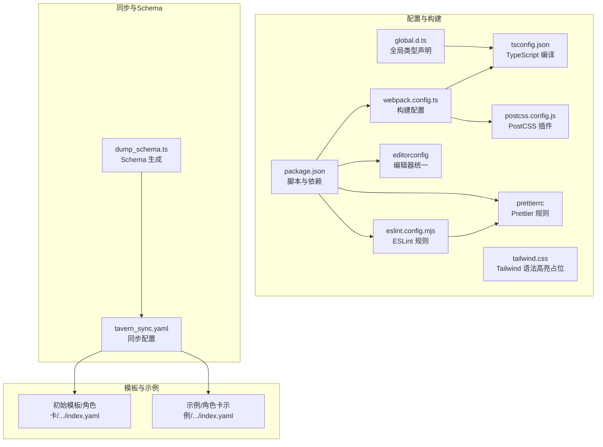
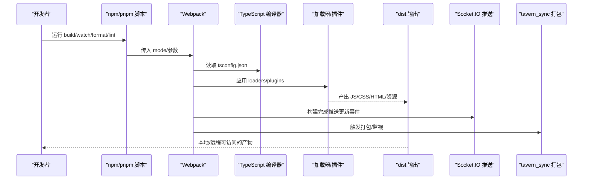
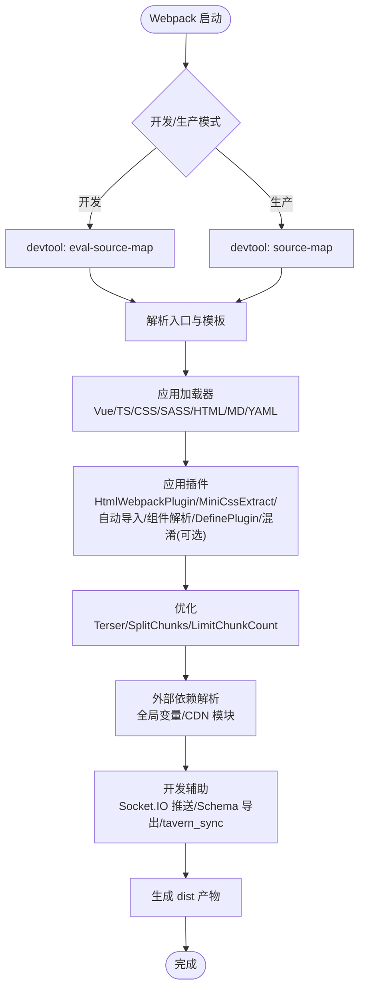
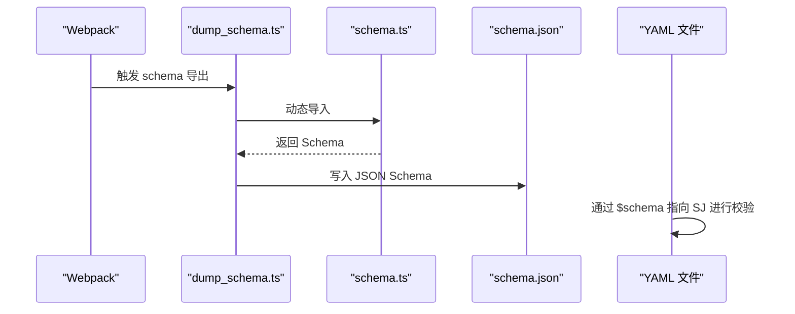
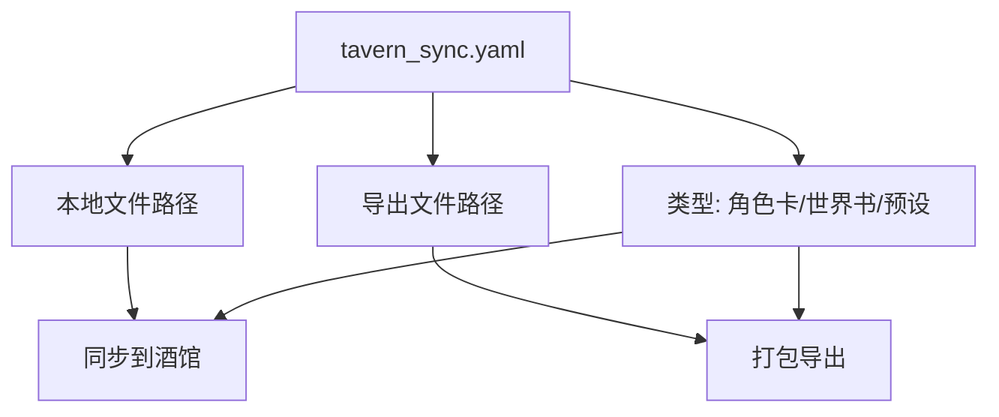
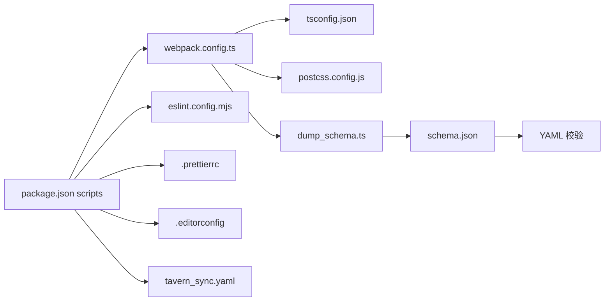

# 配置系统

<cite>
**本文引用的文件**
- [package.json](file://package.json)
- [webpack.config.ts](file://webpack.config.ts)
- [tsconfig.json](file://tsconfig.json)
- [eslint.config.mjs](file://eslint.config.mjs)
- [.prettierrc](file://.prettierrc)
- [.editorconfig](file://.editorconfig)
- [postcss.config.js](file://postcss.config.js)
- [dump_schema.ts](file://dump_schema.ts)
- [tavern_sync.yaml](file://tavern_sync.yaml)
- [global.d.ts](file://global.d.ts)
- [tailwind.css](file://tailwind.css)
- [示例/角色卡示例/index.yaml](file://示例/角色卡示例/index.yaml)
- [示例/角色卡示例/世界书/变量/initvar.yaml](file://示例/角色卡示例/世界书/变量/initvar.yaml)
- [示例/角色卡示例/世界书/变量/变量更新规则.yaml](file://示例/角色卡示例/世界书/变量/变量更新规则.yaml)
- [示例/角色卡示例/世界书/变量/变量输出格式.yaml](file://示例/角色卡示例/世界书/变量/变量输出格式.yaml)
- [初始模板/角色卡/新建为src文件夹中的文件夹/index.yaml](file://初始模板/角色卡/新建为src文件夹中的文件夹/index.yaml)
- [初始模板/角色卡/新建为src文件夹中的文件夹/世界书/变量/initvar.yaml](file://初始模板/角色卡/新建为src文件夹中的文件夹/世界书/变量/initvar.yaml)
</cite>

## 目录
1. [简介](#简介)
2. [项目结构](#项目结构)
3. [核心组件](#核心组件)
4. [架构总览](#架构总览)
5. [详细组件分析](#详细组件分析)
6. [依赖关系分析](#依赖关系分析)
7. [性能考量](#性能考量)
8. [故障排查指南](#故障排查指南)
9. [结论](#结论)
10. [附录](#附录)

## 简介
本文件系统性梳理“酒馆助手模板”的配置体系，覆盖以下方面：
- 角色卡同步配置：如何通过 tavern_sync.yaml 将角色卡/世界书/预设在本地与酒馆之间双向同步与打包。
- Webpack 构建配置：如何解析入口、加载器、插件、优化策略与外部依赖，以及与开发/生产模式的差异。
- TypeScript 编译配置：目标、模块系统、路径映射、严格性与类型声明。
- 代码格式化与风格规范：EditorConfig、Prettier、ESLint 的协同与优先级。
- 配置文件之间的依赖关系与优先级规则：命令脚本、构建配置、类型与样式配置的联动。
- 环境变量与构建优化：CI/调试开关、资源外链与混淆策略。
- 部署与打包：dist 输出、CDN 引入、产物命名与缓存策略。

## 项目结构
本项目采用“模板 + 示例 + 构建配置 + 同步配置”的组织方式：
- 模板与示例：位于 初始模板 与 示例 目录，提供角色卡、世界书、界面与脚本的参考实现。
- 构建与开发：webpack.config.ts 作为主构建入口，配合 package.json 的 scripts 完成开发、监视与打包。
- 类型与样式：tsconfig.json、postcss.config.js、.prettierrc、.editorconfig、global.d.ts 提供类型、样式与格式化约束。
- 同步与 Schema：tavern_sync.yaml 定义同步规则；dump_schema.ts 与 schema.ts 生成 schema.json 以支持 YAML 校验。

图表来源
- [package.json:1-120](file://package.json#L1-L120)
- [webpack.config.ts:1-572](file://webpack.config.ts#L1-L572)
- [tsconfig.json:1-54](file://tsconfig.json#L1-L54)
- [eslint.config.mjs:1-82](file://eslint.config.mjs#L1-L82)
- [.prettierrc:1-14](file://.prettierrc#L1-L14)
- [.editorconfig:1-12](file://.editorconfig#L1-L12)
- [postcss.config.js:1-7](file://postcss.config.js#L1-L7)
- [global.d.ts:1-45](file://global.d.ts#L1-L45)
- [tailwind.css:1-3](file://tailwind.css#L1-L3)
- [dump_schema.ts:1-29](file://dump_schema.ts#L1-L29)
- [tavern_sync.yaml:1-28](file://tavern_sync.yaml#L1-L28)
- [示例/角色卡示例/index.yaml:1-313](file://示例/角色卡示例/index.yaml#L1-L313)
- [初始模板/角色卡/新建为src文件夹中的文件夹/index.yaml:1-171](file://初始模板/角色卡/新建为src文件夹中的文件夹/index.yaml#L1-L171)

章节来源
- [package.json:1-120](file://package.json#L1-L120)
- [webpack.config.ts:1-572](file://webpack.config.ts#L1-L572)
- [tsconfig.json:1-54](file://tsconfig.json#L1-L54)
- [eslint.config.mjs:1-82](file://eslint.config.mjs#L1-L82)
- [.prettierrc:1-14](file://.prettierrc#L1-L14)
- [.editorconfig:1-12](file://.editorconfig#L1-L12)
- [postcss.config.js:1-7](file://postcss.config.js#L1-L7)
- [global.d.ts:1-45](file://global.d.ts#L1-L45)
- [tailwind.css:1-3](file://tailwind.css#L1-L3)
- [dump_schema.ts:1-29](file://dump_schema.ts#L1-L29)
- [tavern_sync.yaml:1-28](file://tavern_sync.yaml#L1-L28)
- [示例/角色卡示例/index.yaml:1-313](file://示例/角色卡示例/index.yaml#L1-L313)
- [初始模板/角色卡/新建为src文件夹中的文件夹/index.yaml:1-171](file://初始模板/角色卡/新建为src文件夹中的文件夹/index.yaml#L1-L171)

## 核心组件
- 包管理与脚本（package.json）
  - 构建脚本：开发构建、生产构建、监视模式、格式化、代码检查、Schema 导出、角色卡同步。
  - 依赖：Webpack 生态、Vue/Pinia、Tailwind、ESLint/Prettier、TypeScript、PostCSS 等。
  - 浏览器兼容：browserslist 默认值。
- Webpack 构建（webpack.config.ts）
  - 动态入口发现与分组、输出目录与命名、资源查询（raw/url）处理、Vue/TS/SASS/CSS/HTML/MD/YAML 加载器。
  - 插件：HtmlWebpackPlugin、MiniCssExtractPlugin、自动导入、组件按需解析、DefinePlugin、混淆（条件启用）。
  - 优化：Terser 压缩（区分开发/生产）、SplitChunks、LimitChunkCount。
  - 外部依赖：全局变量映射、CDN 模块引入、本地/相对路径保留。
  - 开发辅助：Socket.IO 推送、Schema 自动导出、tavern_sync 打包监视。
- TypeScript 编译（tsconfig.json）
  - 目标与模块：ESNext、bundler 解析、严格模式、路径别名、类型声明包含范围。
- 代码风格与格式化（ESLint/Prettier/EditorConfig）
  - ESLint 使用 Flat Config，集成 Vue、Import、Pinia、Tailwind 规则集；Prettier 统一格式；EditorConfig 统一编辑器设置。
- PostCSS（postcss.config.js）
  - Autoprefixer、Tailwind PostCSS 插件、压缩插件。
- 全局类型声明（global.d.ts）
  - 支持 raw/url 查询模块、Vue/HTML/MD/YAML 模块声明，Zod/YAML 全局声明。
- Schema 生成（dump_schema.ts）
  - 扫描 schema.ts，动态导入并导出 schema.json，供 YAML 校验使用。
- 角色卡同步（tavern_sync.yaml + 示例/初始模板 YAML）
  - 定义用户名称、配置项（类型、酒馆名称、本地路径、导出路径），示例与模板提供完整结构参考。

章节来源
- [package.json:1-120](file://package.json#L1-L120)
- [webpack.config.ts:77-572](file://webpack.config.ts#L77-L572)
- [tsconfig.json:1-54](file://tsconfig.json#L1-L54)
- [eslint.config.mjs:14-82](file://eslint.config.mjs#L14-L82)
- [.prettierrc:1-14](file://.prettierrc#L1-14)
- [.editorconfig:1-12](file://.editorconfig#L1-L12)
- [postcss.config.js:1-7](file://postcss.config.js#L1-L7)
- [global.d.ts:1-45](file://global.d.ts#L1-L45)
- [dump_schema.ts:1-29](file://dump_schema.ts#L1-L29)
- [tavern_sync.yaml:1-28](file://tavern_sync.yaml#L1-L28)
- [示例/角色卡示例/index.yaml:1-313](file://示例/角色卡示例/index.yaml#L1-L313)
- [初始模板/角色卡/新建为src文件夹中的文件夹/index.yaml:1-171](file://初始模板/角色卡/新建为src文件夹中的文件夹/index.yaml#L1-L171)

## 架构总览
下图展示从开发到部署的关键流程：开发者通过 npm/pnpm 脚本触发 Webpack，Webpack 依据 tsconfig 与加载器处理源码，生成 dist 产物；同时通过 Socket.IO 推送、Schema 导出与 tavern_sync 打包，实现开发体验与同步能力。

图表来源
- [package.json:2-11](file://package.json#L2-L11)
- [webpack.config.ts:185-572](file://webpack.config.ts#L185-L572)
- [tsconfig.json:12-40](file://tsconfig.json#L12-L40)
- [dump_schema.ts:8-29](file://dump_schema.ts#L8-L29)
- [tavern_sync.yaml:1-28](file://tavern_sync.yaml#L1-L28)

## 详细组件分析

### Webpack 构建配置
- 入口与输出
  - 动态扫描示例与 src 下的 index.ts(x)/js(x)，自动推断 HTML 模板，生成多入口配置。
  - 输出目录为 dist，按入口所在子目录分层存放；chunk 命名含 contenthash；library 类型为 ES Module。
- 加载器与资源处理
  - Vue：vue-loader + VueLoaderPlugin。
  - TS：ts-loader，transpileOnly + onlyCompileBundledFiles；支持 raw/url 查询的内联/源码资源。
  - CSS/SASS：postcss-loader + sass-loader；支持 raw/url 查询；非 HTML 场景使用 MiniCssExtractPlugin。
  - HTML/Markdown/YAML：html-loader、remark-loader、yaml-loader（支持 stream/url/raw）。
- 插件与优化
  - HtmlWebpackPlugin（含 ES 模块脚本加载）、HTML 内联脚本/样式。
  - 自动导入与组件解析：unplugin-auto-import、unplugin-vue-components。
  - DefinePlugin：禁用 hydration mismatch 详情，开发模式开启 prod devtools。
  - LimitChunkCount：限制单入口产物为单 chunk。
  - Terser 压缩：生产模式启用 source-map，开发模式美化输出。
  - SplitChunks：按 async、minSize、cacheGroups 优化 vendor/default 分包。
  - 外部依赖：全局变量映射（如 jQuery/_/showdown/toastr/Vue/VueRouter/YAML/zod），CDN 模块引入（sass/jspm.jsdelivr.net）。
- 开发辅助
  - Socket.IO：监听构建完成事件，向酒馆网页推送更新。
  - Schema 导出：监视 schema.ts 变更，自动导出 schema.json。
  - tavern_sync：监视构建过程，启动/输出/终止同步进程，支持 CI 环境过滤。

图表来源
- [webpack.config.ts:185-572](file://webpack.config.ts#L185-L572)

章节来源
- [webpack.config.ts:77-572](file://webpack.config.ts#L77-L572)

### TypeScript 编译配置
- 目标与模块：ESNext，bundler 解析，允许 UMD 全局访问。
- 路径映射：@/* 与 @util/*，便于跨目录引用。
- 严格性：严格模式、未使用局部变量/参数可关闭；JS 检查关闭。
- 类型声明：包含 @types 与示例/初始模板目录，排除 dist/node_modules。
- JSX：react-jsx，SourceMap 开启，便于调试。

章节来源
- [tsconfig.json:1-54](file://tsconfig.json#L1-L54)

### 代码格式化与风格规范
- EditorConfig：统一缩进、行尾、字符集、最大行长等基础编辑器行为。
- Prettier：统一括号、引号、分号、逗号、缩进宽度等格式规则。
- ESLint：Flat Config，集成 Vue、Import、Pinia、Tailwind 规则集；与 Prettier 结合，关闭部分冲突规则；忽略 dist/node_modules 等目录。

章节来源
- [.editorconfig:1-12](file://.editorconfig#L1-L12)
- [.prettierrc:1-14](file://.prettierrc#L1-L14)
- [eslint.config.mjs:14-82](file://eslint.config.mjs#L14-L82)

### PostCSS 与 Tailwind
- PostCSS 插件：Autoprefixer、Tailwind PostCSS 插件、压缩插件。
- Tailwind：仅激活语法高亮，不实际使用样式；通过全局占位文件声明。

章节来源
- [postcss.config.js:1-7](file://postcss.config.js#L1-L7)
- [tailwind.css:1-3](file://tailwind.css#L1-L3)

### 全局类型声明
- 支持 raw/url 查询模块、Vue/HTML/MD/YAML 模块默认导出类型。
- Zod/YAML 全局声明，便于在 schema.ts 中使用。

章节来源
- [global.d.ts:1-45](file://global.d.ts#L1-L45)

### Schema 生成与校验
- dump_schema.ts：扫描 src 下的 schema.ts，动态导入并导出 schema.json，供 YAML 校验使用。
- 示例/初始模板 YAML：通过注释 $schema 指向 schema.json，实现 VSCode 语言服务器校验。

图表来源
- [dump_schema.ts:8-29](file://dump_schema.ts#L8-L29)
- [示例/角色卡示例/世界书/变量/initvar.yaml:1-34](file://示例/角色卡示例/世界书/变量/initvar.yaml#L1-L34)
- [初始模板/角色卡/新建为src文件夹中的文件夹/世界书/变量/initvar.yaml:1-4](file://初始模板/角色卡/新建为src文件夹中的文件夹/世界书/变量/initvar.yaml#L1-L4)

章节来源
- [dump_schema.ts:1-29](file://dump_schema.ts#L1-L29)
- [示例/角色卡示例/世界书/变量/initvar.yaml:1-34](file://示例/角色卡示例/世界书/变量/initvar.yaml#L1-L34)
- [初始模板/角色卡/新建为src文件夹中的文件夹/世界书/变量/initvar.yaml:1-4](file://初始模板/角色卡/新建为src文件夹中的文件夹/世界书/变量/initvar.yaml#L1-L4)

### 角色卡同步配置
- tavern_sync.yaml：定义 user 名称、配置项（类型、酒馆名称、本地路径、导出路径），支持绝对/相对路径。
- 示例/初始模板 YAML：提供角色卡/世界书/变量的完整结构，包括锚点、立即事件、正则替换、脚本库等。

图表来源
- [tavern_sync.yaml:1-28](file://tavern_sync.yaml#L1-L28)
- [示例/角色卡示例/index.yaml:1-313](file://示例/角色卡示例/index.yaml#L1-L313)
- [初始模板/角色卡/新建为src文件夹中的文件夹/index.yaml:1-171](file://初始模板/角色卡/新建为src文件夹中的文件夹/index.yaml#L1-L171)

章节来源
- [tavern_sync.yaml:1-28](file://tavern_sync.yaml#L1-L28)
- [示例/角色卡示例/index.yaml:1-313](file://示例/角色卡示例/index.yaml#L1-L313)
- [初始模板/角色卡/新建为src文件夹中的文件夹/index.yaml:1-171](file://初始模板/角色卡/新建为src文件夹中的文件夹/index.yaml#L1-L171)

## 依赖关系分析
- 命令脚本与构建
  - package.json 的 scripts 作为统一入口，调用 webpack、prettier、eslint、dump、sync。
  - webpack.config.ts 依据 mode 决定 devtool、压缩与美化策略。
- 类型与样式
  - tsconfig.json 影响 ts-loader 与 IDE 类型检查；postcss.config.js 影响 CSS/SASS 处理。
- 同步与 Schema
  - dump_schema.ts 与 schema.ts/JSON 形成闭环；tavern_sync.yaml 驱动本地与酒馆的同步与打包。

图表来源
- [package.json:2-11](file://package.json#L2-L11)
- [webpack.config.ts:185-572](file://webpack.config.ts#L185-L572)
- [tsconfig.json:12-40](file://tsconfig.json#L12-L40)
- [postcss.config.js:1-7](file://postcss.config.js#L1-L7)
- [dump_schema.ts:8-29](file://dump_schema.ts#L8-L29)
- [eslint.config.mjs:14-82](file://eslint.config.mjs#L14-L82)
- [.prettierrc:1-14](file://.prettierrc#L1-L14)
- [.editorconfig:1-12](file://.editorconfig#L1-L12)
- [tavern_sync.yaml:1-28](file://tavern_sync.yaml#L1-L28)

章节来源
- [package.json:1-120](file://package.json#L1-L120)
- [webpack.config.ts:185-572](file://webpack.config.ts#L185-L572)
- [tsconfig.json:1-54](file://tsconfig.json#L1-L54)
- [postcss.config.js:1-7](file://postcss.config.js#L1-L7)
- [dump_schema.ts:1-29](file://dump_schema.ts#L1-L29)
- [eslint.config.mjs:1-82](file://eslint.config.mjs#L1-L82)
- [.prettierrc:1-14](file://.prettierrc#L1-L14)
- [.editorconfig:1-12](file://.editorconfig#L1-L12)
- [tavern_sync.yaml:1-28](file://tavern_sync.yaml#L1-L28)

## 性能考量
- 构建优化
  - 生产模式启用 source-map 与 Terser 压缩；开发模式美化输出便于调试。
  - SplitChunks 按 async 分离 vendor/default，提升缓存命中率。
  - LimitChunkCount 限制单入口产物为单 chunk，减少网络往返。
- 资源处理
  - raw/url 查询用于内联/源码资源，减少额外请求；非 HTML 场景使用 MiniCssExtractPlugin 提升首屏渲染。
- 外部依赖
  - 全局变量映射与 CDN 引入降低打包体积，加速加载。
- 监视与增量
  - Schema 导出与 tavern_sync 打包采用防抖与监视，避免频繁 I/O。

[本节为通用建议，无需特定文件引用]

## 故障排查指南
- 构建失败
  - 检查 tsconfig.json 的路径映射与模块解析是否正确。
  - 确认 webpack.config.ts 的 loaders/plugins 是否匹配文件类型。
- 样式问题
  - 确认 postcss.config.js 插件顺序与 Tailwind 配置一致。
- 同步异常
  - 检查 tavern_sync.yaml 的路径格式（绝对/相对）与权限。
  - 确保 CI 环境变量 CI=true 时不会误排除构建文件。
- 格式化冲突
  - ESLint 与 Prettier 冲突时，确保已启用 eslint-config-prettier 并忽略 dist/node_modules。

章节来源
- [webpack.config.ts:185-572](file://webpack.config.ts#L185-L572)
- [tsconfig.json:12-40](file://tsconfig.json#L12-L40)
- [postcss.config.js:1-7](file://postcss.config.js#L1-L7)
- [eslint.config.mjs:79-81](file://eslint.config.mjs#L79-L81)
- [tavern_sync.yaml:18-27](file://tavern_sync.yaml#L18-L27)

## 结论
本配置体系通过明确的脚本、构建、类型与风格规范，结合 Schema 与同步配置，实现了从开发到部署的一体化工作流。遵循本文档的参数说明、优先级与最佳实践，可在保证质量的同时提升开发效率与可维护性。

[本节为总结，无需特定文件引用]

## 附录
- 常见配置场景与最佳实践
  - 开发调试：使用开发模式构建，开启 Socket.IO 推送与 Schema 导出，便于实时预览与校验。
  - 生产发布：使用生产模式构建，启用压缩与分包策略，确保产物体积与加载性能。
  - 角色卡同步：在 tavern_sync.yaml 中明确配置类型、酒馆名称与本地/导出路径，确保路径格式正确。
  - 类型安全：在 tsconfig.json 中启用严格模式，合理使用路径别名，避免类型缺失。
  - 代码风格：统一 EditorConfig、Prettier 与 ESLint 规则，减少团队分歧。
- 环境变量
  - CI：设置 CI=true 可在 CI 环境中跳过特定构建逻辑。
  - FORCE_COLOR：用于强制输出彩色日志，便于观察 tavern_sync 的实时输出。
- 部署建议
  - 将 dist 产物托管至静态站点或 CDN，注意缓存策略与 publicPath 配置。
  - 使用 CDN 引入外部依赖，减少打包体积；确保全局变量映射与 CDN 资源可用。

[本节为通用建议，无需特定文件引用]