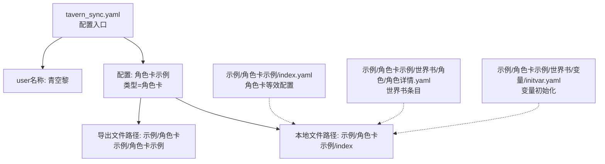
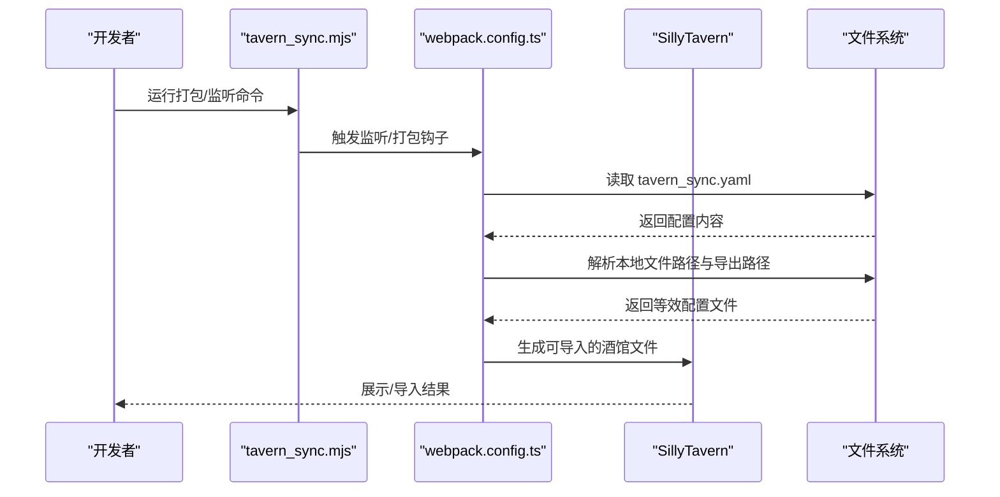
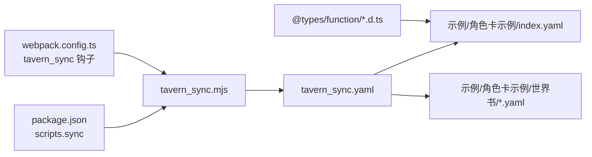

# 酒馆助手同步配置

<cite>
**本文引用的文件**
- [tavern_sync.yaml](file://tavern_sync.yaml)
- [README.md](file://README.md)
- [webpack.config.ts](file://webpack.config.ts)
- [package.json](file://package.json)
- [示例/角色卡示例/index.yaml](file://示例/角色卡示例/index.yaml)
- [示例/角色卡示例/世界书/角色/角色详情.yaml](file://示例/角色卡示例/世界书/角色/角色详情.yaml)
- [示例/角色卡示例/世界书/变量/initvar.yaml](file://示例/角色卡示例/世界书/变量/initvar.yaml)
- [@types/function/character.d.ts](file://@types/function/character.d.ts)
- [@types/function/preset.d.ts](file://@types/function/preset.d.ts)
- [@types/function/worldbook.d.ts](file://@types/function/worldbook.d.ts)
- [util/common.ts](file://util/common.ts)
</cite>

## 目录
1. [简介](#简介)
2. [项目结构](#项目结构)
3. [核心组件](#核心组件)
4. [架构总览](#架构总览)
5. [详细组件分析](#详细组件分析)
6. [依赖分析](#依赖分析)
7. [性能考虑](#性能考虑)
8. [故障排除指南](#故障排除指南)
9. [结论](#结论)
10. [附录](#附录)

## 简介
本文件面向“酒馆助手”（SillyTavern）生态下的配置同步与打包流程，围绕 tavern_sync.yaml 配置文件展开，系统讲解用户名称、角色卡、世界书、预设等配置项的结构、参数含义与设置方法；提供绝对路径与相对路径的使用范式；说明打包导出路径与本地文件路径配置；解释配置名称与脚本调用的关系；并给出配置验证、错误处理与最佳实践。

## 项目结构
本仓库提供了完整的“酒馆助手模板与示例”，其中 tavern_sync.yaml 是配置同步的核心入口；示例/角色卡示例/ 下包含角色卡与世界书的本地等效配置文件，便于对照理解。

图表来源
- [tavern_sync.yaml:1-28](file://tavern_sync.yaml#L1-L28)
- [示例/角色卡示例/index.yaml:1-313](file://示例/角色卡示例/index.yaml#L1-L313)
- [示例/角色卡示例/世界书/角色/角色详情.yaml:1-59](file://示例/角色卡示例/世界书/角色/角色详情.yaml#L1-L59)
- [示例/角色卡示例/世界书/变量/initvar.yaml:1-34](file://示例/角色卡示例/世界书/变量/initvar.yaml#L1-L34)

章节来源
- [tavern_sync.yaml:1-28](file://tavern_sync.yaml#L1-L28)
- [README.md:71-89](file://README.md#L71-L89)

## 核心组件
- tavern_sync.yaml：定义用户名称与各配置项（角色卡/世界书/预设），指定本地文件路径与导出路径，供打包与同步使用。
- 示例/角色卡示例/index.yaml：角色卡等效配置，包含世界书条目、正则脚本、酒馆助手扩展等，与 tavern_sync.yaml 的“本地文件路径”对应。
- @types/function/*：类型声明，用于理解角色卡、世界书、预设在酒馆中的数据结构与扩展字段，辅助配置映射与脚本调用。
- util/common.ts：通用工具，包含配置解析与错误格式化，支撑配置验证与错误处理。

章节来源
- [tavern_sync.yaml:1-28](file://tavern_sync.yaml#L1-L28)
- [示例/角色卡示例/index.yaml:1-313](file://示例/角色卡示例/index.yaml#L1-L313)
- [@types/function/character.d.ts:1-48](file://@types/function/character.d.ts#L1-L48)
- [@types/function/preset.d.ts:48-74](file://@types/function/preset.d.ts#L48-L74)
- [@types/function/worldbook.d.ts:1-289](file://@types/function/worldbook.d.ts#L1-L289)
- [util/common.ts:76-90](file://util/common.ts#L76-L90)

## 架构总览
tavern_sync.yaml 作为配置中心，驱动本地等效配置与酒馆内实体（角色卡/世界书/预设）之间的映射。打包流程通过脚本触发，将配置导出为可导入的酒馆文件；开发时可通过监听机制实现热更新与同步。

图表来源
- [webpack.config.ts:137-183](file://webpack.config.ts#L137-L183)
- [package.json:10-11](file://package.json#L10-L11)
- [tavern_sync.yaml:1-28](file://tavern_sync.yaml#L1-L28)

## 详细组件分析

### tavern_sync.yaml 配置文件详解
- 顶层注释与模式校验
  - 通过语言服务器模式指向远程 schema，确保配置结构正确。
- user名称
  - 用途：当提示词中出现该名称时，会被替换为 <user> 宏，便于统一用户占位。
- 配置节点
  - 结构：每个配置项包含“配置名称”、“类型”、“酒馆中的名称”、“本地文件路径”、“导出文件路径”。
  - 配置名称：脚本调用时用于指明使用哪一组配置，应简洁易记。
  - 类型：可为“角色卡”、“世界书”或“预设”，决定后续处理与导出目标。
  - 酒馆中的名称：与酒馆内实体一致，用于识别与匹配。
  - 本地文件路径：等效配置文件的本地存储位置，支持绝对路径与相对路径。
  - 导出文件路径：使用打包命令直接生成可导入文件的目标路径；若省略，默认导出到本地文件路径的同目录。

章节来源
- [tavern_sync.yaml:1-28](file://tavern_sync.yaml#L1-L28)

### 用户名称配置
- 参数：user名称
- 作用：在提示词宏替换中使用，便于统一引用用户身份。
- 设置要点：与脚本中使用的宏约定保持一致，避免歧义。

章节来源
- [tavern_sync.yaml:3-4](file://tavern_sync.yaml#L3-L4)

### 角色卡配置
- 参数：类型=角色卡；酒馆中的名称=呕吐内心的少女；本地文件路径=示例/角色卡示例/index；导出文件路径=示例/角色卡示例/角色卡示例
- 本地等效配置：示例/角色卡示例/index.yaml 包含角色描述、第一条消息、锚点、世界书条目、扩展字段（正则、酒馆助手脚本库）等，与 tavern_sync.yaml 的“本地文件路径”对应。
- 世界书条目：角色详情、角色阶段、变量初始化与更新规则、立即事件等，均通过“文件”字段指向具体 YAML 文件。
- 酒馆助手扩展：脚本库与变量结构，用于在酒馆中加载前端界面与变量更新逻辑。

章节来源
- [tavern_sync.yaml:9-27](file://tavern_sync.yaml#L9-L27)
- [示例/角色卡示例/index.yaml:1-313](file://示例/角色卡示例/index.yaml#L1-L313)
- [示例/角色卡示例/世界书/角色/角色详情.yaml:1-59](file://示例/角色卡示例/世界书/角色/角色详情.yaml#L1-L59)
- [示例/角色卡示例/世界书/变量/initvar.yaml:1-34](file://示例/角色卡示例/世界书/变量/initvar.yaml#L1-L34)

### 世界书配置
- 参数：类型=世界书；酒馆中的名称；本地文件路径；导出文件路径
- 本地等效配置：示例/角色卡示例/世界书/ 下包含多个条目文件（如角色详情、变量、立即事件等），通过角色卡 index.yaml 的条目引用。
- 世界书条目激活策略与插入位置：支持蓝灯/绿灯、指定深度、角色系统等策略，便于控制提示词注入时机与范围。

章节来源
- [tavern_sync.yaml:9-27](file://tavern_sync.yaml#L9-L27)
- [示例/角色卡示例/index.yaml:38-186](file://示例/角色卡示例/index.yaml#L38-L186)

### 预设配置
- 参数：类型=预设；酒馆中的名称；本地文件路径；导出文件路径
- 本地等效配置：通常对应酒馆中的预设文件，包含提示词列表、扩展字段等。
- 酒馆助手扩展：预设的 extensions.tavern_helper.scripts 与 variables 可用于绑定脚本与变量。

章节来源
- [tavern_sync.yaml:9-27](file://tavern_sync.yaml#L9-L27)
- [@types/function/preset.d.ts:48-74](file://@types/function/preset.d.ts#L48-L74)

### 配置名称与脚本调用
- 配置名称：在 tavern_sync.yaml 中为每个配置项命名，脚本调用时需明确指定该名称以选择对应配置。
- 与酒馆实体对应：通过“酒馆中的名称”与实体匹配，确保导入与绑定准确。

章节来源
- [tavern_sync.yaml:8-14](file://tavern_sync.yaml#L8-L14)

### 绝对路径与相对路径
- 绝对路径：例如 Windows 中将世界书导出到 C 盘某文件夹，需使用绝对路径。
- 相对路径：
  - 与本文件同目录：./角色卡示例 或 角色卡示例
  - 子目录：./世界书/角色卡示例 或 世界书/角色卡示例
  - 父目录：../角色卡示例
- 注意：若路径格式不符合规范将报错，务必遵循上述格式。

章节来源
- [tavern_sync.yaml:16-23](file://tavern_sync.yaml#L16-L23)

### 打包与导出路径
- 打包命令：通过脚本触发，将已配置的角色卡/世界书/预设打包为可导入文件。
- 导出文件路径：若未显式设置，则默认导出到本地文件路径的同目录。
- CI 工作流：README 中列出的 bundle.yaml、bump_deps.yaml、sync_template.yaml 等工作流可自动化执行打包与更新。

章节来源
- [tavern_sync.yaml:25-27](file://tavern_sync.yaml#L25-L27)
- [README.md:75-88](file://README.md#L75-L88)
- [package.json:10-11](file://package.json#L10-L11)

### 配置验证与错误处理
- 配置解析与修复：util/common.ts 提供解析与错误格式化工具，支持 YAML/JSON5/修复 JSON 的多路解析，并将 Zod 错误转换为可读信息。
- 错误展示：包含问题路径、输入片段等，便于定位配置问题。
- 路径格式校验：tavern_sync.yaml 明确要求路径格式，不满足将报错。

章节来源
- [util/common.ts:76-90](file://util/common.ts#L76-L90)
- [util/common.ts:96-118](file://util/common.ts#L96-L118)
- [tavern_sync.yaml:16-18](file://tavern_sync.yaml#L16-L18)

### 与酒馆助手的数据结构对应
- 角色卡：包含头像、版本、作者、描述、第一条消息、世界书名称、条目、扩展字段（正则、酒馆助手脚本库）等。
- 世界书：包含条目列表、激活策略、插入位置、递归控制、文件引用等。
- 预设：包含提示词列表、扩展字段（regex_scripts、tavern_helper.scripts/variables）等。

章节来源
- [示例/角色卡示例/index.yaml:1-313](file://示例/角色卡示例/index.yaml#L1-L313)
- [@types/function/character.d.ts:1-48](file://@types/function/character.d.ts#L1-L48)
- [@types/function/worldbook.d.ts:1-289](file://@types/function/worldbook.d.ts#L1-L289)
- [@types/function/preset.d.ts:48-74](file://@types/function/preset.d.ts#L48-L74)

## 依赖分析
- 构建与监听：webpack.config.ts 注册监听与打包钩子，调用 tavern_sync.mjs 执行同步与打包。
- 脚本入口：package.json 定义 sync 脚本，便于一键执行同步工具。
- 类型约束：@types/function/* 提供角色卡、世界书、预设的类型定义，辅助配置映射与脚本调用。

图表来源
- [package.json:10-11](file://package.json#L10-L11)
- [webpack.config.ts:137-183](file://webpack.config.ts#L137-L183)
- [tavern_sync.yaml:1-28](file://tavern_sync.yaml#L1-L28)
- [示例/角色卡示例/index.yaml:1-313](file://示例/角色卡示例/index.yaml#L1-L313)

章节来源
- [package.json:10-11](file://package.json#L10-L11)
- [webpack.config.ts:137-183](file://webpack.config.ts#L137-L183)
- [@types/function/character.d.ts:1-48](file://@types/function/character.d.ts#L1-L48)
- [@types/function/preset.d.ts:48-74](file://@types/function/preset.d.ts#L48-L74)
- [@types/function/worldbook.d.ts:1-289](file://@types/function/worldbook.d.ts#L1-L289)

## 性能考虑
- 开发时的监听与去抖：webpack.config.ts 对打包操作使用去抖，减少频繁触发带来的资源消耗。
- CI 与自动更新：README 中的工作流可自动化执行打包与依赖更新，降低手工维护成本。
- 路径解析与校验：tavern_sync.yaml 的路径格式要求有助于提前发现错误，避免无效 IO。

章节来源
- [webpack.config.ts:136-137](file://webpack.config.ts#L136-L137)
- [README.md:75-88](file://README.md#L75-L88)
- [tavern_sync.yaml:16-18](file://tavern_sync.yaml#L16-L18)

## 故障排除指南
- 路径格式错误
  - 现象：配置报错
  - 原因：路径不符合绝对/相对路径规范
  - 处理：检查 tavern_sync.yaml 中的本地文件路径与导出文件路径，确保格式正确
- 配置解析失败
  - 现象：Zod 校验错误或解析异常
  - 原因：YAML/JSON5/修复 JSON 解析失败
  - 处理：使用 util/common.ts 的错误格式化输出定位问题路径与输入片段
- 打包未生效
  - 现象：未生成可导入文件
  - 原因：未触发监听或脚本未执行
  - 处理：确认 package.json 中的 sync 脚本与 webpack.config.ts 的监听钩子是否正常

章节来源
- [tavern_sync.yaml:16-18](file://tavern_sync.yaml#L16-L18)
- [util/common.ts:76-90](file://util/common.ts#L76-L90)
- [util/common.ts:96-118](file://util/common.ts#L96-L118)
- [package.json:10-11](file://package.json#L10-L11)
- [webpack.config.ts:137-183](file://webpack.config.ts#L137-L183)

## 结论
tavern_sync.yaml 为酒馆助手生态提供了清晰的配置同步与打包入口。通过合理设置用户名称、配置名称、类型、酒馆中的名称以及本地/导出路径，可实现角色卡、世界书、预设的本地等效配置与酒馆实体的精准映射。结合类型声明与错误处理工具，能够显著提升配置质量与开发效率。配合 CI 工作流与监听机制，可实现自动化打包与持续更新。

## 附录

### 完整示例（结构示意）
- 用户名称：青空黎
- 配置名称：角色卡示例
  - 类型：角色卡
  - 酒馆中的名称：呕吐内心的少女
  - 本地文件路径：示例/角色卡示例/index
  - 导出文件路径：示例/角色卡示例/角色卡示例

章节来源
- [tavern_sync.yaml:3-27](file://tavern_sync.yaml#L3-L27)