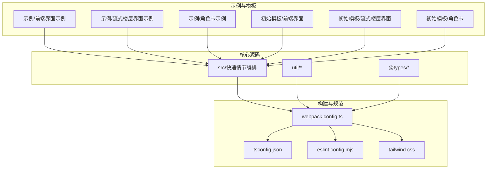
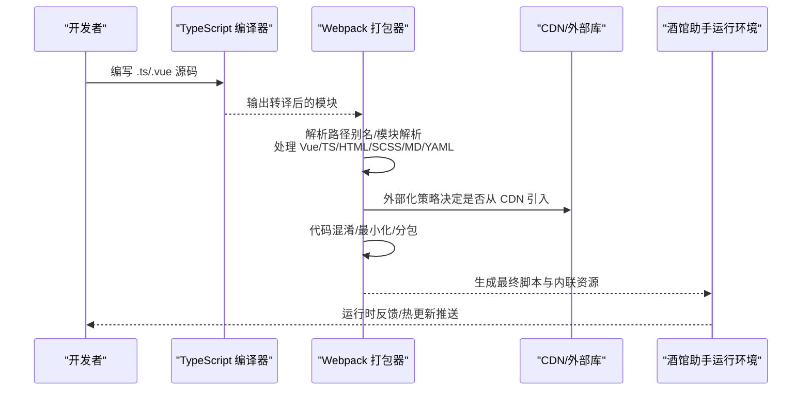
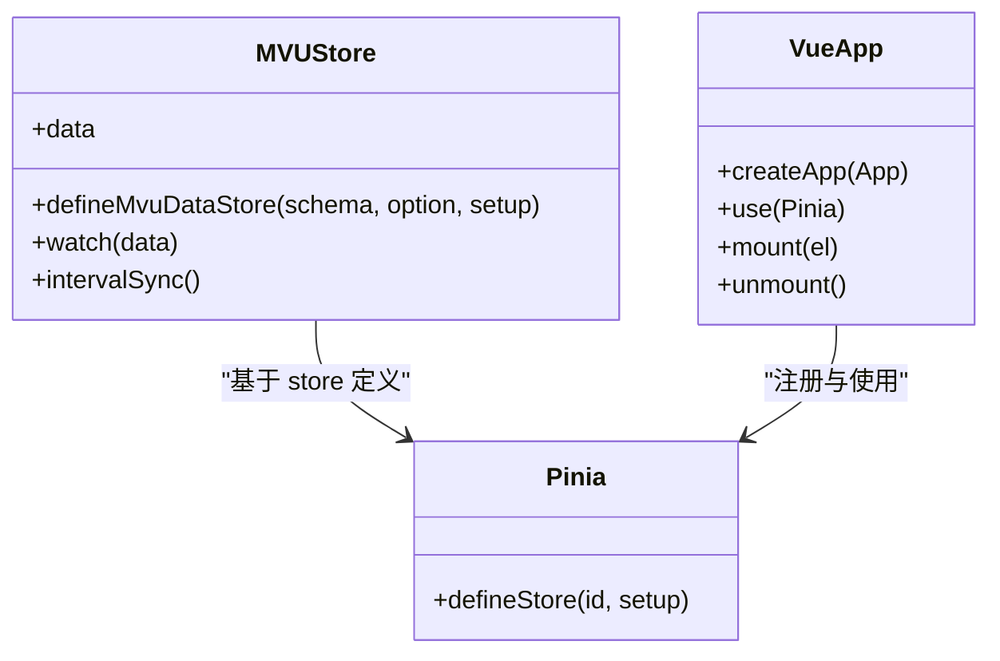
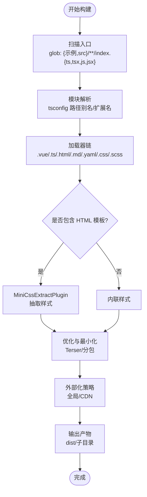
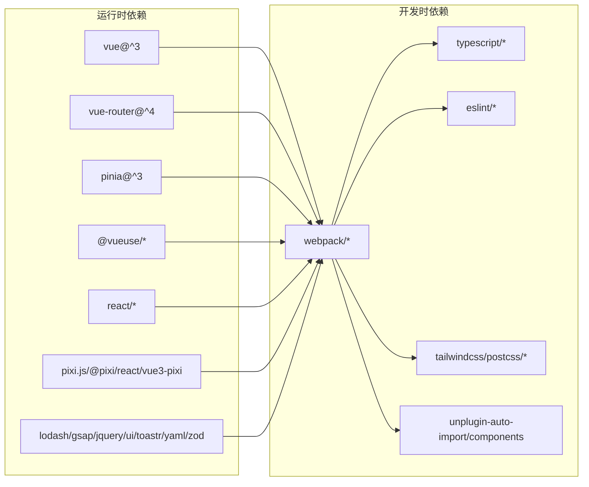

# 技术栈

<cite>
**本文引用的文件**
- [package.json](file://package.json)
- [tsconfig.json](file://tsconfig.json)
- [webpack.config.ts](file://webpack.config.ts)
- [eslint.config.mjs](file://eslint.config.mjs)
- [tailwind.css](file://tailwind.css)
- [util/mvu.ts](file://util/mvu.ts)
- [示例/前端界面示例/界面.vue](file://示例/前端界面示例/界面.vue)
- [示例/前端界面示例/index.ts](file://示例/前端界面示例/index.ts)
- [初始模板/前端界面/新建为src文件夹中的文件夹/App.vue](file://初始模板/前端界面/新建为src文件夹中的文件夹/App.vue)
- [初始模板/前端界面/新建为src文件夹中的文件夹/index.ts](file://初始模板/前端界面/新建为src文件夹中的文件夹/index.ts)
</cite>

## 目录
1. [简介](#简介)
2. [项目结构](#项目结构)
3. [核心组件](#核心组件)
4. [架构总览](#架构总览)
5. [详细组件分析](#详细组件分析)
6. [依赖分析](#依赖分析)
7. [性能考虑](#性能考虑)
8. [故障排查指南](#故障排查指南)
9. [结论](#结论)
10. [附录：学习路径与前置知识](#附录学习路径与前置知识)

## 简介
本技术栈文档面向“酒馆助手模板项目”，系统梳理并解释项目所采用的核心技术与工具链，包括但不限于：Vue3（含组合式 API 与单文件组件）、TypeScript（严格类型与模块解析）、Webpack（多入口、按需产物、CDN 外部化与混淆）、Tailwind CSS（原子化样式与 PostCSS 生态）、ESLint/Prettier（代码质量与风格统一）。文档同时覆盖构建配置、依赖管理策略、开发工具链与自动化流程，并给出学习路径与前置知识要求，帮助开发者快速上手并高效迭代。

## 项目结构
该项目围绕“模板化脚本 + 组件化界面”的思路组织，典型结构如下：
- 示例与模板：位于示例与初始模板目录，包含前端界面、流式楼层界面、角色卡界面与脚本模板，便于复制粘贴与二次开发。
- 核心源码：src 目录下存放可直接运行的脚本入口（如快速情节编排）。
- 工具与通用能力：util 目录提供 MVU 数据存储、脚本工具、流式渲染等通用能力。
- 类型定义：@types 目录提供函数与 iframe 环境的类型声明，确保在酒馆助手运行环境中具备完善的类型支持。
- 构建与规范：webpack.config.ts 定义构建管线；tsconfig.json 提供 TypeScript 编译选项；eslint.config.mjs 与 tailwind.css 确立代码规范与样式基础。

图表来源
- [webpack.config.ts](file://webpack.config.ts)
- [tsconfig.json](file://tsconfig.json)
- [eslint.config.mjs](file://eslint.config.mjs)
- [tailwind.css](file://tailwind.css)

章节来源
- [webpack.config.ts](file://webpack.config.ts)
- [tsconfig.json](file://tsconfig.json)
- [eslint.config.mjs](file://eslint.config.mjs)
- [tailwind.css](file://tailwind.css)

## 核心组件
本节聚焦项目的关键技术选型及其在项目中的职责与价值。

- Vue3
  - 作用：提供响应式数据与组件化 UI，结合单文件组件（.vue）提升开发效率与可维护性。
  - 在项目中的体现：示例与模板中大量使用 Vue3 单文件组件与组合式 API；通过 Pinia 进行状态管理；通过路由进行页面切换。
  - 关键点：项目禁用 Options API，启用生产环境开发工具开关，减少体积与提升调试体验。

- TypeScript
  - 作用：在编译期提供强类型保障，降低运行时错误风险，提升协作效率。
  - 在项目中的体现：严格的编译选项、路径别名、模块解析策略与类型声明文件；配合 ESLint 规则进一步约束类型相关问题。

- Webpack
  - 作用：作为打包器与构建管线核心，负责模块解析、资源处理、产物优化与外部化策略。
  - 在项目中的体现：多入口扫描、按需产物命名、CDN 外部化、代码混淆、样式抽取、热更新与自动同步。

- Tailwind CSS
  - 作用：提供原子化样式能力，快速搭建界面风格，结合 PostCSS 实现按需构建与优化。
  - 在项目中的体现：通过 PostCSS 插件链路与构建配置集成，保证样式在产物中的正确注入与压缩。

- ESLint/Prettier
  - 作用：统一代码风格与质量标准，减少分歧，提升可读性与可维护性。
  - 在项目中的体现：Flat Config 配置、Vue/TS/导入规则、Tailwind CSS 规则集成、与 Prettier 的协同关闭冲突规则。

章节来源
- [示例/前端界面示例/界面.vue](file://示例/前端界面示例/界面.vue)
- [示例/前端界面示例/index.ts](file://示例/前端界面示例/index.ts)
- [初始模板/前端界面/新建为src文件夹中的文件夹/App.vue](file://初始模板/前端界面/新建为src文件夹中的文件夹/App.vue)
- [初始模板/前端界面/新建为src文件夹中的文件夹/index.ts](file://初始模板/前端界面/新建为src文件夹中的文件夹/index.ts)
- [util/mvu.ts](file://util/mvu.ts)
- [package.json](file://package.json)
- [tsconfig.json](file://tsconfig.json)
- [webpack.config.ts](file://webpack.config.ts)
- [eslint.config.mjs](file://eslint.config.mjs)
- [tailwind.css](file://tailwind.css)

## 架构总览
下图展示了从源码到产物的整体流程，以及与外部系统的交互（如酒馆助手运行环境）：

图表来源
- [webpack.config.ts](file://webpack.config.ts)
- [tsconfig.json](file://tsconfig.json)
- [package.json](file://package.json)

## 详细组件分析

### Vue3 组件与状态管理
- 组合式 API 与单文件组件：示例与模板广泛采用 <script setup> 与 scoped 样式，便于局部样式隔离与逻辑复用。
- 状态管理：通过 Pinia 进行集中式状态管理，结合 MVU（模型-视图-更新）模式，实现变量驱动的数据流与持久化。
- 路由：使用 Vue Router 进行页面级导航与切换，示例中通过 RouterView 渲染当前路由组件。

图表来源
- [util/mvu.ts](file://util/mvu.ts)
- [示例/前端界面示例/界面.vue](file://示例/前端界面示例/界面.vue)
- [示例/前端界面示例/index.ts](file://示例/前端界面示例/index.ts)
- [初始模板/前端界面/新建为src文件夹中的文件夹/index.ts](file://初始模板/前端界面/新建为src文件夹中的文件夹/index.ts)

章节来源
- [util/mvu.ts](file://util/mvu.ts)
- [示例/前端界面示例/界面.vue](file://示例/前端界面示例/界面.vue)
- [示例/前端界面示例/index.ts](file://示例/前端界面示例/index.ts)
- [初始模板/前端界面/新建为src文件夹中的文件夹/index.ts](file://初始模板/前端界面/新建为src文件夹中的文件夹/index.ts)

### TypeScript 编译配置
- 严格模式与模块解析：启用严格检查、模块解析策略为 bundler，支持路径别名与 JS/TS 混编。
- 目标与输出：目标 ESNext，输出 dist，便于现代浏览器与 ESM 使用。
- 类型声明：内置 jQuery、React、Lodash、Toastr、YAML、Zod 等全局类型，满足运行环境需求。

章节来源
- [tsconfig.json](file://tsconfig.json)

### Webpack 构建配置
- 多入口与产物命名：自动扫描示例与 src 下的 index 入口，按目录结构输出到 dist 子目录，chunk 文件带内容哈希。
- 模块处理：对 .vue、.ts、.tsx、.html、.md、.yaml、.css/.scss/.sass 进行针对性 loader 处理；支持 raw/url 查询参数以原生或内联方式引入资源。
- 样式处理：根据是否存在 HTML 模板决定使用 MiniCssExtractPlugin 或内联样式；结合 PostCSS 与 Sass Loader。
- 外部化策略：对非本地请求与特定库进行外部化，优先使用全局变量或 CDN 引入，减少包体。
- 优化与混淆：生产模式启用 Terser 最小化与混淆；开发模式保留可读性；LimitChunkCountPlugin 控制分包数量。
- 开发辅助：集成 Vue Loader 插件、自动导入与组件解析插件、DefinePlugin 注入运行常量；监听构建完成向酒馆助手推送更新。

图表来源
- [webpack.config.ts](file://webpack.config.ts)

章节来源
- [webpack.config.ts](file://webpack.config.ts)

### ESLint 与代码规范
- 配置结构：采用 Flat Config，整合 TS、Vue、导入规则与 Pinia 规范；关闭与 Prettier 冲突规则。
- Tailwind CSS 规则：集成 Better Tailwind CSS 插件，校验类名一致性与注册情况。
- 语言选项：设置解析器、ECMAScript 版本与浏览器全局对象，确保在运行环境中不报错。

章节来源
- [eslint.config.mjs](file://eslint.config.mjs)

### Tailwind CSS 与 PostCSS
- 启用方式：通过 tailwind.css 引入 Tailwind 并激活语法高亮；实际构建由 PostCSS 插件链与 Webpack loader 处理。
- 与构建集成：PostCSS Loader 与 Tailwind 插件在 Webpack 中生效，保证样式按需构建与压缩。

章节来源
- [tailwind.css](file://tailwind.css)
- [webpack.config.ts](file://webpack.config.ts)

## 依赖分析
- 运行时依赖（前端生态）
  - Vue3、Vue Router、Pinia：提供组件化与状态管理能力。
  - @vueuse/*：提供响应式工具与指令，简化常用逻辑。
  - React/ReactDOM：兼容运行环境，部分场景复用 React 生态。
  - PixiJS 与 @pixi/react、vue3-pixi：用于图形渲染与交互。
  - Lodash、GSAP、JQuery/JQueryUI、Toastr、YAML、Zod：提供通用工具、动画、UI 与数据校验能力。
- 开发时依赖（构建与规范）
  - Webpack 生态：ts-loader、vue-loader、postcss-loader、sass-loader、html-loader、yaml-loader、mini-css-extract-plugin、terser-webpack-plugin、webpack-obfuscator 等。
  - 类型与规范：typescript、@typescript-eslint/*、eslint、eslint-config-prettier、eslint-plugin-vue、eslint-plugin-import-x、eslint-plugin-pinia、unplugin-auto-import、unplugin-vue-components 等。
  - 样式与工具：tailwindcss、postcss、autoprefixer、chokidar、remark、remark-html、prettier 等。

图表来源
- [package.json](file://package.json)
- [webpack.config.ts](file://webpack.config.ts)

章节来源
- [package.json](file://package.json)
- [webpack.config.ts](file://webpack.config.ts)

## 性能考虑
- 分包与缓存：通过 SplitChunks 将 node_modules 与默认模块分组，提升缓存命中率；异步分块避免首屏阻塞。
- 外部化策略：对常见库进行外部化，优先使用全局变量或 CDN，显著减小包体。
- 最小化与混淆：生产模式启用 Terser，保留必要保留字；开发模式保持可读性以便调试。
- 构建优化：禁用不必要的 API（如 Options API），减少运行时体积；限制分块数量，避免过度切分。
- 样式优化：按需抽取与内联，结合 PostCSS 压缩，减少样式体积。

章节来源
- [webpack.config.ts](file://webpack.config.ts)

## 故障排查指南
- 构建失败
  - 检查入口扫描是否正确匹配 index.ts/js；确认路径别名与 tsconfig 是否一致。
  - 若出现模块解析错误，核对 tsconfig 的 paths 与 webpack resolve.extensions。
- 样式异常
  - 确认是否包含 HTML 模板；有模板时应使用 MiniCssExtractPlugin，否则样式会内联。
  - 检查 PostCSS 与 Tailwind 插件链是否生效。
- 外部化问题
  - 若外部化未命中，检查请求是否为绝对路径或本地模块；确认全局变量映射与 CDN 地址。
- 热更新与同步
  - 构建完成后会向酒馆助手推送更新事件；若无反应，检查监听端口与网络连通性。
- 代码规范
  - 若 ESLint 报错，优先修复类型或导入相关问题；Tailwind 类名不规范可通过 Better Tailwind CSS 规则定位。

章节来源
- [webpack.config.ts](file://webpack.config.ts)
- [eslint.config.mjs](file://eslint.config.mjs)

## 结论
本项目以 Vue3 为核心，结合 TypeScript 与 Webpack 构建体系，辅以 Tailwind CSS 与 ESLint/Prettier 规范，形成一套面向“酒馆助手”运行环境的高效、可维护且可扩展的前端模板技术栈。通过外部化策略与分包优化，兼顾包体大小与运行性能；通过 MVU 模式与 Pinia，实现变量驱动的状态管理与持久化。建议在二次开发中遵循现有规范与目录约定，充分利用自动导入与组件解析插件，提升开发效率。

## 附录：学习路径与前置知识
- Vue3
  - 建议掌握：组合式 API、生命周期、响应式原理、组件通信、插槽与指令、单文件组件。
  - 参考路径：官方文档与实践项目，重点理解 <script setup> 与响应式 API。
- TypeScript
  - 建议掌握：类型系统、模块与命名空间、装饰器、条件类型、严格模式配置。
  - 参考路径：官方手册与项目 tsconfig，关注路径别名与模块解析。
- Webpack
  - 建议掌握：loader 与 plugin、入口与出口、解析与优化、开发服务器与热更新。
  - 参考路径：官方文档与项目配置，理解外部化与分包策略。
- Tailwind CSS
  - 建议掌握：原子类、响应式与暗色模式、自定义与插件、PostCSS 集成。
  - 参考路径：官方文档与项目 PostCSS 配置。
- ESLint/Prettier
  - 建议掌握：规则配置、插件使用、与编辑器集成、CI 中的执行。
  - 参考路径：项目 eslint.config.mjs 与 package.json scripts。