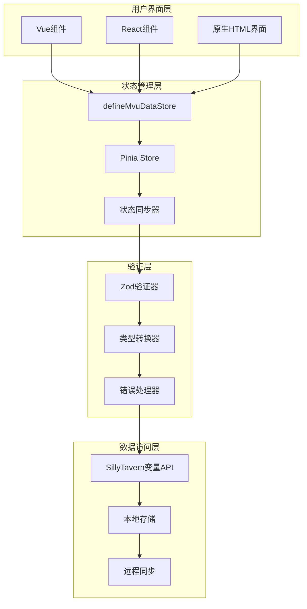
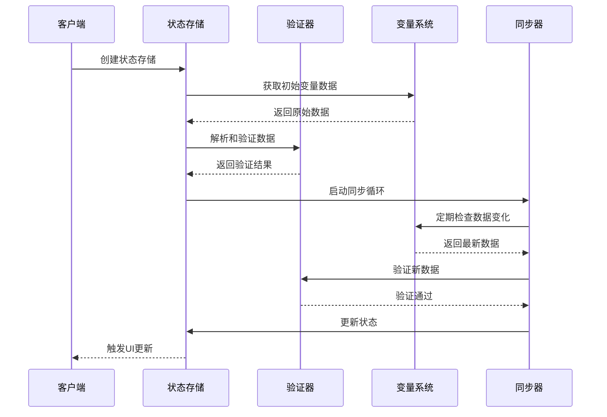
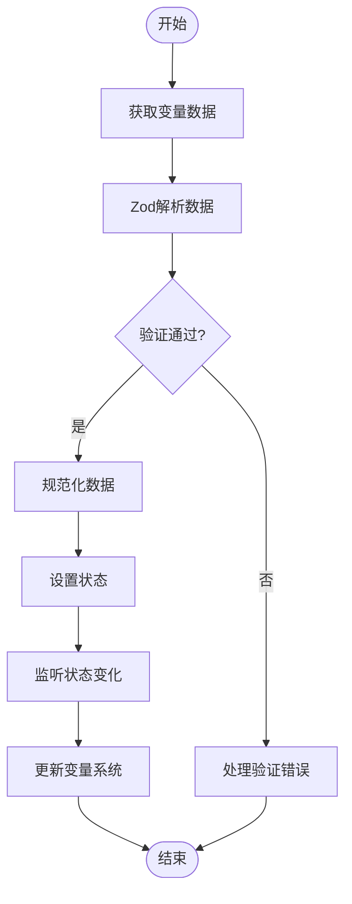
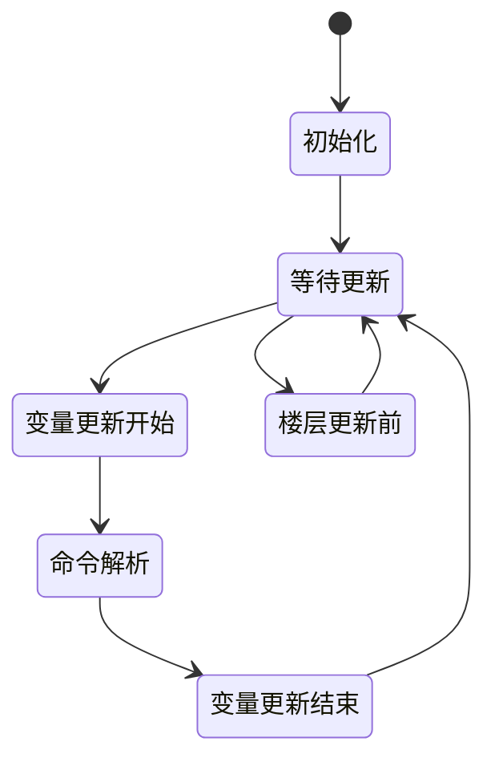
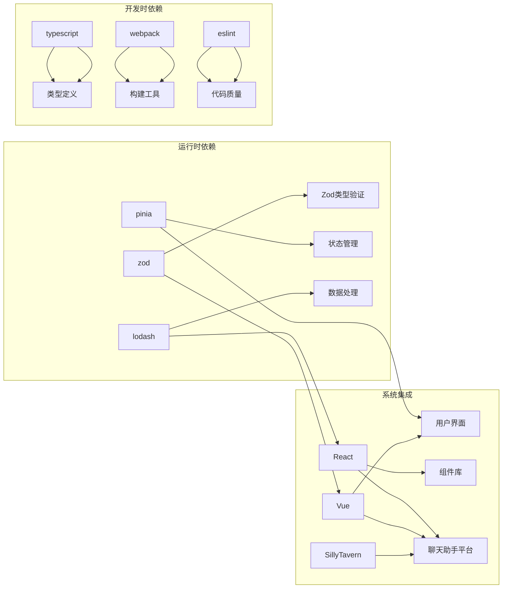
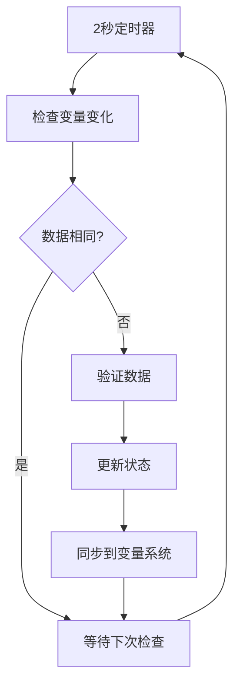

# MVU状态管理系统

<cite>
**本文档引用的文件**
- [util/mvu.ts](file://util/mvu.ts)
- [@types/iframe/exported.mvu.d.ts](file://@types/iframe/exported.mvu.d.ts)
- [@types/function/variables.d.ts](file://@types/function/variables.d.ts)
- [示例/角色卡示例/界面/状态栏/store.ts](file://示例/角色卡示例/界面/状态栏/store.ts)
- [示例/角色卡示例/schema.ts](file://示例/角色卡示例/schema.ts)
- [util/common.ts](file://util/common.ts)
- [dump_schema.ts](file://dump_schema.ts)
- [package.json](file://package.json)
</cite>

## 目录
1. [简介](#简介)
2. [项目结构](#项目结构)
3. [核心组件](#核心组件)
4. [架构概览](#架构概览)
5. [详细组件分析](#详细组件分析)
6. [依赖分析](#依赖分析)
7. [性能考虑](#性能考虑)
8. [故障排除指南](#故障排除指南)
9. [结论](#结论)
10. [附录](#附录)

## 简介

MVU（Model-View-Update）状态管理系统是一个基于Zod类型验证的现代化状态管理解决方案，专为SillyTavern聊天助手平台设计。该系统通过类型安全的数据存储、自动数据同步机制和强大的错误处理策略，为复杂的聊天场景提供了可靠的变量管理能力。

系统的核心优势包括：
- **类型安全保障**：利用Zod进行运行时类型验证，确保数据完整性
- **自动同步机制**：双向数据同步，保持UI与底层数据的一致性
- **事件驱动架构**：支持变量更新事件的监听和处理
- **灵活的存储策略**：支持多种变量存储类型（聊天、消息、角色卡、全局等）

## 项目结构

该项目采用模块化的组织方式，主要分为以下几个核心部分：

```mermaid
graph TB
subgraph "核心模块"
A[util/mvu.ts] --> B[状态管理核心]
C[@types/iframe/exported.mvu.d.ts] --> D[MVU类型定义]
E[@types/function/variables.d.ts] --> F[变量系统API]
end
subgraph "示例模块"
G[示例/角色卡示例/schema.ts] --> H[Zod模式定义]
I[示例/角色卡示例/界面/store.ts] --> J[状态存储示例]
end
subgraph "工具模块"
K[dump_schema.ts] --> L[模式导出工具]
M[util/common.ts] --> N[通用工具函数]
end
A --> G
C --> E
D --> F
```

**图表来源**
- [util/mvu.ts:1-66](file://util/mvu.ts#L1-L66)
- [@types/iframe/exported.mvu.d.ts:1-190](file://@types/iframe/exported.mvu.d.ts#L1-L190)
- [@types/function/variables.d.ts:1-207](file://@types/function/variables.d.ts#L1-L207)

**章节来源**
- [util/mvu.ts:1-66](file://util/mvu.ts#L1-L66)
- [@types/iframe/exported.mvu.d.ts:1-190](file://@types/iframe/exported.mvu.d.ts#L1-L190)
- [@types/function/variables.d.ts:1-207](file://@types/function/variables.d.ts#L1-L207)

## 核心组件

### MVU状态存储定义器

`defineMvuDataStore`是系统的核心组件，负责创建类型安全的状态存储实例。该函数接受Zod模式、变量选项和可选的附加设置函数。

**关键特性：**
- **类型推断**：自动从Zod模式推断数据类型
- **变量选项配置**：支持多种变量存储类型和消息ID
- **自动初始化**：根据现有变量数据初始化状态
- **错误处理**：提供错误捕获和恢复机制

### Zod类型验证系统

系统深度集成了Zod类型验证库，为所有状态管理提供运行时类型安全保障：

**验证流程：**
1. 从变量系统获取原始数据
2. 使用Zod模式进行解析和验证
3. 自动类型转换和规范化
4. 错误收集和报告

### SillyTavern变量系统集成

系统与SillyTavern的变量系统无缝集成，支持以下变量类型：
- **聊天变量** (`chat`)：当前对话的变量
- **消息变量** (`message`)：特定消息楼层的变量
- **角色卡变量** (`character`)：角色卡相关的变量
- **全局变量** (`global`)：全局可用的变量
- **脚本变量** (`script`)：脚本专用的变量

**章节来源**
- [util/mvu.ts:3-66](file://util/mvu.ts#L3-L66)
- [util/common.ts:76-90](file://util/common.ts#L76-L90)
- [@types/function/variables.d.ts:1-207](file://@types/function/variables.d.ts#L1-L207)

## 架构概览

MVU系统采用分层架构设计，确保各组件之间的清晰分离和高内聚低耦合：



**图表来源**
- [util/mvu.ts:15-65](file://util/mvu.ts#L15-L65)
- [@types/iframe/exported.mvu.d.ts:54-177](file://@types/iframe/exported.mvu.d.ts#L54-L177)

系统的工作流程遵循MVU模式的经典实现：

1. **Model**：通过Zod模式定义数据结构和验证规则
2. **View**：Vue/React组件响应状态变化
3. **Update**：用户交互触发状态更新，经过验证后应用

**章节来源**
- [util/mvu.ts:21-65](file://util/mvu.ts#L21-L65)
- [@types/iframe/exported.mvu.d.ts:121-177](file://@types/iframe/exported.mvu.d.ts#L121-L177)

## 详细组件分析

### 状态存储核心实现

#### defineMvuDataStore函数分析



**图表来源**
- [util/mvu.ts:15-43](file://util/mvu.ts#L15-L43)

**实现要点：**
- **消息ID处理**：自动处理消息ID的特殊值（如'latest'）
- **存储键生成**：基于变量选项生成唯一的存储键
- **错误捕获**：使用`errorCatched`包装整个存储逻辑
- **双向同步**：同时处理外部变化和内部更新

#### 类型安全的数据流



**图表来源**
- [util/mvu.ts:22-60](file://util/mvu.ts#L22-L60)

**章节来源**
- [util/mvu.ts:3-66](file://util/mvu.ts#L3-L66)

### Zod类型验证系统应用

#### 模式定义最佳实践

系统中的Zod模式定义展示了类型验证的最佳实践：

**数值类型处理：**
- 使用`z.coerce.number()`进行数值转换
- 结合`transform`函数进行数据规范化
- 利用`_.clamp()`进行数值范围限制

**复杂对象结构：**
- 嵌套对象的递归验证
- 动态键名的记录类型处理
- 条件字段的可选性管理

#### 错误处理和调试

系统提供了完善的错误处理机制：

**错误信息格式化：**
- `prettifyErrorWithInput`函数提供详细的错误报告
- 包含问题路径、输入值和建议的修复方案
- 支持多语言错误信息的本地化

**章节来源**
- [示例/角色卡示例/schema.ts:1-52](file://示例/角色卡示例/schema.ts#L1-L52)
- [util/common.ts:76-90](file://util/common.ts#L76-L90)

### SillyTavern变量系统集成

#### 变量操作API详解

系统提供了丰富的变量操作API，支持不同类型的变量访问：

**基础变量操作：**
- `getVariables`：获取指定类型的变量
- `replaceVariables`：完全替换变量内容
- `updateVariablesWith`：使用更新函数修改变量

**高级变量操作：**
- `insertOrAssignVariables`：插入或分配变量值
- `insertVariables`：仅插入新变量
- `deleteVariable`：删除指定变量

#### 事件驱动的数据更新



**图表来源**
- [@types/iframe/exported.mvu.d.ts:55-119](file://@types/iframe/exported.mvu.d.ts#L55-L119)

**章节来源**
- [@types/function/variables.d.ts:37-207](file://@types/function/variables.d.ts#L37-L207)
- [@types/iframe/exported.mvu.d.ts:121-177](file://@types/iframe/exported.mvu.d.ts#L121-L177)

## 依赖分析

### 核心依赖关系

系统的关键依赖关系如下：



**图表来源**
- [package.json:79-107](file://package.json#L79-L107)
- [package.json:15-78](file://package.json#L15-L78)

### 版本兼容性

系统对依赖版本有明确的要求：
- **TypeScript**: 6.0.0-dev版本
- **Vue**: 3.5.30版本
- **Zod**: 4.3.6版本
- **Pinia**: 3.0.4版本

**章节来源**
- [package.json:15-120](file://package.json#L15-L120)

## 性能考虑

### 内存管理优化

系统采用了多项内存管理优化策略：

**状态缓存机制：**
- 使用`watchIgnorable`避免不必要的状态更新
- 通过`_.isEqual`比较减少重复渲染
- 智能的垃圾回收策略

**异步处理优化：**
- 2秒间隔的定时同步，平衡实时性和性能
- 批量更新操作，减少频繁的DOM操作
- 懒加载机制，按需加载大型数据集

### 数据同步策略



**图表来源**
- [util/mvu.ts:29-43](file://util/mvu.ts#L29-L43)

## 故障排除指南

### 常见问题诊断

**类型验证失败：**
1. 检查Zod模式定义是否正确
2. 验证输入数据格式是否符合预期
3. 使用`prettifyErrorWithInput`获取详细错误信息

**变量同步异常：**
1. 确认变量选项配置正确
2. 检查消息ID的有效性
3. 验证变量系统的可用性

**性能问题：**
1. 检查状态更新频率
2. 优化大型数据的处理逻辑
3. 实施适当的缓存策略

### 调试工具和技巧

**开发时调试：**
- 使用浏览器开发者工具监控状态变化
- 启用Vue DevTools进行组件状态检查
- 利用console.log跟踪数据流

**生产环境监控：**
- 实施错误边界捕获异常
- 记录关键操作的日志
- 设置性能指标监控

**章节来源**
- [util/common.ts:76-135](file://util/common.ts#L76-L135)
- [util/mvu.ts:21-65](file://util/mvu.ts#L21-L65)

## 结论

MVU状态管理系统为SillyTavern平台提供了一个强大而灵活的状态管理解决方案。通过Zod类型验证、自动数据同步和事件驱动架构，系统能够在保证类型安全的同时，提供优秀的用户体验。

**主要优势：**
- **类型安全**：完整的运行时类型验证
- **易于使用**：简洁的API设计和直观的模式定义
- **高性能**：智能的缓存和同步机制
- **可扩展**：模块化的架构支持功能扩展

**适用场景：**
- 复杂的聊天场景状态管理
- 需要强类型保障的应用程序
- 需要实时数据同步的系统
- 多用户协作的聊天平台

## 附录

### 最佳实践指南

**模式定义最佳实践：**
1. 使用明确的类型定义，避免any类型
2. 实施合理的默认值处理
3. 考虑数据的可变性和不可变性需求

**性能优化建议：**
1. 合理设置同步间隔，平衡实时性和性能
2. 实施数据分片和懒加载
3. 使用高效的比较算法

**错误处理策略：**
1. 实施分级错误处理机制
2. 提供友好的错误提示
3. 记录详细的错误日志

### API参考

**核心API概览：**
- `defineMvuDataStore`：创建类型安全的状态存储
- `getVariables`：获取变量数据
- `updateVariablesWith`：更新变量数据
- `registerVariableSchema`：注册变量模式

**章节来源**
- [util/mvu.ts:3-66](file://util/mvu.ts#L3-L66)
- [@types/function/variables.d.ts:188-207](file://@types/function/variables.d.ts#L188-L207)