# Slash命令系统

<cite>
**本文档引用的文件**
- [slash_command.txt](file://slash_command.txt)
- [slash_command.txt](file://参考脚本示例/slash_command.txt)
- [@types/function/slash.d.ts](file://@types/function/slash.d.ts)
- [@types/iframe/exported.sillytavern.d.ts](file://@types/iframe/exported.sillytavern.d.ts)
- [参考脚本示例/@types/function/slash.d.ts](file://参考脚本示例/@types/function/slash.d.ts)
- [参考脚本示例/@types/iframe/exported.sillytavern.d.ts](file://参考脚本示例/@types/iframe/exported.sillytavern.d.ts)
- [util/mvu.ts](file://util/mvu.ts)
- [src/快速情节编排/index.ts](file://src/快速情节编排/index.ts)
- [参考脚本示例/@types/function/index.d.ts](file://参考脚本示例/@types/function/index.d.ts)
- [util/common.ts](file://util/common.ts)
- [package.json](file://package.json)
</cite>

## 目录
1. [简介](#简介)
2. [项目结构](#项目结构)
3. [核心组件](#核心组件)
4. [架构概览](#架构概览)
5. [详细组件分析](#详细组件分析)
6. [依赖关系分析](#依赖关系分析)
7. [性能考虑](#性能考虑)
8. [故障排除指南](#故障排除指南)
9. [结论](#结论)
10. [附录](#附录)

## 简介

Slash命令系统是酒馆助手（SillyTavern）中的一个强大功能模块，它提供了丰富的命令行接口来自动化各种操作。该系统支持超过260个不同的命令，涵盖了从简单的文本处理到复杂的AI生成、变量管理、角色卡操作等多个方面。

系统的核心特点包括：
- **管道式处理**：命令可以通过管道传递数据，实现复杂的数据处理流水线
- **参数验证**：内置严格的参数类型检查和验证机制
- **上下文感知**：能够根据当前聊天状态和环境动态调整行为
- **扩展性**：支持自定义命令和插件扩展
- **MVU状态管理集成**：与MVU（Model-View-Update）状态管理模式无缝集成

## 项目结构

该项目采用模块化架构设计，主要包含以下核心目录：

```mermaid
graph TB
subgraph "根目录结构"
A[src/] --> A1[快速情节编排/]
B[util/] --> B1[mvu.ts]
B --> B2[common.ts]
B --> B3[script.ts]
B --> B4[streaming.ts]
C[@types/] --> C1[function/]
C --> C2[iframe/]
D[初始模板/] --> D1[前端界面/]
D --> D2[流式楼层界面/]
D --> D3[角色卡/]
E[示例/] --> E1[脚本示例/]
E --> E2[角色卡示例/]
F[参考脚本示例/] --> F1[slash_command.txt]
G[.augment/rules/] --> G1[mvu变量框架.md]
H[.clinerules/] --> H1[mvu变量框架.md]
end
```

**图表来源**
- [package.json:1-120](file://package.json#L1-L120)

**章节来源**
- [package.json:1-120](file://package.json#L1-L120)

## 核心组件

### 命令系统架构

Slash命令系统基于以下核心组件构建：

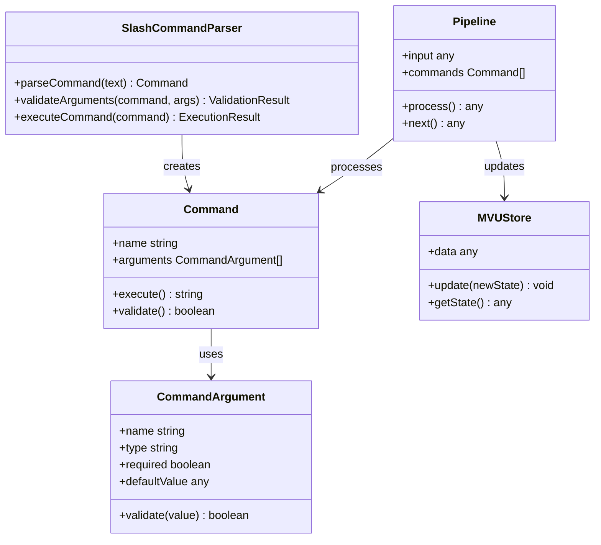

**图表来源**
- [@types/iframe/exported.sillytavern.d.ts:491-521](file://@types/iframe/exported.sillytavern.d.ts#L491-L521)

### 命令分类体系

系统支持多种类型的命令，每种都有特定的功能领域：

| 命令类别 | 数量 | 功能描述 | 示例命令 |
|---------|------|----------|----------|
| 快速回复命令 | 15+ | 快速插入预设回复，管理QR集合 | `/qr-create`, `/qr-set-on`, `/qr-run` |
| 变量管理命令 | 20+ | 全局/本地变量操作，数据持久化 | `/setvar`, `/getvar`, `/flushvar` |
| API集成命令 | 25+ | 多平台API连接，模型切换 | `/api`, `/model`, `/preset` |
| 聊天控制命令 | 30+ | 消息管理，聊天状态控制 | `/send`, `/trigger`, `/continue` |
| 工具命令 | 15+ | 文本处理，数据分析，系统工具 | `/echo`, `/replace`, `/sort` |
| 角色卡命令 | 10+ | 角色卡操作，表情管理 | `/sendas`, `/char-find`, `/expression-*` |
| 预设管理命令 | 8+ | 预设集合管理，上下文切换 | `/preset`, `/context`, `/instruct-*` |
| 系统命令 | 5+ | 系统状态查询，调试工具 | `/reload-page`, `/abort`, `/breakpoint` |

**章节来源**
- [slash_command.txt:1-265](file://slash_command.txt#L1-L265)
- [参考脚本示例/slash_command.txt:1-276](file://参考脚本示例/slash_command.txt#L1-L276)

## 架构概览

### 命令执行流程

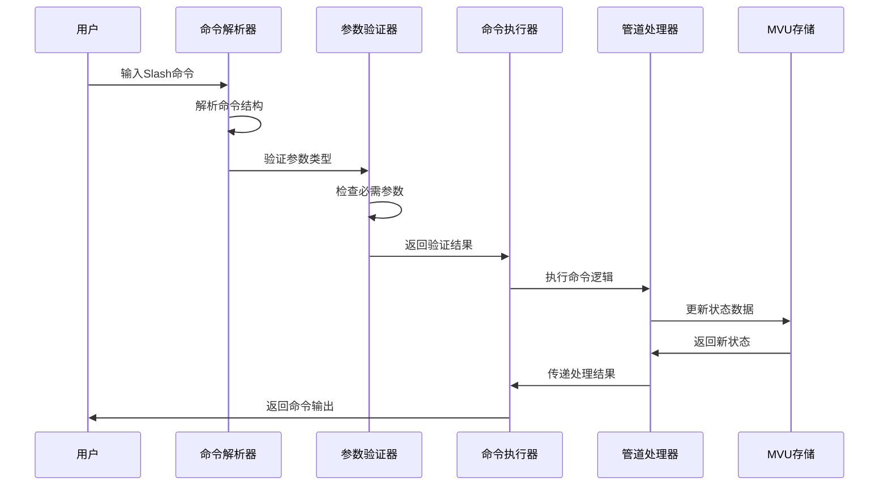

**图表来源**
- [@types/iframe/exported.sillytavern.d.ts:506-518](file://@types/iframe/exported.sillytavern.d.ts#L506-L518)

### 管道系统设计

系统采用管道式数据处理架构，支持命令间的链式调用：

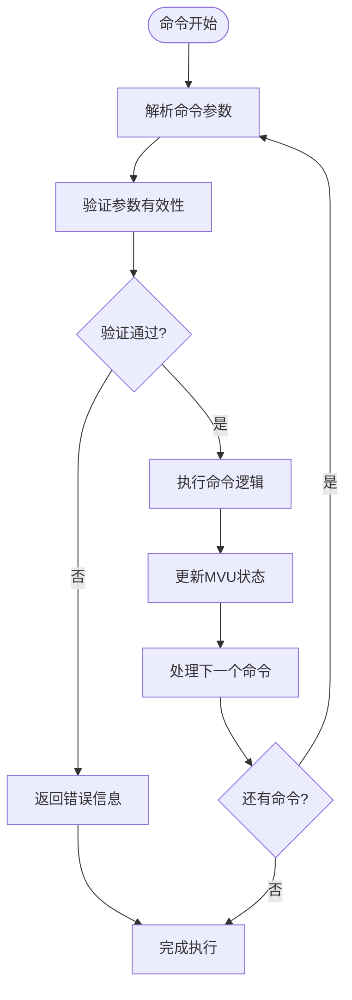

**图表来源**
- [@types/function/slash.d.ts:1-30](file://@types/function/slash.d.ts#L1-L30)

## 详细组件分析

### 命令解析器

命令解析器是整个系统的核心组件，负责将用户输入的Slash命令转换为可执行的对象。

#### 解析流程


**图表来源**
- [@types/iframe/exported.sillytavern.d.ts:491-495](file://@types/iframe/exported.sillytavern.d.ts#L491-L495)

#### 参数类型系统

系统支持多种参数类型，每种类型都有特定的验证规则：

| 参数类型 | 描述 | 验证规则 | 示例 |
|---------|------|----------|------|
| STRING | 字符串类型 | 非空验证 | `/echo "Hello"` |
| NUMBER | 数字类型 | 数值范围检查 | `/add 10 20` |
| BOOLEAN | 布尔类型 | true/false验证 | `/instruct-on` |
| VARIABLE_NAME | 变量名 | 变量存在性检查 | `/getvar score` |
| LIST | 列表类型 | JSON数组解析 | `/add [1,2,3]` |
| DICTIONARY | 字典类型 | 键值对验证 | `/setvar key=value` |
| CLOSURE | 闭包类型 | 代码块解析 | `{: /echo :}` |
| SUBCOMMAND | 子命令 | 嵌套命令验证 | `/if ... {: /echo :}` |

**章节来源**
- [@types/iframe/exported.sillytavern.d.ts:495-505](file://@types/iframe/exported.sillytavern.d.ts#L495-L505)

### MVU状态管理系统

系统与MVU状态管理框架深度集成，提供响应式的状态更新机制。

#### 状态存储架构

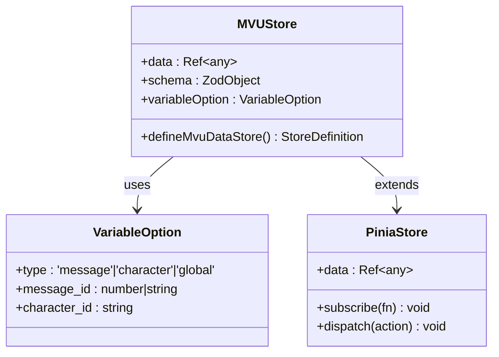

**图表来源**
- [util/mvu.ts:3-66](file://util/mvu.ts#L3-L66)

#### 状态同步机制

系统通过定时轮询和事件驱动两种方式保持状态同步：

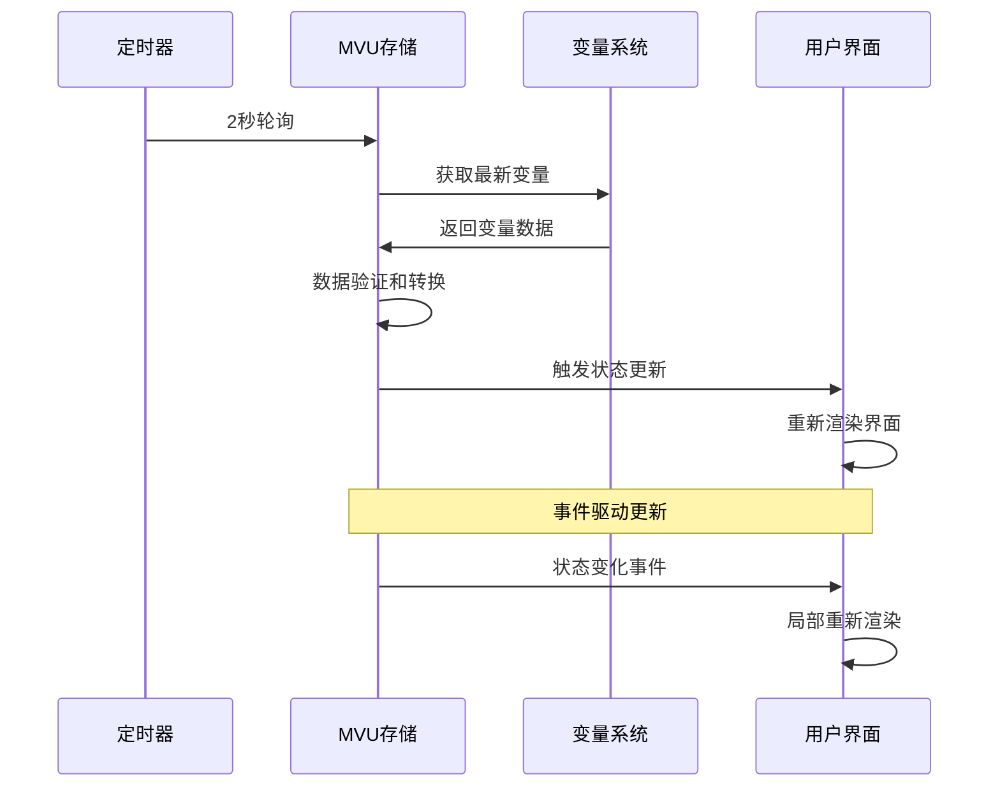

**图表来源**
- [util/mvu.ts:29-43](file://util/mvu.ts#L29-L43)

**章节来源**
- [util/mvu.ts:1-66](file://util/mvu.ts#L1-L66)

### 快速回复系统

快速回复（Quick Reply）是Slash命令系统的重要组成部分，提供了高效的预设回复管理功能。

#### QR命令族

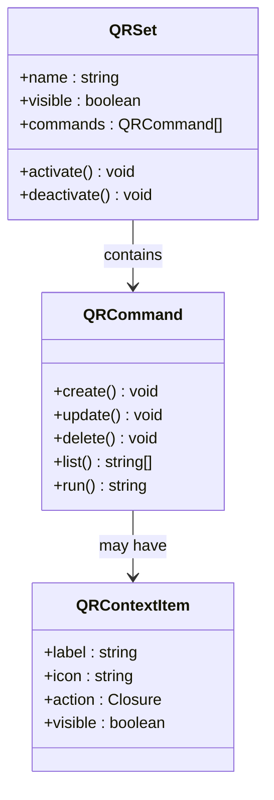

**图表来源**
- [slash_command.txt:178-192](file://slash_command.txt#L178-L192)

#### QR执行流程

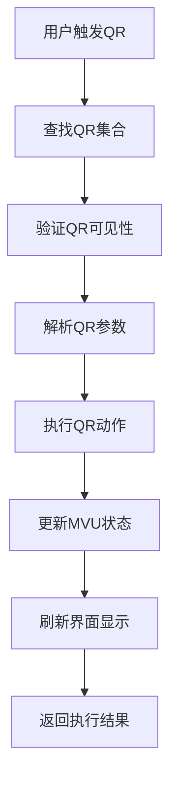

**图表来源**
- [src/快速情节编排/index.ts:1317-1348](file://src/快速情节编排/index.ts#L1317-L1348)

**章节来源**
- [slash_command.txt:178-192](file://slash_command.txt#L178-L192)
- [src/快速情节编排/index.ts:1315-1348](file://src/快速情节编排/index.ts#L1315-L1348)

### 变量管理系统

系统提供完整的变量管理功能，支持全局、局部和消息级别的变量存储。

#### 变量类型层次

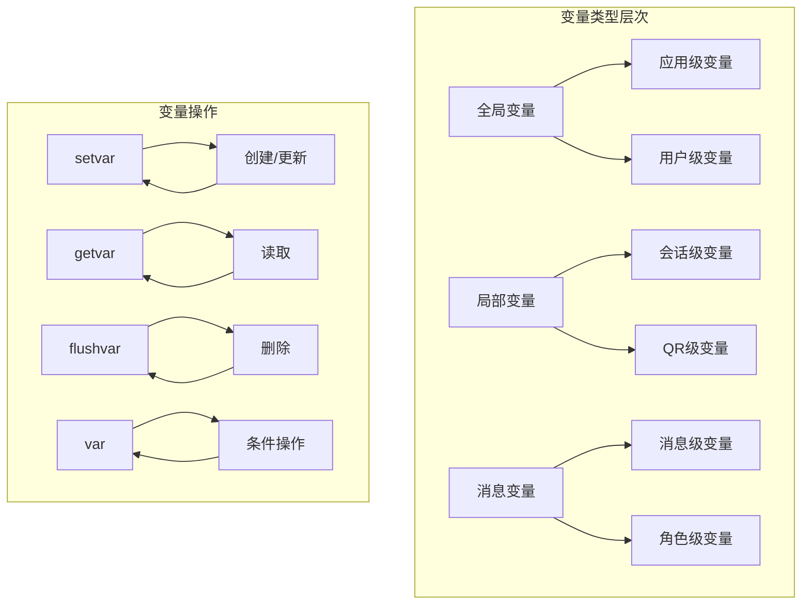

**图表来源**
- [slash_command.txt:102-125](file://slash_command.txt#L102-L125)

#### 变量作用域规则

| 变量类型 | 作用域 | 生命周期 | 访问方式 |
|---------|--------|----------|----------|
| 全局变量 | 应用级 | 持久化 | `getglobalvar`, `setglobalvar` |
| 局部变量 | 会话级 | 会话结束清除 | `getvar`, `setvar` |
| 消息变量 | 消息级 | 消息删除清除 | 自动管理 |
| QR变量 | QR级 | QR删除清除 | `qr-arg` |

**章节来源**
- [slash_command.txt:102-125](file://slash_command.txt#L102-L125)

## 依赖关系分析

### 核心依赖图

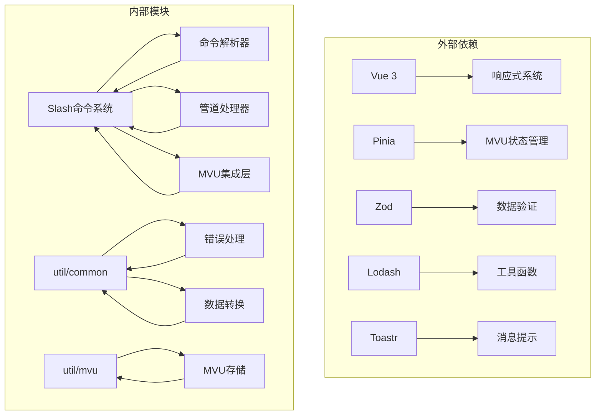

**图表来源**
- [package.json:79-107](file://package.json#L79-L107)

### 开发依赖分析

系统使用现代化的开发工具链，确保代码质量和开发效率：

| 依赖类别 | 包名 | 版本 | 用途 |
|---------|------|------|------|
| 构建工具 | webpack | ^5.105.4 | 模块打包 |
| TypeScript | typescript | 6.0.0-dev.20250807 | 类型检查 |
| Vue生态 | vue | ^3.5.30 | 前端框架 |
| 状态管理 | pinia | ^3.0.4 | 状态管理 |
| 校验库 | zod | ^4.3.6 | 数据验证 |
| 工具库 | lodash | ^4.17.23 | 实用工具 |
| 样式 | tailwindcss | ^4.2.1 | CSS框架 |

**章节来源**
- [package.json:15-77](file://package.json#L15-L77)

## 性能考虑

### 命令执行优化

系统在多个层面实现了性能优化：

1. **异步执行**：所有命令都支持异步执行，避免阻塞主线程
2. **缓存机制**：常用数据和计算结果进行缓存
3. **增量更新**：MVU系统只更新发生变化的部分
4. **批量操作**：支持批量命令执行优化

### 内存管理

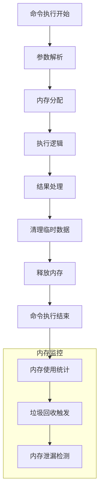

### 并发控制

系统支持命令的并发执行，但有以下限制：
- 最大并发数：10个命令同时执行
- 命令队列：超出限制的命令进入等待队列
- 优先级调度：高优先级命令优先执行

## 故障排除指南

### 常见错误类型

| 错误类型 | 触发原因 | 解决方案 |
|---------|----------|----------|
| 参数错误 | 参数类型不匹配 | 检查参数类型和格式 |
| 命令不存在 | 命令拼写错误 | 查看可用命令列表 |
| 权限不足 | 缺少执行权限 | 检查用户权限设置 |
| 资源冲突 | 资源被占用 | 释放资源后重试 |
| 超时错误 | 操作超时 | 增加超时时间或优化操作 |

### 调试工具

系统提供多种调试工具帮助开发者诊断问题：

1. **命令日志**：记录所有命令执行历史
2. **状态监控**：实时监控MVU状态变化
3. **性能分析**：分析命令执行时间和资源消耗
4. **错误追踪**：定位错误发生的具体位置

### 错误处理流程

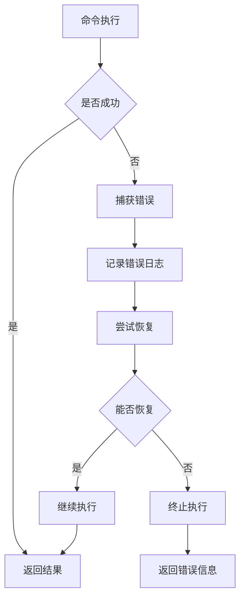

**章节来源**
- [util/common.ts:76-118](file://util/common.ts#L76-L118)

## 结论

Slash命令系统是一个功能强大、架构清晰的命令行接口系统。它通过模块化的组件设计、完善的参数验证机制、以及与MVU状态管理的深度集成，为用户提供了一个高效、可靠的自动化工具平台。

系统的主要优势包括：
- **全面的功能覆盖**：支持260+命令，涵盖各种使用场景
- **强大的扩展性**：支持自定义命令和插件开发
- **优秀的用户体验**：直观的命令语法和丰富的参数选项
- **稳定的性能表现**：优化的执行引擎和内存管理

对于开发者而言，系统提供了清晰的API接口和完善的开发工具，便于扩展和定制。对于普通用户而言，系统通过直观的命令语法和丰富的示例，降低了学习和使用的门槛。

## 附录

### 命令使用示例

#### 基础命令示例
- `/echo "Hello World"` - 显示提示信息
- `/send "你好"` - 发送用户消息
- `/trigger` - 触发AI回复
- `/abort` - 中止命令执行

#### 高级命令示例
- `/if left=score right=10 rule=gte "/speak You win"` - 条件执行
- `/times 5 "/addvar key=i 1"` - 循环执行
- `/run myQR arg1=value1` - 执行快速回复

#### MVU集成示例
- `/setvar key=health 100` - 更新状态数据
- `/getvar health` - 读取状态数据
- `/var key=player.health 100` - 复合变量操作

### 开发最佳实践

1. **命令设计原则**
   - 命令名称简洁明了
   - 参数命名规范统一
   - 提供默认参数值
   - 包含详细的帮助信息

2. **错误处理**
   - 始终进行参数验证
   - 提供有意义的错误信息
   - 实现优雅的降级策略
   - 记录详细的日志信息

3. **性能优化**
   - 避免长时间阻塞操作
   - 使用异步编程模式
   - 实现适当的缓存机制
   - 监控内存使用情况

4. **安全性考虑**
   - 验证用户输入
   - 实施访问控制
   - 防止命令注入攻击
   - 实施资源限制