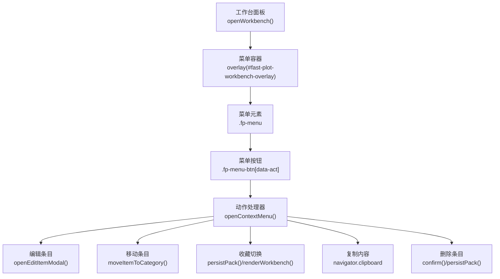
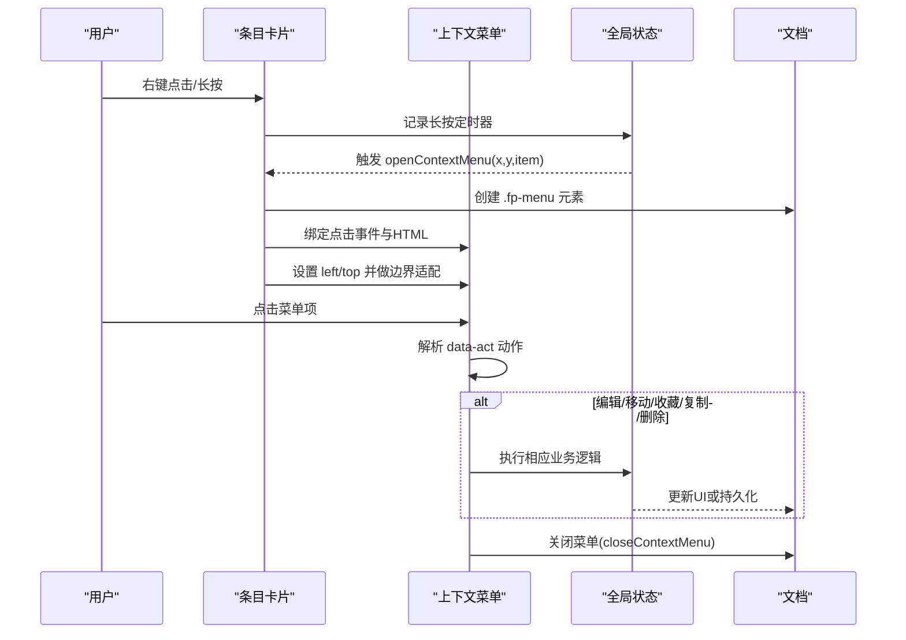
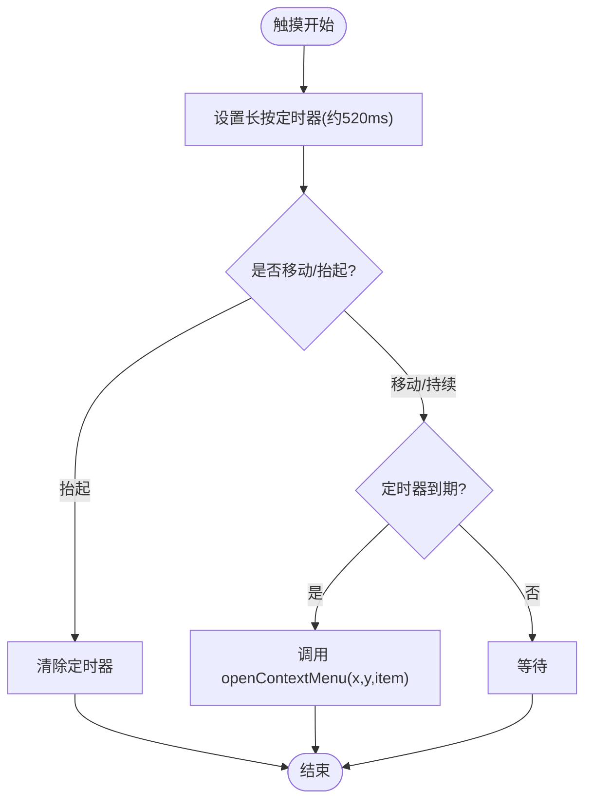
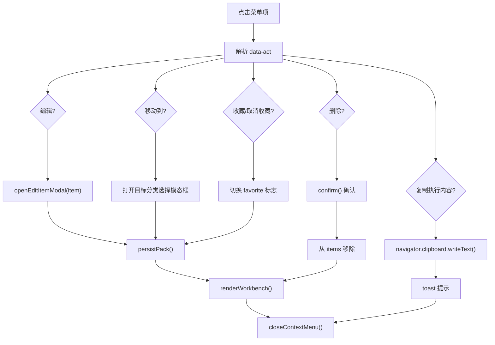
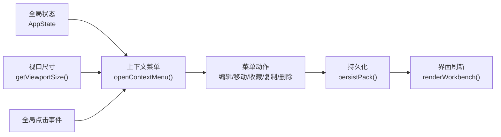

# 上下文菜单系统

<cite>
**本文档引用的文件**
- [src\快速情节编排\index.ts](file://src\快速情节编排\index.ts)
</cite>

## 目录
1. [简介](#简介)
2. [项目结构](#项目结构)
3. [核心组件](#核心组件)
4. [架构总览](#架构总览)
5. [详细组件分析](#详细组件分析)
6. [依赖关系分析](#依赖关系分析)
7. [性能考量](#性能考量)
8. [故障排查指南](#故障排查指南)
9. [结论](#结论)

## 简介
本文件面向“上下文菜单系统”的技术文档，聚焦于右键菜单的触发机制、长按检测、定时器管理、位置计算、层级控制，以及菜单项功能实现（编辑、移动、收藏、复制、删除）、显示隐藏控制（点击外部关闭、键盘快捷键、焦点管理）等核心能力。文档提供代码级分析与可视化图示，帮助开发者快速理解与扩展该系统。

## 项目结构
- 本系统位于 src\快速情节编排\index.ts，采用自包含的模块化封装，内部维护全局状态与渲染逻辑。
- 菜单系统与工作台面板、设置中心、导入导出等功能共同构成完整的“快速情节编排”界面生态。

图表来源
- [src\快速情节编排\index.ts](file://src\快速情节编排\index.ts)

章节来源
- [src\快速情节编排\index.ts](file://src\快速情节编排\index.ts)

## 核心组件
- 全局状态对象：维护当前包、当前分类、历史路径、过滤条件、上下文菜单DOM引用、长按定时器、拖拽数据、宿主窗口与文档引用等。
- 菜单渲染与事件：openContextMenu()负责创建菜单DOM、绑定点击事件、定位与边界适配；closeContextMenu()负责销毁菜单。
- 触发机制：鼠标右键 oncontextmenu 与触摸长按 touchstart/touchend 组合实现跨设备支持。
- 菜单项：编辑、移动到、收藏/取消收藏、复制执行内容、删除。
- 外部点击关闭：通过全局 click 事件检测非菜单区域点击，调用关闭函数。
- 焦点与层级：菜单使用固定定位与极高的 z-index，确保覆盖在所有内容之上；边界适配保证在视口内显示。

章节来源
- [src\快速情节编排\index.ts](file://src\快速情节编排\index.ts)

## 架构总览
上下文菜单系统围绕“触发—定位—交互—收起”的闭环设计：
- 触发：卡片元素绑定 oncontextmenu 与触摸长按事件。
- 定位：根据鼠标/触摸坐标设置 left/top，并在必要时反向调整以贴合视口边缘。
- 交互：点击菜单按钮执行具体动作，部分动作弹出模态框进行二次确认或参数选择。
- 收起：菜单内部点击或外部点击均触发关闭。

图表来源
- [src\快速情节编排\index.ts](file://src\快速情节编排\index.ts)

## 详细组件分析

### 菜单触发与长按检测
- 鼠标右键触发：卡片元素 oncontextmenu 事件中阻止默认行为并调用 openContextMenu。
- 触摸长按触发：touchstart 设置定时器（约520ms），若定时器存在且未被 touchend 清除，则在回调中打开菜单；touchend 清理定时器，避免误触。
- 全局点击关闭：页面 click 事件中，若点击目标不在菜单区域内则关闭菜单。

图表来源
- [src\快速情节编排\index.ts](file://src\快速情节编排\index.ts)

章节来源
- [src\快速情节编排\index.ts](file://src\快速情节编排\index.ts)

### 菜单定位与边界适配
- 定位：菜单元素初始 left/top 即为触发坐标。
- 边界适配：获取菜单自身尺寸与视口尺寸，若右侧或底部越界，则反向调整 left/top，确保完全可见。
- 层级控制：菜单使用固定定位与极高 z-index，保证覆盖在其他元素之上。

章节来源
- [src\快速情节编排\index.ts](file://src\快速情节编排\index.ts)

### 菜单项功能实现
- 编辑：打开编辑模态框，允许修改名称、内容、执行方式与分类。
- 移动到：打开目标分类选择的模态框，确认后调用移动逻辑并刷新界面。
- 收藏/取消收藏：切换条目 favorite 标志，持久化并刷新界面。
- 复制执行内容：使用剪贴板API复制条目内容，反馈提示。
- 删除：二次确认后移除条目，持久化并刷新界面。

图表来源
- [src\快速情节编排\index.ts](file://src\快速情节编排\index.ts)

章节来源
- [src\快速情节编排\index.ts](file://src\快速情节编排\index.ts)

### 显示隐藏控制与用户体验优化
- 点击外部关闭：全局 click 监听器检测点击目标是否在菜单内，若不在则关闭菜单。
- 键盘快捷键：当前代码未实现键盘快捷键关闭菜单。
- 焦点管理：菜单为静态 DOM 片段，未涉及复杂焦点流转；建议在需要时引入键盘导航与焦点回退策略。

章节来源
- [src\快速情节编排\index.ts](file://src\快速情节编排\index.ts)

### 与设置中心、导入导出的关系
- 设置中心：提供主题切换、占位符、令牌、默认执行方式、Toast 参数等设置入口，菜单项本身不直接处理这些设置。
- 导入导出：菜单项不直接参与导入导出流程；导入导出通过工作台顶部按钮触发相应模态框。

章节来源
- [src\快速情节编排\index.ts](file://src\快速情节编排\index.ts)

## 依赖关系分析
- 菜单系统依赖全局状态对象（Pack、当前分类、历史路径、菜单DOM引用、长按定时器等）。
- 菜单渲染依赖视口尺寸计算与边界适配逻辑。
- 菜单项动作依赖持久化与界面刷新函数。
- 外部点击关闭依赖全局事件监听。

图表来源
- [src\快速情节编排\index.ts](file://src\快速情节编排\index.ts)

章节来源
- [src\快速情节编排\index.ts](file://src\快速情节编排\index.ts)

## 性能考量
- 定时器管理：长按定时器在触摸结束时及时清理，避免内存泄漏。
- DOM 操作：菜单创建与销毁为 O(1) 操作，频繁触发时注意避免重复创建。
- 边界计算：仅在菜单首次创建时计算尺寸并做一次边界适配，后续复用结果。
- 事件监听：全局 click 监听器仅在初始化时绑定，避免重复绑定导致的性能问题。

## 故障排查指南
- 菜单无法显示
  - 检查 openContextMenu 是否被正确调用（右键或长按）。
  - 确认全局状态中的 contextMenu 引用是否为空。
- 菜单位置异常
  - 检查 getViewportSize 返回值与实际视口尺寸是否一致。
  - 确认菜单尺寸计算与边界适配逻辑是否生效。
- 菜单不消失
  - 检查全局 click 监听器是否正常工作，点击目标是否被正确排除。
  - 确认 closeContextMenu 是否被菜单内部点击或外部点击触发。
- 功能异常
  - 编辑/移动/收藏/复制/删除等动作需检查对应处理函数与持久化逻辑是否执行成功。
  - 若剪贴板复制失败，检查浏览器权限与 navigator.clipboard 可用性。

章节来源
- [src\快速情节编排\index.ts](file://src\快速情节编排\index.ts)

## 结论
上下文菜单系统通过简洁的触发—定位—交互—收起流程，实现了良好的跨设备体验与可扩展性。其核心优势在于：
- 统一的触发入口（右键与长按）与稳定的定位策略；
- 清晰的动作映射与完善的边界适配；
- 与工作台整体状态的解耦与协作。

未来可考虑增强的方向包括：键盘快捷键支持、焦点管理优化、菜单项动态扩展与主题一致性等。