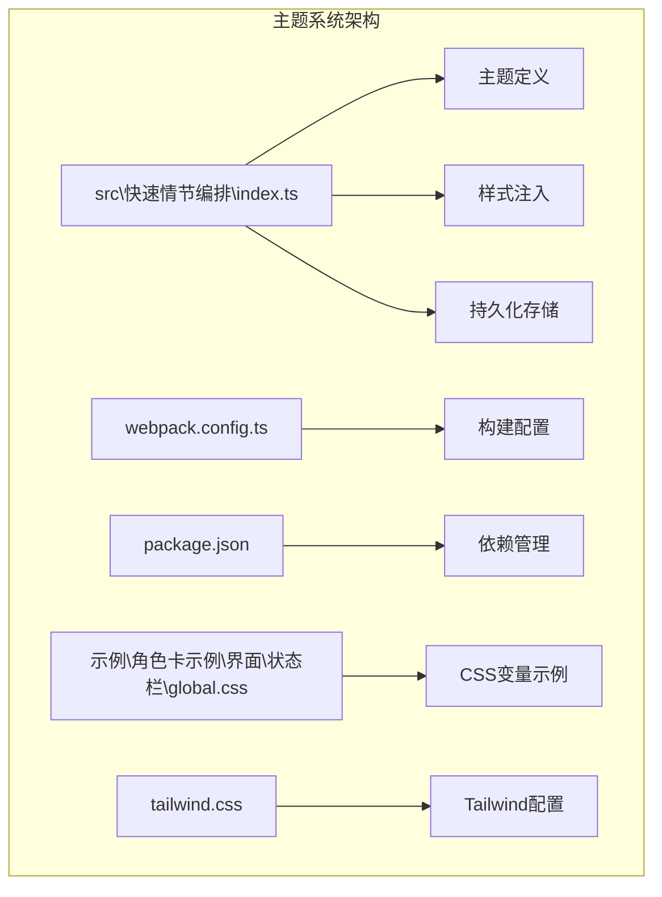
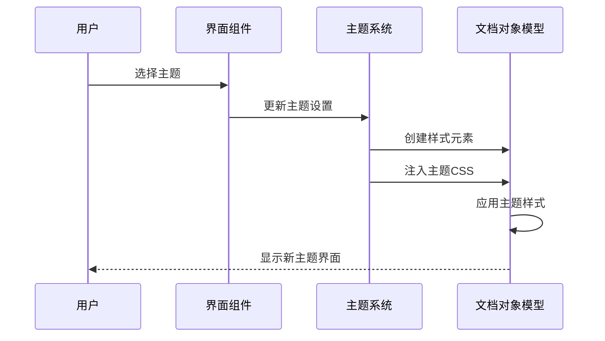
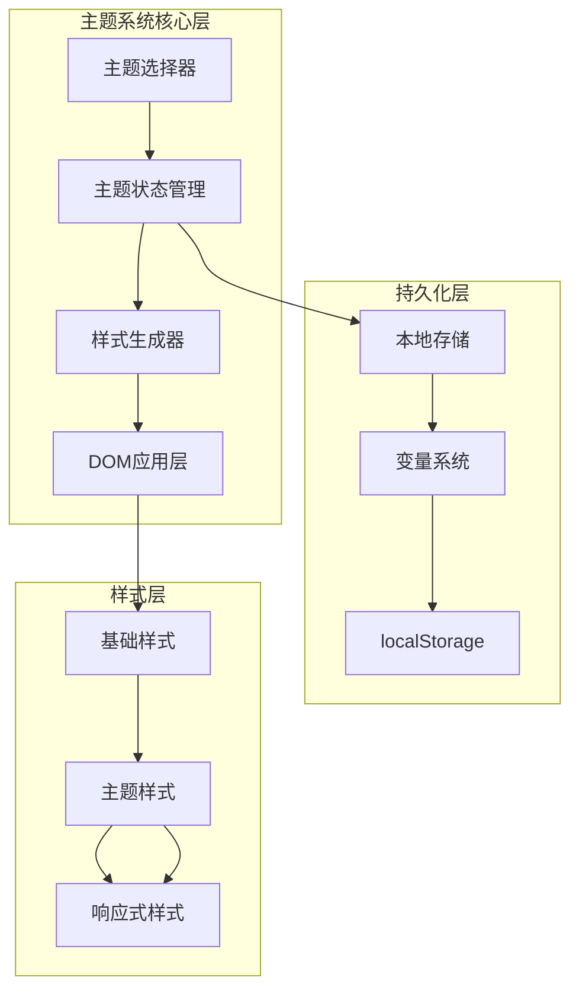
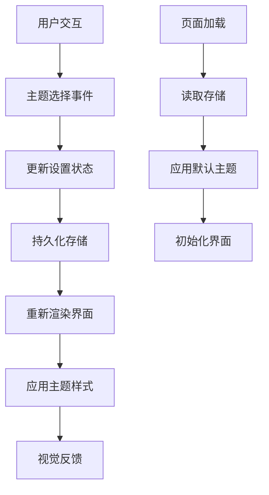
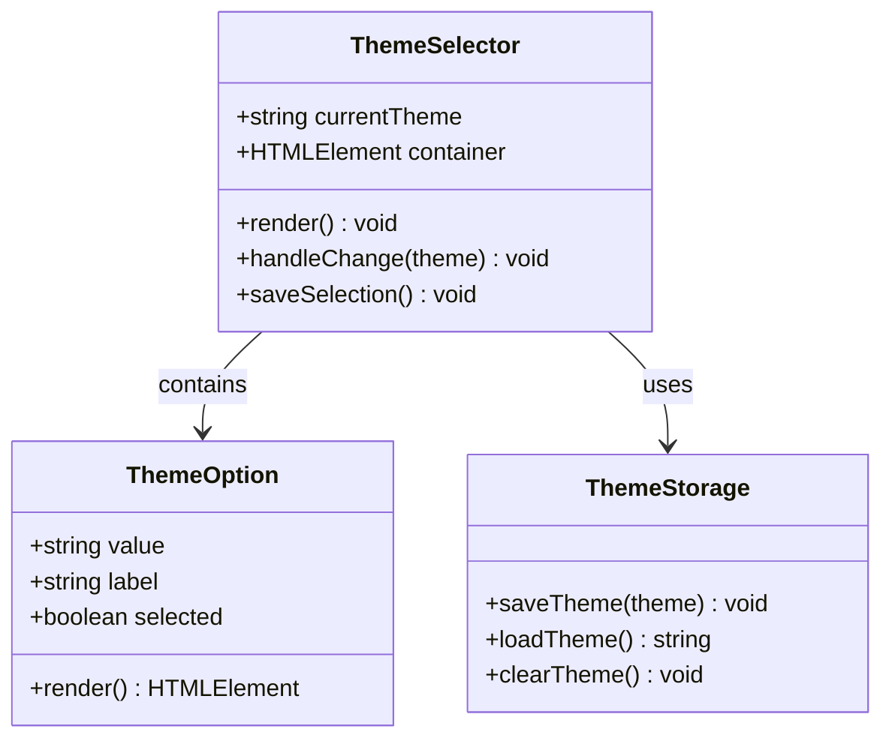
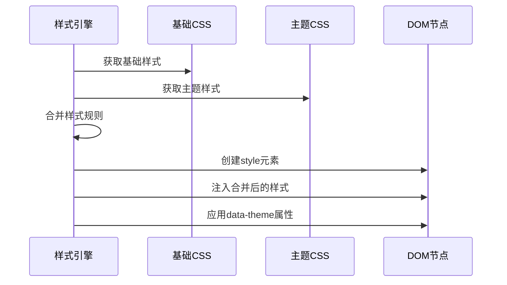
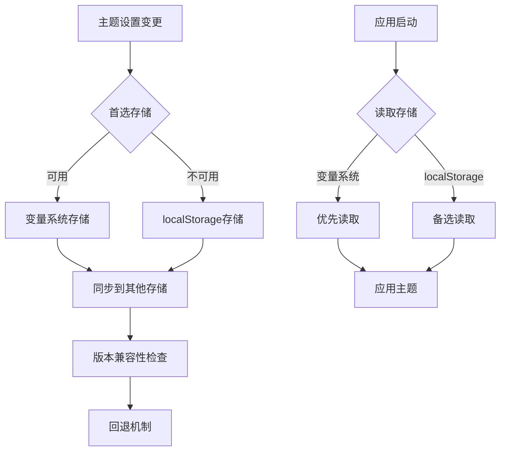
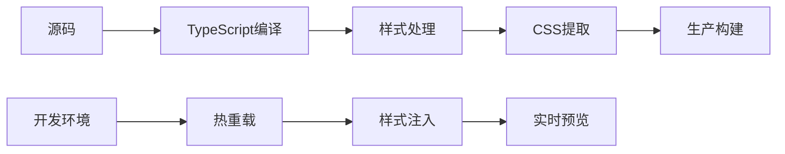

# 主题系统

<cite>
**本文档引用的文件**
- [src\快速情节编排\index.ts](file://src\快速情节编排\index.ts)
- [webpack.config.ts](file://webpack.config.ts)
- [package.json](file://package.json)
- [示例\角色卡示例\界面\状态栏\global.css](file://示例\角色卡示例\界面\状态栏\global.css)
- [tailwind.css](file://tailwind.css)
</cite>

## 目录
1. [简介](#简介)
2. [项目结构](#项目结构)
3. [核心组件](#核心组件)
4. [架构概览](#架构概览)
5. [详细组件分析](#详细组件分析)
6. [依赖分析](#依赖分析)
7. [性能考虑](#性能考虑)
8. [故障排除指南](#故障排除指南)
9. [结论](#结论)

## 简介

主题系统是本项目的重要功能模块，负责为用户提供多种视觉主题选择，包括herdi-light、ink-noir、sand-gold三种内置主题。该系统实现了完整的主题管理生命周期，从主题选择、样式注入到持久化存储，为用户提供了丰富的个性化体验。

## 项目结构

项目采用模块化架构设计，主题系统作为核心功能模块集成在主要的应用程序中：

**图表来源**
- [src\快速情节编排\index.ts:1-120](file://src\快速情节编排\index.ts#L1-L120)
- [webpack.config.ts:1-100](file://webpack.config.ts#L1-L100)

**章节来源**
- [src\快速情节编排\index.ts:1-800](file://src\快速情节编排\index.ts#L1-L800)
- [webpack.config.ts:1-200](file://webpack.config.ts#L1-L200)

## 核心组件

### 主题定义与管理

主题系统通过以下核心组件实现完整的主题管理功能：

#### 主题枚举与默认值
系统定义了三种内置主题，每种主题都有独特的视觉特征和适用场景：

- **Herdi Light**：默认主题，采用温暖的米色调，适合大多数使用场景
- **Ink Noir**：深色主题，采用墨黑色调，适合夜间使用和护眼需求
- **Sand Gold**：暖色调主题，采用沙金色调，营造温馨的阅读氛围

#### 主题持久化机制
主题选择通过本地存储机制实现持久化，确保用户偏好在页面刷新后得以保持。

**章节来源**
- [src\快速情节编排\index.ts:38-44](file://src\快速情节编排\index.ts#L38-L44)
- [src\快速情节编排\index.ts:254-256](file://src\快速情节编排\index.ts#L254-L256)
- [src\快速情节编排\index.ts:411-413](file://src\快速情节编排\index.ts#L411-L413)

### 样式注入与应用

#### 动态样式注入
系统通过动态创建和注入CSS样式表来实现主题切换功能：

**图表来源**
- [src\快速情节编排\index.ts:447-586](file://src\快速情节编排\index.ts#L447-L586)
- [src\快速情节编排\index.ts:2130-2175](file://src\快速情节编排\index.ts#L2130-L2175)

#### 主题CSS结构
每个主题都包含完整的CSS定义，涵盖面板、按钮、卡片、导航等所有UI组件的状态样式。

**章节来源**
- [src\快速情节编排\index.ts:547-583](file://src\快速情节编排\index.ts#L547-L583)

## 架构概览

### 主题系统整体架构

**图表来源**
- [src\快速情节编排\index.ts:960-1059](file://src\快速情节编排\index.ts#L960-L1059)
- [src\快速情节编排\index.ts:183-218](file://src\快速情节编排\index.ts#L183-L218)

### 数据流架构

**图表来源**
- [src\快速情节编排\index.ts:1032-1056](file://src\快速情节编排\index.ts#L1032-L1056)
- [src\快速情节编排\index.ts:428-438](file://src\快速情节编排\index.ts#L428-L438)

## 详细组件分析

### 主题选择器组件

#### 组件结构
主题选择器是一个独立的设置面板，提供直观的主题选择界面：

**图表来源**
- [src\快速情节编排\index.ts:960-1059](file://src\快速情节编排\index.ts#L960-L1059)
- [src\快速情节编排\index.ts:1032-1056](file://src\快速情节编排\index.ts#L1032-L1056)

#### 主题选项实现
系统提供三个预定义的主题选项，每个主题都有明确的视觉特征：

**章节来源**
- [src\快速情节编排\index.ts:1000-1008](file://src\快速情节编排\index.ts#L1000-L1008)

### 样式注入引擎

#### 样式生成机制
系统通过动态生成CSS样式来实现主题切换，包含基础样式和主题特定样式：

**图表来源**
- [src\快速情节编排\index.ts:447-586](file://src\快速情节编排\index.ts#L447-L586)
- [src\快速情节编排\index.ts:2134-2136](file://src\快速情节编排\index.ts#L2134-L2136)

#### 响应式主题支持
系统支持响应式设计，确保在不同屏幕尺寸下主题都能正确显示：

**章节来源**
- [src\快速情节编排\index.ts:577-583](file://src\快速情节编排\index.ts#L577-L583)

### 持久化存储机制

#### 多层存储策略
系统采用多层次的存储策略确保主题设置的可靠性和兼容性：

**图表来源**
- [src\快速情节编排\index.ts:183-218](file://src\快速情节编排\index.ts#L183-L218)
- [src\快速情节编排\index.ts:428-438](file://src\快速情节编排\index.ts#L428-L438)

**章节来源**
- [src\快速情节编排\index.ts:183-218](file://src\快速情节编排\index.ts#L183-L218)

### 主题兼容性检查

#### 版本管理
系统实现了完善的版本管理机制，确保主题设置在不同版本间的兼容性：

**章节来源**
- [src\快速情节编排\index.ts:220-305](file://src\快速情节编排\index.ts#L220-L305)

## 依赖分析

### 构建系统依赖

#### Webpack配置分析
构建系统通过Webpack配置支持主题样式的处理和优化：

**图表来源**
- [webpack.config.ts:350-410](file://webpack.config.ts#L350-L410)
- [webpack.config.ts:421-443](file://webpack.config.ts#L421-L443)

#### 开发工具链
系统使用现代化的开发工具链确保主题开发的效率和质量：

**章节来源**
- [package.json:15-77](file://package.json#L15-L77)
- [webpack.config.ts:1-50](file://webpack.config.ts#L1-L50)

### 样式系统依赖

#### CSS变量支持
系统支持CSS自定义属性，为主题系统提供灵活的颜色管理能力：

**章节来源**
- [示例\角色卡示例\界面\状态栏\global.css:7-17](file://示例\角色卡示例\界面\状态栏\global.css#L7-L17)

## 性能考虑

### 样式加载优化
系统通过以下机制优化主题样式的加载性能：

- **按需加载**：只在需要时创建和注入样式元素
- **缓存机制**：避免重复创建相同的样式元素
- **最小化重绘**：通过批量DOM操作减少重绘次数

### 存储访问优化
持久化存储采用了高效的访问模式：

- **异步存储**：避免阻塞主线程
- **批量更新**：合并多个存储操作
- **错误处理**：优雅处理存储失败的情况

## 故障排除指南

### 常见问题诊断

#### 主题不生效
当遇到主题不生效的问题时，可以按照以下步骤进行排查：

1. **检查样式注入**：确认样式元素是否正确创建和注入
2. **验证DOM属性**：确认面板元素是否包含正确的data-theme属性
3. **检查存储状态**：验证主题设置是否正确保存到存储中

#### 主题切换异常
如果主题切换出现异常，建议检查：

- **事件绑定**：确认主题选择事件是否正确绑定
- **状态更新**：验证主题状态是否正确更新
- **持久化流程**：检查存储流程是否正常执行

**章节来源**
- [src\快速情节编排\index.ts:1032-1056](file://src\快速情节编排\index.ts#L1032-L1056)
- [src\快速情节编排\index.ts:2134-2136](file://src\快速情节编排\index.ts#L2134-L2136)

### 调试技巧

#### 开发者工具使用
使用浏览器开发者工具可以有效调试主题相关问题：

- **Elements面板**：检查data-theme属性和样式应用
- **Sources面板**：设置断点跟踪主题切换流程
- **Console面板**：查看相关的错误信息和警告

## 结论

主题系统通过精心设计的架构实现了完整的主题管理功能。系统不仅提供了美观的视觉效果，更重要的是确保了良好的用户体验和系统的稳定性。

### 关键特性总结

1. **多主题支持**：提供三种精心设计的主题，满足不同用户的视觉偏好
2. **持久化机制**：通过多层次存储确保用户偏好的可靠保存
3. **动态切换**：支持运行时主题切换，无需页面刷新
4. **响应式设计**：适配不同屏幕尺寸和设备类型
5. **性能优化**：通过缓存和异步处理确保流畅的用户体验

### 技术优势

- **模块化设计**：清晰的组件分离便于维护和扩展
- **类型安全**：完整的TypeScript类型定义确保代码质量
- **兼容性强**：支持多种存储机制和浏览器环境
- **可扩展性**：易于添加新的主题和功能特性

主题系统为用户提供了丰富而个性化的使用体验，是项目成功的关键功能之一。