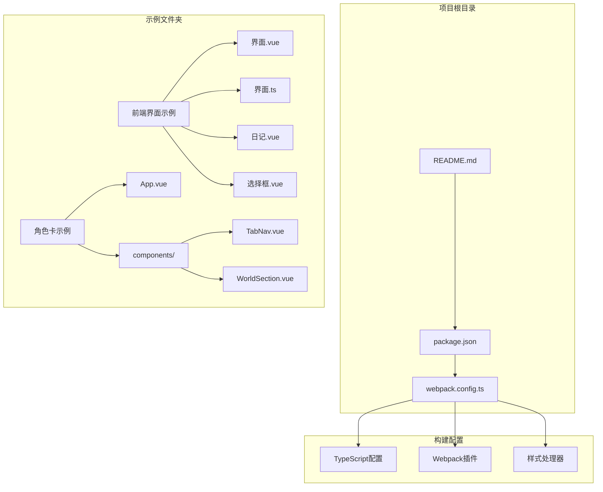
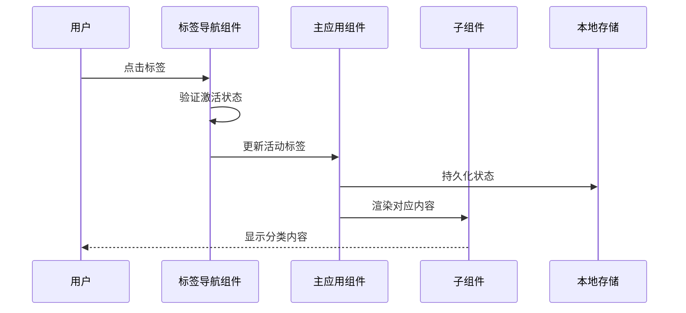
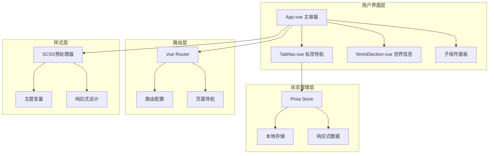
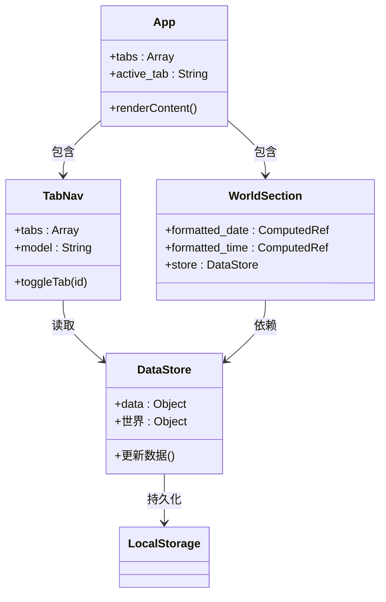
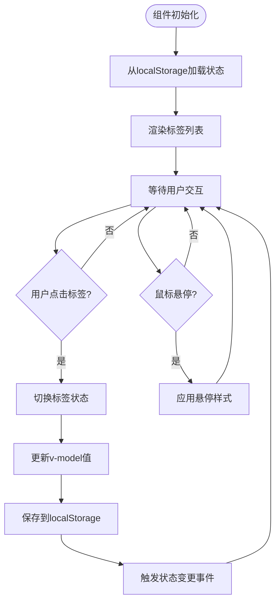
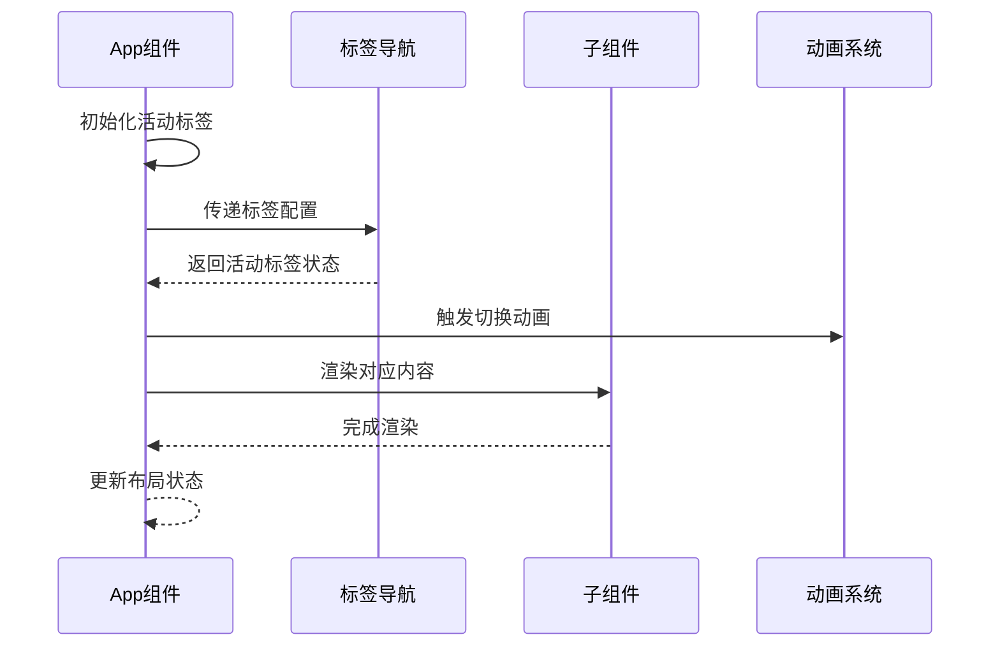
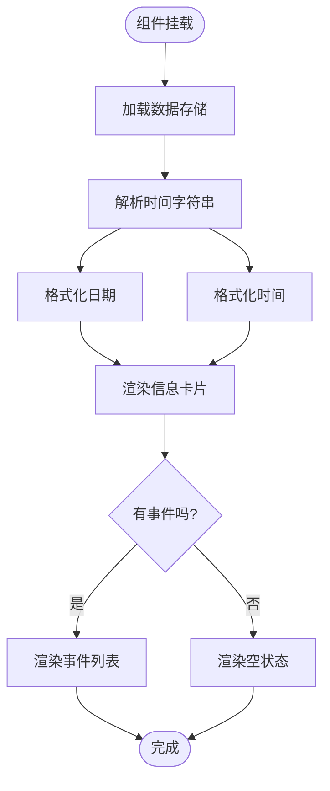
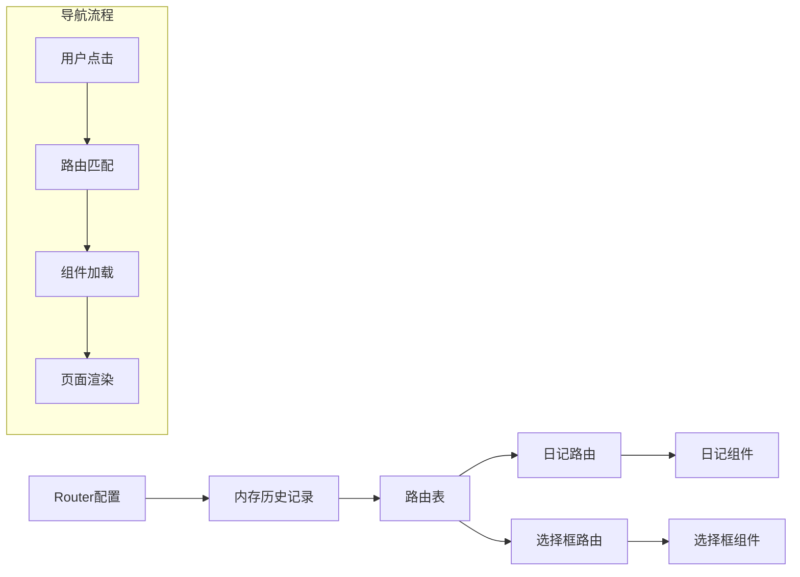
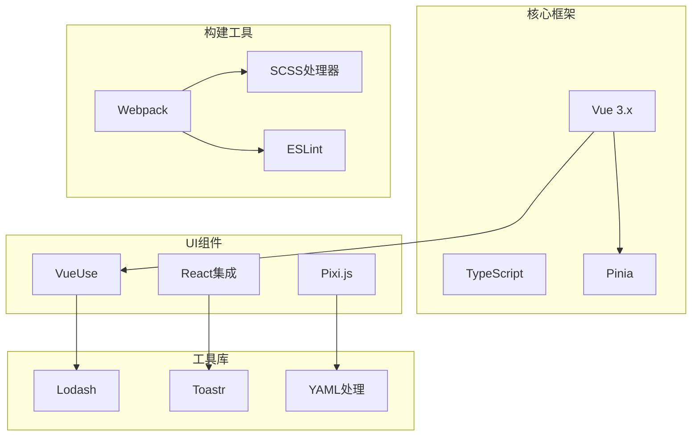
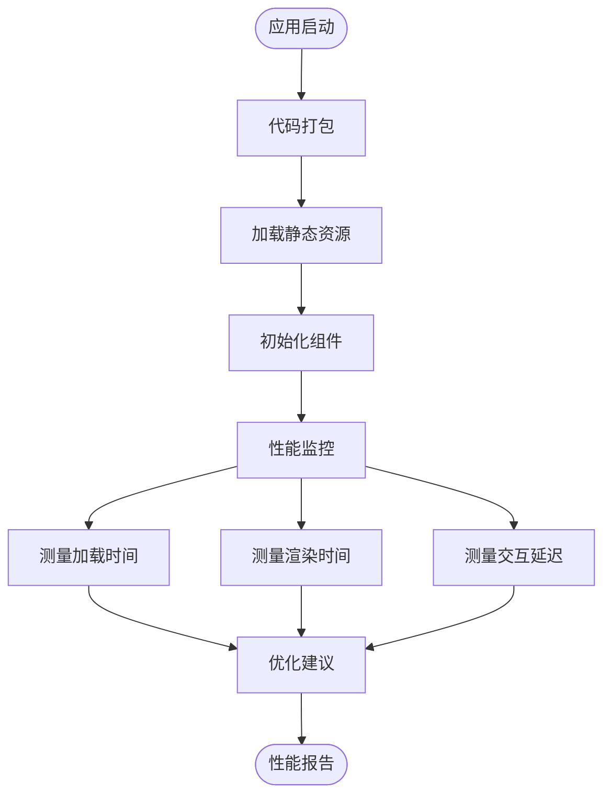

# 分类导航系统

<cite>
**本文档引用的文件**
- [README.md](file://README.md)
- [package.json](file://package.json)
- [webpack.config.ts](file://webpack.config.ts)
- [示例/前端界面示例/界面.vue](file://示例/前端界面示例/界面.vue)
- [示例/前端界面示例/界面.ts](file://示例/前端界面示例/界面.ts)
- [示例/前端界面示例/日记.vue](file://示例/前端界面示例/日记.vue)
- [示例/前端界面示例/选择框.vue](file://示例/前端界面示例/选择框.vue)
- [示例/角色卡示例/界面/状态栏/App.vue](file://示例/角色卡示例/界面/状态栏/App.vue)
- [示例/角色卡示例/界面/状态栏/components/TabNav.vue](file://示例/角色卡示例/界面/状态栏/components/TabNav.vue)
- [示例/角色卡示例/界面/状态栏/components/WorldSection.vue](file://示例/角色卡示例/界面/状态栏/components/WorldSection.vue)
</cite>

## 目录
1. [简介](#简介)
2. [项目结构](#项目结构)
3. [核心组件](#核心组件)
4. [架构概览](#架构概览)
5. [详细组件分析](#详细组件分析)
6. [依赖分析](#依赖分析)
7. [性能考虑](#性能考虑)
8. [故障排除指南](#故障排除指南)
9. [结论](#结论)

## 简介

本项目是一个基于Vue 3的分类导航系统模板，提供了完整的前端界面和脚本开发环境。该系统专注于演示如何构建高效的分类导航界面，包括标签页切换、响应式布局、状态管理和数据绑定等核心功能。

系统采用现代化的前端技术栈，支持TypeScript、SCSS样式预处理、Vue单文件组件开发，并集成了多种实用工具库来提升开发体验和用户体验。

## 项目结构

该项目采用模块化的文件组织结构，主要分为以下几个核心部分：

**图表来源**
- [webpack.config.ts:54-75](file://webpack.config.ts#L54-L75)
- [package.json:15-107](file://package.json#L15-L107)

**章节来源**
- [README.md:1-105](file://README.md#L1-L105)
- [package.json:1-120](file://package.json#L1-L120)
- [webpack.config.ts:1-572](file://webpack.config.ts#L1-L572)

## 核心组件

### 分类导航系统架构

系统采用组件化设计模式，主要包含以下核心组件：

1. **TabNav组件** - 主要的分类导航组件，负责标签页的切换和状态管理
2. **App主组件** - 应用程序的入口点，协调各个子组件的工作
3. **WorldSection组件** - 世界信息展示区域，提供上下文相关的元数据
4. **路由系统** - 基于Vue Router的页面导航机制

### 数据流设计

**图表来源**
- [示例/角色卡示例/界面/状态栏/components/TabNav.vue:23-25](file://示例/角色卡示例/界面/状态栏/components/TabNav.vue#L23-L25)
- [示例/角色卡示例/界面/状态栏/App.vue:32](file://示例/角色卡示例/界面/状态栏/App.vue#L32)

**章节来源**
- [示例/角色卡示例/界面/状态栏/components/TabNav.vue:1-67](file://示例/角色卡示例/界面/状态栏/components/TabNav.vue#L1-L67)
- [示例/角色卡示例/界面/状态栏/App.vue:1-77](file://示例/角色卡示例/界面/状态栏/App.vue#L1-L77)

## 架构概览

### 系统架构图

**图表来源**
- [示例/角色卡示例/界面/状态栏/App.vue:20-33](file://示例/角色卡示例/界面/状态栏/App.vue#L20-L33)
- [示例/角色卡示例/界面/状态栏/components/TabNav.vue:16-25](file://示例/角色卡示例/界面/状态栏/components/TabNav.vue#L16-L25)

### 组件关系图

**图表来源**
- [示例/角色卡示例/界面/状态栏/App.vue:27-33](file://示例/角色卡示例/界面/状态栏/App.vue#L27-L33)
- [示例/角色卡示例/界面/状态栏/components/TabNav.vue:17-25](file://示例/角色卡示例/界面/状态栏/components/TabNav.vue#L17-L25)
- [示例/角色卡示例/界面/状态栏/components/WorldSection.vue:22-36](file://示例/角色卡示例/界面/状态栏/components/WorldSection.vue#L22-L36)

## 详细组件分析

### 标签导航组件 (TabNav)

TabNav组件是分类导航系统的核心，实现了标签页的切换功能和状态管理。

#### 组件特性

- **响应式设计**：自适应不同屏幕尺寸
- **状态持久化**：使用localStorage保存用户偏好
- **无障碍支持**：包含ARIA属性和键盘导航
- **动画效果**：平滑的切换动画和视觉反馈

#### 核心实现逻辑

**图表来源**
- [示例/角色卡示例/界面/状态栏/components/TabNav.vue:23-25](file://示例/角色卡示例/界面/状态栏/components/TabNav.vue#L23-L25)

**章节来源**
- [示例/角色卡示例/界面/状态栏/components/TabNav.vue:1-67](file://示例/角色卡示例/界面/状态栏/components/TabNav.vue#L1-L67)

### 主应用组件 (App)

App组件作为应用程序的主容器，协调各个子组件的工作并管理全局状态。

#### 组件职责

- **布局管理**：定义整体页面布局结构
- **状态协调**：管理活动标签的状态
- **内容渲染**：根据活动标签动态渲染对应内容
- **样式控制**：应用统一的主题样式和动画效果

#### 内容渲染流程

**图表来源**
- [示例/角色卡示例/界面/状态栏/App.vue:9-16](file://示例/角色卡示例/界面/状态栏/App.vue#L9-L16)

**章节来源**
- [示例/角色卡示例/界面/状态栏/App.vue:1-77](file://示例/角色卡示例/界面/状态栏/App.vue#L1-L77)

### 世界信息组件 (WorldSection)

WorldSection组件提供上下文相关的元数据展示，增强用户的导航体验。

#### 功能特性

- **时间显示**：格式化显示当前日期和时间
- **位置信息**：展示用户当前所在位置
- **事件列表**：显示最近的系统事件
- **响应式布局**：适配移动设备的紧凑显示

#### 数据处理流程

**图表来源**
- [示例/角色卡示例/界面/状态栏/components/WorldSection.vue:27-36](file://示例/角色卡示例/界面/状态栏/components/WorldSection.vue#L27-L36)

**章节来源**
- [示例/角色卡示例/界面/状态栏/components/WorldSection.vue:1-111](file://示例/角色卡示例/界面/状态栏/components/WorldSection.vue#L1-L111)

### 路由系统集成

系统集成了Vue Router来支持页面导航和路由管理。

#### 路由配置

**图表来源**
- [示例/前端界面示例/界面.ts:6-17](file://示例/前端界面示例/界面.ts#L6-L17)

**章节来源**
- [示例/前端界面示例/界面.vue:1-4](file://示例/前端界面示例/界面.vue#L1-L4)
- [示例/前端界面示例/界面.ts:1-22](file://示例/前端界面示例/界面.ts#L1-L22)

## 依赖分析

### 技术栈依赖

系统采用现代化的前端技术栈，主要依赖包括：

**图表来源**
- [package.json:79-107](file://package.json#L79-L107)
- [package.json:15-78](file://package.json#L15-L78)

### 外部依赖管理

系统使用pnpm包管理器，支持按需加载和模块导入：

- **CDN导入**：通过jsDelivr CDN自动导入外部模块
- **本地模块**：优先使用本地安装的依赖
- **全局变量**：配置关键库的全局变量映射

**章节来源**
- [package.json:1-120](file://package.json#L1-L120)
- [webpack.config.ts:521-567](file://webpack.config.ts#L521-L567)

## 性能考虑

### 优化策略

1. **代码分割**：使用Webpack的SplitChunks插件实现按需加载
2. **资源压缩**：生产环境启用Terser压缩和CSS提取
3. **缓存策略**：配置浏览器缓存和CDN缓存
4. **懒加载**：组件按需加载，减少初始包大小

### 性能监控

## 故障排除指南

### 常见问题及解决方案

#### 样式加载问题

**问题描述**：组件样式未正确加载或显示异常

**解决步骤**：
1. 检查SCSS文件是否正确编译
2. 验证CSS模块导入路径
3. 确认样式作用域配置

#### 组件状态同步问题

**问题描述**：标签状态与实际显示不一致

**解决步骤**：
1. 检查v-model绑定是否正确
2. 验证localStorage持久化逻辑
3. 确认组件生命周期钩子

#### 路由导航问题

**问题描述**：页面跳转失败或路由参数丢失

**解决步骤**：
1. 检查路由配置和路径匹配
2. 验证组件props传递
3. 确认路由守卫逻辑

**章节来源**
- [示例/角色卡示例/界面/状态栏/components/TabNav.vue:23-25](file://示例/角色卡示例/界面/状态栏/components/TabNav.vue#L23-L25)
- [示例/前端界面示例/界面.ts:19-21](file://示例/前端界面示例/界面.ts#L19-L21)

## 结论

本分类导航系统模板提供了一个完整的、可扩展的前端解决方案，具有以下优势：

1. **模块化设计**：清晰的组件分离和职责划分
2. **响应式布局**：适配多种设备和屏幕尺寸
3. **状态管理**：完善的本地存储和状态同步机制
4. **开发体验**：丰富的工具链和构建配置
5. **可维护性**：良好的代码结构和文档支持

系统为开发者提供了一个坚实的基础，可以根据具体需求进行定制和扩展，适用于各种类型的分类导航应用场景。