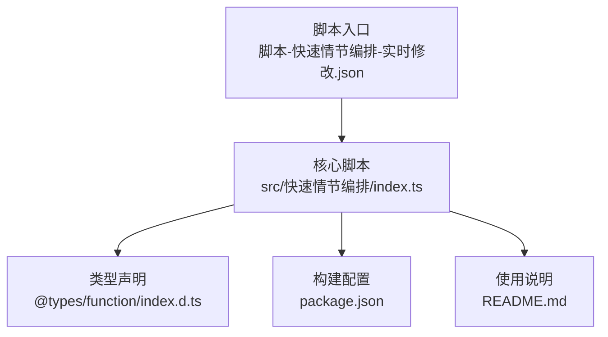
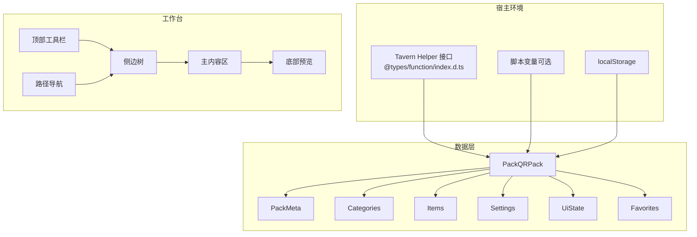
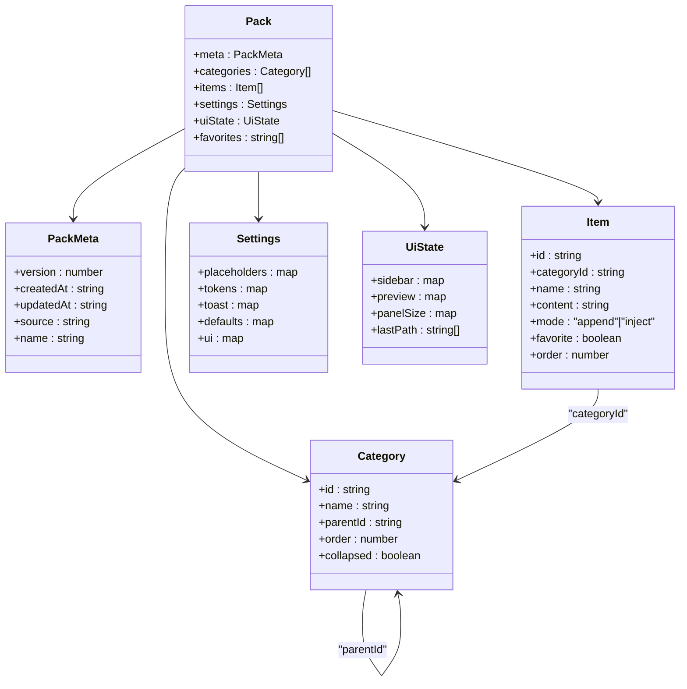
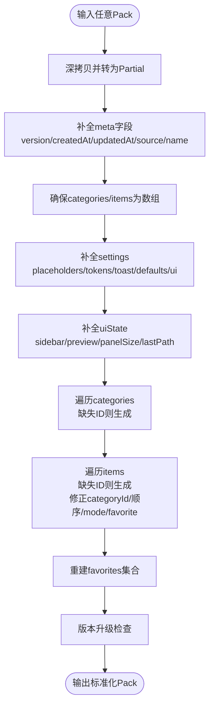
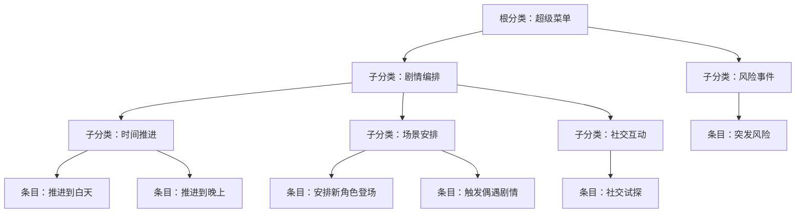
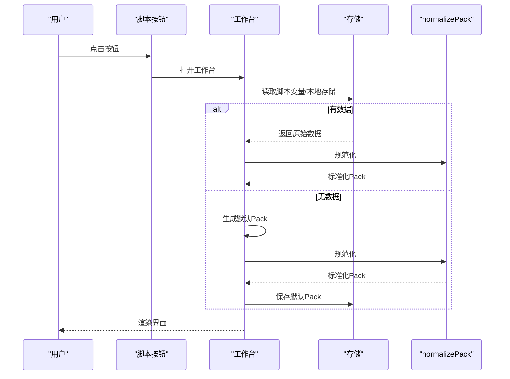
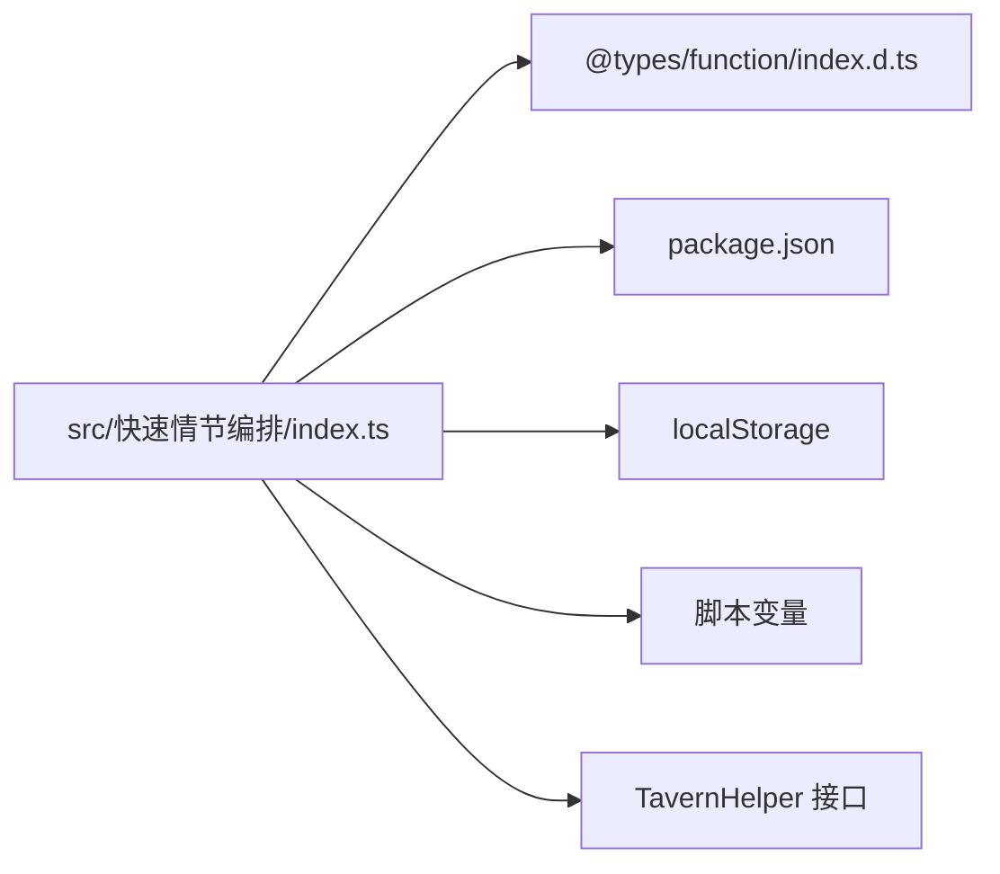

# 剧情包管理

<cite>
**本文引用的文件**
- [src/快速情节编排/index.ts](file://src/快速情节编排/index.ts)
- [package.json](file://package.json)
- [README.md](file://README.md)
- [脚本-快速情节编排-实时修改.json](file://脚本-快速情节编排-实时修改.json)
- [@types/function/index.d.ts](file://@types/function/index.d.ts)
</cite>

## 目录
1. [简介](#简介)
2. [项目结构](#项目结构)
3. [核心组件](#核心组件)
4. [架构总览](#架构总览)
5. [详细组件分析](#详细组件分析)
6. [依赖分析](#依赖分析)
7. [性能考虑](#性能考虑)
8. [故障排除指南](#故障排除指南)
9. [结论](#结论)
10. [附录](#附录)

## 简介
本技术文档面向“剧情包管理系统（QRPack）”，围绕“快速情节编排”脚本展开，系统性阐述其数据结构设计、规范化流程、默认剧情包构建逻辑以及完整的 CRUD（创建、加载、保存、更新）实现。重点包括：
- 数据模型：meta元数据、categories分类、items项目、settings设置、uiState界面状态、favorites收藏夹
- 规范化（normalizePack）：版本兼容、默认值填充、ID生成、父子关系建立
- 默认剧情包（buildDefaultPack）：根分类、剧情分类、时间推进、场景安排、社交互动、风险事件等预设
- 实践示例：如何创建、加载、保存、更新剧情包数据

## 项目结构
该项目采用“脚本即应用”的组织方式，核心逻辑集中在单个TypeScript文件中，配合类型声明与打包配置：
- 核心脚本：src/快速情节编排/index.ts
- 类型声明：@types/function/index.d.ts
- 构建与依赖：package.json
- 使用说明：README.md
- 开发脚本入口：脚本-快速情节编排-实时修改.json

图表来源
- [脚本-快速情节编排-实时修改.json:1-7](file://脚本-快速情节编排-实时修改.json#L1-L7)
- [src/快速情节编排/index.ts:1-2218](file://src/快速情节编排/index.ts#L1-L2218)
- [@types/function/index.d.ts:1-170](file://@types/function/index.d.ts#L1-L170)
- [package.json:1-120](file://package.json#L1-L120)
- [README.md:1-105](file://README.md#L1-L105)

章节来源
- [src/快速情节编排/index.ts:1-2218](file://src/快速情节编排/index.ts#L1-L2218)
- [脚本-快速情节编排-实时修改.json:1-7](file://脚本-快速情节编排-实时修改.json#L1-L7)
- [package.json:1-120](file://package.json#L1-L120)
- [README.md:1-105](file://README.md#L1-L105)

## 核心组件
本系统围绕“剧情包（QRPack）”这一核心实体展开，包含以下关键数据结构与处理流程：

- 数据模型
  - PackMeta：版本、创建时间、更新时间、来源、名称
  - Category：分类，含id、name、parentId、order、collapsed
  - Item：项目，含id、categoryId、name、content、mode（append/inject）、favorite、order
  - Settings：占位符、令牌、Toast、默认行为、UI主题
  - UiState：侧边栏展开状态、宽度、折叠；预览面板展开高度与令牌流；面板尺寸；最后路径
  - Favorites：收藏项ID集合

- 规范化（normalizePack）
  - 保证字段存在性与类型正确
  - 生成缺失的ID
  - 建立父子关系一致性
  - 维护收藏项与items同步
  - 处理版本升级

- 默认剧情包（buildDefaultPack）
  - 构建根分类与剧情子分类
  - 预置时间推进、场景安排、社交互动、风险事件等条目
  - 初始化settings与uiState

- CRUD与交互
  - loadPack/load：加载并规范化现有数据，若无则生成默认数据
  - persistPack：持久化当前状态
  - 导入/导出：支持QRPack v1与原版QR结构
  - UI渲染与交互：树形分类、卡片式条目、上下文菜单、拖拽排序、预览令牌流

章节来源
- [src/快速情节编排/index.ts:12-60](file://src/快速情节编排/index.ts#L12-L60)
- [src/快速情节编排/index.ts:220-305](file://src/快速情节编排/index.ts#L220-L305)
- [src/快速情节编排/index.ts:307-426](file://src/快速情节编排/index.ts#L307-L426)
- [src/快速情节编排/index.ts:428-445](file://src/快速情节编排/index.ts#L428-L445)

## 架构总览
系统采用“单页工作台（Overlay Panel）+ 本地存储”的轻量架构：
- 工作台Overlay承载顶部工具栏、路径导航、侧边树、主内容区与底部预览
- 通过脚本按钮触发打开工作台
- 数据持久化通过脚本变量或localStorage实现
- 导入/导出支持文件与原版QR结构

图表来源
- [@types/function/index.d.ts:1-170](file://@types/function/index.d.ts#L1-L170)
- [src/快速情节编排/index.ts:183-218](file://src/快速情节编排/index.ts#L183-L218)
- [src/快速情节编排/index.ts:1901-2098](file://src/快速情节编排/index.ts#L1901-L2098)

章节来源
- [src/快速情节编排/index.ts:183-218](file://src/快速情节编排/index.ts#L183-L218)
- [src/快速情节编排/index.ts:1901-2098](file://src/快速情节编排/index.ts#L1901-L2098)
- [@types/function/index.d.ts:1-170](file://@types/function/index.d.ts#L1-L170)

## 详细组件分析

### 数据模型与关系
- PackMeta：记录版本、创建/更新时间、来源、名称
- Category：树形结构，parentId为空表示根节点；order决定同级顺序
- Item：属于某个Category，mode决定执行方式（追加或注入），favorite标记收藏
- Settings：占位符映射、执行令牌、Toast参数、默认行为、UI主题
- UiState：侧边栏宽度/展开状态、预览面板高度/展开状态、面板尺寸、最后路径
- Favorites：与items同步的收藏项ID集合

图表来源
- [src/快速情节编排/index.ts:12-60](file://src/快速情节编排/index.ts#L12-L60)

章节来源
- [src/快速情节编排/index.ts:12-60](file://src/快速情节编排/index.ts#L12-L60)

### 规范化流程（normalizePack）
规范化负责将任意输入数据转换为稳定的QRPack结构，确保字段完整性与一致性：
- meta：补齐version、createdAt、updatedAt、source、name
- categories/items：确保数组存在
- settings：补齐占位符、令牌、Toast、默认行为、UI主题
- uiState：补齐sidebar、preview、panelSize、lastPath
- favorites：基于items.favorite重建
- ID生成：为缺失的category/item生成唯一ID
- 父子关系：校验categoryId是否存在于categories，否则回退到根分类
- 版本升级：当meta.version低于当前DATA_VERSION时提升至最新

图表来源
- [src/快速情节编排/index.ts:220-305](file://src/快速情节编排/index.ts#L220-L305)

章节来源
- [src/快速情节编排/index.ts:220-305](file://src/快速情节编排/index.ts#L220-L305)

### 默认剧情包（buildDefaultPack）
默认剧情包提供开箱即用的剧情骨架，包含根分类与若干子分类及典型条目：
- 根分类：超级菜单
- 子分类：
  - 剧情编排（包含时间推进、场景安排、社交互动）
  - 风险事件
- 预置条目：
  - 时间推进：白天/晚上
  - 场景安排：新角色登场、偶遇剧情
  - 社交互动：社交试探
  - 风险事件：突发风险（注入模式）

图表来源
- [src/快速情节编排/index.ts:307-426](file://src/快速情节编排/index.ts#L307-L426)

章节来源
- [src/快速情节编排/index.ts:307-426](file://src/快速情节编排/index.ts#L307-L426)

### CRUD与持久化
- 加载（loadPack/load）
  - 优先从脚本变量或localStorage读取
  - 若不存在则生成默认数据并保存
  - 无论何种来源均通过normalizePack进行规范化
- 保存（persistPack）
  - 更新updatedAt与favorites
  - 写回脚本变量或localStorage
- 导入（openImportModal）
  - 支持QRPack v1与原版QR结构
  - 提供选择与冲突处理（跳过/覆盖/重命名）
- 导出（openExportModal）
  - 以当前分类子树为单位导出为JSON

图表来源
- [src/快速情节编排/index.ts:428-445](file://src/快速情节编排/index.ts#L428-L445)
- [src/快速情节编排/index.ts:220-305](file://src/快速情节编排/index.ts#L220-L305)

章节来源
- [src/快速情节编排/index.ts:428-445](file://src/快速情节编排/index.ts#L428-L445)
- [src/快速情节编排/index.ts:220-305](file://src/快速情节编排/index.ts#L220-L305)

### UI与交互
- 顶部工具栏：返回、快速插入“然后/同时”、新建分类/条目、导入/导出、设置、关闭
- 路径导航：显示当前分类的祖先链
- 侧边树：支持展开/折叠、拖拽排序、关键字过滤
- 主内容区：按组展示卡片式条目，支持收藏、上下文菜单、长按菜单
- 底部预览：展示最近执行的令牌流（条目名/同时/然后）
- 设置中心：占位符、令牌、主题、Toast参数、默认执行方式

章节来源
- [src/快速情节编排/index.ts:1901-2098](file://src/快速情节编排/index.ts#L1901-L2098)
- [src/快速情节编排/index.ts:935-1034](file://src/快速情节编排/index.ts#L935-L1034)
- [src/快速情节编排/index.ts:1036-1123](file://src/快速情节编排/index.ts#L1036-L1123)

## 依赖分析
- 宿主接口依赖：通过@types/function/index.d.ts声明的TavernHelper接口，实现注入提示、变量读写、按钮注册等能力
- 存储依赖：优先使用脚本变量（insertOrAssignVariables/updateVariablesWith），回退到localStorage
- 构建与运行：package.json定义了开发/生产构建、格式化、打包与同步任务

图表来源
- [src/快速情节编排/index.ts:183-218](file://src/快速情节编排/index.ts#L183-L218)
- [@types/function/index.d.ts:1-170](file://@types/function/index.d.ts#L1-L170)
- [package.json:1-120](file://package.json#L1-L120)

章节来源
- [src/快速情节编排/index.ts:183-218](file://src/快速情节编排/index.ts#L183-L218)
- [@types/function/index.d.ts:1-170](file://@types/function/index.d.ts#L1-L170)
- [package.json:1-120](file://package.json#L1-L120)

## 性能考虑
- 规范化成本：normalizePack对categories/items进行线性扫描与ID生成，整体复杂度O(n+m)
- UI渲染：树形与卡片网格按需渲染，支持关键字过滤减少DOM数量
- 存储写入：persistPack仅在必要时更新updatedAt与favorites，避免频繁序列化
- 预览令牌流：限制最大长度，防止内存膨胀

## 故障排除指南
- 无法保存/读取
  - 检查脚本变量接口可用性（insertOrAssignVariables/updateVariablesWith）
  - 若不可用，确认localStorage写入权限
- 工作台无法打开
  - 确认脚本按钮已注册成功
  - 检查宿主环境是否支持TavernHelper接口
- 导入失败
  - 确认JSON格式有效
  - 对于原版QR，系统会自动转换并过滤不兼容条目
- 占位符无效
  - 在设置中心检查占位符映射，确保键名与内容匹配

章节来源
- [src/快速情节编排/index.ts:183-218](file://src/快速情节编排/index.ts#L183-L218)
- [src/快速情节编排/index.ts:1399-1559](file://src/快速情节编排/index.ts#L1399-L1559)
- [src/快速情节编排/index.ts:935-1034](file://src/快速情节编排/index.ts#L935-L1034)

## 结论
本系统以极简架构实现了完整的QRPack数据管理：通过明确的数据模型、稳健的规范化流程、开箱即用的默认剧情包与完善的导入/导出机制，为用户提供了高效可控的剧情编排体验。其模块化设计便于扩展与维护，适合在酒馆助手生态中长期演进。

## 附录

### 数据结构定义（代码片段路径）
- PackMeta、Category、Item、Settings、UiState、Pack
  - [src/快速情节编排/index.ts:12-60](file://src/快速情节编排/index.ts#L12-L60)

### 规范化实现（代码片段路径）
- normalizePack
  - [src/快速情节编排/index.ts:220-305](file://src/快速情节编排/index.ts#L220-L305)

### 默认剧情包构建（代码片段路径）
- buildDefaultPack
  - [src/快速情节编排/index.ts:307-426](file://src/快速情节编排/index.ts#L307-L426)

### CRUD与持久化（代码片段路径）
- loadPack/load
  - [src/快速情节编排/index.ts:428-445](file://src/快速情节编排/index.ts#L428-L445)
- persistPack
  - [src/快速情节编排/index.ts:440-445](file://src/快速情节编排/index.ts#L440-L445)

### 导入/导出（代码片段路径）
- openImportModal/openImportSelectionModal/applyImport
  - [src/快速情节编排/index.ts:1399-1637](file://src/快速情节编排/index.ts#L1399-L1637)
- openExportModal
  - [src/快速情节编排/index.ts:1655-1704](file://src/快速情节编排/index.ts#L1655-L1704)

### UI与交互（代码片段路径）
- renderWorkbench/renderTree/renderMain
  - [src/快速情节编排/index.ts:1901-2098](file://src/快速情节编排/index.ts#L1901-L2098)
- openSettingsModal/openEditItemModal
  - [src/快速情节编排/index.ts:935-1123](file://src/快速情节编排/index.ts#L935-L1123)

### 宿主接口与类型（代码片段路径）
- TavernHelper接口声明
  - [@types/function/index.d.ts:1-170](file://@types/function/index.d.ts#L1-L170)