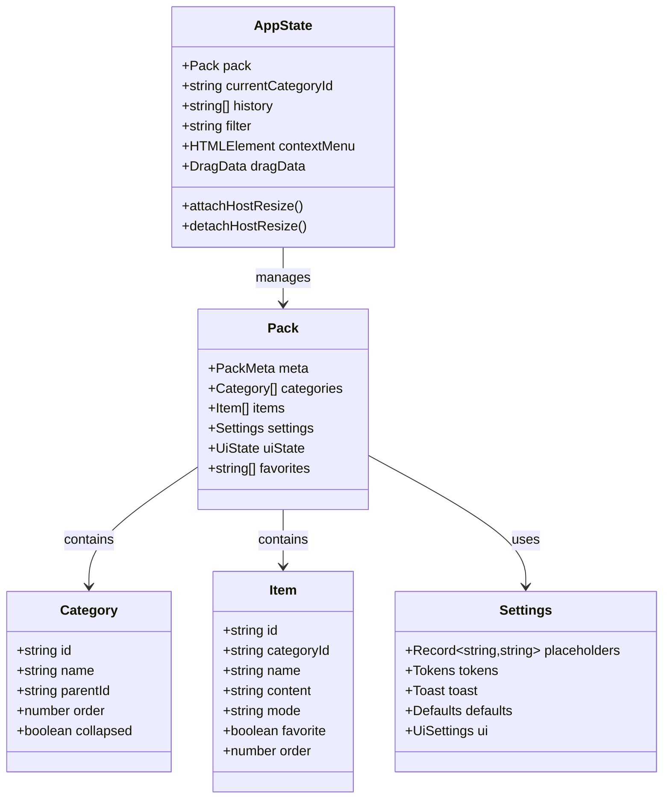
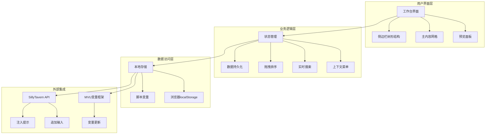
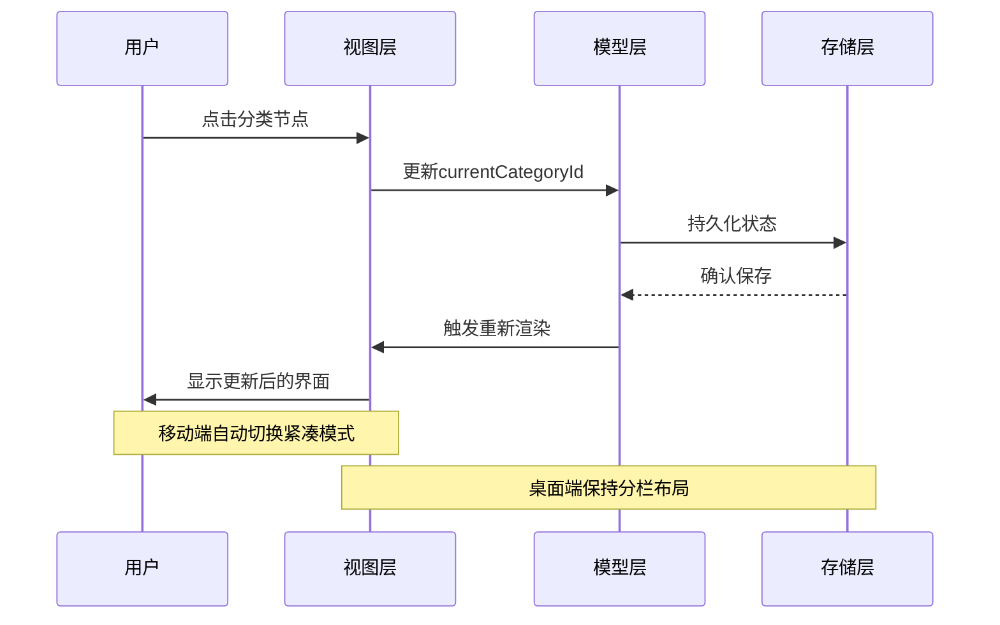
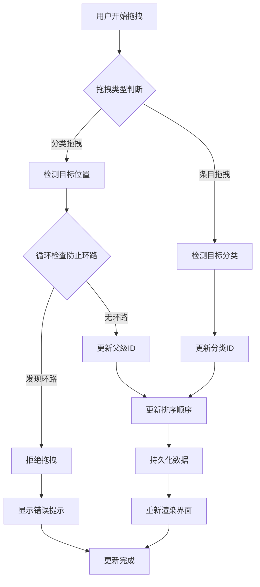
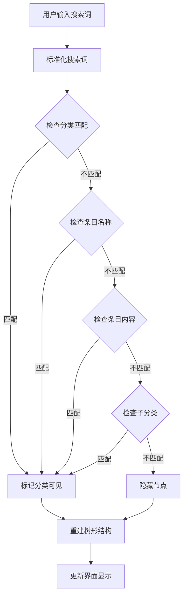
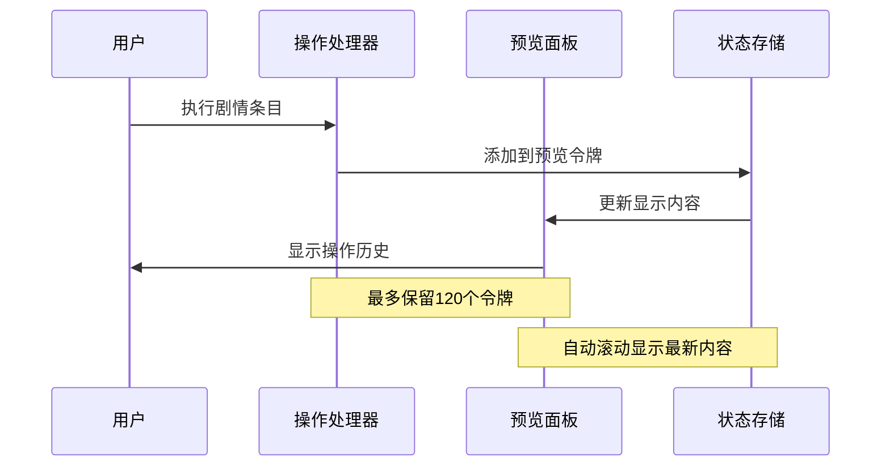
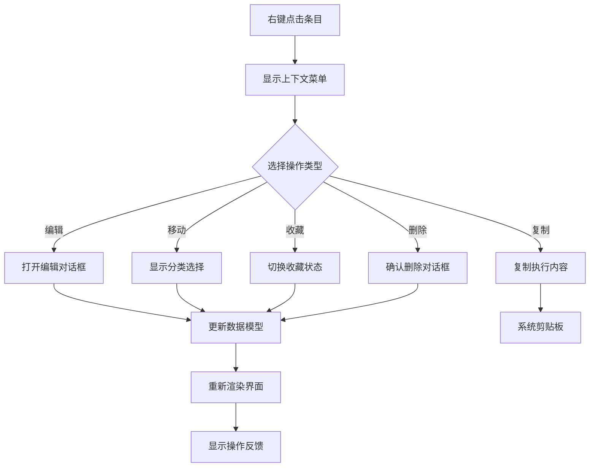
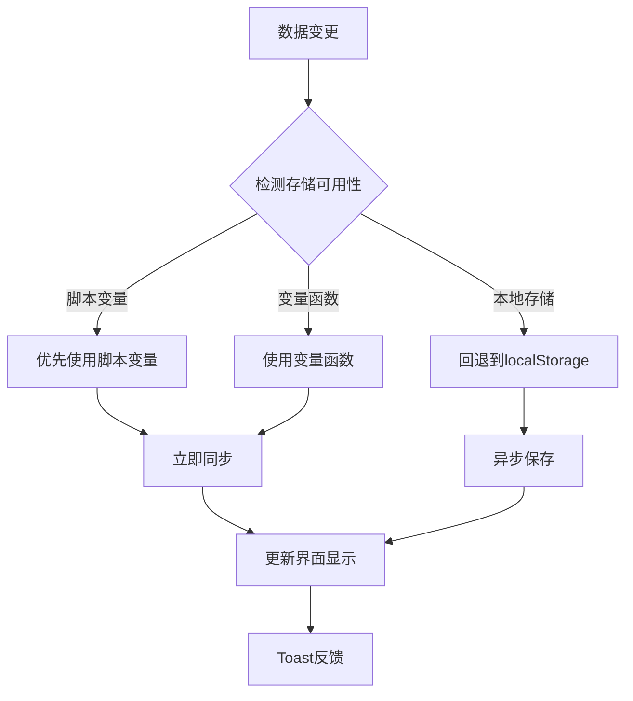
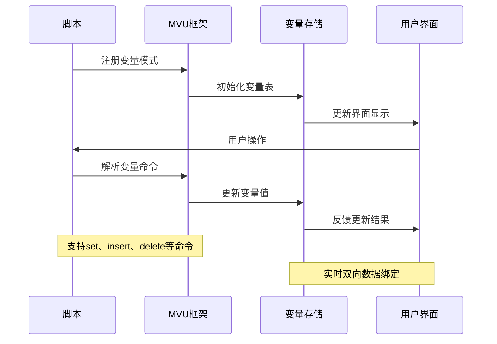

# 快速情节编排系统

<cite>
**本文档引用的文件**
- [src\快速情节编排\index.ts](file://src\快速情节编排\index.ts)
- [util\mvu.ts](file://util\mvu.ts)
- [util\common.ts](file://util\common.ts)
- [util\script.ts](file://util\script.ts)
- [@types\iframe\exported.mvu.d.ts](file://@types\iframe\exported.mvu.d.ts)
- [package.json](file://package.json)
- [README.md](file://README.md)
- [示例\脚本示例\index.ts](file://示例\脚本示例\index.ts)
- [示例\前端界面示例\界面.vue](file://示例\前端界面示例\界面.vue)
- [util\streaming.ts](file://util\streaming.ts)
</cite>

## 目录
1. [简介](#简介)
2. [项目结构](#项目结构)
3. [核心组件](#核心组件)
4. [架构概览](#架构概览)
5. [详细组件分析](#详细组件分析)
6. [依赖分析](#依赖分析)
7. [性能考虑](#性能考虑)
8. [故障排除指南](#故障排除指南)
9. [结论](#结论)
10. [附录](#附录)

## 简介

快速情节编排系统是一个专为酒馆助手（SillyTavern）设计的高级剧情编排工具，采用MVU（Model-View-Update）模式构建。该系统提供了直观的拖拽界面，支持实时搜索、收藏夹管理、主题切换等高级功能，帮助用户高效地组织和执行复杂的剧情指令。

系统的核心设计理念是通过声明式的MVU架构实现数据驱动的UI更新，结合响应式设计确保在不同设备上的良好体验。用户可以通过简单的拖拽操作来组织剧情元素，通过实时搜索快速定位所需的剧情片段，并通过收藏夹功能快速访问常用内容。

## 项目结构

该项目采用模块化设计，主要分为以下几个核心部分：

```mermaid
graph TB
subgraph "核心系统"
A[src\快速情节编排\index.ts] --> B[主控制器]
C[util\mvu.ts] --> D[MVU数据存储]
E[util\common.ts] --> F[通用工具函数]
G[util\script.ts] --> H[脚本工具集]
end
subgraph "类型定义"
I[@types\iframe\exported.mvu.d.ts] --> J[MVU接口类型]
K[package.json] --> L[依赖管理]
end
subgraph "示例与文档"
M[示例\脚本示例\index.ts] --> N[脚本示例]
O[示例\前端界面示例\界面.vue] --> P[界面示例]
Q[README.md] --> R[使用说明]
end
subgraph "流式处理"
S[util\streaming.ts] --> T[流式消息处理]
end
```

**图表来源**
- [src\快速情节编排\index.ts:1-50](file://src\快速情节编排\index.ts#L1-L50)
- [util\mvu.ts:1-20](file://util\mvu.ts#L1-L20)
- [package.json:1-30](file://package.json#L1-L30)

**章节来源**
- [src\快速情节编排\index.ts:1-100](file://src\快速情节编排\index.ts#L1-L100)
- [package.json:1-50](file://package.json#L1-L50)

## 核心组件

### MVU架构实现

系统采用MVU（Model-View-Update）模式，通过Pinia状态管理实现响应式数据绑定：



**图表来源**
- [src\快速情节编排\index.ts:67-60](file://src\快速情节编排\index.ts#L67-L60)
- [src\快速情节编排\index.ts:12-60](file://src\快速情节编排\index.ts#L12-L60)

### 数据模型结构

系统定义了完整的数据模型来支持剧情编排功能：

**PackMeta** - 包元数据
- 版本控制：支持数据迁移和版本管理
- 时间戳：记录创建和更新时间
- 源标识：标记数据来源
- 名称：包的显示名称

**Category** - 分类模型
- 层级结构：支持多级嵌套分类
- 排序机制：通过order字段维护显示顺序
- 折叠状态：记录用户的展开/折叠偏好
- 父子关系：通过parentId建立树形结构

**Item** - 条目模型
- 执行内容：包含实际的剧情指令
- 执行模式：支持追加到输入框或注入到上下文
- 收藏功能：通过favorite标记重要条目
- 分类关联：通过categoryId关联到相应分类

**Settings** - 设置模型
- 占位符系统：支持动态变量替换
- 执行令牌：自定义"然后"和"同时"按钮文本
- UI配置：主题选择和界面行为
- 性能设置：Toast消息的堆叠和显示时长

**章节来源**
- [src\快速情节编排\index.ts:12-60](file://src\快速情节编排\index.ts#L12-L60)
- [src\快速情节编排\index.ts:307-426](file://src\快速情节编排\index.ts#L307-L426)

## 架构概览

系统采用分层架构设计，实现了清晰的关注点分离：



**图表来源**
- [src\快速情节编排\index.ts:1901-2098](file://src\快速情节编排\index.ts#L1901-L2098)
- [src\快速情节编排\index.ts:440-445](file://src\快速情节编排\index.ts#L440-L445)

### MVU模式应用

系统实现了完整的MVU架构：

**Model（模型）**：AppState和Pack对象负责数据存储和状态管理
**View（视图）**：通过renderWorkbench等函数生成DOM结构
**Update（更新）**：通过事件处理器和状态变更函数实现数据更新

这种设计确保了数据流向的单向性和可预测性，简化了复杂状态管理。

**章节来源**
- [src\快速情节编排\index.ts:2130-2176](file://src\快速情节编排\index.ts#L2130-L2176)
- [util\mvu.ts:3-66](file://util\mvu.ts#L3-L66)

## 详细组件分析

### 响应式UI组件设计

系统实现了高度响应式的用户界面，支持多种设备和屏幕尺寸：



**图表来源**
- [src\快速情节编排\index.ts:2044-2098](file://src\快速情节编排\index.ts#L2044-L2098)
- [src\快速情节编排\index.ts:1901-1942](file://src\快速情节编排\index.ts#L1901-L1942)

### 拖拽排序机制

系统提供了直观的拖拽排序功能，支持分类和条目的重新排列：



**图表来源**
- [src\快速情节编排\index.ts:762-785](file://src\快速情节编排\index.ts#L762-L785)
- [src\快速情节编排\index.ts:841-865](file://src\快速情节编排\index.ts#L841-L865)

### 实时搜索功能

系统实现了高效的实时搜索功能，支持多维度内容检索：



**图表来源**
- [src\快速情节编排\index.ts:805-816](file://src\快速情节编排\index.ts#L805-L816)
- [src\快速情节编排\index.ts:876-922](file://src\快速情节编排\index.ts#L876-L922)

### 主题系统

系统支持三种主题风格，提供个性化的视觉体验：

**Herdi Light** - 经典浅色主题
**Ink Noir** - 深色主题，适合夜间使用  
**Sand Gold** - 温暖色调主题

主题切换通过CSS变量和data属性实现，无需重新加载页面即可生效。

**章节来源**
- [src\快速情节编排\index.ts:532-552](file://src\快速情节编排\index.ts#L532-L552)
- [src\快速情节编排\index.ts:1908](file://src\快速情节编排\index.ts#L1908)

### 预览面板

预览面板实时显示用户操作的历史记录，提供操作追踪功能：



**图表来源**
- [src\快速情节编排\index.ts:697-705](file://src\快速情节编排\index.ts#L697-L705)
- [src\快速情节编排\index.ts:1706-1715](file://src\快速情节编排\index.ts#L1706-L1715)

### 上下文菜单

系统提供丰富的上下文菜单功能，支持条目的编辑、移动、收藏等操作：



**图表来源**
- [src\快速情节编排\index.ts:1717-1789](file://src\快速情节编排\index.ts#L1717-L1789)
- [src\快速情节编排\index.ts:1036-1123](file://src\快速情节编排\index.ts#L1036-L1123)

### 数据持久化

系统实现了多层次的数据持久化策略：



**图表来源**
- [src\快速情节编排\index.ts:198-218](file://src\快速情节编排\index.ts#L198-L218)
- [src\快速情节编排\index.ts:440-445](file://src\快速情节编排\index.ts#L440-L445)

**章节来源**
- [src\快速情节编排\index.ts:183-218](file://src\快速情节编排\index.ts#L183-L218)
- [src\快速情节编排\index.ts:440-445](file://src\快速情节编排\index.ts#L440-L445)

## 依赖分析

系统依赖关系清晰，主要依赖包括：

```mermaid
graph TB
subgraph "核心依赖"
A[Vue 3] --> B[响应式系统]
C[Pinia] --> D[状态管理]
E[Lodash] --> F[工具函数]
G[jQuery] --> H[DOM操作]
end
subgraph "开发依赖"
I[TypeScript] --> J[类型安全]
K[Webpack] --> L[打包工具]
M[Tailwind CSS] --> N[样式框架]
end
subgraph "运行时依赖"
O[SillyTavern API] --> P[集成接口]
Q[MVU变量框架] --> R[变量管理]
S[React] --> T[组件支持]
end
A --> O
C --> Q
I --> K
M --> N
```



**图表来源**
- [package.json:79-107](file://package.json#L79-L107)
- [package.json:15-78](file://package.json#L15-L78)

### MVU变量框架集成

系统与MVU变量框架深度集成，提供强大的变量管理能力：



**图表来源**
- [@types\iframe\exported.mvu.d.ts:54-177](file://@types\iframe\exported.mvu.d.ts#L54-L177)
- [util\mvu.ts:3-66](file://util\mvu.ts#L3-L66)

**章节来源**
- [package.json:79-107](file://package.json#L79-L107)
- [@types\iframe\exported.mvu.d.ts:1-190](file://@types\iframe\exported.mvu.d.ts#L1-L190)

## 性能考虑

系统在设计时充分考虑了性能优化：

### 内存管理
- 使用requestAnimationFrame优化重绘频率
- 实现数据克隆和深拷贝的智能处理
- 控制预览面板令牌数量，限制内存占用

### 渲染优化
- 采用虚拟滚动减少DOM节点数量
- 实现增量更新，避免全量重渲染
- 使用CSS Grid和Flexbox提升布局性能

### 存储优化
- 实现智能缓存机制
- 优化JSON序列化和反序列化
- 支持增量保存，减少存储压力

## 故障排除指南

### 常见问题及解决方案

**界面不显示或显示异常**
1. 检查浏览器控制台是否有JavaScript错误
2. 确认SillyTavern版本兼容性
3. 尝试刷新页面或重启脚本

**数据丢失问题**
1. 检查浏览器存储权限设置
2. 验证localStorage空间是否充足
3. 尝试使用备份数据恢复

**拖拽功能失效**
1. 确认浏览器支持HTML5拖拽API
2. 检查是否有其他插件干扰拖拽事件
3. 尝试禁用广告拦截器

**章节来源**
- [src\快速情节编排\index.ts:2167-2176](file://src\快速情节编排\index.ts#L2167-L2176)
- [util\script.ts:38-47](file://util\script.ts#L38-L47)

## 结论

快速情节编排系统通过采用MVU架构和现代前端技术，成功实现了复杂剧情管理的可视化解决方案。系统具有以下优势：

1. **架构清晰**：MVU模式确保了数据流向的单向性和可预测性
2. **用户体验优秀**：响应式设计支持多设备使用，拖拽操作直观易用
3. **功能丰富**：涵盖分类管理、收藏夹、主题切换、实时搜索等核心功能
4. **扩展性强**：模块化设计便于功能扩展和定制

该系统为剧情创作者提供了强大而灵活的工具，能够显著提升剧情编排的效率和质量。

## 附录

### 快速开始指南

1. **安装依赖**：运行 `npm install` 安装项目依赖
2. **开发构建**：使用 `npm run build:dev` 进行开发构建
3. **生产构建**：使用 `npm run build` 生成生产版本
4. **热重载**：运行 `npm run watch` 启用文件监听

### API参考

系统提供完整的TypeScript类型定义，支持IDE智能提示和编译时类型检查。

### 贡献指南

欢迎通过GitHub Issues和Pull Request参与项目贡献，共同改进这个强大的剧情编排工具。