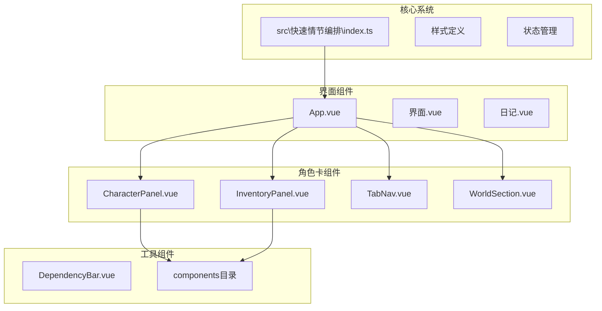
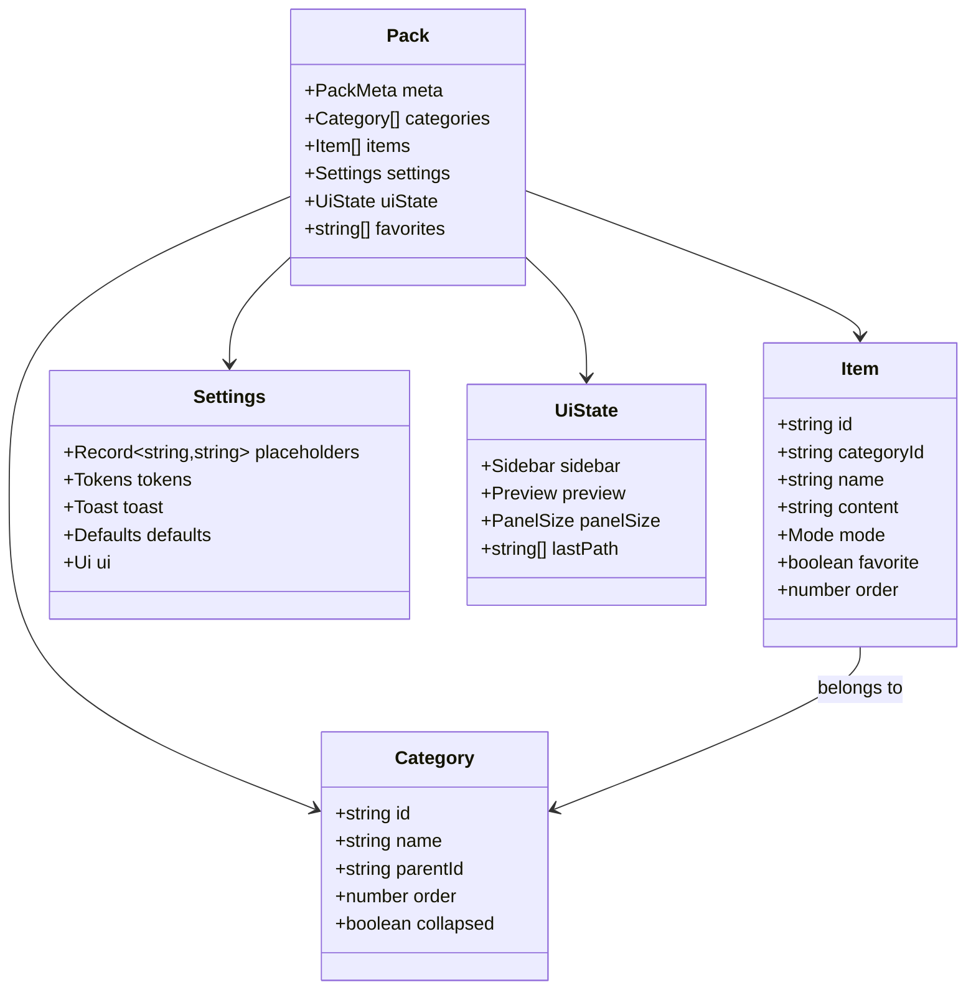
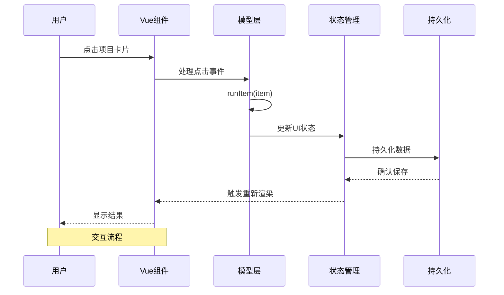
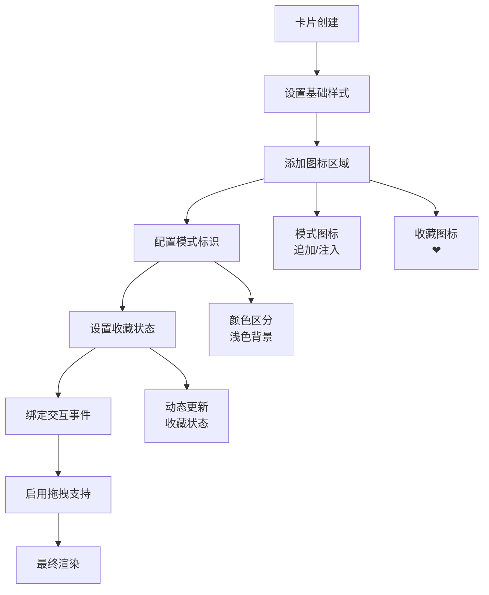
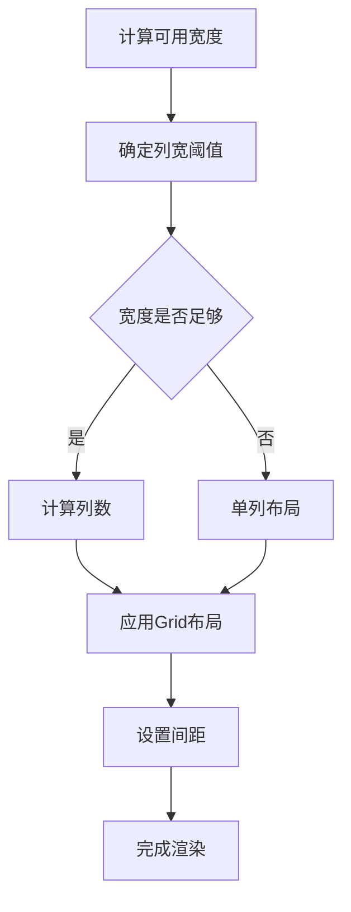
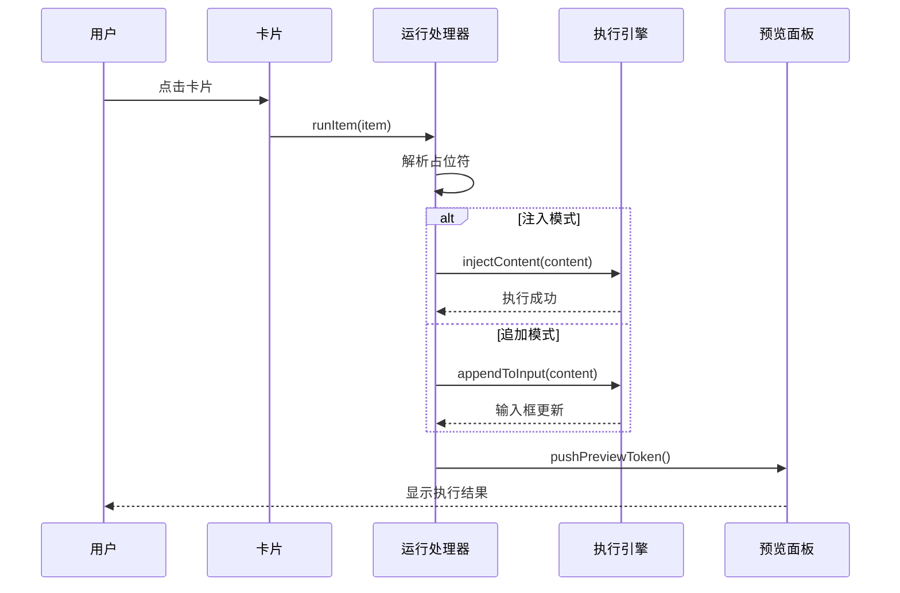
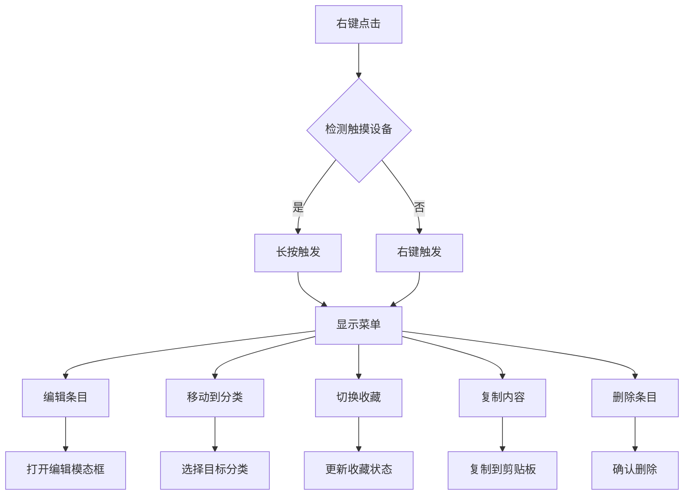
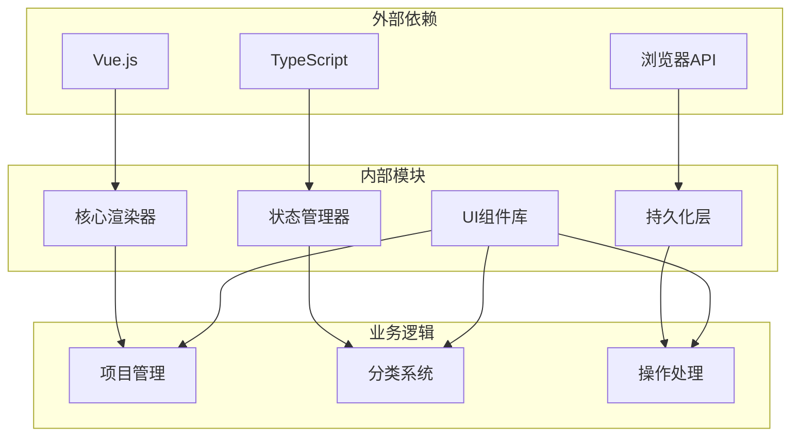

# 项目展示系统

<cite>
**本文档引用的文件**
- [src\快速情节编排\index.ts](file://src\快速情节编排\index.ts)
- [示例\前端界面示例\界面.vue](file://示例\前端界面示例\界面.vue)
- [示例\前端界面示例\日记.vue](file://示例\前端界面示例\日记.vue)
- [示例\角色卡示例\界面\状态栏\App.vue](file://示例\角色卡示例\界面\状态栏\App.vue)
- [示例\角色卡示例\界面\状态栏\components\CharacterPanel.vue](file://示例\角色卡示例\界面\状态栏\components\CharacterPanel.vue)
- [示例\角色卡示例\界面\状态栏\components\InventoryPanel.vue](file://示例\角色卡示例\界面\状态栏\components\InventoryPanel.vue)
</cite>

## 目录
1. [简介](#简介)
2. [项目结构](#项目结构)
3. [核心组件](#核心组件)
4. [架构概览](#架构概览)
5. [详细组件分析](#详细组件分析)
6. [依赖关系分析](#依赖关系分析)
7. [性能考虑](#性能考虑)
8. [故障排除指南](#故障排除指南)
9. [结论](#结论)

## 简介

项目展示系统是一个基于Vue.js和TypeScript构建的交互式界面，主要用于展示和管理项目卡片。该系统提供了丰富的UI组件、响应式布局、拖拽支持和多种交互功能。系统采用模块化设计，包含项目卡片渲染、网格布局算法、操作功能等多个核心组件。

## 项目结构

项目采用清晰的模块化组织结构，主要分为以下几个部分：

**图表来源**
- [src\快速情节编排\index.ts:1-50](file://src\快速情节编排\index.ts#L1-L50)
- [示例\角色卡示例\界面\状态栏\App.vue:1-35](file://示例\角色卡示例\界面\状态栏\App.vue#L1-L35)

**章节来源**
- [src\快速情节编排\index.ts:1-100](file://src\快速情节编排\index.ts#L1-L100)
- [示例\角色卡示例\界面\状态栏\App.vue:1-77](file://示例\角色卡示例\界面\状态栏\App.vue#L1-L77)

## 核心组件

### 数据模型架构

系统采用类型安全的数据模型设计，主要包括以下核心接口：

**图表来源**
- [src\快速情节编排\index.ts:12-60](file://src\快速情节编排\index.ts#L12-L60)

### 状态管理系统

系统实现了完整的状态管理机制，包括：

- **应用状态**：管理当前工作台状态、拖拽数据、上下文菜单等
- **UI状态**：控制面板大小、侧边栏展开状态、预览面板等
- **持久化存储**：支持localStorage和变量存储两种持久化方式

**章节来源**
- [src\快速情节编排\index.ts:67-111](file://src\快速情节编排\index.ts#L67-L111)
- [src\快速情节编排\index.ts:183-218](file://src\快速情节编排\index.ts#L183-L218)

## 架构概览

系统采用MVU（Model-View-Update）架构模式，结合Vue.js的响应式特性：

**图表来源**
- [src\快速情节编排\index.ts:740-754](file://src\快速情节编排\index.ts#L740-L754)
- [src\快速情节编排\index.ts:440-445](file://src\快速情节编排\index.ts#L440-L445)

## 详细组件分析

### 项目卡片渲染系统

#### 卡片设计要素

项目卡片是系统的核心展示组件，具有以下设计特点：

**图表来源**
- [src\快速情节编排\index.ts:1838-1874](file://src\快速情节编排\index.ts#L1838-L1874)

#### 标题显示机制

卡片标题采用智能截断和换行处理：

- **标题长度限制**：确保长标题在有限空间内可读
- **响应式字体**：根据屏幕尺寸调整字体大小
- **权重和行高**：优化视觉层次和可读性

#### 内容预览功能

系统提供双模式的内容预览：

- **追加模式**：将内容添加到输入框末尾
- **注入模式**：将内容注入到聊天上下文中
- **令牌流预览**：显示执行历史和连接符

**章节来源**
- [src\快速情节编排\index.ts:483-501](file://src\快速情节编排\index.ts#L483-L501)
- [src\快速情节编排\index.ts:740-754](file://src\快速情节编排\index.ts#L740-L754)

### 网格布局算法

#### 响应式列数计算

系统采用CSS Grid实现自适应网格布局：

**图表来源**
- [src\快速情节编排\index.ts:483-484](file://src\快速情节编排\index.ts#L483-L484)

#### 卡片尺寸适配

- **最小宽度**：220px确保内容可读性
- **最大宽度**：根据屏幕尺寸动态调整
- **间距控制**：10px网格间距提供良好的视觉节奏

#### 空位填充策略

系统采用CSS Grid的自动填充机制：
- `auto-fill`：自动填充可用空间
- `minmax(220px, 1fr)`：确保最小220px宽度
- 自动换行：超出容器宽度时自动换行

**章节来源**
- [src\快速情节编排\index.ts:483-531](file://src\快速情节编排\index.ts#L483-L531)

### 项目操作功能

#### 点击运行机制

**图表来源**
- [src\快速情节编排\index.ts:740-754](file://src\快速情节编排\index.ts#L740-L754)
- [src\快速情节编排\index.ts:680-690](file://src\快速情节编排\index.ts#L680-L690)

#### 收藏状态切换

收藏功能采用双向数据绑定：
- **状态存储**：在Item对象中维护favorite标志
- **UI反馈**：实时更新卡片显示
- **持久化**：自动保存到存储系统

#### 上下文菜单交互

系统提供丰富的上下文菜单选项：

**图表来源**
- [src\快速情节编排\index.ts:1742-1814](file://src\快速情节编排\index.ts#L1742-L1814)

#### 拖拽支持实现

系统实现了完整的拖拽功能：

- **拖拽数据传递**：通过DragData接口传递类型和ID
- **拖拽事件处理**：支持分类和条目的拖拽移动
- **视觉反馈**：拖拽过程中的高亮和轮廓效果

**章节来源**
- [src\快速情节编排\index.ts:62-65](file://src\快速情节编排\index.ts#L62-L65)
- [src\快速情节编排\index.ts:866-890](file://src\快速情节编排\index.ts#L866-L890)

### 主题系统

系统支持三种主题风格：

| 主题名称 | 特征描述 | 颜色方案 |
|---------|----------|----------|
| Herdi Light | 经典米色主题 | 暖色调，柔和背景 |
| Ink Noir | 深色主题 | 深蓝灰，高对比度 |
| Sand Gold | 金色主题 | 暖金色调，优雅外观 |

**章节来源**
- [src\快速情节编排\index.ts:1000-1007](file://src\快速情节编排\index.ts#L1000-L1007)
- [src\快速情节编排\index.ts:547-564](file://src\快速情节编排\index.ts#L547-L564)

## 依赖关系分析

系统采用松耦合的设计模式，主要依赖关系如下：

**图表来源**
- [src\快速情节编排\index.ts:1-50](file://src\快速情节编排\index.ts#L1-L50)

**章节来源**
- [src\快速情节编排\index.ts:1-100](file://src\快速情节编排\index.ts#L1-L100)

## 性能考虑

### 渲染优化

- **虚拟滚动**：对于大量项目的情况，考虑实现虚拟滚动
- **懒加载**：延迟加载非可见区域的卡片
- **防抖处理**：对频繁的UI更新进行防抖优化

### 内存管理

- **事件监听器清理**：确保组件销毁时移除所有事件监听器
- **定时器清理**：及时清除长按定时器等定时任务
- **DOM引用管理**：避免内存泄漏的DOM引用

### 响应式性能

- **媒体查询优化**：针对不同屏幕尺寸优化渲染策略
- **CSS Grid性能**：利用现代浏览器的CSS Grid优化
- **GPU加速**：合理使用transform和opacity属性

## 故障排除指南

### 常见问题及解决方案

#### 卡片渲染异常

**问题症状**：卡片显示错位或内容不完整
**可能原因**：
- CSS Grid兼容性问题
- 动态样式加载失败
- 屏幕尺寸计算错误

**解决步骤**：
1. 检查浏览器对CSS Grid的支持
2. 验证样式表加载状态
3. 确认viewport设置正确

#### 拖拽功能失效

**问题症状**：拖拽操作无响应
**可能原因**：
- HTML5拖拽API不支持
- 事件监听器冲突
- 浏览器安全策略限制

**解决步骤**：
1. 检查浏览器兼容性
2. 确认事件监听器正确绑定
3. 验证跨域访问权限

#### 数据持久化失败

**问题症状**：设置或数据无法保存
**可能原因**：
- localStorage访问受限
- 变量存储API不可用
- 网络连接问题

**解决步骤**：
1. 检查浏览器隐私设置
2. 验证API可用性
3. 尝试降级存储方案

**章节来源**
- [src\快速情节编排\index.ts:149-173](file://src\快速情节编排\index.ts#L149-L173)
- [src\快速情节编排\index.ts:183-218](file://src\快速情节编排\index.ts#L183-L218)

## 结论

项目展示系统是一个功能完整、设计精良的交互式界面解决方案。系统通过模块化的架构设计、响应式的布局算法和丰富的交互功能，为用户提供了优秀的使用体验。

### 主要优势

1. **模块化设计**：清晰的组件分离和职责划分
2. **响应式布局**：自适应不同屏幕尺寸的显示效果
3. **丰富的交互**：支持点击、拖拽、上下文菜单等多种交互方式
4. **主题系统**：提供多种视觉主题供用户选择
5. **数据持久化**：可靠的本地存储机制

### 技术亮点

- **类型安全**：完整的TypeScript类型定义
- **性能优化**：合理的渲染策略和内存管理
- **兼容性**：良好的浏览器兼容性和降级处理
- **可扩展性**：模块化设计便于功能扩展

该系统为类似项目展示和管理需求提供了优秀的参考实现，其设计理念和实现方式值得在其他项目中借鉴和应用。