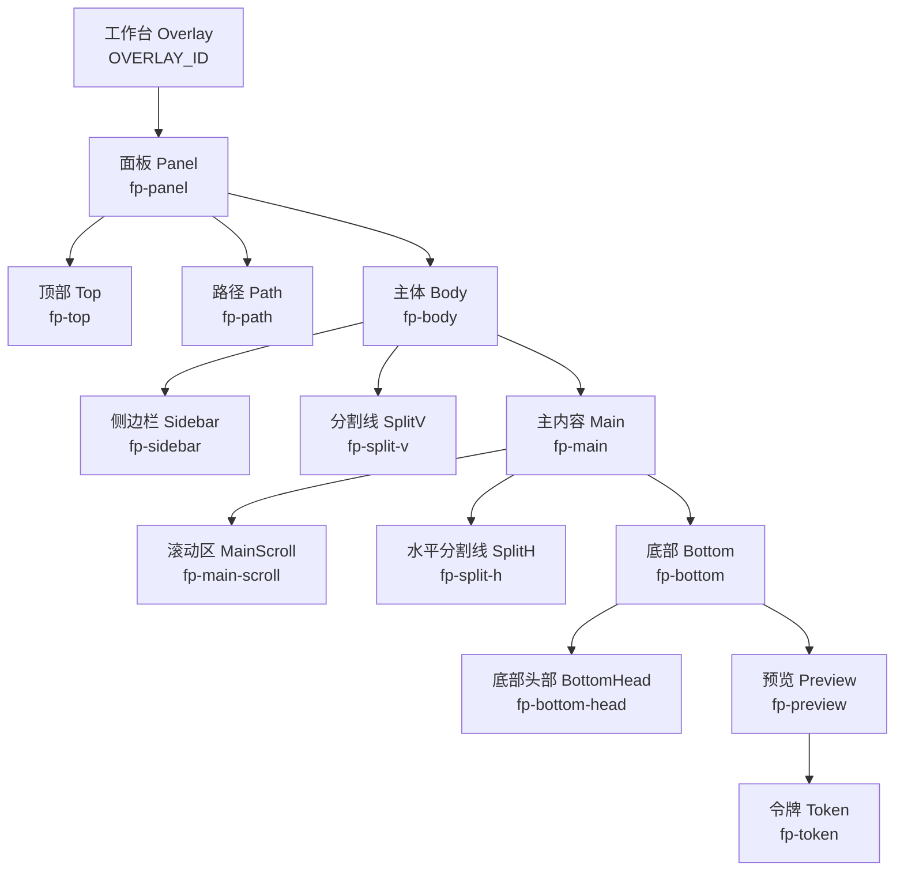
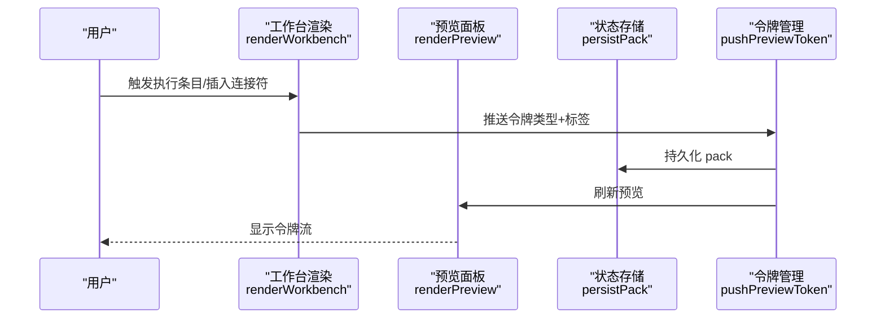
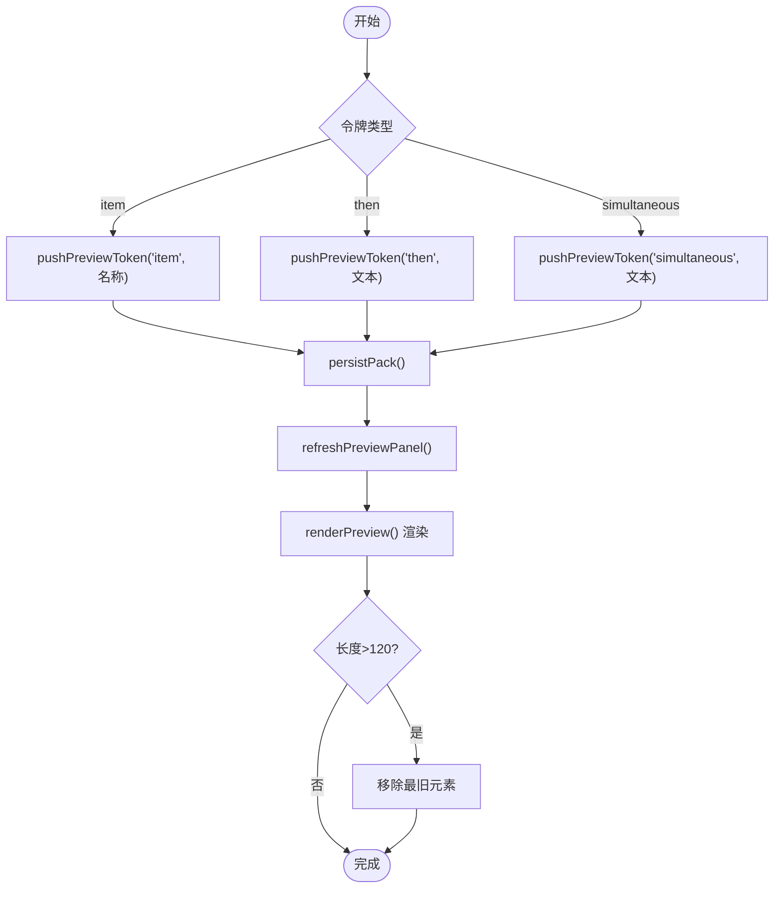
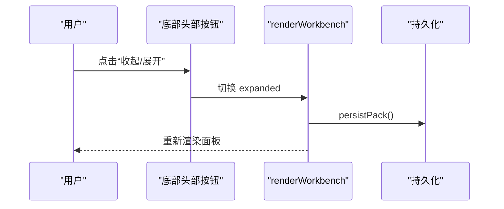
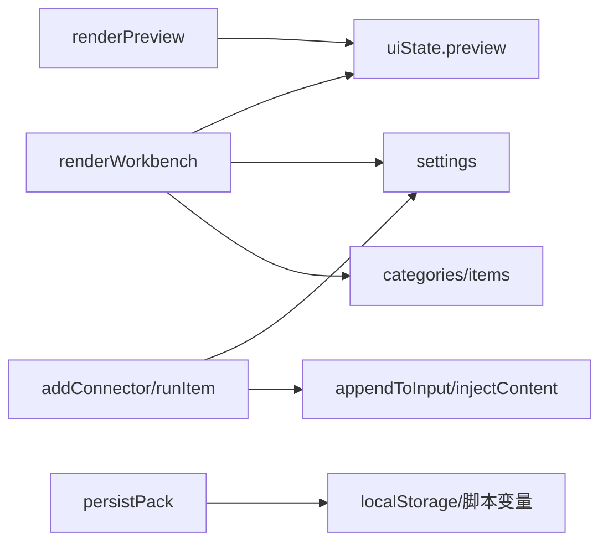

# 预览面板系统

<cite>
**本文档引用的文件**
- [src/快速情节编排/index.ts](file://src/快速情节编排/index.ts)
- [util/mvu.ts](file://util/mvu.ts)
- [util/common.ts](file://util/common.ts)
- [@types/iframe/exported.mvu.d.ts](file://@types/iframe/exported.mvu.d.ts)
- [@types/function/index.d.ts](file://@types/function/index.d.ts)
</cite>

## 目录
1. [简介](#简介)
2. [项目结构](#项目结构)
3. [核心组件](#核心组件)
4. [架构总览](#架构总览)
5. [详细组件分析](#详细组件分析)
6. [依赖关系分析](#依赖关系分析)
7. [性能考量](#性能考量)
8. [故障排查指南](#故障排查指南)
9. [结论](#结论)

## 简介
本文件面向“预览面板系统”的技术文档，聚焦以下目标：
- 动态渲染机制：令牌（token）系统、连接符（然后/同时）显示、实时更新
- 令牌管理逻辑：令牌类型区分（项目、然后、同时）、显示顺序、数量限制、自动清理
- 展开折叠控制：高度调整、状态持久化、动画效果
- 提供具体实现示例路径，展示如何添加令牌、渲染预览内容、处理面板状态变化

## 项目结构
预览面板系统位于 src/快速情节编排/index.ts 中，采用单文件模块化设计，内部包含完整的状态管理、UI 渲染、事件绑定与持久化逻辑。系统通过注入样式、构建工作台（面板）、渲染侧边栏与主内容区、以及底部预览面板，形成完整的交互闭环。

图表来源
- [src/快速情节编排/index.ts:2130-2372](file://src/快速情节编排/index.ts#L2130-L2372)

章节来源
- [src/快速情节编排/index.ts:2130-2372](file://src/快速情节编排/index.ts#L2130-L2372)

## 核心组件
- 状态与数据模型
  - Pack：整体数据包，包含元信息、分类、条目、设置、UI 状态、收藏项
  - UiState.preview：预览面板状态，包含展开状态、高度、令牌数组
  - Settings：包含占位符、令牌文本、默认执行方式、主题等
- 渲染管线
  - renderWorkbench：构建并渲染工作台，决定桌面/紧凑两种布局
  - renderPreview：将令牌数组渲染为 UI 片段
  - refreshPreviewPanel：刷新预览面板
- 交互与事件
  - addConnector：插入“然后/同时”连接符
  - runItem：执行条目（追加或注入），并推送令牌
  - 展开/收起预览面板、拖拽调整尺寸、主题切换等

章节来源
- [src/快速情节编排/index.ts:12-60](file://src/快速情节编排/index.ts#L12-L60)
- [src/快速情节编排/index.ts:46-51](file://src/快速情节编排/index.ts#L46-L51)
- [src/快速情节编排/index.ts:38-44](file://src/快速情节编排/index.ts#L38-L44)
- [src/快速情节编排/index.ts:1731-1740](file://src/快速情节编排/index.ts#L1731-L1740)
- [src/快速情节编排/index.ts:756-764](file://src/快速情节编排/index.ts#L756-L764)
- [src/快速情节编排/index.ts:2360-2371](file://src/快速情节编排/index.ts#L2360-L2371)

## 架构总览
系统采用“状态驱动渲染”的架构，通过 pack/uiState/persistPack 的写入-持久化-读取循环，确保 UI 与数据同步。预览面板作为底部区域，以令牌数组为数据源，实时反映用户的操作序列。

图表来源
- [src/快速情节编排/index.ts:740-754](file://src/快速情节编排/index.ts#L740-L754)
- [src/快速情节编排/index.ts:722-730](file://src/快速情节编排/index.ts#L722-L730)
- [src/快速情节编排/index.ts:1731-1740](file://src/快速情节编排/index.ts#L1731-L1740)
- [src/快速情节编排/index.ts:2130-2372](file://src/快速情节编排/index.ts#L2130-L2372)

## 详细组件分析

### 令牌系统与动态渲染
- 令牌类型
  - item：来自条目的名称
  - then：表示“然后”
  - simultaneous：表示“同时”
  - raw：兜底类型
- 令牌数组
  - 存储在 uiState.preview.tokens 中，每个元素包含 id、type、label
  - 最多保留 120 个，超出时移除最早的一个
- 渲染流程
  - renderPreview 逐个创建 span 元素，应用 fp-token 与类型类名
  - refreshPreviewPanel 在状态变化后触发重新渲染
- 实时更新
  - runItem 与 addConnector 在成功执行后调用 pushPreviewToken
  - persistPack 保证状态持久化，重启后仍可恢复

图表来源
- [src/快速情节编排/index.ts:722-730](file://src/快速情节编排/index.ts#L722-L730)
- [src/快速情节编排/index.ts:1731-1740](file://src/快速情节编排/index.ts#L1731-L1740)
- [src/快速情节编排/index.ts:740-754](file://src/快速情节编排/index.ts#L740-L754)
- [src/快速情节编排/index.ts:756-764](file://src/快速情节编排/index.ts#L756-L764)

章节来源
- [src/快速情节编排/index.ts:722-730](file://src/快速情节编排/index.ts#L722-L730)
- [src/快速情节编排/index.ts:1731-1740](file://src/快速情节编排/index.ts#L1731-L1740)
- [src/快速情节编排/index.ts:740-754](file://src/快速情节编排/index.ts#L740-L754)
- [src/快速情节编排/index.ts:756-764](file://src/快速情节编排/index.ts#L756-L764)

### 连接符（然后/同时）显示与交互
- 插入逻辑
  - addConnector 根据类型选择 settings.tokens.then/simultaneous
  - 成功后推送对应类型的令牌并提示
- UI 行为
  - 顶部工具栏提供“然后/同时”按钮，点击即插入
  - 预览面板显示对应的令牌文本

章节来源
- [src/快速情节编排/index.ts:756-764](file://src/快速情节编排/index.ts#L756-L764)
- [src/快速情节编排/index.ts:2329-2330](file://src/快速情节编排/index.ts#L2329-L2330)

### 预览面板展开/收起与高度调整
- 展开/收起
  - 底部头部包含“收起/展开”按钮，切换 uiState.preview.expanded
  - renderWorkbench 根据 expanded 设置 bottom 的 collapsed 类与 splitH 的可见性
- 高度调整
  - enableResizers 提供水平拖拽调整 bottom 高度
  - 拖拽结束后写回 uiState.preview.height 并持久化
- 动画效果
  - 通过 CSS 类切换实现折叠/展开的视觉过渡
  - 面板尺寸在不同屏幕尺寸下自动适配

图表来源
- [src/快速情节编排/index.ts:2360-2371](file://src/快速情节编排/index.ts#L2360-L2371)
- [src/快速情节编排/index.ts:2108-2127](file://src/快速情节编排/index.ts#L2108-L2127)
- [src/快速情节编排/index.ts:2264-2271](file://src/快速情节编排/index.ts#L2264-L2271)

章节来源
- [src/快速情节编排/index.ts:2360-2371](file://src/快速情节编排/index.ts#L2360-L2371)
- [src/快速情节编排/index.ts:2108-2127](file://src/快速情节编排/index.ts#L2108-L2127)
- [src/快速情节编排/index.ts:2264-2271](file://src/快速情节编排/index.ts#L2264-L2271)

### 占位符与令牌文本配置
- 占位符
  - settings.placeholders 支持用户自定义占位符映射
  - resolvePlaceholders 在执行条目前进行替换
- 令牌文本
  - settings.tokens.then/simultaneous 可在设置中心修改
  - addConnector 使用当前配置的令牌文本插入

章节来源
- [src/快速情节编排/index.ts:648-655](file://src/快速情节编排/index.ts#L648-L655)
- [src/快速情节编排/index.ts:1037-1041](file://src/快速情节编排/index.ts#L1037-L1041)
- [src/快速情节编排/index.ts:756-764](file://src/快速情节编排/index.ts#L756-L764)

### 数据持久化与状态恢复
- 持久化策略
  - persistPack 写入 localStorage 或脚本变量存储
  - loadPack 首次加载时从存储恢复，不存在则生成默认数据
- 关键状态
  - uiState.preview.expanded/height/tokens
  - uiState.sidebar.width/expanded/collapsed
  - panelSize.width/height
  - lastPath 用于恢复上次浏览路径

章节来源
- [src/快速情节编排/index.ts:440-445](file://src/快速情节编排/index.ts#L440-L445)
- [src/快速情节编排/index.ts:428-438](file://src/快速情节编排/index.ts#L428-L438)
- [src/快速情节编排/index.ts:415-425](file://src/快速情节编排/index.ts#L415-L425)

### 与外部环境的集成点
- 注入内容
  - injectContent 优先使用 injectPrompts，其次尝试斜杠命令注入
- 变量框架
  - 通过 @types/iframe/exported.mvu.d.ts 与 @types/function/index.d.ts 提供的接口进行变量读写与事件监听
- MVU 数据存储
  - util/mvu.ts 提供基于 Pinia 的 MVU 数据存储定义与更新机制

章节来源
- [src/快速情节编排/index.ts:692-720](file://src/快速情节编排/index.ts#L692-L720)
- [@types/iframe/exported.mvu.d.ts:1-190](file://@types/iframe/exported.mvu.d.ts#L1-L190)
- [@types/function/index.d.ts:1-170](file://@types/function/index.d.ts#L1-L170)
- [util/mvu.ts:1-66](file://util/mvu.ts#L1-L66)

## 依赖关系分析
- 组件耦合
  - renderWorkbench 依赖 uiState.preview、settings、categories/items
  - renderPreview 仅依赖 uiState.preview.tokens
  - addConnector/runItem 依赖 settings.tokens 与输入框
- 外部依赖
  - 酒馆助手接口：injectPrompts、斜杠命令、变量读写
  - 浏览器 API：localStorage、requestAnimationFrame、getBoundingClientRect
- 循环依赖
  - 无直接循环；渲染与状态分离，通过 persistPack 解耦

图表来源
- [src/快速情节编排/index.ts:2130-2372](file://src/快速情节编排/index.ts#L2130-L2372)
- [src/快速情节编排/index.ts:1731-1740](file://src/快速情节编排/index.ts#L1731-L1740)
- [src/快速情节编排/index.ts:756-764](file://src/快速情节编排/index.ts#L756-L764)
- [src/快速情节编排/index.ts:440-445](file://src/快速情节编排/index.ts#L440-L445)

章节来源
- [src/快速情节编排/index.ts:2130-2372](file://src/快速情节编排/index.ts#L2130-L2372)
- [src/快速情节编排/index.ts:1731-1740](file://src/快速情节编排/index.ts#L1731-L1740)
- [src/快速情节编排/index.ts:756-764](file://src/快速情节编排/index.ts#L756-L764)
- [src/快速情节编排/index.ts:440-445](file://src/快速情节编排/index.ts#L440-L445)

## 性能考量
- 渲染优化
  - renderPreview 仅遍历 tokens 数组，复杂度 O(n)
  - 使用 requestAnimationFrame 处理窗口尺寸变化，避免阻塞
- 存储优化
  - 令牌数组限制为 120 个，防止内存膨胀
  - 持久化采用批量写入，减少频繁 IO
- 交互优化
  - 拖拽尺寸使用 RAF 防抖，提升流畅度
  - 紧凑模式在小屏自动启用，降低 DOM 复杂度

## 故障排查指南
- 预览面板不显示
  - 检查 OVERLAY_ID 是否存在，overlay 是否挂载成功
  - 确认 renderPreview 是否被调用
- 令牌不更新
  - 确认 pushPreviewToken 是否被调用
  - 检查 persistPack 是否成功写入
- 面板尺寸异常
  - 检查 enableResizers 的鼠标事件绑定
  - 确认 uiState.preview.height 是否正确写回
- 注入失败
  - 检查 injectPrompts 是否可用，否则回落到斜杠命令
  - 确认上下文环境（getContext）是否可用

章节来源
- [src/快速情节编排/index.ts:2381-2444](file://src/快速情节编排/index.ts#L2381-L2444)
- [src/快速情节编排/index.ts:692-720](file://src/快速情节编排/index.ts#L692-L720)
- [src/快速情节编排/index.ts:2108-2127](file://src/快速情节编排/index.ts#L2108-L2127)
- [src/快速情节编排/index.ts:1731-1740](file://src/快速情节编排/index.ts#L1731-L1740)

## 结论
预览面板系统通过清晰的状态模型与渲染分离，实现了高可用的动态令牌展示与交互控制。其核心特性包括：
- 令牌类型化管理与数量限制，保障性能与可读性
- 连接符的统一配置与插入，提升创作表达力
- 展开/收起与拖拽调整的高度控制，兼顾桌面与移动端体验
- 与酒馆助手接口的无缝集成，支持注入与变量更新

未来可扩展方向：
- 增加令牌分组与过滤
- 支持令牌序列的撤销/重做
- 优化移动端紧凑模式的交互细节