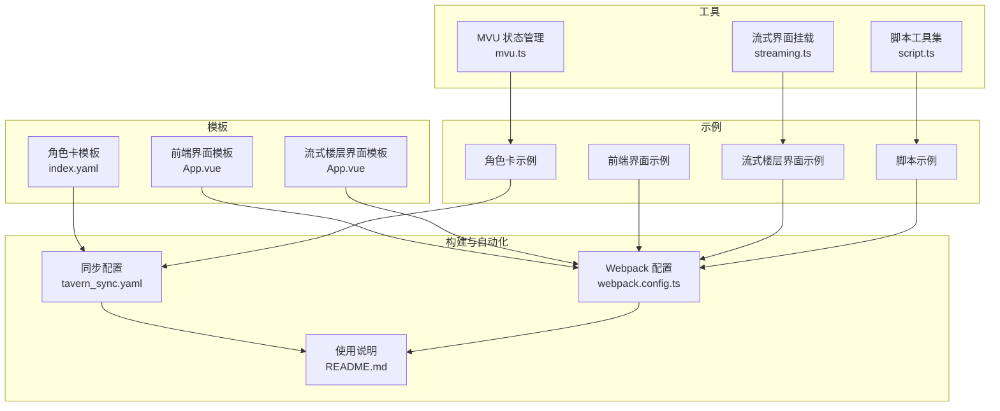
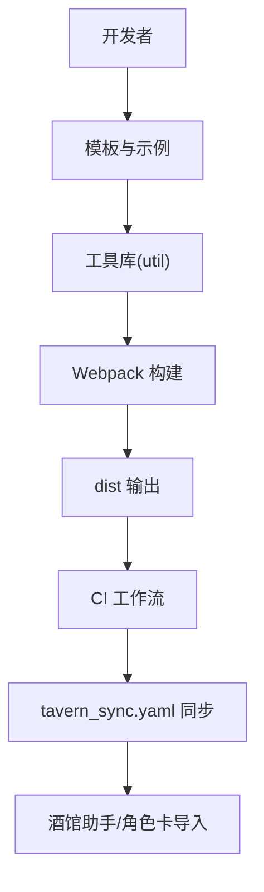
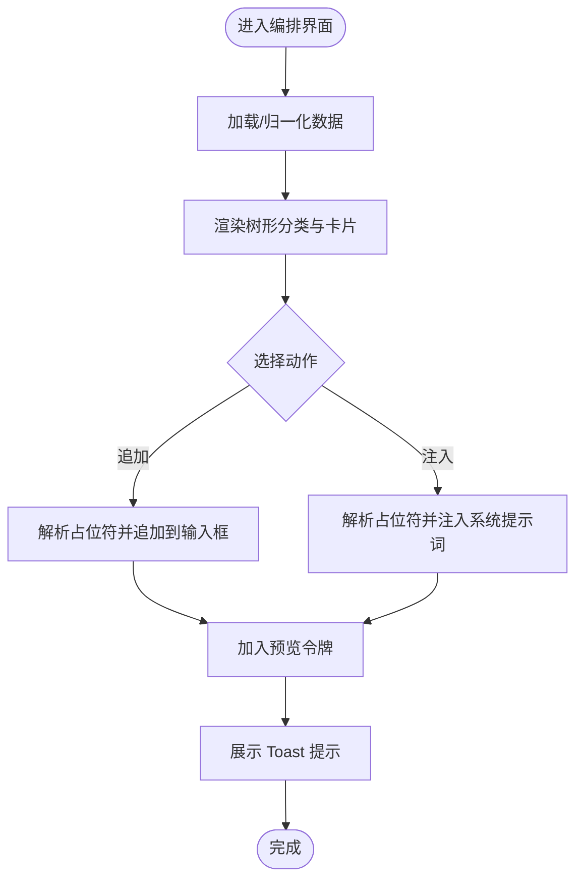
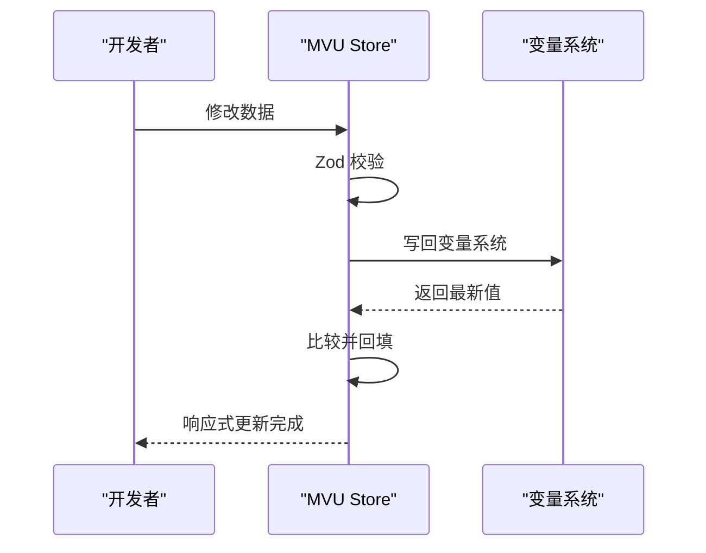
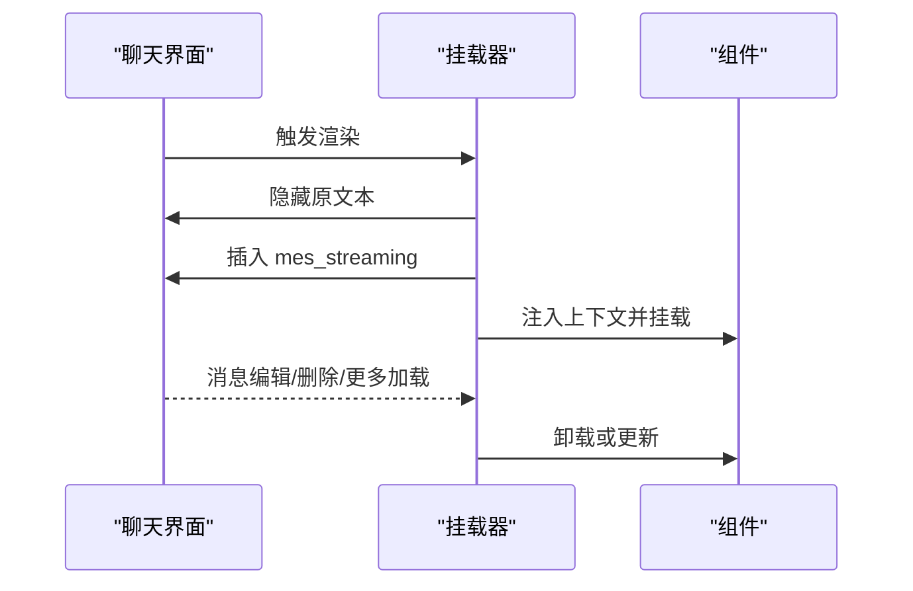
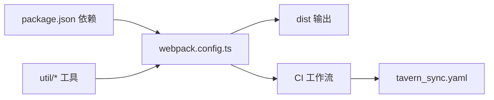

# 核心特性

<cite>
**本文引用的文件**   
- [README.md](file://README.md)
- [package.json](file://package.json)
- [webpack.config.ts](file://webpack.config.ts)
- [src/快速情节编排/index.ts](file://src/快速情节编排/index.ts)
- [util/mvu.ts](file://util/mvu.ts)
- [util/streaming.ts](file://util/streaming.ts)
- [util/script.ts](file://util/script.ts)
- [初始模板/前端界面/新建为src文件夹中的文件夹/App.vue](file://初始模板/前端界面/新建为src文件夹中的文件夹/App.vue)
- [初始模板/流式楼层界面/新建为src文件夹中的文件夹/App.vue](file://初始模板/流式楼层界面/新建为src文件夹中的文件夹/App.vue)
- [初始模板/角色卡/新建为src文件夹中的文件夹/index.yaml](file://初始模板/角色卡/新建为src文件夹中的文件夹/index.yaml)
- [示例/角色卡示例/index.yaml](file://示例/角色卡示例/index.yaml)
- [tavern_sync.yaml](file://tavern_sync.yaml)
</cite>

## 目录
1. [简介](#简介)
2. [项目结构](#项目结构)
3. [核心组件](#核心组件)
4. [架构总览](#架构总览)
5. [详细组件分析](#详细组件分析)
6. [依赖分析](#依赖分析)
7. [性能考虑](#性能考虑)
8. [故障排查指南](#故障排查指南)
9. [结论](#结论)
10. [附录](#附录)

## 简介
本项目是一个面向“酒馆助手”的模板工程，提供一套完整的前端界面与脚本开发、打包与自动更新能力，以及围绕角色卡与世界书的自动化同步方案。其核心特性包括：
- 快速情节编排系统：以可视化卡片与树形分类组织常用剧情片段，支持“追加/注入”两种模式，配合占位符与令牌，快速拼装对话内容。
- MVU（Model-View-Update）状态管理：基于 Pinia 的响应式数据存储与校验，结合 Zod Schema 对变量进行强类型约束与持久化。
- 前端界面模板：提供 Vue 3 + TypeScript 的最小可运行模板，便于快速搭建页面。
- 流式界面支持：在聊天楼层中挂载自定义组件，支持 iframe 或 div 两种宿主，实现与酒馆样式的隔离或融合。
- 角色卡集成：通过 YAML 配置角色卡、世界书条目、正则替换与脚本库，配合 tavern_sync.yaml 实现一键打包与导入。

## 项目结构
项目采用“模板 + 示例 + 工具 + 构建配置”的组织方式：
- 初始模板：包含前端界面、流式楼层界面、脚本与角色卡模板，作为开发者起点。
- 示例：提供可直接运行的前端界面、流式楼层界面、脚本与角色卡示例，便于对照学习。
- util：封装通用工具，如 MVU 状态管理、流式界面挂载、脚本加载与样式传送等。
- 构建与自动化：webpack.config.ts 负责打包、热更新、CDN 外链与混淆；README.md 与 tavern_sync.yaml 提供 CI/CD 与同步配置。

**图示来源**
- [webpack.config.ts:1-572](file://webpack.config.ts#L1-L572)
- [README.md:1-105](file://README.md#L1-L105)
- [tavern_sync.yaml:1-28](file://tavern_sync.yaml#L1-L28)

**章节来源**
- [README.md:1-105](file://README.md#L1-L105)
- [webpack.config.ts:1-572](file://webpack.config.ts#L1-L572)

## 核心组件
- 快速情节编排：以卡片与树形分类组织剧情片段，支持占位符解析、令牌插入、预览面板与收藏夹，提供统一的“追加/注入”交互入口。
- MVU 状态管理：通过 Zod Schema 校验数据，结合 Pinia Store 实现读取、写入与定时同步，确保变量结构稳定与一致性。
- 流式界面挂载：在聊天楼层动态挂载自定义组件，支持 iframe 隔离样式或 div 融合样式，适配编辑态切换。
- 模板系统：提供前端界面、流式楼层界面、脚本与角色卡模板，覆盖从页面到角色卡的全链路开发需求。
- 自动化与同步：通过 CI 工作流实现自动打包、依赖更新与模板同步；通过 tavern_sync.yaml 实现角色卡/世界书/预设的打包与导入。

**章节来源**
- [src/快速情节编排/index.ts:1-800](file://src/快速情节编排/index.ts#L1-L800)
- [util/mvu.ts:1-66](file://util/mvu.ts#L1-L66)
- [util/streaming.ts:1-238](file://util/streaming.ts#L1-L238)
- [初始模板/前端界面/新建为src文件夹中的文件夹/App.vue:1-8](file://初始模板/前端界面/新建为src文件夹中的文件夹/App.vue#L1-L8)
- [初始模板/流式楼层界面/新建为src文件夹中的文件夹/App.vue:1-11](file://初始模板/流式楼层界面/新建为src文件夹中的文件夹/App.vue#L1-L11)
- [初始模板/角色卡/新建为src文件夹中的文件夹/index.yaml:1-171](file://初始模板/角色卡/新建为src文件夹中的文件夹/index.yaml#L1-L171)
- [示例/角色卡示例/index.yaml:1-313](file://示例/角色卡示例/index.yaml#L1-L313)
- [tavern_sync.yaml:1-28](file://tavern_sync.yaml#L1-L28)

## 架构总览
整体架构由“模板与示例”、“工具库”、“构建与自动化”三部分组成，通过 webpack 配置串联开发、打包与部署流程；通过 CI 工作流与 tavern_sync.yaml 实现持续集成与角色卡同步。

**图示来源**
- [webpack.config.ts:1-572](file://webpack.config.ts#L1-L572)
- [README.md:71-89](file://README.md#L71-L89)
- [tavern_sync.yaml:1-28](file://tavern_sync.yaml#L1-L28)

## 详细组件分析

### 快速情节编排系统
- 功能概述
  - 以树形分类组织剧情片段，支持“追加/注入”两种模式，配合占位符与令牌，快速拼装对话内容。
  - 提供收藏夹、预览面板、主题切换与尺寸记忆，提升编辑效率。
- 数据模型
  - PackMeta：元信息（版本、创建/更新时间、来源、名称）。
  - Category：分类（含父子关系、展开状态与排序）。
  - Item：剧情片段（归属分类、名称、内容、模式、收藏标记与排序）。
  - Settings：占位符、令牌、Toast 参数、默认行为与 UI 主题。
  - UiState：侧边栏、预览面板、面板尺寸与路径记录。
- 关键流程
  - 初始化与归一化：加载/构建默认数据，保证结构与版本兼容。
  - 占位符解析：将 {@key:default} 替换为设置中的占位符值。
  - 追加/注入：向输入框追加内容或通过注入接口插入系统提示词。
  - 预览与 Toast：维护令牌队列与提示栈，反馈操作结果。
- 适用场景
  - 快速拼装日常对话、推进时间、安排场景、社交互动与突发风险事件。
  - 适合新手快速上手与老手高效复用。

**图示来源**
- [src/快速情节编排/index.ts:428-740](file://src/快速情节编排/index.ts#L428-L740)

**章节来源**
- [src/快速情节编排/index.ts:12-77](file://src/快速情节编排/index.ts#L12-L77)
- [src/快速情节编排/index.ts:428-740](file://src/快速情节编排/index.ts#L428-L740)

### MVU 状态管理系统
- 功能概述
  - 基于 Pinia 的 Store 定义，结合 Zod Schema 对变量进行强类型校验与默认值处理。
  - 支持读取与写入变量，定时轮询与响应式更新，确保数据一致性与持久化。
- 关键流程
  - 初始化：从变量系统读取数据，解析为 Schema 类型，若缺失则使用默认值。
  - 响应式更新：监听数据变化，安全解析并写回变量系统；若与持久化不一致则同步。
  - 定时同步：周期性检查变量系统中的最新值，必要时回填并写回。
- 适用场景
  - 角色卡变量结构管理、状态栏界面数据驱动、跨模块共享状态。

**图示来源**
- [util/mvu.ts:1-66](file://util/mvu.ts#L1-L66)

**章节来源**
- [util/mvu.ts:1-66](file://util/mvu.ts#L1-L66)

### 流式界面支持
- 功能概述
  - 在聊天楼层中挂载自定义组件，支持 iframe 隔离样式或 div 融合样式。
  - 提供上下文注入（消息 ID、是否流式中），适配编辑态切换与多消息渲染。
- 关键流程
  - 选择宿主：iframe（隔离样式，推荐）或 div（融合样式）。
  - 渲染策略：隐藏原楼层文本，在其后插入 mes_streaming 容器，挂载组件。
  - 上下文注入：为每个消息注入 prefix/host_id/message_id/message/during_streaming。
  - 生命周期：监听消息渲染、编辑、删除与更多消息加载事件，动态挂载/卸载。
- 适用场景
  - 为特定角色或情境定制楼层展示，如状态栏、分段显示、搜索高亮等。

**图示来源**
- [util/streaming.ts:41-238](file://util/streaming.ts#L41-L238)

**章节来源**
- [util/streaming.ts:1-238](file://util/streaming.ts#L1-L238)

### 前端界面模板
- 功能概述
  - 提供最小可运行的 Vue 3 + TypeScript 模板，包含入口 HTML、TS 入口与基础样式。
- 使用建议
  - 基于模板快速搭建页面，结合 TailwindCSS 或内联样式，按需引入组件库与工具函数。

**章节来源**
- [初始模板/前端界面/新建为src文件夹中的文件夹/App.vue:1-8](file://初始模板/前端界面/新建为src文件夹中的文件夹/App.vue#L1-L8)

### 流式楼层界面模板
- 功能概述
  - 提供流式楼层界面模板，演示如何注入上下文并使用响应式数据。
- 使用建议
  - 优先使用 iframe 宿主以获得样式隔离；如需融合样式可使用 div 宿主并注意样式冲突。

**章节来源**
- [初始模板/流式楼层界面/新建为src文件夹中的文件夹/App.vue:1-11](file://初始模板/流式楼层界面/新建为src文件夹中的文件夹/App.vue#L1-L11)

### 角色卡模板与同步
- 功能概述
  - 角色卡模板通过 YAML 配置角色描述、锚点、世界书条目、正则替换与脚本库。
  - tavern_sync.yaml 配置角色卡/世界书/预设的本地路径与导出路径，支持一键打包与导入。
- 使用建议
  - 在角色卡模板中定义变量结构与输出格式，结合 MVU 管理状态；通过 tavern_sync.yaml 自动打包并导入酒馆。

**章节来源**
- [初始模板/角色卡/新建为src文件夹中的文件夹/index.yaml:1-171](file://初始模板/角色卡/新建为src文件夹中的文件夹/index.yaml#L1-L171)
- [tavern_sync.yaml:1-28](file://tavern_sync.yaml#L1-L28)
- [示例/角色卡示例/index.yaml:1-313](file://示例/角色卡示例/index.yaml#L1-L313)

## 依赖分析
- 构建与打包
  - Webpack 配置负责入口扫描、Vue Loader、TS 编译、样式处理、资源内联与外链、混淆与分块。
  - 开发服务器与 Socket 通信用于监听编译完成并推送更新事件。
- 自动化与同步
  - CI 工作流实现自动打包、依赖更新与模板同步；tavern_sync.yaml 配置角色卡/世界书/预设的打包与导入。
- 工具库
  - MVU：Pinia + Zod，提供强类型数据管理。
  - 流式界面：DOM 操作与事件监听，提供上下文注入与生命周期管理。
  - 脚本工具：样式传送、iframe/div 宿主创建、聊天切换重载。

**图示来源**
- [package.json:1-120](file://package.json#L1-L120)
- [webpack.config.ts:1-572](file://webpack.config.ts#L1-L572)
- [README.md:71-89](file://README.md#L71-L89)
- [tavern_sync.yaml:1-28](file://tavern_sync.yaml#L1-L28)

**章节来源**
- [package.json:1-120](file://package.json#L1-L120)
- [webpack.config.ts:1-572](file://webpack.config.ts#L1-L572)
- [README.md:71-89](file://README.md#L71-L89)

## 性能考虑
- 代码分割与懒加载：通过异步分块与最小化配置，减少首屏体积。
- 样式处理：CSS 提取与内联策略平衡加载与渲染性能。
- 外部依赖：CDN 引入与全局变量映射降低打包体积。
- 流式界面：按需挂载与销毁，避免不必要的 DOM 操作。
- 数据同步：MVU 使用定时轮询与响应式更新，避免频繁写回。

## 故障排查指南
- 打包冲突
  - 说明：dist 文件夹随仓库上传易产生分支冲突。
  - 解决：启用 git 合并策略，使冲突时使用当前版本；CI 会重新打包 dist。
- CI 权限
  - 说明：首次创建仓库后需在 Actions 设置中开启工作流权限。
  - 解决：前往仓库 Settings -> Actions -> General，设置为“读写权限”并允许创建/批准 PR。
- 自动更新与打包
  - 说明：未启用本地使用时无法通过 jsdelivr 实现自动更新。
  - 解决：创建为新仓库并配置工作流；或仅在本地使用时不依赖自动更新。
- 流式界面样式冲突
  - 说明：div 宿主会继承酒馆样式，TailwindCSS 可能影响其他区域。
  - 解决：优先使用 iframe 宿主；如使用 div 宿主，避免使用可能影响全局的类名。

**章节来源**
- [README.md:22-100](file://README.md#L22-L100)

## 结论
本项目通过模板化与工具化，为“酒馆助手”提供了从界面到角色卡的全链路开发体验。快速情节编排简化了对话组织，MVU 状态管理保障了数据一致性，流式界面支持提升了楼层展示的灵活性，模板与同步机制降低了维护成本。结合 CI/CD 与 tavern_sync.yaml，实现了高效的自动化交付与角色卡管理。

## 附录
- 使用步骤
  - 本地使用：下载压缩包后按教程文档进行配置与开发。
  - 创建新仓库：使用模板或 Fork 后启用 Actions 权限。
  - 自动更新：通过 jsdelivr 链接实现前端界面与脚本的自动更新。
  - 自动打包与同步：配置 tavern_sync.yaml 并启用 CI 工作流。

**章节来源**
- [README.md:5-105](file://README.md#L5-L105)
- [tavern_sync.yaml:1-28](file://tavern_sync.yaml#L1-L28)