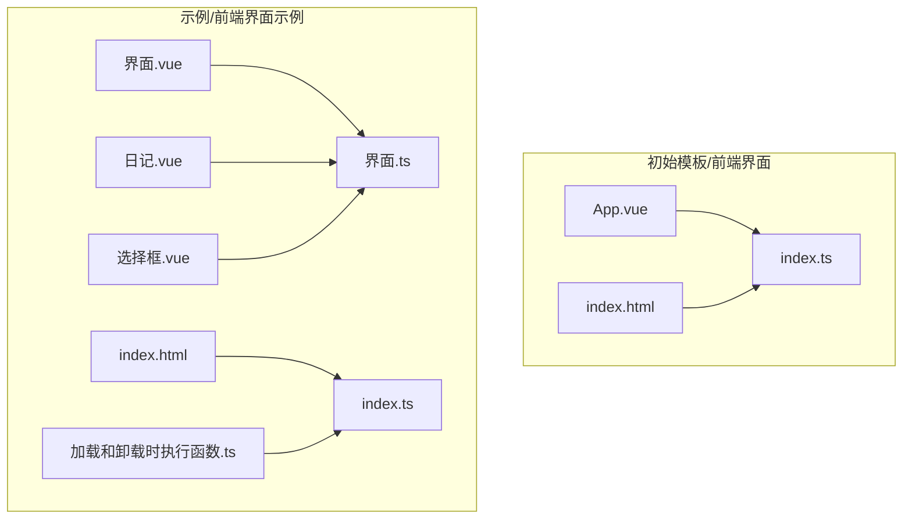
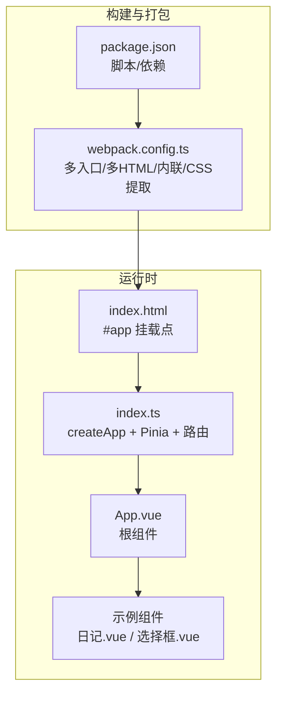
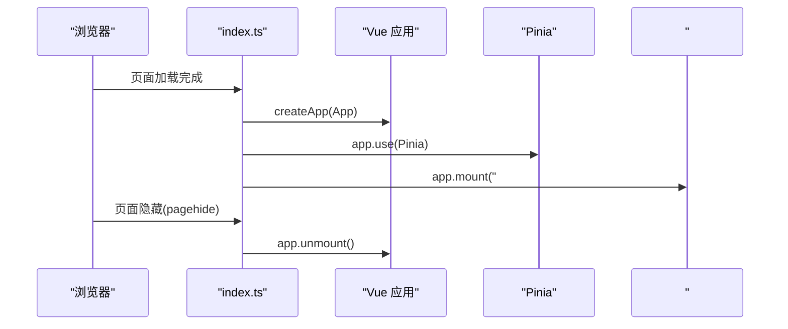
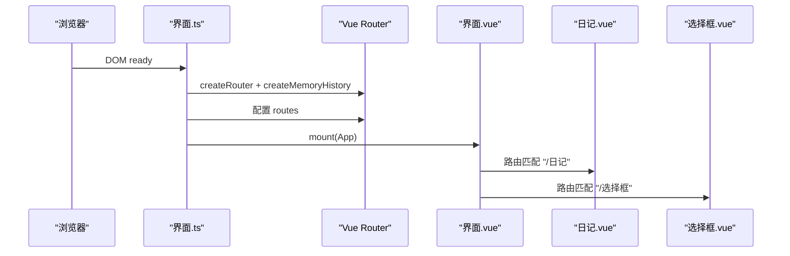
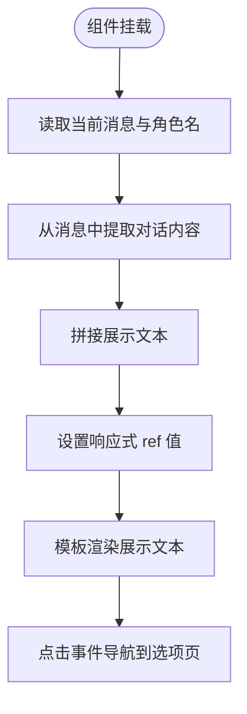
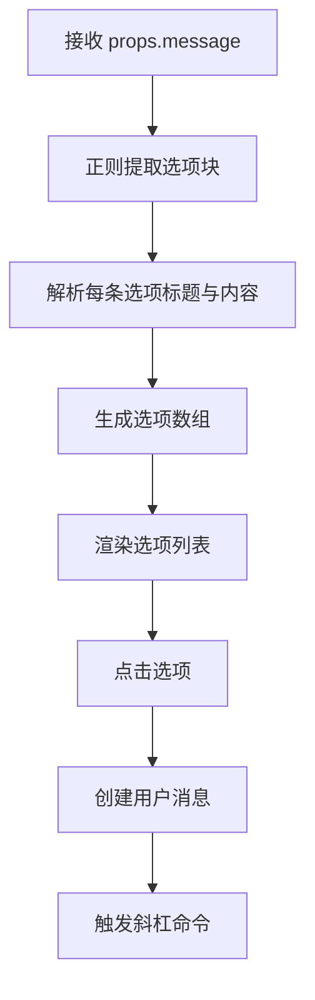
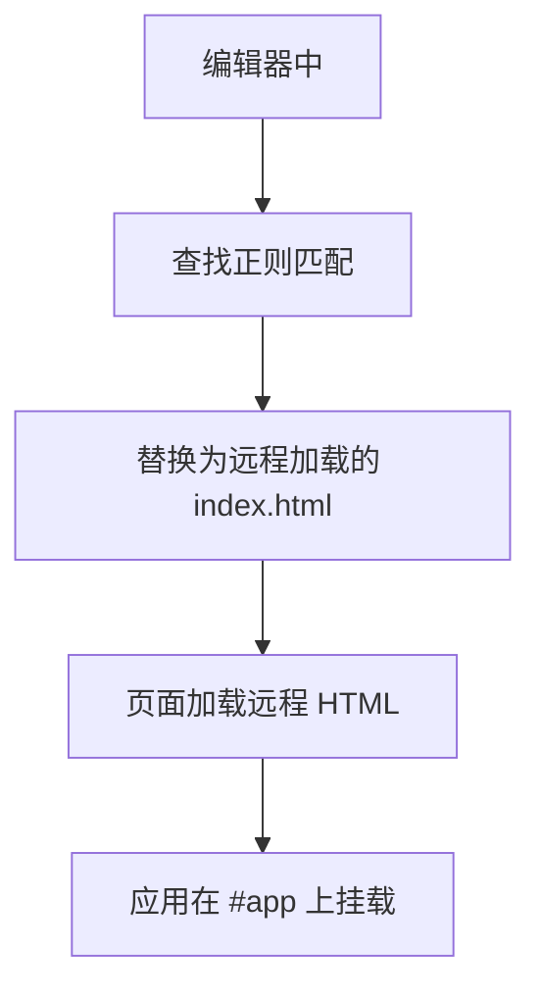
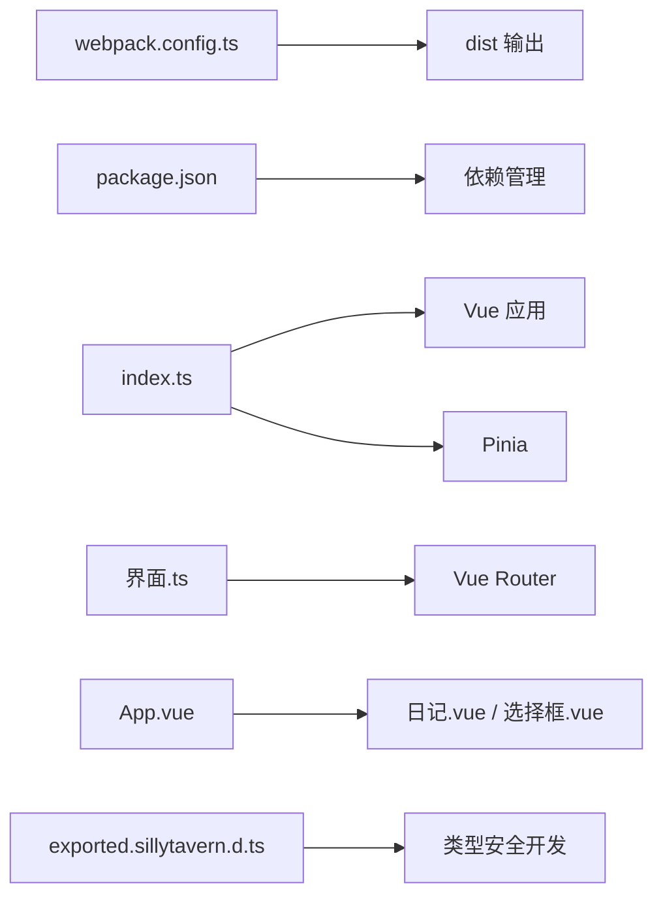

# 前端界面模板

<cite>
**本文引用的文件**
- [初始模板/前端界面/新建为src文件夹中的文件夹/App.vue](file://初始模板/前端界面/新建为src文件夹中的文件夹/App.vue)
- [初始模板/前端界面/新建为src文件夹中的文件夹/index.html](file://初始模板/前端界面/新建为src文件夹中的文件夹/index.html)
- [初始模板/前端界面/新建为src文件夹中的文件夹/index.ts](file://初始模板/前端界面/新建为src文件夹中的文件夹/index.ts)
- [示例/前端界面示例/界面.vue](file://示例/前端界面示例/界面.vue)
- [示例/前端界面示例/界面.ts](file://示例/前端界面示例/界面.ts)
- [示例/前端界面示例/日记.vue](file://示例/前端界面示例/日记.vue)
- [示例/前端界面示例/选择框.vue](file://示例/前端界面示例/选择框.vue)
- [示例/前端界面示例/index.html](file://示例/前端界面示例/index.html)
- [示例/前端界面示例/index.ts](file://示例/前端界面示例/index.ts)
- [示例/前端界面示例/加载和卸载时执行函数.ts](file://示例/前端界面示例/加载和卸载时执行函数.ts)
- [初始模板/前端界面/导入到酒馆中/界面-实时修改.json](file://初始模板/前端界面/导入到酒馆中/界面-实时修改.json)
- [webpack.config.ts](file://webpack.config.ts)
- [@types/iframe/exported.sillytavern.d.ts](file://@types/iframe/exported.sillytavern.d.ts)
- [README.md](file://README.md)
- [package.json](file://package.json)
</cite>

## 目录
1. [简介](#简介)
2. [项目结构](#项目结构)
3. [核心组件](#核心组件)
4. [架构总览](#架构总览)
5. [详细组件分析](#详细组件分析)
6. [依赖关系分析](#依赖关系分析)
7. [性能考量](#性能考量)
8. [故障排查指南](#故障排查指南)
9. [结论](#结论)
10. [附录](#附录)

## 简介
本指南面向希望在 SillyTavern 中使用前端界面模板的开发者与使用者，系统讲解模板的结构组成（App.vue 组件、index.html 页面结构、index.ts 入口文件）、在 SillyTavern 中的导入流程与配置项、Vue 组件的生命周期与数据绑定/事件处理实践、以及如何定制界面（样式、功能组件、布局调整）并给出常见问题的解决方案。文中所有技术细节均来自仓库现有文件，并通过图示与分层说明帮助不同背景的读者快速上手。

## 项目结构
模板采用“示例”和“初始模板”双路径组织：
- 初始模板：提供最小可用骨架（App.vue、index.html、index.ts），便于快速复制并开始二次开发。
- 示例：提供完整可运行的前端界面示例（含路由、组件、样式与生命周期示例），可直接参考其模式进行扩展。

图表来源
- [初始模板/前端界面/新建为src文件夹中的文件夹/App.vue:1-8](file://初始模板/前端界面/新建为src文件夹中的文件夹/App.vue#L1-L8)
- [初始模板/前端界面/新建为src文件夹中的文件夹/index.html:1-5](file://初始模板/前端界面/新建为src文件夹中的文件夹/index.html#L1-L5)
- [初始模板/前端界面/新建为src文件夹中的文件夹/index.ts:1-9](file://初始模板/前端界面/新建为src文件夹中的文件夹/index.ts#L1-L9)
- [示例/前端界面示例/界面.vue:1-4](file://示例/前端界面示例/界面.vue#L1-L4)
- [示例/前端界面示例/界面.ts:1-22](file://示例/前端界面示例/界面.ts#L1-L22)
- [示例/前端界面示例/日记.vue:1-107](file://示例/前端界面示例/日记.vue#L1-L107)
- [示例/前端界面示例/选择框.vue:1-215](file://示例/前端界面示例/选择框.vue#L1-L215)
- [示例/前端界面示例/index.html:1-5](file://示例/前端界面示例/index.html#L1-L5)
- [示例/前端界面示例/index.ts:1-3](file://示例/前端界面示例/index.ts#L1-L3)
- [示例/前端界面示例/加载和卸载时执行函数.ts:1-11](file://示例/前端界面示例/加载和卸载时执行函数.ts#L1-L11)

章节来源
- [初始模板/前端界面/新建为src文件夹中的文件夹/App.vue:1-8](file://初始模板/前端界面/新建为src文件夹中的文件夹/App.vue#L1-L8)
- [初始模板/前端界面/新建为src文件夹中的文件夹/index.html:1-5](file://初始模板/前端界面/新建为src文件夹中的文件夹/index.html#L1-L5)
- [初始模板/前端界面/新建为src文件夹中的文件夹/index.ts:1-9](file://初始模板/前端界面/新建为src文件夹中的文件夹/index.ts#L1-L9)
- [示例/前端界面示例/界面.vue:1-4](file://示例/前端界面示例/界面.vue#L1-L4)
- [示例/前端界面示例/界面.ts:1-22](file://示例/前端界面示例/界面.ts#L1-L22)
- [示例/前端界面示例/日记.vue:1-107](file://示例/前端界面示例/日记.vue#L1-L107)
- [示例/前端界面示例/选择框.vue:1-215](file://示例/前端界面示例/选择框.vue#L1-L215)
- [示例/前端界面示例/index.html:1-5](file://示例/前端界面示例/index.html#L1-L5)
- [示例/前端界面示例/index.ts:1-3](file://示例/前端界面示例/index.ts#L1-L3)
- [示例/前端界面示例/加载和卸载时执行函数.ts:1-11](file://示例/前端界面示例/加载和卸载时执行函数.ts#L1-L11)

## 核心组件
- App.vue：模板的根组件，采用单文件组件结构，包含模板、脚本与样式三部分，适合直接扩展为页面容器或路由视图。
- index.html：页面骨架，包含挂载点 div#app，供入口脚本挂载应用。
- index.ts：应用入口，负责创建 Vue 应用实例、安装 Pinia 状态管理、挂载与卸载生命周期处理。

章节来源
- [初始模板/前端界面/新建为src文件夹中的文件夹/App.vue:1-8](file://初始模板/前端界面/新建为src文件夹中的文件夹/App.vue#L1-L8)
- [初始模板/前端界面/新建为src文件夹中的文件夹/index.html:1-5](file://初始模板/前端界面/新建为src文件夹中的文件夹/index.html#L1-L5)
- [初始模板/前端界面/新建为src文件夹中的文件夹/index.ts:1-9](file://初始模板/前端界面/新建为src文件夹中的文件夹/index.ts#L1-L9)

## 架构总览
模板采用“HTML + Vue 单文件组件 + TypeScript + Pinia + 路由”的组合，构建可在 SillyTavern 中通过脚本或正则注入加载的前端界面。Webpack 负责打包与内联资源，支持开发与生产模式，同时提供监听与自动更新能力。

图表来源
- [webpack.config.ts:77-80](file://webpack.config.ts#L77-L80)
- [package.json:1-120](file://package.json#L1-L120)
- [示例/前端界面示例/index.html:1-5](file://示例/前端界面示例/index.html#L1-L5)
- [示例/前端界面示例/index.ts:1-3](file://示例/前端界面示例/index.ts#L1-L3)
- [示例/前端界面示例/界面.vue:1-4](file://示例/前端界面示例/界面.vue#L1-L4)
- [示例/前端界面示例/日记.vue:1-107](file://示例/前端界面示例/日记.vue#L1-L107)
- [示例/前端界面示例/选择框.vue:1-215](file://示例/前端界面示例/选择框.vue#L1-L215)

章节来源
- [webpack.config.ts:77-80](file://webpack.config.ts#L77-L80)
- [package.json:1-120](file://package.json#L1-L120)
- [示例/前端界面示例/index.html:1-5](file://示例/前端界面示例/index.html#L1-L5)
- [示例/前端界面示例/index.ts:1-3](file://示例/前端界面示例/index.ts#L1-L3)
- [示例/前端界面示例/界面.vue:1-4](file://示例/前端界面示例/界面.vue#L1-L4)
- [示例/前端界面示例/日记.vue:1-107](file://示例/前端界面示例/日记.vue#L1-L107)
- [示例/前端界面示例/选择框.vue:1-215](file://示例/前端界面示例/选择框.vue#L1-L215)

## 详细组件分析

### 入口与挂载流程（index.ts）
- 创建应用实例并安装 Pinia。
- 将应用挂载至 #app。
- 监听页面隐藏事件，在卸载时解绑应用，避免内存泄漏。

图表来源
- [初始模板/前端界面/新建为src文件夹中的文件夹/index.ts:4-8](file://初始模板/前端界面/新建为src文件夹中的文件夹/index.ts#L4-L8)

章节来源
- [初始模板/前端界面/新建为src文件夹中的文件夹/index.ts:1-9](file://初始模板/前端界面/新建为src文件夹中的文件夹/index.ts#L1-L9)

### 路由与页面容器（示例/前端界面示例）
- 界面.vue：作为路由容器，内部嵌套 RouterView，承载子路由视图。
- 界面.ts：创建内存历史的路由实例，定义路由表并默认跳转到某路径；在 DOM 就绪后挂载应用。

图表来源
- [示例/前端界面示例/界面.ts:6-21](file://示例/前端界面示例/界面.ts#L6-L21)
- [示例/前端界面示例/界面.vue:1-4](file://示例/前端界面示例/界面.vue#L1-L4)
- [示例/前端界面示例/日记.vue:1-107](file://示例/前端界面示例/日记.vue#L1-L107)
- [示例/前端界面示例/选择框.vue:1-215](file://示例/前端界面示例/选择框.vue#L1-L215)

章节来源
- [示例/前端界面示例/界面.vue:1-4](file://示例/前端界面示例/界面.vue#L1-L4)
- [示例/前端界面示例/界面.ts:1-22](file://示例/前端界面示例/界面.ts#L1-L22)

### 组件生命周期与数据绑定（示例/前端界面示例/日记.vue）
- 生命周期：在 mounted 钩子中执行初始化逻辑，读取当前消息并解析展示文本。
- 数据绑定：使用响应式 ref 存储展示文本，模板中直接绑定渲染。
- 事件处理：通过点击事件导航到另一个路由视图。

图表来源
- [示例/前端界面示例/日记.vue:25-27](file://示例/前端界面示例/日记.vue#L25-L27)
- [示例/前端界面示例/日记.vue:10-23](file://示例/前端界面示例/日记.vue#L10-L23)

章节来源
- [示例/前端界面示例/日记.vue:1-107](file://示例/前端界面示例/日记.vue#L1-L107)

### 事件处理与交互（示例/前端界面示例/选择框.vue）
- 属性接收：通过 defineProps 接收父组件传入的消息字符串。
- 数据解析：使用正则解析消息中的选项块，生成选项数组。
- 事件处理：点击选项后创建用户消息并触发斜杠命令。

图表来源
- [示例/前端界面示例/选择框.vue:21-44](file://示例/前端界面示例/选择框.vue#L21-L44)
- [示例/前端界面示例/选择框.vue:29-39](file://示例/前端界面示例/选择框.vue#L29-L39)

章节来源
- [示例/前端界面示例/选择框.vue:1-215](file://示例/前端界面示例/选择框.vue#L1-L215)

### 样式与主题（示例/前端界面示例/日记.vue 与 选择框.vue）
- 使用 scoped SCSS 控制样式作用域，避免全局污染。
- 通过媒体查询适配移动端。
- 使用过渡与悬停效果提升交互体验。

章节来源
- [示例/前端界面示例/日记.vue:30-106](file://示例/前端界面示例/日记.vue#L30-L106)
- [示例/前端界面示例/选择框.vue:47-214](file://示例/前端界面示例/选择框.vue#L47-L214)

### 在 SillyTavern 中导入前端界面模板
- 使用“实时修改”正则脚本注入：通过正则替换将页面 body 内容替换为远程加载的 index.html。
- 关键配置项：
  - 替换目标：将页面 body 替换为远程加载的 HTML。
  - 脚本 ID/名称：用于识别与管理。
  - 启用/禁用：根据需要开启或关闭。
  - Markdown 限制：仅在 Markdown 编辑器中生效。
  - 运行时机：编辑时是否运行等。

图表来源
- [初始模板/前端界面/导入到酒馆中/界面-实时修改.json:1-16](file://初始模板/前端界面/导入到酒馆中/界面-实时修改.json#L1-L16)

章节来源
- [初始模板/前端界面/导入到酒馆中/界面-实时修改.json:1-16](file://初始模板/前端界面/导入到酒馆中/界面-实时修改.json#L1-L16)

### 自定义前端界面的方法
- 修改样式：在组件的 scoped 样式中调整颜色、字体、间距与动画，注意媒体查询适配。
- 添加功能组件：新增 .vue 文件并在路由中注册，或在现有组件中扩展逻辑。
- 调整布局：通过 RouterView 容器与路由配置切换视图，或在 App.vue 中引入全局布局结构。
- 生命周期钩子：在 onMounted/onUnmounted 等钩子中执行初始化与清理逻辑。
- 事件处理：在模板中绑定事件，或通过 props 传递回调函数。

章节来源
- [示例/前端界面示例/界面.vue:1-4](file://示例/前端界面示例/界面.vue#L1-L4)
- [示例/前端界面示例/界面.ts:6-21](file://示例/前端界面示例/界面.ts#L6-L21)
- [示例/前端界面示例/日记.vue:25-27](file://示例/前端界面示例/日记.vue#L25-L27)
- [示例/前端界面示例/选择框.vue:41-44](file://示例/前端界面示例/选择框.vue#L41-L44)

## 依赖关系分析
- 构建侧：webpack.config.ts 定义多入口、HTML 模板、内联脚本与样式、CSS 提取、外部依赖映射等。
- 运行侧：index.ts 引入 Vue 与 Pinia，示例路由使用 vue-router；组件间通过 props 与事件通信。
- 类型侧：@types/iframe/exported.sillytavern.d.ts 提供 SillyTavern 环境 API 的类型声明，便于在 TS 中安全使用。

图表来源
- [webpack.config.ts:77-80](file://webpack.config.ts#L77-L80)
- [package.json:1-120](file://package.json#L1-L120)
- [示例/前端界面示例/index.ts:1-3](file://示例/前端界面示例/index.ts#L1-L3)
- [示例/前端界面示例/界面.ts:1-22](file://示例/前端界面示例/界面.ts#L1-L22)
- [示例/前端界面示例/界面.vue:1-4](file://示例/前端界面示例/界面.vue#L1-L4)
- [示例/前端界面示例/日记.vue:1-107](file://示例/前端界面示例/日记.vue#L1-L107)
- [示例/前端界面示例/选择框.vue:1-215](file://示例/前端界面示例/选择框.vue#L1-L215)
- [@types/iframe/exported.sillytavern.d.ts:1-698](file://@types/iframe/exported.sillytavern.d.ts#L1-L698)

章节来源
- [webpack.config.ts:77-80](file://webpack.config.ts#L77-L80)
- [package.json:1-120](file://package.json#L1-L120)
- [示例/前端界面示例/index.ts:1-3](file://示例/前端界面示例/index.ts#L1-L3)
- [示例/前端界面示例/界面.ts:1-22](file://示例/前端界面示例/界面.ts#L1-L22)
- [示例/前端界面示例/界面.vue:1-4](file://示例/前端界面示例/界面.vue#L1-L4)
- [示例/前端界面示例/日记.vue:1-107](file://示例/前端界面示例/日记.vue#L1-L107)
- [示例/前端界面示例/选择框.vue:1-215](file://示例/前端界面示例/选择框.vue#L1-L215)
- [@types/iframe/exported.sillytavern.d.ts:1-698](file://@types/iframe/exported.sillytavern.d.ts#L1-L698)

## 性能考量
- 构建优化：生产模式启用 Terser 压缩与分包策略，减少体积与加载时间。
- 资源内联：HTML/CSS 内联减少网络往返，适合一次性加载的界面。
- 外部依赖：通过 externals 将常用库映射为全局变量或 CDN，降低打包体积。
- 监听与热更新：开发模式下监听文件变化并推送更新，提升迭代效率。

章节来源
- [webpack.config.ts:484-520](file://webpack.config.ts#L484-L520)
- [webpack.config.ts:521-567](file://webpack.config.ts#L521-L567)
- [README.md:71-89](file://README.md#L71-L89)

## 故障排查指南
- 页面未加载远程 HTML：检查“实时修改”正则脚本的替换字符串与启用状态，确认路径正确。
- 点击无响应：确认事件绑定与路由配置正确，检查 props 传递与事件回调。
- 样式不生效：检查 scoped 样式作用域与选择器优先级，确保未被覆盖。
- 卸载未清理：确认在 pagehide 事件中执行了应用卸载，避免内存泄漏。
- 构建失败：检查 package.json 脚本与依赖版本，确保 Node 与包管理器环境正常。

章节来源
- [初始模板/前端界面/导入到酒馆中/界面-实时修改.json:1-16](file://初始模板/前端界面/导入到酒馆中/界面-实时修改.json#L1-L16)
- [示例/前端界面示例/加载和卸载时执行函数.ts:7-11](file://示例/前端界面示例/加载和卸载时执行函数.ts#L7-L11)
- [示例/前端界面示例/日记.vue:25-27](file://示例/前端界面示例/日记.vue#L25-L27)
- [示例/前端界面示例/选择框.vue:41-44](file://示例/前端界面示例/选择框.vue#L41-L44)

## 结论
本模板提供了从入口挂载、路由容器、组件交互到样式主题的完整前端界面开发范式。结合 SillyTavern 的“实时修改”注入机制与 Webpack 的构建优化，开发者可以快速搭建并迭代界面。建议在实际项目中遵循组件化、生命周期规范与类型安全原则，以获得更稳定的用户体验与更易维护的代码结构。

## 附录
- 使用方法与 CI 功能说明详见项目自述文件。
- 如需进一步了解 SillyTavern 提供的上下文 API，可参考类型声明文件。

章节来源
- [README.md:1-105](file://README.md#L1-L105)
- [@types/iframe/exported.sillytavern.d.ts:382-697](file://@types/iframe/exported.sillytavern.d.ts#L382-L697)