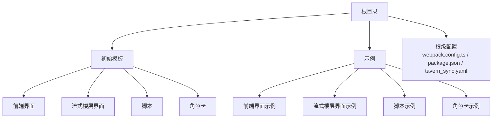
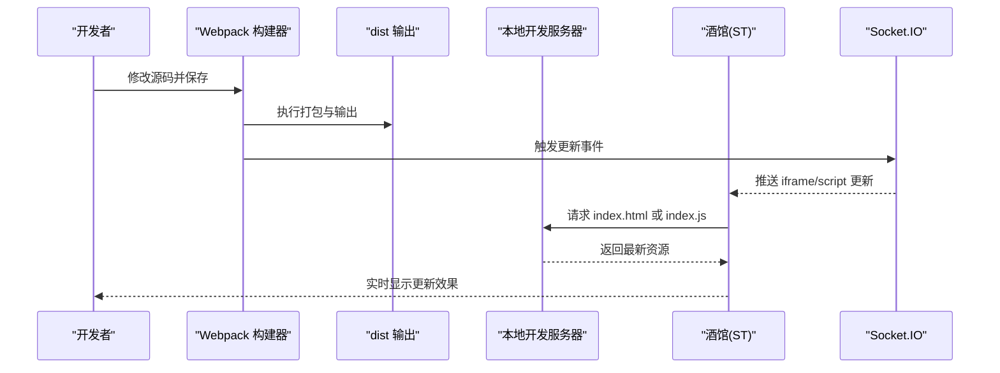
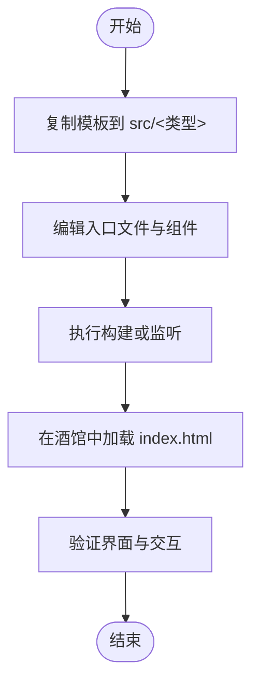
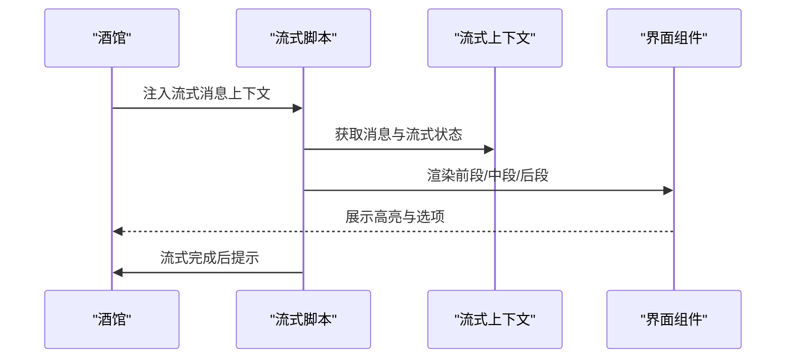
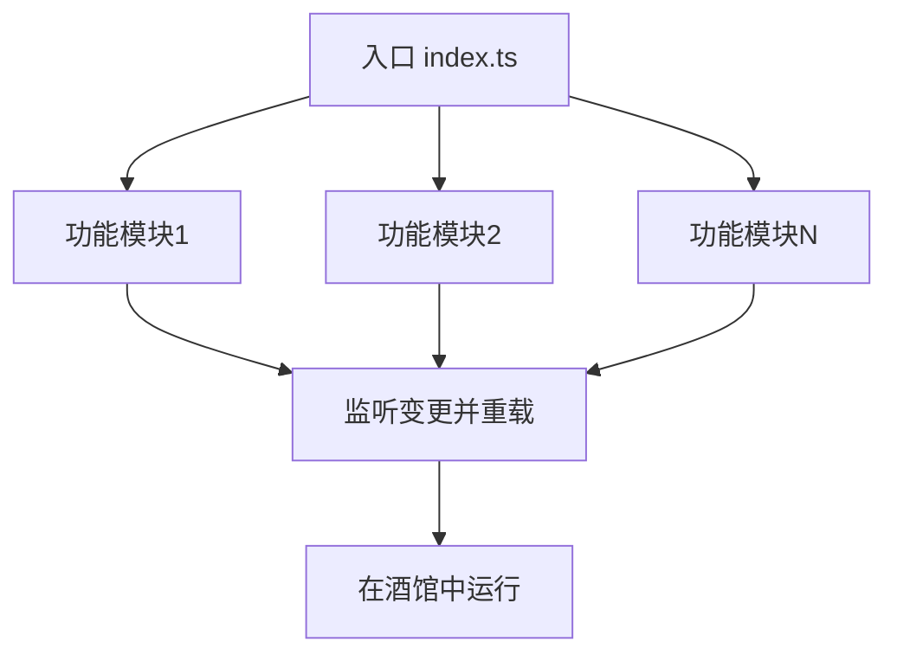
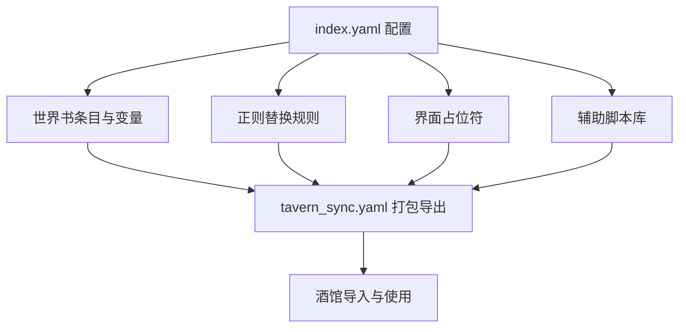
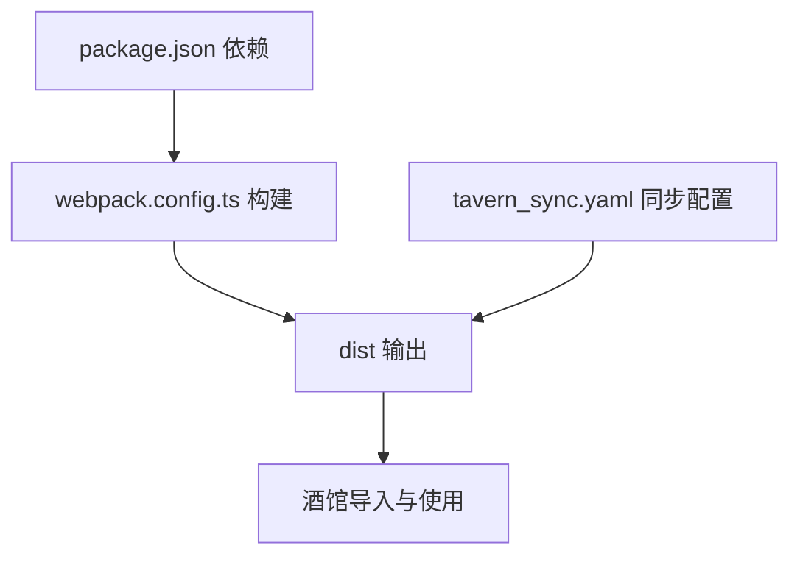

# 模板系统

<cite>
**本文引用的文件**
- [README.md](file://README.md)
- [package.json](file://package.json)
- [webpack.config.ts](file://webpack.config.ts)
- [tavern_sync.yaml](file://tavern_sync.yaml)
- [初始模板/前端界面/导入到酒馆中/界面-实时修改.json](file://初始模板/前端界面/导入到酒馆中/界面-实时修改.json)
- [初始模板/流式楼层界面/导入到酒馆中/流式楼层界面脚本-实时修改.json](file://初始模板/流式楼层界面/导入到酒馆中/流式楼层界面脚本-实时修改.json)
- [初始模板/脚本/导入到酒馆中/脚本-实时修改.json](file://初始模板/脚本/导入到酒馆中/脚本-实时修改.json)
- [初始模板/角色卡/新建为src文件夹中的文件夹/index.yaml](file://初始模板/角色卡/新建为src文件夹中的文件夹/index.yaml)
- [初始模板/角色卡/新建为src文件夹中的文件夹/schema.ts](file://初始模板/角色卡/新建为src文件夹中的文件夹/schema.ts)
- [初始模板/前端界面/新建为src文件夹中的文件夹/App.vue](file://初始模板/前端界面/新建为src文件夹中的文件夹/App.vue)
- [初始模板/流式楼层界面/新建为src文件夹中的文件夹/App.vue](file://初始模板/流式楼层界面/新建为src文件夹中的文件夹/App.vue)
- [示例/前端界面示例/界面.vue](file://示例/前端界面示例/界面.vue)
- [示例/流式楼层界面示例/App.vue](file://示例/流式楼层界面示例/App.vue)
- [示例/脚本示例/index.ts](file://示例/脚本示例/index.ts)
- [示例/角色卡示例/界面/状态栏/App.vue](file://示例/角色卡示例/界面/状态栏/App.vue)
</cite>

## 目录
1. [简介](#简介)
2. [项目结构](#项目结构)
3. [核心组件](#核心组件)
4. [架构总览](#架构总览)
5. [详细组件分析](#详细组件分析)
6. [依赖关系分析](#依赖关系分析)
7. [性能考虑](#性能考虑)
8. [故障排查指南](#故障排查指南)
9. [结论](#结论)
10. [附录](#附录)

## 简介
本模板系统面向 SillyTavern（以下简称“酒馆”）生态，提供多种类型的模板，涵盖：
- 前端界面模板：用于构建可在酒馆中实时加载的页面化交互界面。
- 流式楼层界面模板：用于在消息流式输出过程中渲染楼层界面，支持高亮、分段、搜索等功能。
- 脚本模板：用于在酒馆中动态加载的脚本模块，支持事件绑定、消息监听、设置界面等。
- 角色卡模板：用于角色卡及其世界书、变量系统的结构化配置与扩展。

模板系统通过本地开发服务器与打包流程，实现热更新、自动打包与同步，同时提供 CI 工作流以实现模板仓库的自动同步与依赖更新。

## 项目结构
模板系统采用按类型分层的组织方式，主要目录如下：
- 初始模板：提供各类模板的最小可用骨架，便于快速复制与定制。
- 示例：提供各类型模板的参考实现，便于理解结构与最佳实践。
- 根级配置：包含构建配置、同步配置与依赖管理，支撑模板的开发与发布。

**图表来源**
- [webpack.config.ts:51-75](file://webpack.config.ts#L51-L75)
- [tavern_sync.yaml:6-28](file://tavern_sync.yaml#L6-L28)

**章节来源**
- [README.md:1-105](file://README.md#L1-L105)
- [package.json:1-120](file://package.json#L1-L120)
- [webpack.config.ts:51-75](file://webpack.config.ts#L51-L75)
- [tavern_sync.yaml:1-28](file://tavern_sync.yaml#L1-L28)

## 核心组件
- 构建与热更新
  - 通过 webpack 配置扫描 src 与示例目录下的入口文件，自动构建并输出至 dist 目录；在监听模式下，通过 Socket.IO 推送更新事件，实现与酒馆的热更新联动。
- 自动打包与同步
  - 通过 tavern_sync.yaml 配置角色卡/世界书/预设的打包与导出路径，配合 CI 工作流实现模板仓库的自动同步与依赖更新。
- 模板导入配置
  - 提供 JSON 配置文件，用于在酒馆中导入前端界面或脚本，支持正则替换、Markdown 仅处理等选项。

**章节来源**
- [webpack.config.ts:77-80](file://webpack.config.ts#L77-L80)
- [webpack.config.ts:83-107](file://webpack.config.ts#L83-L107)
- [tavern_sync.yaml:6-28](file://tavern_sync.yaml#L6-L28)
- [初始模板/前端界面/导入到酒馆中/界面-实时修改.json:1-16](file://初始模板/前端界面/导入到酒馆中/界面-实时修改.json#L1-L16)
- [初始模板/流式楼层界面/导入到酒馆中/流式楼层界面脚本-实时修改.json:1-8](file://初始模板/流式楼层界面/导入到酒馆中/流式楼层界面脚本-实时修改.json#L1-L8)
- [初始模板/脚本/导入到酒馆中/脚本-实时修改.json:1-8](file://初始模板/脚本/导入到酒馆中/脚本-实时修改.json#L1-L8)

## 架构总览
模板系统的核心流程包括：本地开发、构建打包、热更新推送、模板导入与使用。

**图表来源**
- [webpack.config.ts:83-107](file://webpack.config.ts#L83-L107)
- [webpack.config.ts:191-226](file://webpack.config.ts#L191-L226)

**章节来源**
- [README.md:49-69](file://README.md#L49-L69)
- [webpack.config.ts:83-107](file://webpack.config.ts#L83-L107)

## 详细组件分析

### 前端界面模板
- 用途与场景
  - 在酒馆中加载自定义页面化界面，适合需要复杂交互与状态管理的场景。
- 结构特点
  - 包含入口 HTML、TS/Vue 入口文件与基础 App.vue。
  - 支持样式内联与模块化打包，适配热更新。
- 使用方法
  - 将模板复制到 src 对应目录，修改入口文件与组件结构。
  - 通过本地开发服务器访问 index.html，或在酒馆中使用导入配置进行加载。
- 导入配置要点
  - 配置项包含脚本名、正则匹配与替换字符串、是否仅 Markdown 处理等。
- 开发最佳实践
  - 使用 Vue 组件化开发，合理拆分模块与样式。
  - 在入口 TS 中集中导入所需模块，保持逻辑清晰。
  - 利用热更新机制频繁验证改动。

**图表来源**
- [初始模板/前端界面/新建为src文件夹中的文件夹/App.vue:1-8](file://初始模板/前端界面/新建为src文件夹中的文件夹/App.vue#L1-L8)
- [示例/前端界面示例/界面.vue:1-4](file://示例/前端界面示例/界面.vue#L1-L4)

**章节来源**
- [初始模板/前端界面/导入到酒馆中/界面-实时修改.json:1-16](file://初始模板/前端界面/导入到酒馆中/界面-实时修改.json#L1-L16)
- [初始模板/前端界面/新建为src文件夹中的文件夹/App.vue:1-8](file://初始模板/前端界面/新建为src文件夹中的文件夹/App.vue#L1-L8)
- [示例/前端界面示例/界面.vue:1-4](file://示例/前端界面示例/界面.vue#L1-L4)

### 流式楼层界面模板
- 用途与场景
  - 在消息流式输出过程中渲染楼层界面，支持高亮、分段、搜索与选项插入等。
- 结构特点
  - 通过注入流式上下文，解析消息中的特殊标记，分割前后段落并渲染对应组件。
  - 支持监听流式状态变化，触发提示与挂载提示。
- 使用方法
  - 将模板复制到 src 对应目录，根据需要引入搜索框、高亮器、分段组件等。
  - 在酒馆中使用导入配置加载脚本，确保脚本路径指向打包后的 index.js。
- 开发最佳实践
  - 合理划分组件职责，保持模板可维护性。
  - 注意流式状态的监听与清理，避免重复提示。

**图表来源**
- [示例/流式楼层界面示例/App.vue:16-72](file://示例/流式楼层界面示例/App.vue#L16-L72)

**章节来源**
- [初始模板/流式楼层界面/导入到酒馆中/流式楼层界面脚本-实时修改.json:1-8](file://初始模板/流式楼层界面/导入到酒馆中/流式楼层界面脚本-实时修改.json#L1-L8)
- [初始模板/流式楼层界面/新建为src文件夹中的文件夹/App.vue:1-11](file://初始模板/流式楼层界面/新建为src文件夹中的文件夹/App.vue#L1-L11)
- [示例/流式楼层界面示例/App.vue:16-72](file://示例/流式楼层界面示例/App.vue#L16-L72)

### 脚本模板
- 用途与场景
  - 在酒馆中动态加载脚本，支持按钮事件、消息监听、设置界面与楼层调整等。
- 结构特点
  - 通过入口 index.ts 聚合多个功能模块，便于扩展与维护。
  - 支持在监听模式下自动重载脚本，提升开发效率。
- 使用方法
  - 将模板复制到 src 对应目录，按需添加功能模块。
  - 在酒馆中使用导入配置加载脚本，确保脚本路径正确。
- 开发最佳实践
  - 将功能拆分为独立模块，通过入口统一导入。
  - 合理使用事件监听与清理，避免内存泄漏。

**图表来源**
- [示例/脚本示例/index.ts:1-7](file://示例/脚本示例/index.ts#L1-L7)

**章节来源**
- [初始模板/脚本/导入到酒馆中/脚本-实时修改.json:1-8](file://初始模板/脚本/导入到酒馆中/脚本-实时修改.json#L1-L8)
- [示例/脚本示例/index.ts:1-7](file://示例/脚本示例/index.ts#L1-L7)

### 角色卡模板
- 用途与场景
  - 用于角色卡及其世界书、变量系统的结构化配置与扩展，支持正则替换、界面占位符与辅助脚本库。
- 结构特点
  - 通过 YAML 配置角色卡元数据、第一条消息、锚点与世界书条目。
  - 支持正则替换规则，实现变量更新的折叠与显示控制。
  - 提供界面占位符，可加载状态栏等界面。
- 使用方法
  - 将模板复制到 src 对应目录，按需配置 index.yaml 与相关文件。
  - 使用 tavern_sync.yaml 配置打包与导出路径，生成可导入的酒馆文件。
- 开发最佳实践
  - 合理组织世界书条目与变量文件，保持结构清晰。
  - 使用占位符与正则规则提升界面与交互体验。

**图表来源**
- [初始模板/角色卡/新建为src文件夹中的文件夹/index.yaml:1-171](file://初始模板/角色卡/新建为src文件夹中的文件夹/index.yaml#L1-L171)
- [tavern_sync.yaml:6-28](file://tavern_sync.yaml#L6-L28)

**章节来源**
- [初始模板/角色卡/新建为src文件夹中的文件夹/index.yaml:1-171](file://初始模板/角色卡/新建为src文件夹中的文件夹/index.yaml#L1-L171)
- [tavern_sync.yaml:6-28](file://tavern_sync.yaml#L6-L28)

## 依赖关系分析
模板系统通过构建配置与同步配置实现模块间的依赖与协作关系。

**图表来源**
- [package.json:15-107](file://package.json#L15-L107)
- [webpack.config.ts:191-226](file://webpack.config.ts#L191-L226)
- [tavern_sync.yaml:6-28](file://tavern_sync.yaml#L6-L28)

**章节来源**
- [package.json:15-107](file://package.json#L15-L107)
- [webpack.config.ts:191-226](file://webpack.config.ts#L191-L226)
- [tavern_sync.yaml:6-28](file://tavern_sync.yaml#L6-L28)

## 性能考虑
- 构建优化
  - 生产模式启用压缩与分块策略，减少体积与加载时间。
  - 通过 externals 配置将常用库从 CDN 引入，降低打包体积。
- 热更新与监听
  - 监听模式下自动推送更新事件，减少手动刷新成本。
- 打包与同步
  - 通过 CI 工作流定期更新依赖与模板，保证稳定性与兼容性。

**章节来源**
- [webpack.config.ts:484-520](file://webpack.config.ts#L484-L520)
- [webpack.config.ts:521-567](file://webpack.config.ts#L521-L567)
- [README.md:71-89](file://README.md#L71-L89)

## 故障排查指南
- 打包冲突
  - 若出现 dist 冲突，可通过配置 git 合并策略使用当前版本，避免手动解决冲突。
- 热更新无效
  - 确认本地开发服务器已启动，且 Socket.IO 推送事件正常触发。
- 导入配置错误
  - 检查导入 JSON 中的脚本路径与替换字符串，确保与实际打包路径一致。
- 同步失败
  - 检查 tavern_sync.yaml 中的配置名称、本地文件路径与导出文件路径是否正确。

**章节来源**
- [README.md:90-100](file://README.md#L90-L100)
- [webpack.config.ts:83-107](file://webpack.config.ts#L83-L107)
- [初始模板/前端界面/导入到酒馆中/界面-实时修改.json:1-16](file://初始模板/前端界面/导入到酒馆中/界面-实时修改.json#L1-L16)
- [tavern_sync.yaml:6-28](file://tavern_sync.yaml#L6-L28)

## 结论
模板系统提供了从开发到部署的一体化方案，覆盖前端界面、流式楼层界面、脚本与角色卡四大类模板。通过本地开发服务器、热更新与 CI 工作流，开发者可以高效地构建、测试与发布模板，并在酒馆中稳定使用。建议在开发过程中遵循模块化与可维护性的原则，充分利用导入配置与同步配置，以获得更好的开发体验与用户体验。

## 附录
- 使用示例
  - 前端界面：参考示例中的界面.vue 与 App.vue，结合导入配置在酒馆中加载。
  - 流式楼层界面：参考示例中的 App.vue，理解上下文注入与消息分段渲染。
  - 脚本模板：参考示例中的 index.ts，按需添加功能模块并导入。
  - 角色卡模板：参考示例中的 index.yaml 与 schema.ts，配置角色卡与世界书。
- 最佳实践
  - 将功能拆分为独立模块，通过入口统一聚合。
  - 合理使用热更新与监听机制，提升开发效率。
  - 通过 CI 工作流定期同步模板与依赖，保持项目健康。

**章节来源**
- [示例/前端界面示例/界面.vue:1-4](file://示例/前端界面示例/界面.vue#L1-L4)
- [示例/流式楼层界面示例/App.vue:16-72](file://示例/流式楼层界面示例/App.vue#L16-L72)
- [示例/脚本示例/index.ts:1-7](file://示例/脚本示例/index.ts#L1-L7)
- [示例/角色卡示例/界面/状态栏/App.vue:1-77](file://示例/角色卡示例/界面/状态栏/App.vue#L1-L77)