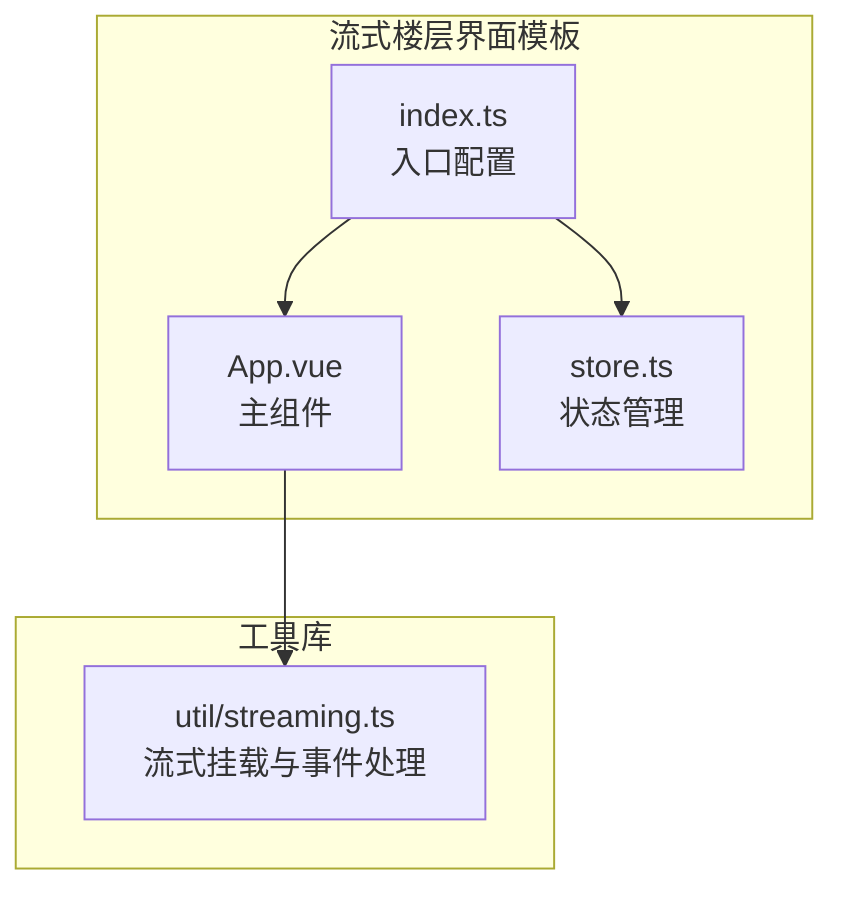
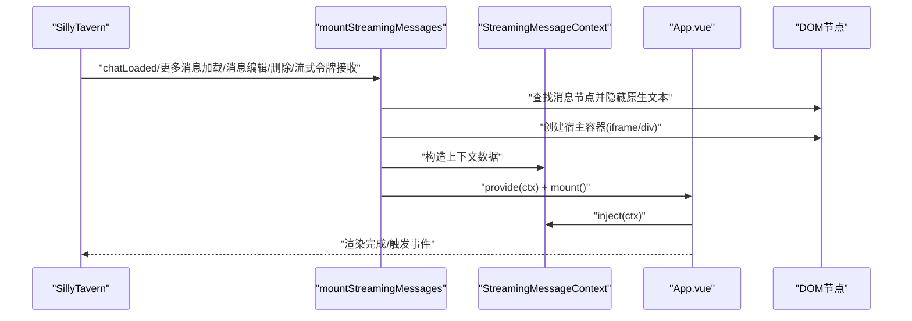
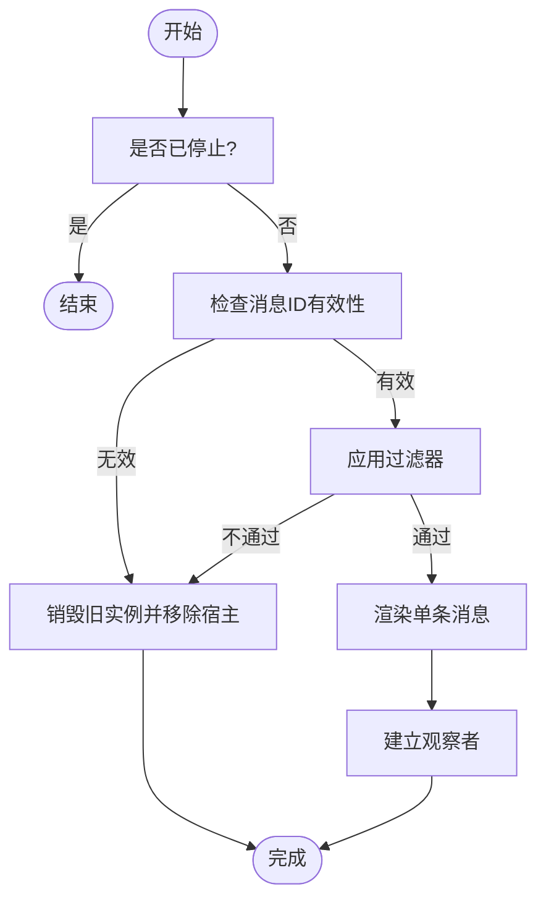
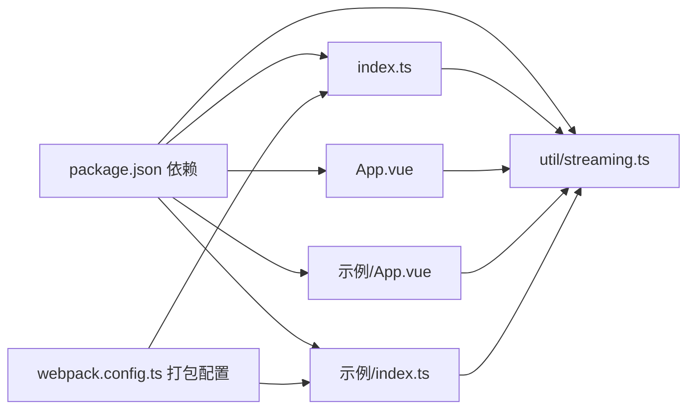

# 流式楼层界面模板

<cite>
**本文引用的文件**
- [App.vue](file://初始模板/流式楼层界面/新建为src文件夹中的文件夹/App.vue)
- [store.ts](file://初始模板/流式楼层界面/新建为src文件夹中的文件夹/store.ts)
- [index.ts](file://初始模板/流式楼层界面/新建为src文件夹中的文件夹/index.ts)
- [streaming.ts](file://util/streaming.ts)
- [示例/App.vue](file://示例/流式楼层界面示例/App.vue)
- [示例/index.ts](file://示例/流式楼层界面示例/index.ts)
- [示例/分段.vue](file://示例/流式楼层界面示例/分段.vue)
- [示例/搜索框.vue](file://示例/流式楼层界面示例/搜索框.vue)
- [示例/高亮.vue](file://示例/流式楼层界面示例/高亮.vue)
- [displayed_message.d.ts](file://@types/function/displayed_message.d.ts)
- [流式楼层界面脚本-实时修改.json](file://初始模板/流式楼层界面/导入到酒馆中/流式楼层界面脚本-实时修改.json)
- [package.json](file://package.json)
- [webpack.config.ts](file://webpack.config.ts)
- [README.md](file://README.md)
</cite>

## 目录
1. [简介](#简介)
2. [项目结构](#项目结构)
3. [核心组件](#核心组件)
4. [架构总览](#架构总览)
5. [详细组件分析](#详细组件分析)
6. [依赖关系分析](#依赖关系分析)
7. [性能考虑](#性能考虑)
8. [故障排查指南](#故障排查指南)
9. [结论](#结论)
10. [附录](#附录)

## 简介
本指南面向希望在 SillyTavern（简称“酒馆”）中使用流式楼层界面模板的开发者与使用者。文档围绕流式界面模板的架构设计、消息实时更新机制、上下文注入与状态同步进行深入解析，并提供在酒馆中导入与使用的完整步骤、自定义方法（样式、搜索、高亮等）以及性能优化建议。模板采用 Vue 3 + Pinia + TypeScript 技术栈，结合 util/streaming 提供的挂载与事件驱动渲染能力，实现对酒馆各楼层消息的流式替换显示。

## 项目结构
流式楼层界面模板由三部分组成：
- 入口配置：index.ts 负责初始化挂载与生命周期管理
- 主组件：App.vue 注入流式消息上下文并组织子组件
- 状态管理：store.ts 提供可扩展的数据存储（默认最小化）

图表来源
- [index.ts:1-10](file://初始模板/流式楼层界面/新建为src文件夹中的文件夹/index.ts#L1-L10)
- [App.vue:1-11](file://初始模板/流式楼层界面/新建为src文件夹中的文件夹/App.vue#L1-L11)
- [store.ts:1-7](file://初始模板/流式楼层界面/新建为src文件夹中的文件夹/store.ts#L1-L7)
- [streaming.ts:1-238](file://util/streaming.ts#L1-L238)

章节来源
- [index.ts:1-10](file://初始模板/流式楼层界面/新建为src文件夹中的文件夹/index.ts#L1-L10)
- [App.vue:1-11](file://初始模板/流式楼层界面/新建为src文件夹中的文件夹/App.vue#L1-L11)
- [store.ts:1-7](file://初始模板/流式楼层界面/新建为src文件夹中的文件夹/store.ts#L1-L7)
- [streaming.ts:1-238](file://util/streaming.ts#L1-L238)

## 核心组件
- 入口配置（index.ts）
  - 调用 mountStreamingMessages 挂载流式界面
  - 传入组件工厂函数与可选配置（宿主类型、过滤器、前缀）
  - 监听页面卸载事件以清理资源
- 主组件（App.vue）
  - 通过 injectStreamingMessageContext 注入流式消息上下文
  - 基于上下文数据渲染子组件（如搜索、分段、高亮）
- 状态管理（store.ts）
  - 使用 defineStore 定义数据存储，便于扩展业务状态
- 工具库（util/streaming.ts）
  - 提供 StreamingMessageContext 上下文类型与注入函数
  - 提供 mountStreamingMessages 挂载函数，负责：
    - 识别楼层元素并隐藏原生文本
    - 为每个消息创建独立宿主（iframe/div），挂载 Vue 应用
    - 响应酒馆事件（加载、编辑、删除、更多消息、流式令牌接收）
    - 管理观察者与销毁流程，确保编辑态与显示态切换正确

章节来源
- [index.ts:1-10](file://初始模板/流式楼层界面/新建为src文件夹中的文件夹/index.ts#L1-L10)
- [App.vue:1-11](file://初始模板/流式楼层界面/新建为src文件夹中的文件夹/App.vue#L1-L11)
- [store.ts:1-7](file://初始模板/流式楼层界面/新建为src文件夹中的文件夹/store.ts#L1-L7)
- [streaming.ts:1-238](file://util/streaming.ts#L1-L238)

## 架构总览
流式楼层界面的运行时架构如下：
- 入口通过 mountStreamingMessages 将 Vue 应用挂载到每个非用户/非系统楼层
- 每个消息对应一个独立的宿主容器（iframe 或 div），保证样式隔离或继承
- 通过 provide/inject 传递 StreamingMessageContext，包含消息 ID、内容、是否处于流式中等信息
- 借助酒馆事件系统，动态渲染、更新、销毁对应楼层的流式界面

图表来源
- [streaming.ts:41-237](file://util/streaming.ts#L41-L237)
- [index.ts:1-10](file://初始模板/流式楼层界面/新建为src文件夹中的文件夹/index.ts#L1-L10)
- [App.vue:1-11](file://初始模板/流式楼层界面/新建为src文件夹中的文件夹/App.vue#L1-L11)

## 详细组件分析

### 入口配置（index.ts）
- 功能要点
  - 调用 mountStreamingMessages，传入组件工厂函数（createApp(App).use(createPinia())）
  - 可选配置：host（iframe/div）、filter（楼层过滤器）、prefix（唯一标识）
  - 监听 window.pagehide 事件，调用 unmount 清理
- 关键行为
  - 返回 unmount 函数，用于卸载所有已挂载的流式界面
  - 通过事件驱动渲染，确保与酒馆交互一致

章节来源
- [index.ts:1-10](file://初始模板/流式楼层界面/新建为src文件夹中的文件夹/index.ts#L1-L10)
- [streaming.ts:41-237](file://util/streaming.ts#L41-L237)

### 主组件（App.vue）
- 功能要点
  - 注入 StreamingMessageContext，读取 message_id、message、during_streaming 等
  - 可组合子组件（搜索框、分段、高亮、角色选项等）
  - 监听 during_streaming 变化，在流式结束时提示用户
- 设计模式
  - 通过上下文驱动渲染，避免直接操作 DOM
  - 子组件职责单一，便于复用与扩展

章节来源
- [App.vue:1-11](file://初始模板/流式楼层界面/新建为src文件夹中的文件夹/App.vue#L1-L11)
- [示例/App.vue:1-72](file://示例/流式楼层界面示例/App.vue#L1-L72)

### 状态管理（store.ts）
- 功能要点
  - 使用 defineStore 定义命名 store，导出 data 状态
  - 可在此基础上扩展业务状态（如搜索词、高亮规则等）
- 注意事项
  - 与流式上下文解耦，避免重复存储相同数据

章节来源
- [store.ts:1-7](file://初始模板/流式楼层界面/新建为src文件夹中的文件夹/store.ts#L1-L7)

### 工具库（util/streaming.ts）
- StreamingMessageContext
  - 包含 prefix、host_id、message_id、message、during_streaming 等字段
- mountStreamingMessages
  - 宿主策略：iframe 隔离样式，div 继承样式
  - 过滤器：仅对满足条件的楼层挂载
  - 事件绑定：chatLoaded、MESSAGE_EDITED、MESSAGE_DELETED、MORE_MESSAGES_LOADED、STREAM_TOKEN_RECEIVED
  - 生命周期：renderOneMessage/renderAllMessage、destroy、unmount
- 样式与编辑态
  - 编辑态时隐藏流式界面，显示原生文本
  - 通过观察者检测编辑态变化，动态切换显示

图表来源
- [streaming.ts:41-237](file://util/streaming.ts#L41-L237)

章节来源
- [streaming.ts:1-238](file://util/streaming.ts#L1-L238)

### 示例组件（搜索、分段、高亮）
- 搜索框（SearchBar）
  - v-model 双向绑定查询词
  - 支持清空与键盘 ESC 快捷键
- 分段（Segment）
  - 将 HTML 按换行切分为段落，支持点击展开与模糊遮罩
- 高亮（Highlighter）
  - 基于 vue-word-highlighter 实现关键词高亮
  - 使用全局样式避免与酒馆 mark 冲突

章节来源
- [示例/搜索框.vue:1-95](file://示例/流式楼层界面示例/搜索框.vue#L1-L95)
- [示例/分段.vue:1-79](file://示例/流式楼层界面示例/分段.vue#L1-L79)
- [示例/高亮.vue:1-20](file://示例/流式楼层界面示例/高亮.vue#L1-L20)

## 依赖关系分析
- 依赖生态
  - Vue 3、Pinia、jQuery、lodash、toastr、vue-word-highlighter 等
  - Webpack 打包配置支持多入口、按需内联、CDN 外部化
- 模块关系
  - index.ts 依赖 util/streaming.ts
  - App.vue 依赖 streaming.ts 的上下文注入
  - 示例组件依赖 App.vue 与工具库

图表来源
- [package.json:79-106](file://package.json#L79-L106)
- [webpack.config.ts:571-572](file://webpack.config.ts#L571-L572)
- [index.ts:1-10](file://初始模板/流式楼层界面/新建为src文件夹中的文件夹/index.ts#L1-L10)
- [示例/index.ts:1-8](file://示例/流式楼层界面示例/index.ts#L1-L8)
- [App.vue:1-11](file://初始模板/流式楼层界面/新建为src文件夹中的文件夹/App.vue#L1-L11)
- [示例/App.vue:1-72](file://示例/流式楼层界面示例/App.vue#L1-L72)
- [streaming.ts:1-238](file://util/streaming.ts#L1-L238)

章节来源
- [package.json:1-120](file://package.json#L1-L120)
- [webpack.config.ts:1-572](file://webpack.config.ts#L1-L572)

## 性能考虑
- 宿主选择
  - iframe：样式隔离，适合复杂界面；注意跨文档样式注入与通信成本
  - div：继承样式，减少隔离成本；注意避免使用 mes_text 类名
- 渲染策略
  - 仅对目标楼层渲染，避免全量重绘
  - 使用 MutationObserver 监控编辑态，减少不必要的 DOM 操作
- 事件节流
  - 更多消息加载与流式令牌接收事件采用延时处理，降低抖动
- 打包优化
  - 生产模式启用 Terser 压缩与分包策略
  - CDN 外链第三方库，减少体积

章节来源
- [streaming.ts:21-40](file://util/streaming.ts#L21-L40)
- [streaming.ts:188-237](file://util/streaming.ts#L188-L237)
- [webpack.config.ts:484-520](file://webpack.config.ts#L484-L520)

## 故障排查指南
- 无法挂载流式界面
  - 检查入口是否在 DOM ready 后调用 mountStreamingMessages
  - 确认宿主类型与过滤器配置是否符合预期
- 编辑态异常
  - 确保编辑态切换时原生文本与流式界面正确切换
  - 检查观察者是否被正确断开
- 样式冲突
  - 若使用 div 宿主，避免使用 mes_text 类名
  - 高亮样式需使用全局作用域，避免 scoped 影响酒馆原有样式
- 事件未触发
  - 确认事件监听顺序与去重逻辑
  - 检查消息 ID 有效性与范围

章节来源
- [streaming.ts:129-161](file://util/streaming.ts#L129-L161)
- [streaming.ts:189-237](file://util/streaming.ts#L189-L237)

## 结论
流式楼层界面模板通过 mountStreamingMessages 与 provide/inject 机制，实现了对酒馆楼层消息的流式替换显示。其架构清晰、事件驱动、易于扩展，适合在酒馆中构建复杂的交互式界面。通过合理选择宿主类型、优化渲染策略与事件处理，可在保证体验的同时兼顾性能与稳定性。

## 附录

### 如何在 SillyTavern 中导入流式界面模板
- 步骤
  - 在本地或 CI 打包生成 dist 目标产物
  - 在酒馆中创建脚本，引用打包后的 index.js 路径
  - 参考导入配置文件中的示例路径进行替换
- 参考
  - 脚本导入配置示例：[流式楼层界面脚本-实时修改.json:1-8](file://初始模板/流式楼层界面/导入到酒馆中/流式楼层界面脚本-实时修改.json#L1-L8)

章节来源
- [流式楼层界面脚本-实时修改.json:1-8](file://初始模板/流式楼层界面/导入到酒馆中/流式楼层界面脚本-实时修改.json#L1-L8)
- [README.md:49-69](file://README.md#L49-L69)

### 使用方法与配置参数
- 入口配置（index.ts）
  - mountStreamingMessages(creator, options)
  - options.host: 'iframe' | 'div'
  - options.filter: (message_id, message) => boolean
  - options.prefix: 字符串，用于唯一标识
- 主组件（App.vue）
  - injectStreamingMessageContext 获取上下文
  - 基于上下文渲染子组件
- 状态管理（store.ts）
  - defineStore 定义命名 store，导出状态

章节来源
- [index.ts:1-10](file://初始模板/流式楼层界面/新建为src文件夹中的文件夹/index.ts#L1-L10)
- [App.vue:1-11](file://初始模板/流式楼层界面/新建为src文件夹中的文件夹/App.vue#L1-L11)
- [store.ts:1-7](file://初始模板/流式楼层界面/新建为src文件夹中的文件夹/store.ts#L1-L7)
- [streaming.ts:41-44](file://util/streaming.ts#L41-L44)

### 自定义方法
- 修改消息显示样式
  - 使用 iframe 宿主时可自由使用 TailwindCSS
  - 使用 div 宿主时需继承酒馆样式，避免使用 mes_text 类名
- 添加搜索功能
  - 使用示例中的 SearchBar 组件，配合 Highlighter 实现关键词高亮
- 实现高亮效果
  - 使用 vue-word-highlighter 组件，自定义高亮样式类
- 分段展示
  - 使用 Segment 组件按行切分并支持点击展开与模糊遮罩

章节来源
- [示例/搜索框.vue:1-95](file://示例/流式楼层界面示例/搜索框.vue#L1-L95)
- [示例/分段.vue:1-79](file://示例/流式楼层界面示例/分段.vue#L1-L79)
- [示例/高亮.vue:1-20](file://示例/流式楼层界面示例/高亮.vue#L1-L20)
- [示例/App.vue:1-72](file://示例/流式楼层界面示例/App.vue#L1-L72)

### 消息实时更新与上下文注入原理
- 实时更新
  - 监听 STREAM_TOKEN_RECEIVED 事件，增量更新当前消息
  - 监听 CHARACTER_MESSAGE_RENDERED、MESSAGE_EDITED、MESSAGE_DELETED、MORE_MESSAGES_LOADED 等事件，触发局部或全量渲染
- 上下文注入
  - provide('streaming_message_context', data) 为每个消息提供独立上下文
  - inject 获取上下文，读取 message_id、message、during_streaming 等
- 状态同步
  - during_streaming 用于判断流式是否结束，便于触发提示或后续逻辑

章节来源
- [streaming.ts:17-19](file://util/streaming.ts#L17-L19)
- [streaming.ts:112-118](file://util/streaming.ts#L112-L118)
- [streaming.ts:215-217](file://util/streaming.ts#L215-L217)
- [示例/App.vue:60-70](file://示例/流式楼层界面示例/App.vue#L60-L70)

### 与格式化消息的关系
- formatAsDisplayedMessage 可将字符串格式化为酒馆显示的 HTML
- 在 div 宿主模式下，可使用该函数生成 HTML 并替换 mes_text 类名以适配样式

章节来源
- [displayed_message.d.ts:23-46](file://@types/function/displayed_message.d.ts#L23-L46)