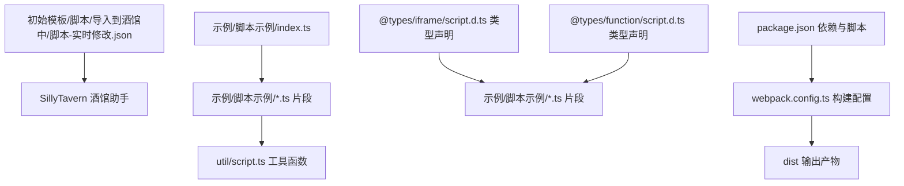
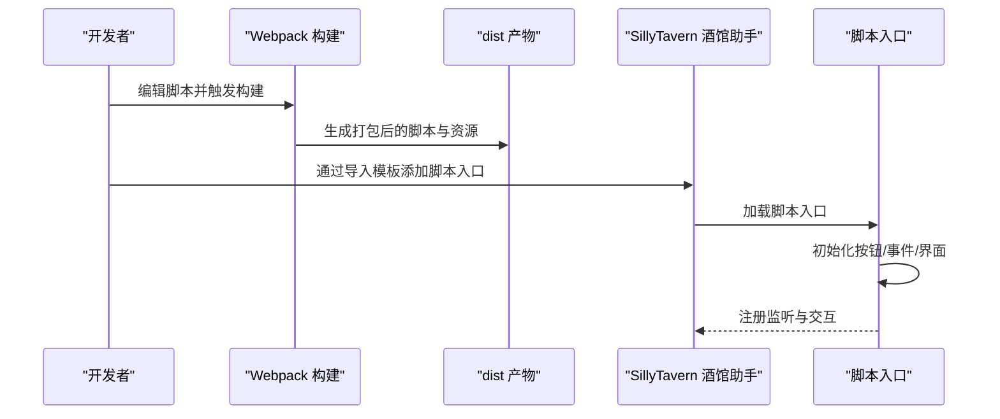
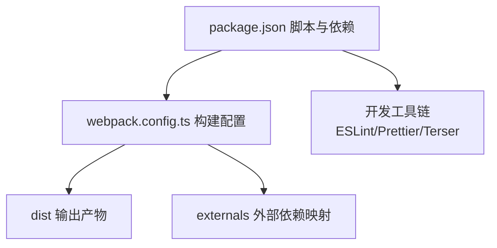

# 脚本模板

<cite>
**本文引用的文件**
- [README.md](file://README.md)
- [脚本-实时修改.json](file://初始模板/脚本/导入到酒馆中/脚本-实时修改.json)
- [index.ts](file://示例/脚本示例/index.ts)
- [settings.ts](file://示例/脚本示例/settings.ts)
- [加载和卸载时执行函数.ts](file://示例/脚本示例/加载和卸载时执行函数.ts)
- [添加按钮和注册按钮事件.ts](file://示例/脚本示例/添加按钮和注册按钮事件.ts)
- [监听消息修改.ts](file://示例/脚本示例/监听消息修改.ts)
- [聊天文件变更时重载脚本.ts](file://示例/脚本示例/聊天文件变更时重载脚本.ts)
- [设置界面.ts](file://示例/脚本示例/设置界面.ts)
- [调整消息楼层.ts](file://示例/脚本示例/调整消息楼层.ts)
- [script.ts](file://util/script.ts)
- [script.d.ts（函数类型）](file://@types/function/script.d.ts)
- [script.d.ts（iframe 类型）](file://@types/iframe/script.d.ts)
- [package.json](file://package.json)
- [webpack.config.ts](file://webpack.config.ts)
</cite>

## 目录
1. [简介](#简介)
2. [项目结构](#项目结构)
3. [核心组件](#核心组件)
4. [架构总览](#架构总览)
5. [详细组件分析](#详细组件分析)
6. [依赖分析](#依赖分析)
7. [性能考虑](#性能考虑)
8. [故障排查指南](#故障排查指南)
9. [结论](#结论)
10. [附录](#附录)

## 简介
本指南面向希望在酒馆助手（SillyTavern）中使用脚本模板进行开发的用户与维护者。文档围绕脚本模板的基本结构、导入流程、配置与参数、事件监听与消息处理、界面交互、最佳实践以及常见使用场景展开，帮助读者快速上手脚本开发。

## 项目结构
该仓库提供了“脚本模板”与“示例脚本”两大板块：
- 初始模板：提供可直接导入到酒馆助手的脚本 JSON 模板，便于快速添加脚本入口。
- 示例脚本：提供一组可复用的脚本片段，涵盖加载/卸载钩子、按钮注册与事件、消息监听、聊天切换重载、设置界面挂载、消息楼层调整等典型场景。
- 工具与类型：提供脚本开发常用工具函数与类型声明，确保在脚本中安全地调用酒馆助手 API。

图表来源
- [脚本-实时修改.json:1-8](file://初始模板/脚本/导入到酒馆中/脚本-实时修改.json#L1-L8)
- [index.ts:1-7](file://示例/脚本示例/index.ts#L1-L7)
- [script.ts:1-47](file://util/script.ts#L1-L47)
- [script.d.ts（iframe 类型）:1-90](file://@types/iframe/script.d.ts#L1-L90)
- [script.d.ts（函数类型）:1-82](file://@types/function/script.d.ts#L1-L82)
- [webpack.config.ts:1-572](file://webpack.config.ts#L1-L572)
- [package.json:1-120](file://package.json#L1-L120)

章节来源
- [README.md:1-105](file://README.md#L1-L105)
- [脚本-实时修改.json:1-8](file://初始模板/脚本/导入到酒馆中/脚本-实时修改.json#L1-L8)
- [index.ts:1-7](file://示例/脚本示例/index.ts#L1-L7)
- [package.json:1-120](file://package.json#L1-L120)
- [webpack.config.ts:1-572](file://webpack.config.ts#L1-L572)

## 核心组件
- 脚本入口与导入
  - 通过“导入到酒馆中”的 JSON 模板，将脚本打包产物的 URL 注入到酒馆助手，实现一键添加与实时更新。
- 脚本片段与复用
  - 示例脚本通过模块化入口文件聚合多个功能片段，便于按需组合与维护。
- 工具函数
  - 提供样式传送、脚本 ID 容器、聊天切换重载等通用能力，降低重复劳动。
- 类型声明
  - 为脚本按钮、脚本树、事件类型等提供强类型支持，提升开发体验与稳定性。

章节来源
- [脚本-实时修改.json:1-8](file://初始模板/脚本/导入到酒馆中/脚本-实时修改.json#L1-L8)
- [index.ts:1-7](file://示例/脚本示例/index.ts#L1-L7)
- [script.ts:1-47](file://util/script.ts#L1-L47)
- [script.d.ts（iframe 类型）:1-90](file://@types/iframe/script.d.ts#L1-L90)
- [script.d.ts（函数类型）:1-82](file://@types/function/script.d.ts#L1-L82)

## 架构总览
下图展示了从“脚本模板”到“SillyTavern 酒馆助手”的整体流程：开发者在本地构建脚本，生成 dist 产物；通过 JSON 模板将脚本入口注入酒馆助手；脚本在运行时通过工具函数与类型声明与酒馆助手交互。

图表来源
- [webpack.config.ts:185-572](file://webpack.config.ts#L185-L572)
- [脚本-实时修改.json:1-8](file://初始模板/脚本/导入到酒馆中/脚本-实时修改.json#L1-L8)
- [index.ts:1-7](file://示例/脚本示例/index.ts#L1-L7)

## 详细组件分析

### 组件一：脚本导入与配置
- 目标
  - 将脚本入口注入酒馆助手，支持本地开发与远程 CDN 更新。
- 关键点
  - 使用“导入到酒馆中”的 JSON 模板，将脚本打包产物的 URL 写入 content 字段。
  - 本地开发时指向本地服务器地址；生产环境可指向 CDN。
- 最佳实践
  - 本地调试时确保端口开放且可访问。
  - 生产环境建议配合版本号策略与缓存控制，保证更新及时。

章节来源
- [脚本-实时修改.json:1-8](file://初始模板/脚本/导入到酒馆中/脚本-实时修改.json#L1-L8)
- [README.md:49-69](file://README.md#L49-L69)

### 组件二：脚本入口与模块化组织
- 目标
  - 通过入口文件聚合多个功能片段，形成可复用的脚本组件。
- 关键点
  - 入口文件统一导入各功能片段，按需执行初始化逻辑。
- 最佳实践
  - 将公共逻辑抽取为独立片段，避免重复代码。
  - 明确每个片段的职责边界，便于测试与维护。

章节来源
- [index.ts:1-7](file://示例/脚本示例/index.ts#L1-L7)

### 组件三：加载与卸载生命周期
- 目标
  - 在页面加载与卸载时执行必要的初始化与清理。
- 关键点
  - 使用页面加载钩子进行初始化提示。
  - 使用页面隐藏事件进行资源释放与卸载提示。
- 最佳实践
  - 在卸载时主动移除事件监听、DOM 节点与定时器。
  - 使用统一的销毁函数，确保资源回收完整。

章节来源
- [加载和卸载时执行函数.ts:1-10](file://示例/脚本示例/加载和卸载时执行函数.ts#L1-L10)

### 组件四：按钮注册与事件绑定
- 目标
  - 动态注册脚本按钮并在点击时触发相应逻辑。
- 关键点
  - 通过按钮事件类型与事件绑定函数建立点击响应。
  - 使用可见性控制按钮展示。
- 最佳实践
  - 按钮命名规范统一，避免重复。
  - 事件回调中尽量减少阻塞操作，必要时异步处理。

章节来源
- [添加按钮和注册按钮事件.ts:1-8](file://示例/脚本示例/添加按钮和注册按钮事件.ts#L1-L8)
- [script.d.ts（iframe 类型）:13-41](file://@types/iframe/script.d.ts#L13-L41)

### 组件五：消息监听与交互
- 目标
  - 监听消息更新事件并做出相应反馈。
- 关键点
  - 使用消息更新事件类型监听特定消息的变更。
- 最佳实践
  - 在回调中避免频繁 DOM 操作，必要时节流/防抖。
  - 对异常消息 ID 做边界检查与容错处理。

章节来源
- [监听消息修改.ts:1-4](file://示例/脚本示例/监听消息修改.ts#L1-L4)
- [script.d.ts（函数类型）:47-82](file://@types/function/script.d.ts#L47-L82)

### 组件六：聊天切换重载
- 目标
  - 当聊天文件切换时自动刷新页面，确保脚本状态与当前聊天一致。
- 关键点
  - 使用工具函数监听聊天变更事件并触发页面重载。
- 最佳实践
  - 在重载前保存必要状态，避免数据丢失。
  - 对频繁切换场景考虑延迟重载策略。

章节来源
- [聊天文件变更时重载脚本.ts:1-4](file://示例/脚本示例/聊天文件变更时重载脚本.ts#L1-L4)
- [script.ts:38-47](file://util/script.ts#L38-L47)

### 组件七：设置界面集成
- 目标
  - 在酒馆助手设置页挂载自定义 Vue 界面，提供可配置项。
- 关键点
  - 创建带脚本 ID 的容器节点并挂载应用。
  - 使用样式传送函数将样式注入页面头部。
  - 在页面卸载时卸载应用并清理样式。
- 最佳实践
  - 将界面与业务逻辑解耦，使用 Pinia 管理状态。
  - 注意样式隔离与冲突，必要时使用作用域样式。

章节来源
- [设置界面.ts:1-18](file://示例/脚本示例/设置界面.ts#L1-L18)
- [script.ts:13-36](file://util/script.ts#L13-L36)

### 组件八：消息楼层调整
- 目标
  - 在特定条件下批量创建消息，引导对话走向。
- 关键点
  - 通过消息创建 API 批量插入消息，并指定刷新策略。
  - 使用辅助函数进行文本格式化与结构化消息生成。
- 最佳实践
  - 严格判断前置条件，避免重复插入。
  - 对消息内容进行安全校验与格式化，防止注入风险。

章节来源
- [调整消息楼层.ts:1-40](file://示例/脚本示例/调整消息楼层.ts#L1-L40)

### 组件九：工具函数与类型声明
- 目标
  - 提供脚本开发常用能力与类型约束，提升开发效率与安全性。
- 关键点
  - 工具函数：样式传送、脚本 ID 容器、聊天切换重载等。
  - 类型声明：脚本按钮、脚本树、事件类型等。
- 最佳实践
  - 在引入外部依赖时遵循类型声明，避免隐式类型错误。
  - 对工具函数的返回值与副作用进行明确约定。

章节来源
- [script.ts:1-47](file://util/script.ts#L1-L47)
- [script.d.ts（iframe 类型）:1-90](file://@types/iframe/script.d.ts#L1-L90)
- [script.d.ts（函数类型）:1-82](file://@types/function/script.d.ts#L1-L82)

## 依赖分析
- 构建与打包
  - 通过 webpack 配置实现 TypeScript 编译、Vue 单文件组件解析、样式处理与资源内联。
  - 支持开发模式热更新与生产模式代码压缩与分块。
- 外部依赖
  - 通过 externals 将部分依赖映射为全局变量或 CDN 引入，减少打包体积。
- 任务与脚本
  - 提供构建、监听、格式化、校验、模式转换等脚本命令，便于本地开发与 CI 集成。

图表来源
- [package.json:1-120](file://package.json#L1-L120)
- [webpack.config.ts:185-572](file://webpack.config.ts#L185-L572)

章节来源
- [package.json:1-120](file://package.json#L1-L120)
- [webpack.config.ts:185-572](file://webpack.config.ts#L185-L572)

## 性能考虑
- 代码分割与懒加载
  - 合理拆分脚本模块，按需加载，减少首屏体积。
- 样式与资源
  - 使用样式传送函数集中管理样式，避免重复注入。
  - 对图片与静态资源采用内联或 CDN 引入策略。
- 事件与轮询
  - 对高频事件进行节流/防抖，避免主线程阻塞。
  - 避免不必要的页面重载，优先局部更新。
- 依赖管理
  - 通过 externals 将大体积依赖交由 CDN 加载，缩短首屏时间。

## 故障排查指南
- 脚本未生效
  - 检查导入模板中的脚本 URL 是否正确且可访问。
  - 确认本地开发服务器已启动并允许跨域访问。
- 按钮不显示或无响应
  - 确认按钮名称唯一且与事件绑定一致。
  - 检查事件绑定是否在页面加载完成后执行。
- 界面样式异常
  - 确认样式传送函数已调用且未被提前销毁。
  - 检查是否存在样式覆盖或作用域冲突。
- 聊天切换后状态不同步
  - 确认聊天切换重载逻辑已启用。
  - 在卸载时确保清理了所有事件与资源。

章节来源
- [脚本-实时修改.json:1-8](file://初始模板/脚本/导入到酒馆中/脚本-实时修改.json#L1-L8)
- [设置界面.ts:1-18](file://示例/脚本示例/设置界面.ts#L1-L18)
- [script.ts:38-47](file://util/script.ts#L38-L47)

## 结论
本脚本模板提供了从导入、开发到部署的一体化方案。通过模块化的脚本片段、完善的工具函数与类型声明，以及清晰的构建配置，开发者可以高效地创建可复用的脚本组件，并在 SillyTavern 中实现丰富的事件监听、消息处理与界面交互功能。建议在实际项目中遵循本文的最佳实践，持续优化性能与可维护性。

## 附录
- 常用场景清单
  - 页面加载提示与卸载清理
  - 动态按钮注册与事件绑定
  - 消息更新监听与反馈
  - 聊天切换自动重载
  - 设置界面挂载与状态持久化
  - 批量消息插入与对话引导