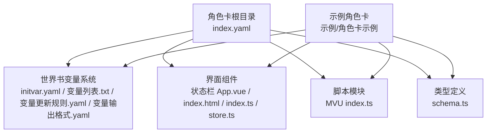
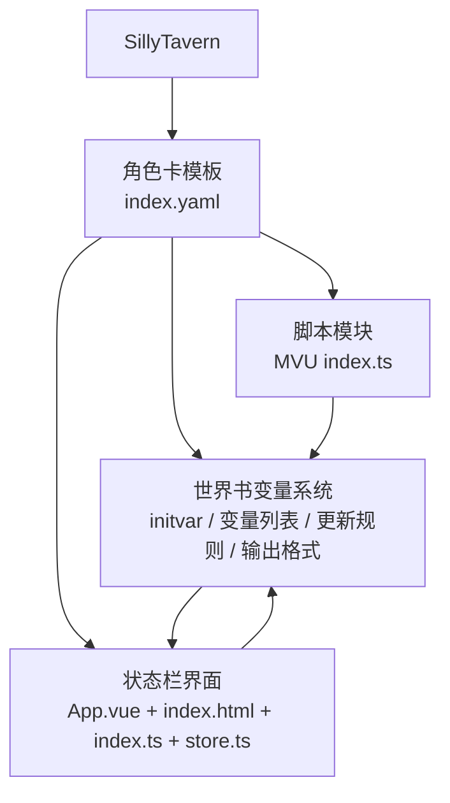
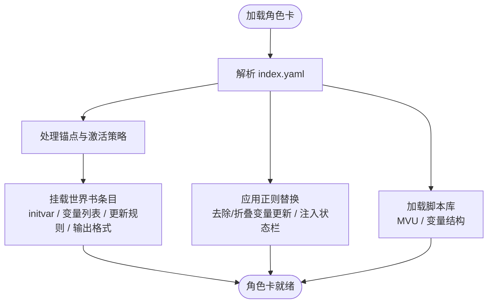
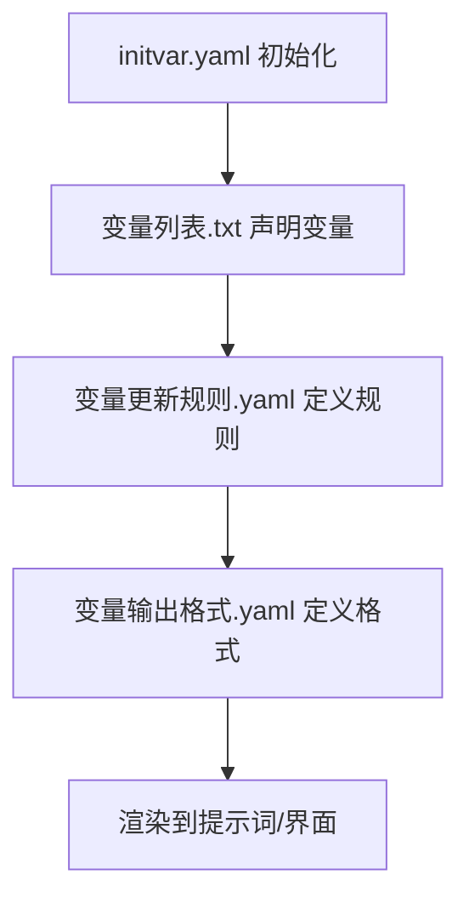
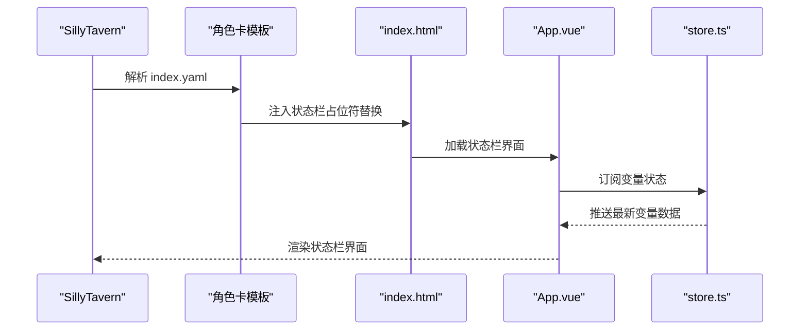
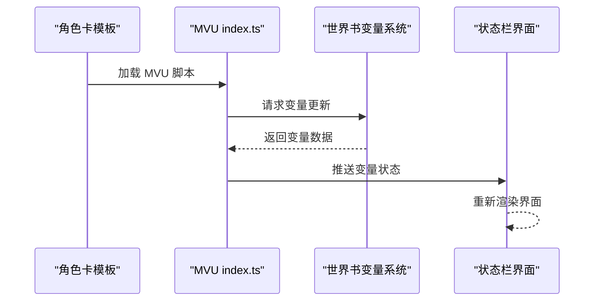
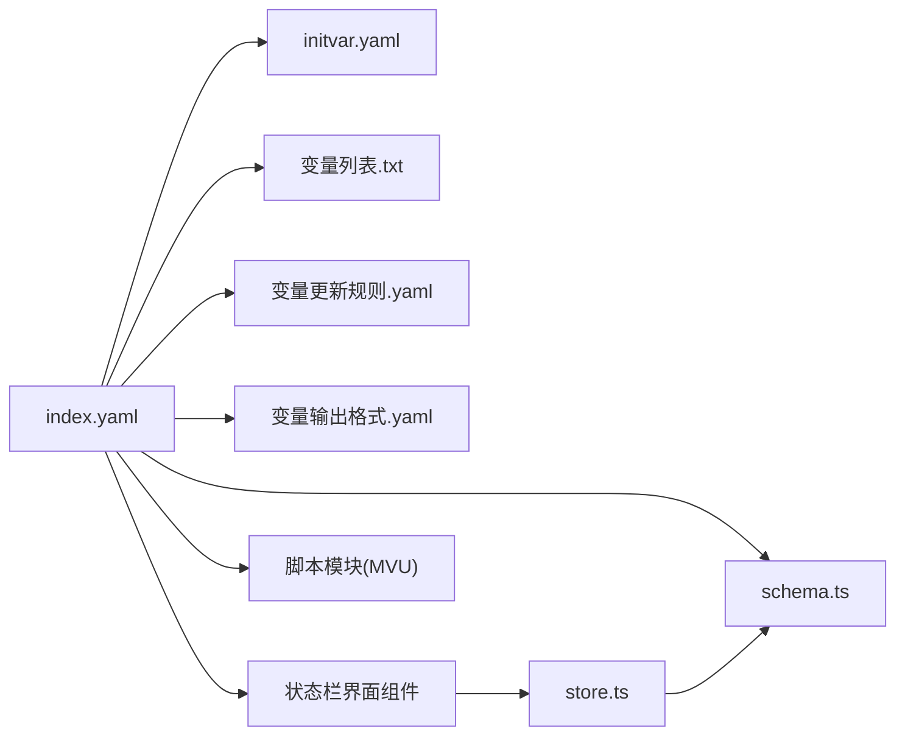

# 角色卡模板

<cite>
**本文引用的文件**
- [index.yaml](file://初始模板/角色卡/新建为src文件夹中的文件夹/index.yaml)
- [schema.ts](file://初始模板/角色卡/新建为src文件夹中的文件夹/schema.ts)
- [initvar.yaml](file://初始模板/角色卡/新建为src文件夹中的文件夹/世界书/变量/initvar.yaml)
- [变量列表.txt](file://初始模板/角色卡/新建为src文件夹中的文件夹/世界书/变量/变量列表.txt)
- [变量更新规则.yaml](file://初始模板/角色卡/新建为src文件夹中的文件夹/世界书/变量/变量更新规则.yaml)
- [App.vue](file://初始模板/角色卡/新建为src文件夹中的文件夹/界面/状态栏/App.vue)
- [store.ts](file://初始模板/角色卡/新建为src文件夹中的文件夹/界面/状态栏/store.ts)
- [index.ts](file://初始模板/角色卡/新建为src文件夹中的文件夹/脚本/MVU/index.ts)
- [index.html](file://初始模板/角色卡/新建为src文件夹中的文件夹/界面/状态栏/index.html)
- [index.ts](file://初始模板/角色卡/新建为src文件夹中的文件夹/界面/状态栏/index.ts)
- [index.yaml](file://示例/角色卡示例/index.yaml)
- [schema.ts](file://示例/角色卡示例/schema.ts)
- [initvar.yaml](file://示例/角色卡示例/世界书/变量/initvar.yaml)
- [变量列表.txt](file://示例/角色卡示例/世界书/变量/变量列表.txt)
- [变量更新规则.yaml](file://示例/角色卡示例/世界书/变量/变量更新规则.yaml)
- [App.vue](file://示例/角色卡示例/界面/状态栏/App.vue)
- [store.ts](file://示例/角色卡示例/界面/状态栏/store.ts)
- [index.ts](file://示例/角色卡示例/脚本/MVU/index.ts)
- [index.html](file://示例/角色卡示例/界面/状态栏/index.html)
- [index.ts](file://示例/角色卡示例/界面/状态栏/index.ts)
</cite>

## 目录
1. [简介](#简介)
2. [项目结构](#项目结构)
3. [核心组件](#核心组件)
4. [架构总览](#架构总览)
5. [详细组件分析](#详细组件分析)
6. [依赖关系分析](#依赖关系分析)
7. [性能考虑](#性能考虑)
8. [故障排查指南](#故障排查指南)
9. [结论](#结论)
10. [附录](#附录)

## 简介
本指南面向希望在“SillyTavern”中使用并扩展角色卡模板的开发者与运营者。内容覆盖角色卡模板的完整结构：index.yaml 配置、schema.ts 类型定义、世界书变量系统（initvar 初始化、变量列表、更新规则、输出格式）、界面组件（状态栏）以及脚本模块（MVU）。同时提供角色卡导入与配置步骤、世界书变量系统的使用方法、状态栏界面组件的功能说明、角色卡脚本开发指南（MVU 状态管理、事件处理、数据同步），并给出可直接参考的配置示例与最佳实践。

## 项目结构
角色卡模板位于“初始模板/角色卡/新建为src文件夹中的文件夹”，其核心由以下部分组成：
- 角色卡配置：index.yaml（角色元信息、锚点、世界书条目、正则替换、脚本库）
- 类型定义：schema.ts（用于校验 initvar 的 Zod Schema）
- 世界书变量系统：initvar.yaml、变量列表.txt、变量更新规则.yaml、变量输出格式.yaml
- 界面组件：状态栏界面（App.vue、index.html、index.ts、store.ts）
- 脚本模块：MVU 脚本入口 index.ts
- 示例角色卡：位于“示例/角色卡示例”，可对照参考

图示来源
- [index.yaml:1-171](file://初始模板/角色卡/新建为src文件夹中的文件夹/index.yaml#L1-L171)
- [schema.ts:1-4](file://初始模板/角色卡/新建为src文件夹中的文件夹/schema.ts#L1-L4)
- [initvar.yaml:1-4](file://初始模板/角色卡/新建为src文件夹中的文件夹/世界书/变量/initvar.yaml#L1-L4)
- [变量列表.txt:1-5](file://初始模板/角色卡/新建为src文件夹中的文件夹/世界书/变量/变量列表.txt#L1-L5)
- [变量更新规则.yaml:1-3](file://初始模板/角色卡/新建为src文件夹中的文件夹/世界书/变量/变量更新规则.yaml#L1-L3)
- [App.vue:1-6](file://初始模板/角色卡/新建为src文件夹中的文件夹/界面/状态栏/App.vue#L1-L6)
- [store.ts:1-5](file://初始模板/角色卡/新建为src文件夹中的文件夹/界面/状态栏/store.ts#L1-L5)
- [index.ts:1-2](file://初始模板/角色卡/新建为src文件夹中的文件夹/脚本/MVU/index.ts#L1-L2)
- [index.yaml:1-171](file://示例/角色卡示例/index.yaml#L1-L171)
- [schema.ts:1-4](file://示例/角色卡示例/schema.ts#L1-L4)

章节来源
- [index.yaml:1-171](file://初始模板/角色卡/新建为src文件夹中的文件夹/index.yaml#L1-L171)
- [schema.ts:1-4](file://初始模板/角色卡/新建为src文件夹中的文件夹/schema.ts#L1-L4)

## 核心组件
- 角色卡配置（index.yaml）
  - 角色元信息：头像、版本、作者、备注、第一条消息
  - 锚点：向量化激活策略、插入位置、激活概率
  - 世界书条目：变量开始/结束分隔符、initvar、变量列表、变量更新规则、变量输出格式
  - 正则替换：去除变量更新标记、折叠变量更新、注入状态栏界面占位符
  - 酒馆助手脚本库：MVU 变量更新脚本、变量结构脚本
- 类型定义（schema.ts）
  - 使用 Zod Schema 定义 initvar 校验规则，供 initvar.yaml 使用
- 世界书变量系统
  - initvar.yaml：初始化变量集合，需配合 schema.json 校验
  - 变量列表.txt：声明当前角色使用的变量及其输出格式片段
  - 变量更新规则.yaml：定义变量更新触发与同步规则
  - 变量输出格式.yaml：定义变量在提示词中的渲染格式
- 界面组件（状态栏）
  - App.vue：状态栏界面模板骨架
  - index.html：加载状态栏界面的入口页面
  - index.ts：状态栏应用入口逻辑
  - store.ts：基于 MVU 的数据存储与订阅
- 脚本模块（MVU）
  - index.ts：引入外部 MVU 变量更新脚本，驱动变量同步与渲染

章节来源
- [index.yaml:1-171](file://初始模板/角色卡/新建为src文件夹中的文件夹/index.yaml#L1-L171)
- [schema.ts:1-4](file://初始模板/角色卡/新建为src文件夹中的文件夹/schema.ts#L1-L4)
- [initvar.yaml:1-4](file://初始模板/角色卡/新建为src文件夹中的文件夹/世界书/变量/initvar.yaml#L1-L4)
- [变量列表.txt:1-5](file://初始模板/角色卡/新建为src文件夹中的文件夹/世界书/变量/变量列表.txt#L1-L5)
- [变量更新规则.yaml:1-3](file://初始模板/角色卡/新建为src文件夹中的文件夹/世界书/变量/变量更新规则.yaml#L1-L3)
- [App.vue:1-6](file://初始模板/角色卡/新建为src文件夹中的文件夹/界面/状态栏/App.vue#L1-L6)
- [index.html](file://初始模板/角色卡/新建为src文件夹中的文件夹/界面/状态栏/index.html)
- [index.ts](file://初始模板/角色卡/新建为src文件夹中的文件夹/界面/状态栏/index.ts)
- [store.ts:1-5](file://初始模板/角色卡/新建为src文件夹中的文件夹/界面/状态栏/store.ts#L1-L5)
- [index.ts:1-2](file://初始模板/角色卡/新建为src文件夹中的文件夹/脚本/MVU/index.ts#L1-L2)

## 架构总览
角色卡模板通过 index.yaml 将“世界书变量系统”“界面组件”“脚本模块”整合为统一的运行时体系。世界书变量系统负责变量的初始化、更新与输出；界面组件负责展示变量状态；脚本模块负责变量同步与事件处理。

图示来源
- [index.yaml:1-171](file://初始模板/角色卡/新建为src文件夹中的文件夹/index.yaml#L1-L171)
- [initvar.yaml:1-4](file://初始模板/角色卡/新建为src文件夹中的文件夹/世界书/变量/initvar.yaml#L1-L4)
- [变量列表.txt:1-5](file://初始模板/角色卡/新建为src文件夹中的文件夹/世界书/变量/变量列表.txt#L1-L5)
- [变量更新规则.yaml:1-3](file://初始模板/角色卡/新建为src文件夹中的文件夹/世界书/变量/变量更新规则.yaml#L1-L3)
- [App.vue:1-6](file://初始模板/角色卡/新建为src文件夹中的文件夹/界面/状态栏/App.vue#L1-L6)
- [index.html](file://初始模板/角色卡/新建为src文件夹中的文件夹/界面/状态栏/index.html)
- [index.ts](file://初始模板/角色卡/新建为src文件夹中的文件夹/界面/状态栏/index.ts)
- [store.ts:1-5](file://初始模板/角色卡/新建为src文件夹中的文件夹/界面/状态栏/store.ts#L1-L5)
- [index.ts:1-2](file://初始模板/角色卡/新建为src文件夹中的文件夹/脚本/MVU/index.ts#L1-L2)

## 详细组件分析

### 组件一：角色卡配置（index.yaml）
- 角色元信息与第一条消息：用于角色卡的基本识别与初始对话
- 锚点与激活策略：通过向量化与插入位置控制世界书条目的生效范围与优先级
- 世界书条目：
  - 变量开始/结束分隔符：用于组织变量相关条目
  - initvar：启用蓝灯激活，插入到角色定义前，用于初始化变量
  - 变量列表：启用蓝灯激活，插入到指定深度，用于列出当前角色使用的变量
  - 变量更新规则：启用蓝灯激活，插入到指定深度，用于定义变量更新规则
  - 变量输出格式：启用蓝灯激活，插入到指定深度，用于定义变量输出格式
- 正则替换：
  - 去除变量更新标记：过滤用户输入与AI输出中的更新标记
  - 折叠变量更新：将未闭合的更新标记以折叠形式显示
  - 注入状态栏界面：将占位符替换为远程加载的状态栏界面
- 酒馆助手脚本库：
  - MVU 变量更新脚本：引入外部 bundle，驱动变量更新
  - 变量结构脚本：引入变量结构脚本，提供变量结构支持

图示来源
- [index.yaml:1-171](file://初始模板/角色卡/新建为src文件夹中的文件夹/index.yaml#L1-L171)

章节来源
- [index.yaml:1-171](file://初始模板/角色卡/新建为src文件夹中的文件夹/index.yaml#L1-L171)

### 组件二：类型定义（schema.ts）
- 使用 Zod Schema 定义 initvar 的结构约束，确保 initvar.yaml 的键值与类型符合预期
- 通过 schema.json 的生成与校验，保障变量初始化的正确性

章节来源
- [schema.ts:1-4](file://初始模板/角色卡/新建为src文件夹中的文件夹/schema.ts#L1-L4)

### 组件三：世界书变量系统
- initvar.yaml
  - 用于声明角色的初始变量集合，需在 pnpm watch 生成 schema.json 后进行校验
- 变量列表.txt
  - 声明当前角色使用的变量名与输出片段，如状态栏当前变量的渲染
- 变量更新规则.yaml
  - 定义变量的更新触发条件与同步规则，决定何时刷新与渲染
- 变量输出格式.yaml
  - 定义变量在提示词中的渲染格式，影响最终上下文

图示来源
- [initvar.yaml:1-4](file://初始模板/角色卡/新建为src文件夹中的文件夹/世界书/变量/initvar.yaml#L1-L4)
- [变量列表.txt:1-5](file://初始模板/角色卡/新建为src文件夹中的文件夹/世界书/变量/变量列表.txt#L1-L5)
- [变量更新规则.yaml:1-3](file://初始模板/角色卡/新建为src文件夹中的文件夹/世界书/变量/变量更新规则.yaml#L1-L3)

章节来源
- [initvar.yaml:1-4](file://初始模板/角色卡/新建为src文件夹中的文件夹/世界书/变量/initvar.yaml#L1-L4)
- [变量列表.txt:1-5](file://初始模板/角色卡/新建为src文件夹中的文件夹/世界书/变量/变量列表.txt#L1-L5)
- [变量更新规则.yaml:1-3](file://初始模板/角色卡/新建为src文件夹中的文件夹/世界书/变量/变量更新规则.yaml#L1-L3)

### 组件四：界面组件（状态栏）
- App.vue：状态栏界面的模板骨架，用于承载角色面板、库存面板、依赖条等组件
- index.html：加载状态栏界面的入口页面，通过占位符替换实现远程加载
- index.ts：状态栏应用入口逻辑，负责初始化与事件绑定
- store.ts：基于 MVU 的数据存储与订阅，连接界面与变量系统

图示来源
- [index.yaml:137-154](file://初始模板/角色卡/新建为src文件夹中的文件夹/index.yaml#L137-L154)
- [index.html](file://初始模板/角色卡/新建为src文件夹中的文件夹/界面/状态栏/index.html)
- [App.vue:1-6](file://初始模板/角色卡/新建为src文件夹中的文件夹/界面/状态栏/App.vue#L1-L6)
- [store.ts:1-5](file://初始模板/角色卡/新建为src文件夹中的文件夹/界面/状态栏/store.ts#L1-L5)

章节来源
- [App.vue:1-6](file://初始模板/角色卡/新建为src文件夹中的文件夹/界面/状态栏/App.vue#L1-L6)
- [index.html](file://初始模板/角色卡/新建为src文件夹中的文件夹/界面/状态栏/index.html)
- [index.ts](file://初始模板/角色卡/新建为src文件夹中的文件夹/界面/状态栏/index.ts)
- [store.ts:1-5](file://初始模板/角色卡/新建为src文件夹中的文件夹/界面/状态栏/store.ts#L1-L5)

### 组件五：脚本模块（MVU）
- index.ts：引入外部 MVU 变量更新脚本，负责变量的同步与更新
- 结合世界书变量系统与界面组件，实现变量驱动的动态界面

图示来源
- [index.ts:1-2](file://初始模板/角色卡/新建为src文件夹中的文件夹/脚本/MVU/index.ts#L1-L2)
- [index.yaml:156-170](file://初始模板/角色卡/新建为src文件夹中的文件夹/index.yaml#L156-L170)

章节来源
- [index.ts:1-2](file://初始模板/角色卡/新建为src文件夹中的文件夹/脚本/MVU/index.ts#L1-L2)

## 依赖关系分析
- index.yaml 对世界书变量系统、界面组件、脚本模块存在强依赖
- schema.ts 为 initvar.yaml 提供类型约束
- store.ts 依赖 MVU 数据模型与当前消息上下文
- 示例角色卡与初始模板保持一致结构，便于迁移与复用

图示来源
- [index.yaml:1-171](file://初始模板/角色卡/新建为src文件夹中的文件夹/index.yaml#L1-L171)
- [schema.ts:1-4](file://初始模板/角色卡/新建为src文件夹中的文件夹/schema.ts#L1-L4)
- [initvar.yaml:1-4](file://初始模板/角色卡/新建为src文件夹中的文件夹/世界书/变量/initvar.yaml#L1-L4)
- [变量列表.txt:1-5](file://初始模板/角色卡/新建为src文件夹中的文件夹/世界书/变量/变量列表.txt#L1-L5)
- [变量更新规则.yaml:1-3](file://初始模板/角色卡/新建为src文件夹中的文件夹/世界书/变量/变量更新规则.yaml#L1-L3)
- [App.vue:1-6](file://初始模板/角色卡/新建为src文件夹中的文件夹/界面/状态栏/App.vue#L1-L6)
- [store.ts:1-5](file://初始模板/角色卡/新建为src文件夹中的文件夹/界面/状态栏/store.ts#L1-L5)
- [index.ts:1-2](file://初始模板/角色卡/新建为src文件夹中的文件夹/脚本/MVU/index.ts#L1-L2)

章节来源
- [index.yaml:1-171](file://初始模板/角色卡/新建为src文件夹中的文件夹/index.yaml#L1-L171)
- [schema.ts:1-4](file://初始模板/角色卡/新建为src文件夹中的文件夹/schema.ts#L1-L4)
- [store.ts:1-5](file://初始模板/角色卡/新建为src文件夹中的文件夹/界面/状态栏/store.ts#L1-L5)

## 性能考虑
- 世界书条目数量与激活策略应合理配置，避免过多蓝灯激活导致上下文膨胀
- 正则替换应尽量简洁，减少对用户输入与AI输出的处理开销
- 状态栏界面建议按需渲染，避免频繁重绘
- MVU 脚本应避免高频轮询，采用事件驱动的数据更新机制

## 故障排查指南
- initvar 校验失败
  - 确认已运行 pnpm watch 生成 schema.json
  - 检查 schema.ts 中的 Zod Schema 是否与 initvar.yaml 的结构一致
- 变量未显示或渲染异常
  - 检查变量列表.txt 中的变量名是否与 initvar.yaml 一致
  - 检查变量更新规则.yaml 的触发条件是否满足
- 状态栏界面未加载
  - 检查 index.yaml 中的正则替换是否正确注入了状态栏占位符
  - 检查 index.html 的远程加载地址是否可达
- MVU 脚本未生效
  - 检查 index.ts 中是否成功引入外部 MVU 脚本
  - 检查 store.ts 中的消息上下文是否正确

章节来源
- [initvar.yaml:1-4](file://初始模板/角色卡/新建为src文件夹中的文件夹/世界书/变量/initvar.yaml#L1-L4)
- [schema.ts:1-4](file://初始模板/角色卡/新建为src文件夹中的文件夹/schema.ts#L1-L4)
- [变量列表.txt:1-5](file://初始模板/角色卡/新建为src文件夹中的文件夹/世界书/变量/变量列表.txt#L1-L5)
- [变量更新规则.yaml:1-3](file://初始模板/角色卡/新建为src文件夹中的文件夹/世界书/变量/变量更新规则.yaml#L1-L3)
- [index.yaml:137-154](file://初始模板/角色卡/新建为src文件夹中的文件夹/index.yaml#L137-L154)
- [index.html](file://初始模板/角色卡/新建为src文件夹中的文件夹/界面/状态栏/index.html)
- [index.ts:1-2](file://初始模板/角色卡/新建为src文件夹中的文件夹/脚本/MVU/index.ts#L1-L2)
- [store.ts:1-5](file://初始模板/角色卡/新建为src文件夹中的文件夹/界面/状态栏/store.ts#L1-L5)

## 结论
角色卡模板通过清晰的配置文件、严格的类型约束、灵活的变量系统与直观的界面组件，实现了变量驱动的角色交互体验。遵循本文档的结构与流程，可在 SillyTavern 中高效地完成角色卡的导入、配置与扩展。

## 附录

### 角色卡导入与配置步骤
- 在 SillyTavern 中添加角色卡模板
  - 将角色卡根目录复制到角色卡目录
  - 确保 index.yaml、世界书变量文件、界面组件与脚本模块齐全
  - 在角色卡编辑器中加载该角色卡
- 配置世界书变量
  - 编写 initvar.yaml 并通过 schema.json 校验
  - 在变量列表.txt 中声明变量名与输出片段
  - 在变量更新规则.yaml 中定义更新触发条件
  - 在变量输出格式.yaml 中定义渲染格式
- 验证状态栏界面
  - 确认 index.yaml 的正则替换已注入状态栏占位符
  - 确认 index.html 可正常加载远程界面
  - 确认 store.ts 已正确订阅变量并驱动界面更新

章节来源
- [index.yaml:1-171](file://初始模板/角色卡/新建为src文件夹中的文件夹/index.yaml#L1-L171)
- [initvar.yaml:1-4](file://初始模板/角色卡/新建为src文件夹中的文件夹/世界书/变量/initvar.yaml#L1-L4)
- [变量列表.txt:1-5](file://初始模板/角色卡/新建为src文件夹中的文件夹/世界书/变量/变量列表.txt#L1-L5)
- [变量更新规则.yaml:1-3](file://初始模板/角色卡/新建为src文件夹中的文件夹/世界书/变量/变量更新规则.yaml#L1-L3)
- [index.html](file://初始模板/角色卡/新建为src文件夹中的文件夹/界面/状态栏/index.html)

### 角色卡脚本开发指南（MVU）
- MVU 状态管理
  - 使用 store.ts 中的 defineMvuDataStore 创建数据存储
  - 通过订阅与推送实现状态变更的响应式更新
- 事件处理
  - 在 index.ts 中绑定事件监听，触发变量更新
  - 通过 MVU 脚本实现事件到状态的映射
- 数据同步
  - 在 MVU 脚本中调用变量更新接口，确保界面与变量系统一致
  - 使用正则替换与世界书条目控制变量的可见性与渲染时机

章节来源
- [store.ts:1-5](file://初始模板/角色卡/新建为src文件夹中的文件夹/界面/状态栏/store.ts#L1-L5)
- [index.ts](file://初始模板/角色卡/新建为src文件夹中的文件夹/界面/状态栏/index.ts)
- [index.ts:1-2](file://初始模板/角色卡/新建为src文件夹中的文件夹/脚本/MVU/index.ts#L1-L2)

### 完整配置示例与最佳实践
- 参考示例角色卡
  - 示例角色卡位于“示例/角色卡示例”，包含完整的 index.yaml、schema.ts、世界书变量文件、界面组件与脚本模块
- 最佳实践
  - 使用锚点与激活策略精确控制世界书条目的生效范围
  - 将变量初始化与更新规则分离，提升可维护性
  - 界面组件按需渲染，避免不必要的重绘
  - 通过正则替换实现变量的隐藏与折叠，优化显示效果

章节来源
- [index.yaml:1-171](file://示例/角色卡示例/index.yaml#L1-L171)
- [schema.ts:1-4](file://示例/角色卡示例/schema.ts#L1-L4)
- [initvar.yaml:1-4](file://示例/角色卡示例/世界书/变量/initvar.yaml#L1-L4)
- [变量列表.txt:1-5](file://示例/角色卡示例/世界书/变量/变量列表.txt#L1-L5)
- [变量更新规则.yaml:1-3](file://示例/角色卡示例/世界书/变量/变量更新规则.yaml#L1-L3)
- [App.vue:1-6](file://示例/角色卡示例/界面/状态栏/App.vue#L1-L6)
- [store.ts:1-5](file://示例/角色卡示例/界面/状态栏/store.ts#L1-L5)
- [index.ts:1-2](file://示例/角色卡示例/脚本/MVU/index.ts#L1-L2)