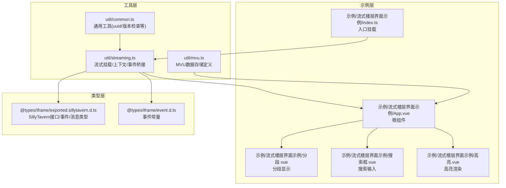
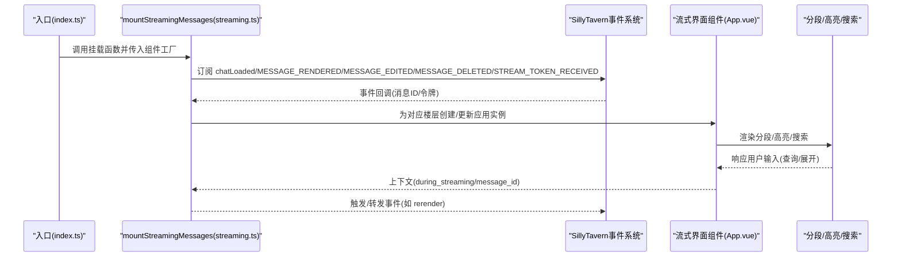
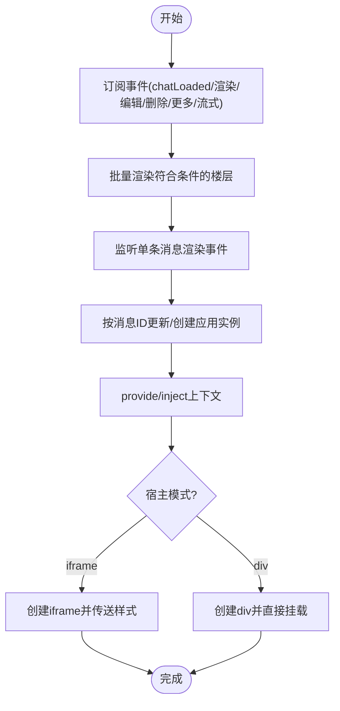
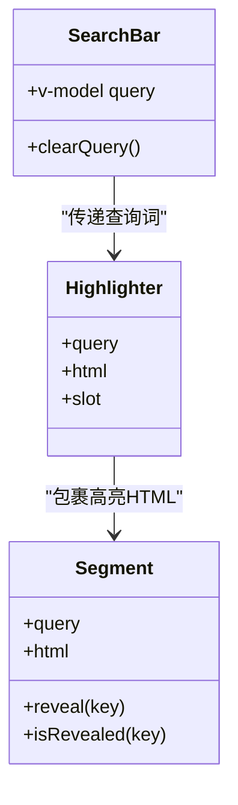
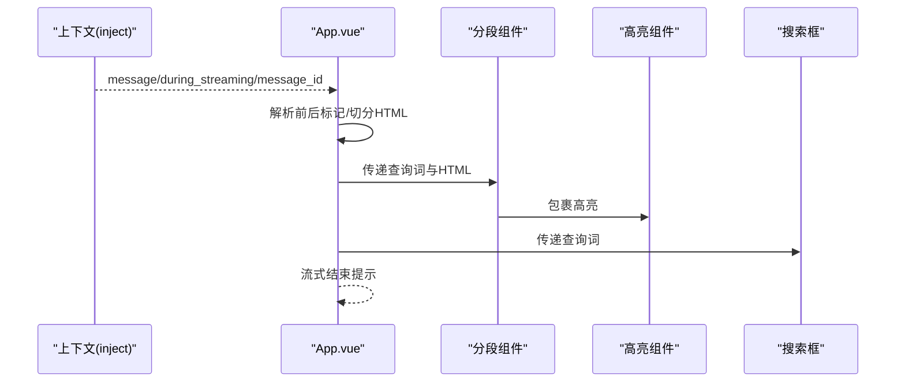
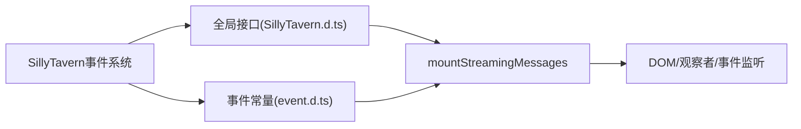
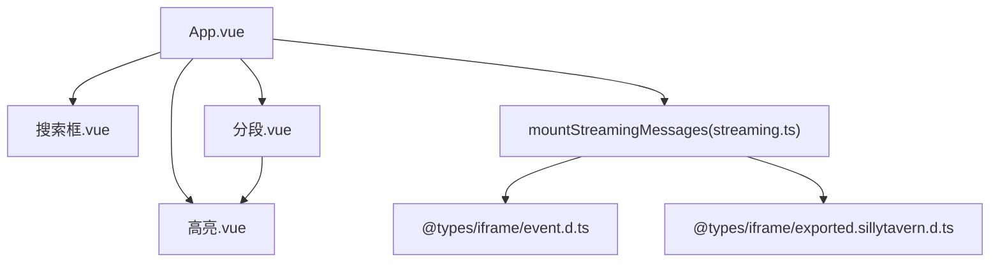

# 流式界面支持

<cite>
**本文引用的文件**   
- [util/streaming.ts](file://util/streaming.ts)
- [示例/流式楼层界面示例/index.ts](file://示例/流式楼层界面示例/index.ts)
- [示例/流式楼层界面示例/App.vue](file://示例/流式楼层界面示例/App.vue)
- [示例/流式楼层界面示例/分段.vue](file://示例/流式楼层界面示例/分段.vue)
- [示例/流式楼层界面示例/搜索框.vue](file://示例/流式楼层界面示例/搜索框.vue)
- [示例/流式楼层界面示例/高亮.vue](file://示例/流式楼层界面示例/高亮.vue)
- [@types/iframe/exported.sillytavern.d.ts](file://@types/iframe/exported.sillytavern.d.ts)
- [@types/iframe/event.d.ts](file://@types/iframe/event.d.ts)
- [util/mvu.ts](file://util/mvu.ts)
- [util/common.ts](file://util/common.ts)
</cite>

## 目录
1. [简介](#简介)
2. [项目结构](#项目结构)
3. [核心组件](#核心组件)
4. [架构总览](#架构总览)
5. [组件详解](#组件详解)
6. [依赖关系分析](#依赖关系分析)
7. [性能考量](#性能考量)
8. [故障排查指南](#故障排查指南)
9. [结论](#结论)
10. [附录：完整开发示例](#附录完整开发示例)

## 简介
本技术文档围绕“流式界面支持系统”展开，目标是帮助开发者在 SillyTavern 的聊天楼层中，为正在流式生成的消息提供可交互、可扩展的自定义界面。文档覆盖以下主题：
- 流式消息处理架构的设计理念与实现方式（消息上下文注入、实时更新、搜索与高亮）
- 流式界面组件结构（分段显示、搜索框、高亮组件）的功能与使用方法
- 与 SillyTavern 流式消息系统的集成（消息监听、上下文管理、生命周期控制）
- 自定义流式界面组件的完整开发示例
- 性能优化建议、兼容性考虑与调试技巧

## 项目结构
与流式界面支持直接相关的代码主要分布在以下位置：
- 工具层：提供流式挂载、上下文注入、样式注入与事件桥接
- 示例层：演示如何基于工具层构建完整的流式界面组件树
- 类型层：声明 SillyTavern 的事件、消息类型与全局接口
- 状态层：提供 MVU 数据存储能力，便于与变量系统联动

图示来源
- [util/streaming.ts:1-238](file://util/streaming.ts#L1-L238)
- [示例/流式楼层界面示例/index.ts:1-8](file://示例/流式楼层界面示例/index.ts#L1-L8)
- [@types/iframe/exported.sillytavern.d.ts:1-698](file://@types/iframe/exported.sillytavern.d.ts#L1-L698)
- [@types/iframe/event.d.ts:216-276](file://@types/iframe/event.d.ts#L216-L276)

章节来源
- [util/streaming.ts:1-238](file://util/streaming.ts#L1-L238)
- [示例/流式楼层界面示例/index.ts:1-8](file://示例/流式楼层界面示例/index.ts#L1-L8)
- [@types/iframe/exported.sillytavern.d.ts:1-698](file://@types/iframe/exported.sillytavern.d.ts#L1-L698)
- [@types/iframe/event.d.ts:216-276](file://@types/iframe/event.d.ts#L216-L276)

## 核心组件
- 流式消息上下文注入
  - 通过 provide/inject 机制向子组件注入当前楼层的流式上下文，包含 prefix、host_id、message_id、message、during_streaming 等字段，供子组件决定渲染策略与行为。
- 流式界面挂载器
  - mountStreamingMessages 负责：
    - 隐藏原生楼层文本，插入独立容器（mes_streaming），并在其下挂载 Vue 应用
    - 支持 iframe 与 div 两种宿主模式；iframe 可隔离样式，div 则继承宿主样式
    - 基于 SillyTavern 事件系统监听消息渲染、编辑、删除、更多消息加载、流式令牌到达等事件，动态增删改对应楼层的流式界面
    - 提供统一的卸载函数，清理 DOM、观察者与事件监听
- 搜索与高亮
  - 搜索框组件提供关键词输入与清空
  - 高亮组件基于第三方库对 HTML 片段进行关键词高亮
  - 分段组件支持按行拆分、点击展开、模糊遮罩等交互

章节来源
- [util/streaming.ts:5-19](file://util/streaming.ts#L5-L19)
- [util/streaming.ts:41-238](file://util/streaming.ts#L41-L238)
- [示例/流式楼层界面示例/搜索框.vue:1-95](file://示例/流式楼层界面示例/搜索框.vue#L1-L95)
- [示例/流式楼层界面示例/高亮.vue:1-20](file://示例/流式楼层界面示例/高亮.vue#L1-L20)
- [示例/流式楼层界面示例/分段.vue:1-79](file://示例/流式楼层界面示例/分段.vue#L1-L79)

## 架构总览
下图展示了从挂载入口到组件渲染、事件驱动更新以及与 SillyTavern 的集成路径。

图示来源
- [util/streaming.ts:188-238](file://util/streaming.ts#L188-L238)
- [示例/流式楼层界面示例/index.ts:1-8](file://示例/流式楼层界面示例/index.ts#L1-L8)
- [@types/iframe/event.d.ts:216-276](file://@types/iframe/event.d.ts#L216-L276)

## 组件详解

### 流式挂载与上下文注入
- 设计要点
  - 使用 provide/inject 在每个楼层的 Vue 应用实例中注入只读上下文，避免跨组件传递样板代码
  - 通过唯一前缀(prefix)与 message_id 组合生成宿主元素 ID，确保多楼层并存时互不干扰
  - 支持 iframe 与 div 两种宿主模式：iframe 隔离样式，div 继承样式但需注意类名冲突
- 生命周期与事件
  - chatLoaded：首次加载时批量渲染所有符合条件的楼层
  - CHARACTER_MESSAGE_RENDERED：单条消息渲染或重渲染时更新对应楼层
  - MESSAGE_EDITED/MESSAGE_DELETED：编辑或删除后重建对应楼层
  - MORE_MESSAGES_LOADED/MESSAGE_DELETED：延迟重渲染，保证 DOM 结构稳定
  - STREAM_TOKEN_RECEIVED：实时接收流式令牌，增量更新当前楼层
- DOM 与样式
  - 隐藏原生 .mes_text，并在 .mes_streaming 下插入宿主容器
  - iframe 模式在 load 事件后将样式传送至 iframe head，确保组件样式生效
  - 编辑态检测：当进入编辑区域时自动切换显示/隐藏，保证编辑功能可用

图示来源
- [util/streaming.ts:41-127](file://util/streaming.ts#L41-L127)
- [util/streaming.ts:164-186](file://util/streaming.ts#L164-L186)

章节来源
- [util/streaming.ts:5-19](file://util/streaming.ts#L5-L19)
- [util/streaming.ts:41-127](file://util/streaming.ts#L41-L127)
- [util/streaming.ts:164-186](file://util/streaming.ts#L164-L186)

### 搜索与高亮组件
- 搜索框(SearchBar)
  - 提供 v-model 双向绑定的查询词
  - 支持清空查询、回车 ESC 快捷键
  - 样式采用主题色系，聚焦态增强视觉反馈
- 高亮组件(Highlighter)
  - 基于第三方库对 HTML 进行关键词高亮
  - 使用全局样式类名避免与宿主 mark 冲突
- 分段组件(Segment)
  - 将 HTML 按行切分为片段，支持点击展开与模糊遮罩
  - 通过计算属性维护展开状态集合，避免重复渲染

图示来源
- [示例/流式楼层界面示例/搜索框.vue:1-95](file://示例/流式楼层界面示例/搜索框.vue#L1-L95)
- [示例/流式楼层界面示例/高亮.vue:1-20](file://示例/流式楼层界面示例/高亮.vue#L1-L20)
- [示例/流式楼层界面示例/分段.vue:1-79](file://示例/流式楼层界面示例/分段.vue#L1-L79)

章节来源
- [示例/流式楼层界面示例/搜索框.vue:1-95](file://示例/流式楼层界面示例/搜索框.vue#L1-L95)
- [示例/流式楼层界面示例/高亮.vue:1-20](file://示例/流式楼层界面示例/高亮.vue#L1-L20)
- [示例/流式楼层界面示例/分段.vue:1-79](file://示例/流式楼层界面示例/分段.vue#L1-L79)

### 根组件与消息切分
- 根组件(App.vue)
  - 通过 inject 获取上下文，基于 message 的特定标记进行前后段落切分
  - 使用格式化函数将消息内容转换为可渲染的 HTML
  - 监听 during_streaming 变化，在流式结束时提示用户
  - 通过条件渲染组合分段、高亮与角色扮演选项组件

图示来源
- [示例/流式楼层界面示例/App.vue:16-71](file://示例/流式楼层界面示例/App.vue#L16-L71)
- [util/streaming.ts:17-19](file://util/streaming.ts#L17-L19)

章节来源
- [示例/流式楼层界面示例/App.vue:16-71](file://示例/流式楼层界面示例/App.vue#L16-L71)
- [util/streaming.ts:17-19](file://util/streaming.ts#L17-L19)

### 与 SillyTavern 的集成
- 事件集成
  - 通过 SillyTavern.eventSource.on/once/makeFirst 等 API 订阅消息渲染、编辑、删除、更多消息加载、流式令牌到达等事件
  - 在事件回调中调用渲染/销毁逻辑，确保与页面状态同步
- 类型与接口
  - 通过 @types/iframe/exported.sillytavern.d.ts 获取消息结构、事件常量与全局接口
  - 通过 @types/iframe/event.d.ts 获取事件枚举，保证事件名一致性
- 生命周期控制
  - 页面卸载时调用 unmount，释放 DOM、观察者与事件监听，防止内存泄漏

图示来源
- [@types/iframe/event.d.ts:216-276](file://@types/iframe/event.d.ts#L216-L276)
- [@types/iframe/exported.sillytavern.d.ts:382-698](file://@types/iframe/exported.sillytavern.d.ts#L382-L698)
- [util/streaming.ts:188-238](file://util/streaming.ts#L188-L238)

章节来源
- [@types/iframe/event.d.ts:216-276](file://@types/iframe/event.d.ts#L216-L276)
- [@types/iframe/exported.sillytavern.d.ts:382-698](file://@types/iframe/exported.sillytavern.d.ts#L382-L698)
- [util/streaming.ts:188-238](file://util/streaming.ts#L188-L238)

## 依赖关系分析
- 组件耦合
  - App.vue 依赖搜索框、分段、高亮组件，形成清晰的组合关系
  - 分段组件依赖高亮组件，形成嵌套渲染链
- 外部依赖
  - 高亮组件依赖第三方库进行关键词高亮
  - 事件系统依赖 SillyTavern 的事件常量与全局接口
- 潜在循环依赖
  - 当前结构为单向依赖（App -> 子组件），未发现循环依赖
- 兼容性
  - 通过通用工具函数与类型声明，降低对具体版本的耦合

图示来源
- [示例/流式楼层界面示例/App.vue:16-71](file://示例/流式楼层界面示例/App.vue#L16-L71)
- [示例/流式楼层界面示例/分段.vue:1-79](file://示例/流式楼层界面示例/分段.vue#L1-L79)
- [示例/流式楼层界面示例/搜索框.vue:1-95](file://示例/流式楼层界面示例/搜索框.vue#L1-L95)
- [示例/流式楼层界面示例/高亮.vue:1-20](file://示例/流式楼层界面示例/高亮.vue#L1-L20)
- [util/streaming.ts:41-127](file://util/streaming.ts#L41-L127)
- [@types/iframe/event.d.ts:216-276](file://@types/iframe/event.d.ts#L216-L276)
- [@types/iframe/exported.sillytavern.d.ts:382-698](file://@types/iframe/exported.sillytavern.d.ts#L382-L698)

章节来源
- [示例/流式楼层界面示例/App.vue:16-71](file://示例/流式楼层界面示例/App.vue#L16-L71)
- [util/streaming.ts:41-127](file://util/streaming.ts#L41-L127)
- [@types/iframe/event.d.ts:216-276](file://@types/iframe/event.d.ts#L216-L276)
- [@types/iframe/exported.sillytavern.d.ts:382-698](file://@types/iframe/exported.sillytavern.d.ts#L382-L698)

## 性能考量
- 渲染策略
  - 批量渲染与按需更新结合：chatLoaded 时批量渲染，后续事件按消息 ID 单点更新，减少不必要的重绘
  - 使用响应式上下文与计算属性，避免重复解析 HTML
- DOM 与样式
  - iframe 模式可隔离样式，减少对宿主的影响；div 模式需谨慎使用类名，避免与 .mes_text 冲突
  - 通过样式传送机制在 iframe 模式下确保组件样式生效
- 事件与观察者
  - 编辑态检测使用 MutationObserver，仅在必要时切换显示/隐藏，避免频繁 DOM 操作
- 资源管理
  - 提供统一卸载函数，释放观察者与事件监听，防止内存泄漏

## 故障排查指南
- 常见问题
  - 楼层未显示：确认是否正确隐藏 .mes_text 并插入 .mes_streaming 容器
  - 样式异常：iframe 模式下检查样式传送是否完成；div 模式下避免使用 .mes_text 类名
  - 事件未触发：检查事件常量与订阅顺序，确保在 chatLoaded 后再订阅渲染事件
  - 高亮无效：确认高亮组件的 HTML 输入与查询词传递无误
- 调试技巧
  - 在流式结束时弹出提示，辅助定位渲染完成时机
  - 使用浏览器开发者工具观察 DOM 结构与事件回调
  - 在卸载时打印日志，验证资源回收是否正常

章节来源
- [util/streaming.ts:108-162](file://util/streaming.ts#L108-L162)
- [util/streaming.ts:224-238](file://util/streaming.ts#L224-L238)
- [示例/流式楼层界面示例/App.vue:60-71](file://示例/流式楼层界面示例/App.vue#L60-L71)

## 结论
流式界面支持系统通过“上下文注入 + 事件驱动 + 组件组合”的架构，实现了对 SillyTavern 楼层的无缝扩展。借助 mountStreamingMessages，开发者可以在不破坏原生体验的前提下，为流式消息提供丰富的交互能力。配合搜索与高亮组件，用户能够更高效地浏览与检索长文本内容。通过合理的生命周期管理与样式隔离策略，系统在功能与性能之间取得了良好平衡。

## 附录：完整开发示例
- 入口挂载
  - 在页面就绪后调用挂载函数，传入组件工厂与可选配置（宿主模式、过滤器、前缀）
  - 页面卸载时调用返回的卸载函数
- 组件开发步骤
  - 在根组件中注入上下文，基于 message 与 during_streaming 控制渲染
  - 使用搜索框组件收集查询词，传递给高亮组件
  - 使用分段组件对长文本进行分段与展开控制
  - 在流式结束后给出用户提示，提升交互体验

章节来源
- [示例/流式楼层界面示例/index.ts:1-8](file://示例/流式楼层界面示例/index.ts#L1-L8)
- [示例/流式楼层界面示例/App.vue:16-71](file://示例/流式楼层界面示例/App.vue#L16-L71)
- [util/streaming.ts:41-127](file://util/streaming.ts#L41-L127)