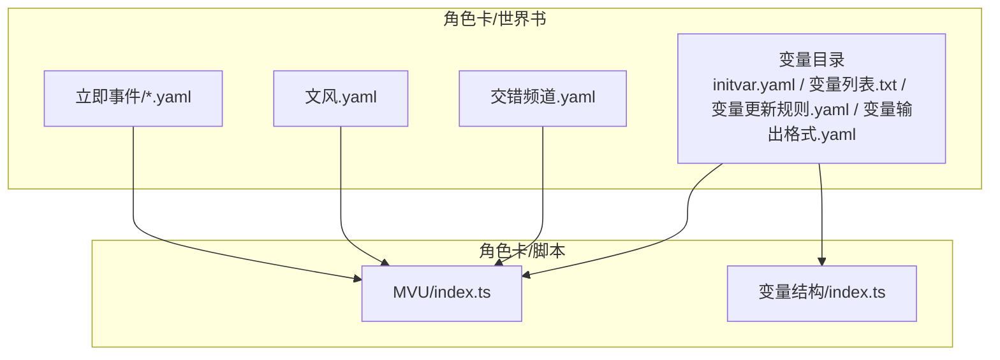
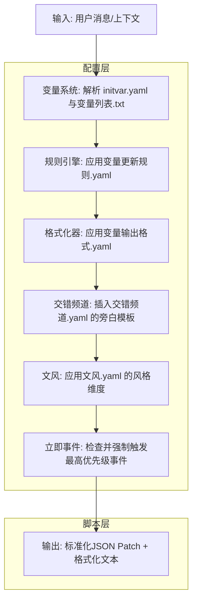
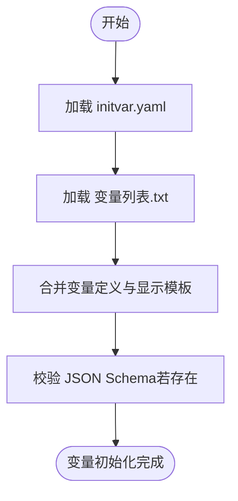
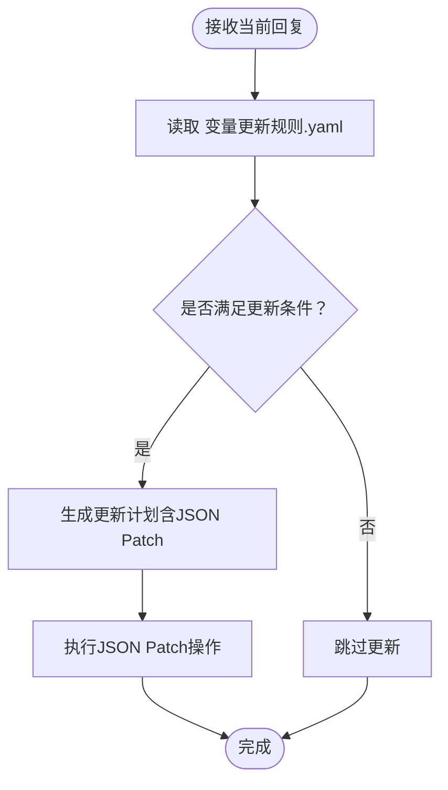
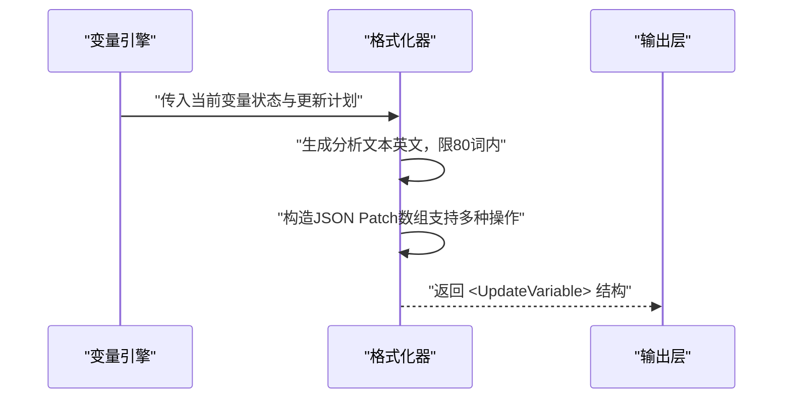
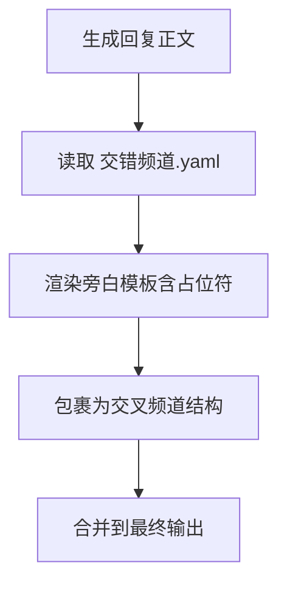
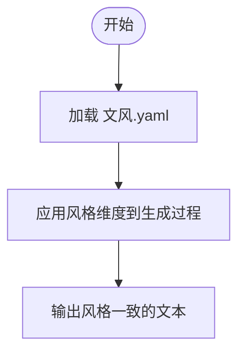
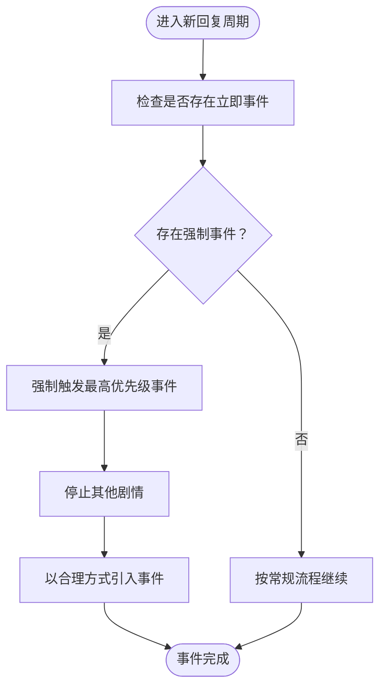
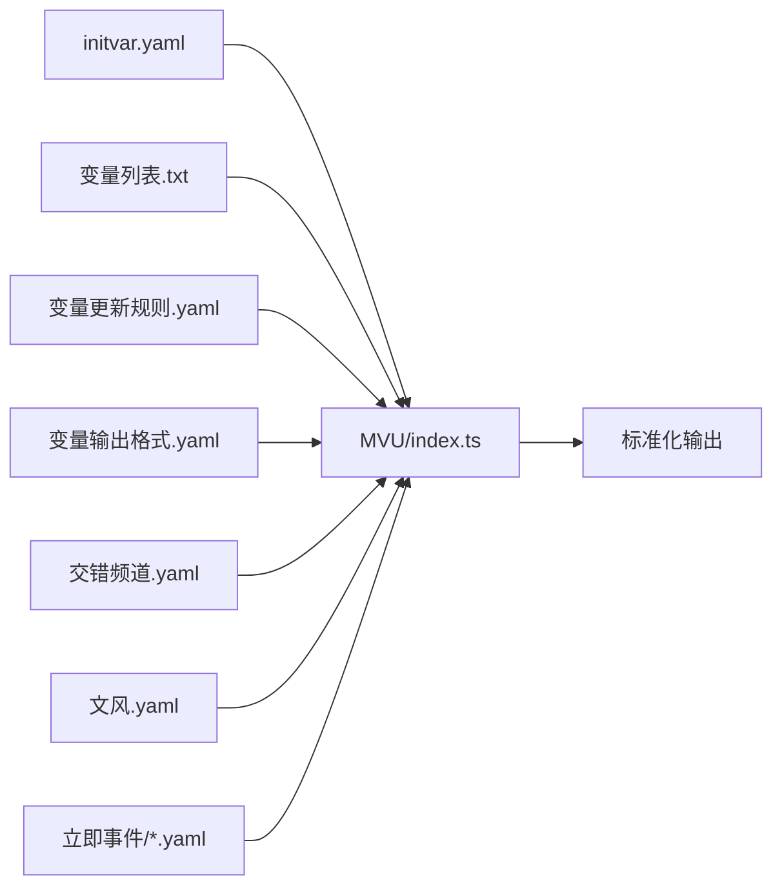

# 世界书系统

<cite>
**本文引用的文件**
- [示例/角色卡示例/世界书/变量/initvar.yaml](file://示例/角色卡示例/世界书/变量/initvar.yaml)
- [示例/角色卡示例/世界书/变量/变量列表.txt](file://示例/角色卡示例/世界书/变量/变量列表.txt)
- [示例/角色卡示例/世界书/变量/变量更新规则.yaml](file://示例/角色卡示例/世界书/变量/变量更新规则.yaml)
- [示例/角色卡示例/世界书/变量/变量输出格式.yaml](file://示例/角色卡示例/世界书/变量/变量输出格式.yaml)
- [示例/角色卡示例/世界书/交错频道.yaml](file://示例/角色卡示例/世界书/交错频道.yaml)
- [示例/角色卡示例/世界书/文风.yaml](file://示例/角色卡示例/世界书/文风.yaml)
- [示例/角色卡示例/世界书/立即事件/冲动啊，请平息吧.yaml](file://示例/角色卡示例/世界书/立即事件/冲动啊，请平息吧.yaml)
- [示例/角色卡示例/世界书/立即事件/理性啊，请不要冻结.yaml](file://示例/角色卡示例/世界书/立即事件/理性啊，请不要冻结.yaml)
- [初始模板/角色卡/新建为src文件夹中的文件夹/世界书/变量/initvar.yaml](file://初始模板/角色卡/新建为src文件夹中的文件夹/世界书/变量/initvar.yaml)
- [初始模板/角色卡/新建为src文件夹中的文件夹/世界书/变量/变量列表.txt](file://初始模板/角色卡/新建为src文件夹中的文件夹/世界书/变量/变量列表.txt)
- [初始模板/角色卡/新建为src文件夹中的文件夹/世界书/变量/变量更新规则.yaml](file://初始模板/角色卡/新建为src文件夹中的文件夹/世界书/变量/变量更新规则.yaml)
- [初始模板/角色卡/新建为src文件夹中的文件夹/世界书/变量/变量输出格式.yaml](file://初始模板/角色卡/新建为src文件夹中的文件夹/世界书/变量/变量输出格式.yaml)
</cite>

## 目录
1. [简介](#简介)
2. [项目结构](#项目结构)
3. [核心组件](#核心组件)
4. [架构总览](#架构总览)
5. [详细组件分析](#详细组件分析)
6. [依赖分析](#依赖分析)
7. [性能考量](#性能考量)
8. [故障排查指南](#故障排查指南)
9. [结论](#结论)
10. [附录](#附录)

## 简介
本技术文档面向“世界书系统”，系统围绕“变量定义—初始化—更新规则—输出格式化—交错频道—文风—立即事件”等模块构建，旨在为角色卡提供可配置、可扩展、可自动化的变量管理与行为控制能力。本文档将从架构、数据流、处理逻辑、集成点、错误处理与性能特性等方面进行深入解析，并给出可视化图示与实践建议。

## 项目结构
世界书系统的关键文件集中在“角色卡/世界书/变量”目录下，配合“交错频道.yaml”“文风.yaml”“立即事件/*.yaml”等文件共同构成变量系统的工作闭环。示例与初始模板提供了两套可对照的实现形态，便于理解配置差异与演进路径。

图表来源
- [示例/角色卡示例/世界书/变量/initvar.yaml:1-4](file://示例/角色卡示例/世界书/变量/initvar.yaml#L1-L4)
- [示例/角色卡示例/世界书/变量/变量列表.txt:1-5](file://示例/角色卡示例/世界书/变量/变量列表.txt#L1-L5)
- [示例/角色卡示例/世界书/变量/变量更新规则.yaml:1-3](file://示例/角色卡示例/世界书/变量/变量更新规则.yaml#L1-L3)
- [示例/角色卡示例/世界书/变量/变量输出格式.yaml:1-32](file://示例/角色卡示例/世界书/变量/变量输出格式.yaml#L1-L32)
- [示例/角色卡示例/世界书/交错频道.yaml:1-12](file://示例/角色卡示例/世界书/交错频道.yaml#L1-L12)
- [示例/角色卡示例/世界书/文风.yaml:1-98](file://示例/角色卡示例/世界书/文风.yaml#L1-L98)
- [示例/角色卡示例/世界书/立即事件/冲动啊，请平息吧.yaml:1-16](file://示例/角色卡示例/世界书/立即事件/冲动啊，请平息吧.yaml#L1-L16)
- [示例/角色卡示例/世界书/立即事件/理性啊，请不要冻结.yaml:1-17](file://示例/角色卡示例/世界书/立即事件/理性啊，请不要冻结.yaml#L1-L17)

章节来源
- [示例/角色卡示例/世界书/变量/initvar.yaml:1-4](file://示例/角色卡示例/世界书/变量/initvar.yaml#L1-L4)
- [示例/角色卡示例/世界书/变量/变量列表.txt:1-5](file://示例/角色卡示例/世界书/变量/变量列表.txt#L1-L5)
- [示例/角色卡示例/世界书/变量/变量更新规则.yaml:1-3](file://示例/角色卡示例/世界书/变量/变量更新规则.yaml#L1-L3)
- [示例/角色卡示例/世界书/变量/变量输出格式.yaml:1-32](file://示例/角色卡示例/世界书/变量/变量输出格式.yaml#L1-L32)
- [示例/角色卡示例/世界书/交错频道.yaml:1-12](file://示例/角色卡示例/世界书/交错频道.yaml#L1-L12)
- [示例/角色卡示例/世界书/文风.yaml:1-98](file://示例/角色卡示例/世界书/文风.yaml#L1-L98)
- [示例/角色卡示例/世界书/立即事件/冲动啊，请平息吧.yaml:1-16](file://示例/角色卡示例/世界书/立即事件/冲动啊，请平息吧.yaml#L1-L16)
- [示例/角色卡示例/世界书/立即事件/理性啊，请不要冻结.yaml:1-17](file://示例/角色卡示例/世界书/立即事件/理性啊，请不要冻结.yaml#L1-L17)

## 核心组件
- 变量定义与初始化：通过 initvar.yaml 与变量列表.txt 描述变量集合与默认值，形成变量模型。
- 变量更新规则：通过变量更新规则.yaml 描述变量在不同情境下的更新策略与约束。
- 变量输出格式化：通过变量输出格式.yaml 定义最终输出的结构与JSON Patch操作规范。
- 交错频道：通过交错频道.yaml 提供跨频道的旁白式输出模板，用于在回复中插入特定格式的交叉信息。
- 文风：通过文风.yaml 定义叙述风格维度与参数，指导文本生成的风格一致性。
- 立即事件：通过立即事件/*.yaml 定义高优先级、强制触发的剧情事件，覆盖常规流程。

章节来源
- [示例/角色卡示例/世界书/变量/initvar.yaml:1-4](file://示例/角色卡示例/世界书/变量/initvar.yaml#L1-L4)
- [示例/角色卡示例/世界书/变量/变量列表.txt:1-5](file://示例/角色卡示例/世界书/变量/变量列表.txt#L1-L5)
- [示例/角色卡示例/世界书/变量/变量更新规则.yaml:1-3](file://示例/角色卡示例/世界书/变量/变量更新规则.yaml#L1-L3)
- [示例/角色卡示例/世界书/变量/变量输出格式.yaml:1-32](file://示例/角色卡示例/世界书/变量/变量输出格式.yaml#L1-L32)
- [示例/角色卡示例/世界书/交错频道.yaml:1-12](file://示例/角色卡示例/世界书/交错频道.yaml#L1-L12)
- [示例/角色卡示例/世界书/文风.yaml:1-98](file://示例/角色卡示例/世界书/文风.yaml#L1-L98)
- [示例/角色卡示例/世界书/立即事件/冲动啊，请平息吧.yaml:1-16](file://示例/角色卡示例/世界书/立即事件/冲动啊，请平息吧.yaml#L1-L16)
- [示例/角色卡示例/世界书/立即事件/理性啊，请不要冻结.yaml:1-17](file://示例/角色卡示例/世界书/立即事件/理性啊，请不要冻结.yaml#L1-L17)

## 架构总览
世界书系统采用“配置驱动 + 输出模板 + 事件覆盖”的架构。变量系统通过 YAML 配置描述变量模型与更新规则，脚本层负责解析与执行，最终以标准化的输出格式返回给角色卡渲染或聊天引擎。

图表来源
- [示例/角色卡示例/世界书/变量/initvar.yaml:1-4](file://示例/角色卡示例/世界书/变量/initvar.yaml#L1-L4)
- [示例/角色卡示例/世界书/变量/变量列表.txt:1-5](file://示例/角色卡示例/世界书/变量/变量列表.txt#L1-L5)
- [示例/角色卡示例/世界书/变量/变量更新规则.yaml:1-3](file://示例/角色卡示例/世界书/变量/变量更新规则.yaml#L1-L3)
- [示例/角色卡示例/世界书/变量/变量输出格式.yaml:1-32](file://示例/角色卡示例/世界书/变量/变量输出格式.yaml#L1-L32)
- [示例/角色卡示例/世界书/交错频道.yaml:1-12](file://示例/角色卡示例/世界书/交错频道.yaml#L1-L12)
- [示例/角色卡示例/世界书/文风.yaml:1-98](file://示例/角色卡示例/世界书/文风.yaml#L1-L98)
- [示例/角色卡示例/世界书/立即事件/冲动啊，请平息吧.yaml:1-16](file://示例/角色卡示例/世界书/立即事件/冲动啊，请平息吧.yaml#L1-L16)
- [示例/角色卡示例/世界书/立即事件/理性啊，请不要冻结.yaml:1-17](file://示例/角色卡示例/世界书/立即事件/理性啊，请不要冻结.yaml#L1-L17)

## 详细组件分析

### 变量定义与初始化
- initvar.yaml：作为变量模型的入口，提供 JSON Schema 校验提示与占位结构，便于后续填充变量定义。
- 变量列表.txt：定义变量的显示模板与占位符，支持嵌套格式化函数，用于在界面或输出中呈现变量状态。
- 初始模板 vs 示例：两者均提供相同结构的文件，示例文件更完整，适合直接参考；初始模板提供最小可用骨架。

图表来源
- [示例/角色卡示例/世界书/变量/initvar.yaml:1-4](file://示例/角色卡示例/世界书/变量/initvar.yaml#L1-L4)
- [示例/角色卡示例/世界书/变量/变量列表.txt:1-5](file://示例/角色卡示例/世界书/变量/变量列表.txt#L1-L5)
- [初始模板/角色卡/新建为src文件夹中的文件夹/世界书/变量/initvar.yaml:1-4](file://初始模板/角色卡/新建为src文件夹中的文件夹/世界书/变量/initvar.yaml#L1-L4)
- [初始模板/角色卡/新建为src文件夹中的文件夹/世界书/变量/变量列表.txt:1-5](file://初始模板/角色卡/新建为src文件夹中的文件夹/世界书/变量/变量列表.txt#L1-L5)

章节来源
- [示例/角色卡示例/世界书/变量/initvar.yaml:1-4](file://示例/角色卡示例/世界书/变量/initvar.yaml#L1-L4)
- [示例/角色卡示例/世界书/变量/变量列表.txt:1-5](file://示例/角色卡示例/世界书/变量/变量列表.txt#L1-L5)
- [初始模板/角色卡/新建为src文件夹中的文件夹/世界书/变量/initvar.yaml:1-4](file://初始模板/角色卡/新建为src文件夹中的文件夹/世界书/变量/initvar.yaml#L1-L4)
- [初始模板/角色卡/新建为src文件夹中的文件夹/世界书/变量/变量列表.txt:1-5](file://初始模板/角色卡/新建为src文件夹中的文件夹/世界书/变量/变量列表.txt#L1-L5)

### 变量更新规则
- 变量更新规则.yaml：定义变量在不同情境下的更新策略，包括检查条件、更新时机与优先级等。该文件为空占位，实际规则需按业务需求填充。

图表来源
- [示例/角色卡示例/世界书/变量/变量更新规则.yaml:1-3](file://示例/角色卡示例/世界书/变量/变量更新规则.yaml#L1-L3)

章节来源
- [示例/角色卡示例/世界书/变量/变量更新规则.yaml:1-3](file://示例/角色卡示例/世界书/变量/变量更新规则.yaml#L1-L3)

### 变量输出格式化
- 变量输出格式.yaml：定义输出规则与JSON Patch操作规范，确保变量更新结果以标准结构返回，支持替换、增量、插入、删除、移动等操作，并明确只读字段的保护。
- 输出模板：包含“分析”与“JSONPatch”两部分，分析部分用于解释更新动机与依据，JSONPatch部分用于精确描述变量变更。

图表来源
- [示例/角色卡示例/世界书/变量/变量输出格式.yaml:1-32](file://示例/角色卡示例/世界书/变量/变量输出格式.yaml#L1-L32)

章节来源
- [示例/角色卡示例/世界书/变量/变量输出格式.yaml:1-32](file://示例/角色卡示例/世界书/变量/变量输出格式.yaml#L1-L32)

### 交错频道
- 交错频道.yaml：提供跨频道旁白式输出模板，用于在回复中插入特定格式的交叉信息，增强叙事层次与角色互动的多维性。

图表来源
- [示例/角色卡示例/世界书/交错频道.yaml:1-12](file://示例/角色卡示例/世界书/交错频道.yaml#L1-L12)

章节来源
- [示例/角色卡示例/世界书/交错频道.yaml:1-12](file://示例/角色卡示例/世界书/交错频道.yaml#L1-L12)

### 文风
- 文风.yaml：定义叙述风格的多个维度（词汇丰富度、句式节奏、情感倾向、感官细节等），用于指导生成文本的风格一致性，确保角色表达符合预设的人设与情境。

图表来源
- [示例/角色卡示例/世界书/文风.yaml:1-98](file://示例/角色卡示例/世界书/文风.yaml#L1-L98)

章节来源
- [示例/角色卡示例/世界书/文风.yaml:1-98](file://示例/角色卡示例/世界书/文风.yaml#L1-L98)

### 立即事件
- 立即事件/*.yaml：定义高优先级、强制触发的剧情事件，覆盖常规流程，要求以合理方式引入事件并停止其他剧情。事件包含描述、进程、要求与规则四部分，确保可控与可解释。

图表来源
- [示例/角色卡示例/世界书/立即事件/冲动啊，请平息吧.yaml:1-16](file://示例/角色卡示例/世界书/立即事件/冲动啊，请平息吧.yaml#L1-L16)
- [示例/角色卡示例/世界书/立即事件/理性啊，请不要冻结.yaml:1-17](file://示例/角色卡示例/世界书/立即事件/理性啊，请不要冻结.yaml#L1-L17)

章节来源
- [示例/角色卡示例/世界书/立即事件/冲动啊，请平息吧.yaml:1-16](file://示例/角色卡示例/世界书/立即事件/冲动啊，请平息吧.yaml#L1-L16)
- [示例/角色卡示例/世界书/立即事件/理性啊，请不要冻结.yaml:1-17](file://示例/角色卡示例/世界书/立即事件/理性啊，请不要冻结.yaml#L1-L17)

## 依赖分析
- 配置依赖：变量系统依赖于 initvar.yaml、变量列表.txt、变量更新规则.yaml、变量输出格式.yaml 的协同工作；交错频道.yaml 与文风.yaml 作为附加配置影响输出形态；立即事件/*.yaml 作为外部触发源影响流程走向。
- 脚本依赖：MVU/index.ts 与变量结构/index.ts 作为脚本层，负责解析配置、执行更新与格式化输出。
- 数据耦合：变量输出格式.yaml 与 JSON Patch 规范耦合，确保更新操作的标准化与可追踪性。

图表来源
- [示例/角色卡示例/世界书/变量/initvar.yaml:1-4](file://示例/角色卡示例/世界书/变量/initvar.yaml#L1-L4)
- [示例/角色卡示例/世界书/变量/变量列表.txt:1-5](file://示例/角色卡示例/世界书/变量/变量列表.txt#L1-L5)
- [示例/角色卡示例/世界书/变量/变量更新规则.yaml:1-3](file://示例/角色卡示例/世界书/变量/变量更新规则.yaml#L1-L3)
- [示例/角色卡示例/世界书/变量/变量输出格式.yaml:1-32](file://示例/角色卡示例/世界书/变量/变量输出格式.yaml#L1-L32)
- [示例/角色卡示例/世界书/交错频道.yaml:1-12](file://示例/角色卡示例/世界书/交错频道.yaml#L1-L12)
- [示例/角色卡示例/世界书/文风.yaml:1-98](file://示例/角色卡示例/世界书/文风.yaml#L1-L98)
- [示例/角色卡示例/世界书/立即事件/冲动啊，请平息吧.yaml:1-16](file://示例/角色卡示例/世界书/立即事件/冲动啊，请平息吧.yaml#L1-L16)
- [示例/角色卡示例/世界书/立即事件/理性啊，请不要冻结.yaml:1-17](file://示例/角色卡示例/世界书/立即事件/理性啊，请不要冻结.yaml#L1-L17)

章节来源
- [示例/角色卡示例/世界书/变量/initvar.yaml:1-4](file://示例/角色卡示例/世界书/变量/initvar.yaml#L1-L4)
- [示例/角色卡示例/世界书/变量/变量列表.txt:1-5](file://示例/角色卡示例/世界书/变量/变量列表.txt#L1-L5)
- [示例/角色卡示例/世界书/变量/变量更新规则.yaml:1-3](file://示例/角色卡示例/世界书/变量/变量更新规则.yaml#L1-L3)
- [示例/角色卡示例/世界书/变量/变量输出格式.yaml:1-32](file://示例/角色卡示例/世界书/变量/变量输出格式.yaml#L1-L32)
- [示例/角色卡示例/世界书/交错频道.yaml:1-12](file://示例/角色卡示例/世界书/交错频道.yaml#L1-L12)
- [示例/角色卡示例/世界书/文风.yaml:1-98](file://示例/角色卡示例/世界书/文风.yaml#L1-L98)
- [示例/角色卡示例/世界书/立即事件/冲动啊，请平息吧.yaml:1-16](file://示例/角色卡示例/世界书/立即事件/冲动啊，请平息吧.yaml#L1-L16)
- [示例/角色卡示例/世界书/立即事件/理性啊，请不要冻结.yaml:1-17](file://示例/角色卡示例/世界书/立即事件/理性啊，请不要冻结.yaml#L1-L17)

## 性能考量
- 配置解析：YAML 文件规模与嵌套深度直接影响解析与校验成本，建议保持结构扁平化与键名简洁。
- 输出格式化：JSON Patch 数组长度与操作复杂度影响序列化与传输开销，建议批量合并更新，减少操作次数。
- 交错频道与文风：模板渲染与风格维度应用会增加计算量，建议缓存常用模板与风格参数。
- 立即事件：强制触发会打断常规流程，应尽量缩短事件处理链路，避免重复计算。

## 故障排查指南
- initvar.yaml 校验失败：检查 JSON Schema 路径与文件完整性，确保编辑器启用语言服务器校验。
- 变量未生效：确认变量列表.txt 中的占位符与变量模型一致，检查只读字段前缀与输出格式化规则。
- 更新规则不触发：核对变量更新规则.yaml 的条件表达式与上下文匹配，确保事件优先级与强制规则正确。
- 输出格式异常：检查变量输出格式.yaml 的 JSON Patch 语法与路径合法性，避免对只读字段进行写操作。
- 交错频道不显示：确认交错频道.yaml 的模板结构与包裹标签正确，检查渲染占位符是否被正确替换。
- 文风不一致：核对文风.yaml 的维度参数与生成器设置，确保风格维度在生成阶段被正确应用。
- 立即事件未触发：检查立即事件/*.yaml 的规则与优先级，确认事件引入方式与上下文触发条件。

章节来源
- [示例/角色卡示例/世界书/变量/变量输出格式.yaml:1-32](file://示例/角色卡示例/世界书/变量/变量输出格式.yaml#L1-L32)
- [示例/角色卡示例/世界书/交错频道.yaml:1-12](file://示例/角色卡示例/世界书/交错频道.yaml#L1-L12)
- [示例/角色卡示例/世界书/文风.yaml:1-98](file://示例/角色卡示例/世界书/文风.yaml#L1-L98)
- [示例/角色卡示例/世界书/立即事件/冲动啊，请平息吧.yaml:1-16](file://示例/角色卡示例/世界书/立即事件/冲动啊，请平息吧.yaml#L1-L16)
- [示例/角色卡示例/世界书/立即事件/理性啊，请不要冻结.yaml:1-17](file://示例/角色卡示例/世界书/立即事件/理性啊，请不要冻结.yaml#L1-L17)

## 结论
世界书系统通过“配置—规则—格式化—事件—风格”的闭环设计，实现了变量驱动的角色行为控制与多维叙事表达。建议在实际使用中：
- 以示例文件为基准，逐步完善配置；
- 将复杂逻辑拆分为多个立即事件，提升可控性；
- 使用 JSON Patch 精准描述变量变更，确保可观测与可回溯；
- 通过交错频道与文风增强叙事层次与风格一致性；
- 在脚本层做好缓存与批处理，优化性能与稳定性。

## 附录
- 实际使用示例（路径指引）
  - 初始化变量：参考 [示例/角色卡示例/世界书/变量/initvar.yaml:1-4](file://示例/角色卡示例/世界书/变量/initvar.yaml#L1-L4)
  - 定义变量列表与显示模板：参考 [示例/角色卡示例/世界书/变量/变量列表.txt:1-5](file://示例/角色卡示例/世界书/变量/变量列表.txt#L1-L5)
  - 配置变量更新规则：参考 [示例/角色卡示例/世界书/变量/变量更新规则.yaml:1-3](file://示例/角色卡示例/世界书/变量/变量更新规则.yaml#L1-L3)
  - 配置变量输出格式：参考 [示例/角色卡示例/世界书/变量/变量输出格式.yaml:1-32](file://示例/角色卡示例/世界书/变量/变量输出格式.yaml#L1-L32)
  - 配置交错频道：参考 [示例/角色卡示例/世界书/交错频道.yaml:1-12](file://示例/角色卡示例/世界书/交错频道.yaml#L1-L12)
  - 配置文风：参考 [示例/角色卡示例/世界书/文风.yaml:1-98](file://示例/角色卡示例/世界书/文风.yaml#L1-L98)
  - 配置立即事件：参考 [示例/角色卡示例/世界书/立即事件/冲动啊，请平息吧.yaml:1-16](file://示例/角色卡示例/世界书/立即事件/冲动啊，请平息吧.yaml#L1-L16) 与 [示例/角色卡示例/世界书/立即事件/理性啊，请不要冻结.yaml:1-17](file://示例/角色卡示例/世界书/立即事件/理性啊，请不要冻结.yaml#L1-L17)