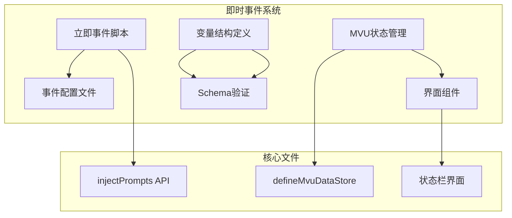
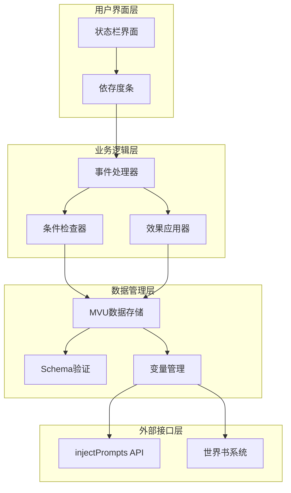
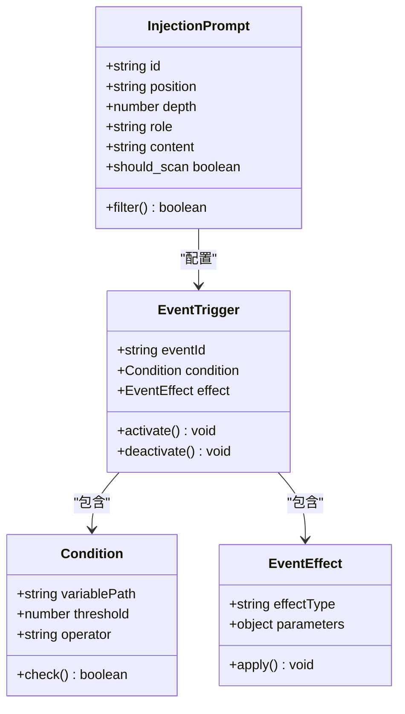
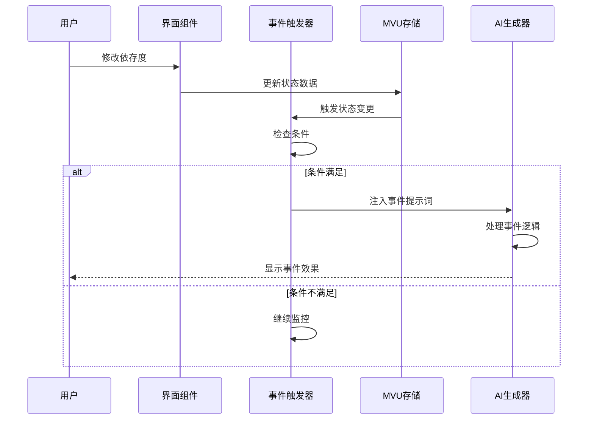
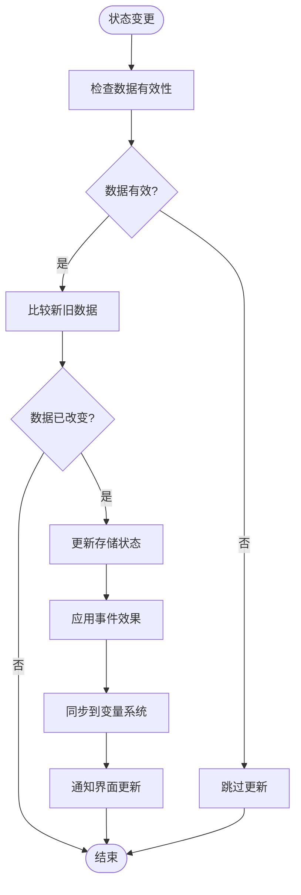
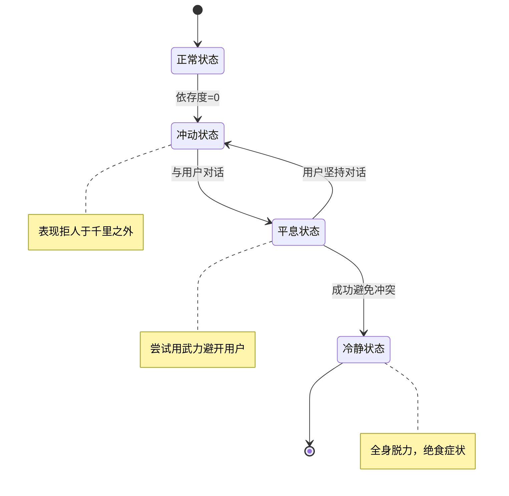
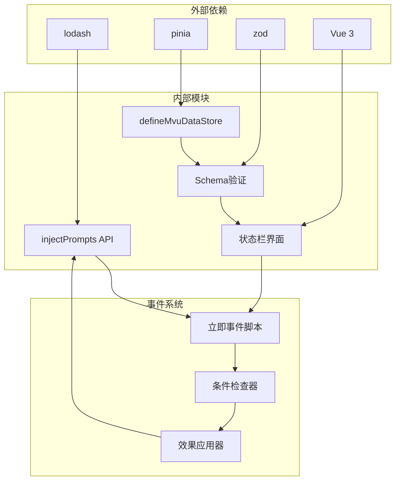

# 即时事件系统

<cite>
**本文档引用的文件**
- [立即事件/index.ts](file://示例\角色卡示例\脚本\立即事件\index.ts)
- [冲动啊，请平息吧.yaml](file://示例\角色卡示例\世界书\立即事件\冲动啊，请平息吧.yaml)
- [理性啊，请不要冻结.yaml](file://示例\角色卡示例\世界书\立即事件\理性啊，请不要冻结.yaml)
- [MVU/index.ts](file://示例\角色卡示例\脚本\MVU\index.ts)
- [变量结构/index.ts](file://示例\角色卡示例\脚本\变量结构\index.ts)
- [schema.ts](file://示例\角色卡示例\schema.ts)
- [store.ts](file://示例\角色卡示例\界面\状态栏\store.ts)
- [mvu.ts](file://util\mvu.ts)
- [inject.d.ts](file://@types\function\inject.d.ts)
- [exported.mvu.d.ts](file://@types\iframe\exported.mvu.d.ts)
- [variables.d.ts](file://@types\function\variables.d.ts)
- [DependencyBar.vue](file://示例\角色卡示例\界面\状态栏\components\DependencyBar.vue)
- [App.vue](file://示例\角色卡示例\界面\状态栏\App.vue)
- [变量更新规则.yaml](file://示例\角色卡示例\世界书\变量\变量更新规则.yaml)
</cite>

## 目录
1. [简介](#简介)
2. [项目结构](#项目结构)
3. [核心组件](#核心组件)
4. [架构概览](#架构概览)
5. [详细组件分析](#详细组件分析)
6. [依赖关系分析](#依赖关系分析)
7. [性能考虑](#性能考虑)
8. [故障排除指南](#故障排除指南)
9. [结论](#结论)
10. [附录](#附录)

## 简介

即时事件系统是本项目中的一个核心功能模块，用于实现实时触发的角色状态变化和剧情推进。该系统通过"立即事件"机制，在特定条件下自动触发预定义的剧情事件，为角色卡提供动态的交互体验。

系统的核心特点包括：
- **实时触发机制**：基于变量状态变化自动触发事件
- **条件驱动**：通过预设条件判断是否触发事件
- **状态管理集成**：与MVU状态管理系统无缝集成
- **可视化反馈**：提供直观的状态变化展示
- **可扩展性**：支持自定义事件的创建和配置

## 项目结构

项目采用模块化组织方式，即时事件系统主要分布在以下目录结构中：

**图表来源**
- [立即事件/index.ts:1-23](file://示例\角色卡示例\脚本\立即事件\index.ts#L1-L23)
- [mvu.ts:1-66](file://util\mvu.ts#L1-L66)
- [store.ts:1-5](file://示例\角色卡示例\界面\状态栏\store.ts#L1-L5)

**章节来源**
- [立即事件/index.ts:1-23](file://示例\角色卡示例\脚本\立即事件\index.ts#L1-L23)
- [schema.ts:1-52](file://示例\角色卡示例\schema.ts#L1-L52)
- [store.ts:1-5](file://示例\角色卡示例\界面\状态栏\store.ts#L1-L5)

## 核心组件

### 立即事件引擎

立即事件系统的核心是基于`injectPrompts` API的事件注入机制。该机制允许在满足特定条件时自动向AI生成器注入预定义的提示词。

### MVU状态管理

系统采用MVU（Model-View-Update）架构模式，通过Zod Schema进行数据验证和转换，确保状态的一致性和完整性。

### 事件触发器

事件触发器负责监控变量状态变化，并在达到预设阈值时激活相应的事件。

**章节来源**
- [inject.d.ts:1-46](file://@types\function\inject.d.ts#L1-L46)
- [mvu.ts:1-66](file://util\mvu.ts#L1-L66)
- [schema.ts:1-52](file://示例\角色卡示例\schema.ts#L1-L52)

## 架构概览

即时事件系统的整体架构采用分层设计，各组件之间通过清晰的接口进行通信：

**图表来源**
- [DependencyBar.vue:1-64](file://示例\角色卡示例\界面\状态栏\components\DependencyBar.vue#L1-L64)
- [mvu.ts:1-66](file://util\mvu.ts#L1-L66)
- [inject.d.ts:1-46](file://@types\function\inject.d.ts#L1-L46)

## 详细组件分析

### 立即事件脚本引擎

立即事件脚本通过`injectPrompts` API实现事件的自动触发。每个事件都包含以下关键要素：

#### 事件定义结构

**图表来源**
- [inject.d.ts:1-46](file://@types\function\inject.d.ts#L1-L46)
- [立即事件/index.ts:1-23](file://示例\角色卡示例\脚本\立即事件\index.ts#L1-L23)

#### 事件触发流程

**图表来源**
- [立即事件/index.ts:1-23](file://示例\角色卡示例\脚本\立即事件\index.ts#L1-L23)
- [mvu.ts:29-43](file://util\mvu.ts#L29-L43)

**章节来源**
- [立即事件/index.ts:1-23](file://示例\角色卡示例\脚本\立即事件\index.ts#L1-L23)
- [inject.d.ts:1-46](file://@types\function\inject.d.ts#L1-L46)

### MVU状态管理系统

MVU（Model-View-Update）架构提供了强大的状态管理能力，确保事件系统能够实时响应状态变化。

#### 数据流架构

**图表来源**
- [mvu.ts:29-60](file://util\mvu.ts#L29-L60)

#### 状态存储机制

MVU系统通过`defineMvuDataStore`函数创建类型安全的数据存储：

**章节来源**
- [mvu.ts:1-66](file://util\mvu.ts#L1-L66)
- [store.ts:1-5](file://示例\角色卡示例\界面\状态栏\store.ts#L1-L5)

### 事件效果实现

事件效果通过多种方式实现，包括状态数据更新、界面反馈和AI行为改变。

#### 事件效果类型

| 效果类型 | 实现方式 | 触发条件 |
|---------|---------|---------|
| 状态变化 | 更新MVU存储中的数据 | 依存度达到阈值 |
| 界面反馈 | 触发Vue组件重新渲染 | 状态数据变更 |
| AI行为 | 注入系统提示词 | 事件激活 |
| 世界书更新 | 修改世界书条目 | 事件完成 |

**章节来源**
- [DependencyBar.vue:1-64](file://示例\角色卡示例\界面\状态栏\components\DependencyBar.vue#L1-L64)
- [变量更新规则.yaml:1-51](file://示例\角色卡示例\世界书\变量\变量更新规则.yaml#L1-L51)

### 具体事件示例分析

#### "冲动啊，请平息吧"事件

该事件针对依存度为0的情况，触发白娅的自卑行为表现：

**图表来源**
- [冲动啊，请平息吧.yaml:1-16](file://示例\角色卡示例\世界书\立即事件\冲动啊，请平息吧.yaml#L1-L16)

#### "理性啊，请不要冻结"事件

该事件针对依存度为100%的情况，触发白娅的极端顺从行为：

**章节来源**
- [冲动啊，请平息吧.yaml:1-16](file://示例\角色卡示例\世界书\立即事件\冲动啊，请平息吧.yaml#L1-L16)
- [理性啊，请不要冻结.yaml:1-17](file://示例\角色卡示例\世界书\立即事件\理性啊，请不要冻结.yaml#L1-L17)

## 依赖关系分析

即时事件系统的依赖关系呈现清晰的层次结构：

**图表来源**
- [mvu.ts:1-66](file://util\mvu.ts#L1-L66)
- [inject.d.ts:1-46](file://@types\function\inject.d.ts#L1-L46)
- [schema.ts:1-52](file://示例\角色卡示例\schema.ts#L1-L52)

**章节来源**
- [exported.mvu.d.ts:1-47](file://@types\iframe\exported.mvu.d.ts#L1-L47)
- [variables.d.ts:37-65](file://@types\function\variables.d.ts#L37-L65)

## 性能考虑

即时事件系统在设计时充分考虑了性能优化：

### 状态同步优化

系统采用2秒间隔的轮询机制，平衡了实时性和性能开销：

- **轮询间隔**：2000ms
- **数据比较**：使用深度比较避免不必要的更新
- **条件检查**：仅在状态变化时触发事件检查

### 内存管理

- **垃圾回收**：自动清理未使用的事件监听器
- **数据缓存**：缓存Schema验证结果减少重复计算
- **组件卸载**：确保Vue组件销毁时清理相关资源

### 并发控制

系统通过`watchIgnorable`确保状态更新的原子性，避免竞态条件。

## 故障排除指南

### 常见问题及解决方案

#### 事件不触发

**可能原因**：
- 条件函数返回false
- 变量路径错误
- 事件被其他逻辑覆盖

**解决步骤**：
1. 检查条件函数的返回值
2. 验证变量路径的正确性
3. 查看事件注入的日志信息

#### 状态不同步

**可能原因**：
- MVU存储未正确初始化
- Schema验证失败
- 数据更新时机不当

**解决步骤**：
1. 确认MVU存储的初始化顺序
2. 检查Schema定义的完整性
3. 调整数据更新的时间点

#### 界面不更新

**可能原因**：
- Vue响应式系统失效
- 组件未正确订阅状态
- 作用域问题

**解决步骤**：
1. 确保使用正确的响应式API
2. 检查组件的props和computed属性
3. 验证组件的作用域和生命周期

**章节来源**
- [mvu.ts:29-60](file://util\mvu.ts#L29-L60)
- [DependencyBar.vue:1-64](file://示例\角色卡示例\界面\状态栏\components\DependencyBar.vue#L1-L64)

## 结论

即时事件系统通过巧妙的设计实现了角色状态的动态管理和实时响应。系统的核心优势包括：

1. **实时性**：通过MVU架构实现毫秒级状态响应
2. **可扩展性**：模块化的事件系统支持自定义扩展
3. **稳定性**：完善的错误处理和状态管理机制
4. **可视化**：直观的界面反馈增强用户体验

该系统为角色扮演类应用提供了强大的剧情驱动能力，能够根据玩家的行为和选择动态调整故事走向，创造更加沉浸式的交互体验。

## 附录

### 开发最佳实践

#### 创建自定义事件

1. **定义事件配置**：在世界书的立即事件目录中创建新的YAML文件
2. **编写触发条件**：在立即事件脚本中添加条件检查逻辑
3. **实现事件效果**：通过MVU存储更新角色状态
4. **测试验证**：使用状态栏界面验证事件效果

#### 性能优化建议

- 合理设置轮询间隔，避免过度频繁的状态检查
- 使用条件过滤减少不必要的事件触发
- 优化Schema验证逻辑，提高数据处理效率
- 实施适当的缓存策略，减少重复计算

#### 调试技巧

- 利用浏览器开发者工具监控状态变化
- 检查事件注入的日志输出
- 使用Vue DevTools观察组件状态
- 实施渐进式的功能测试