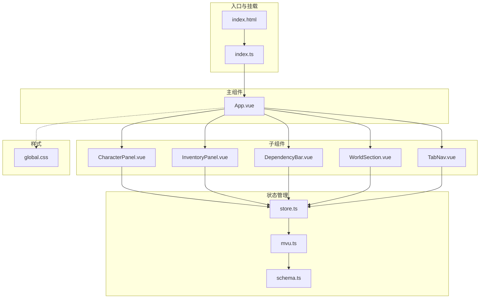
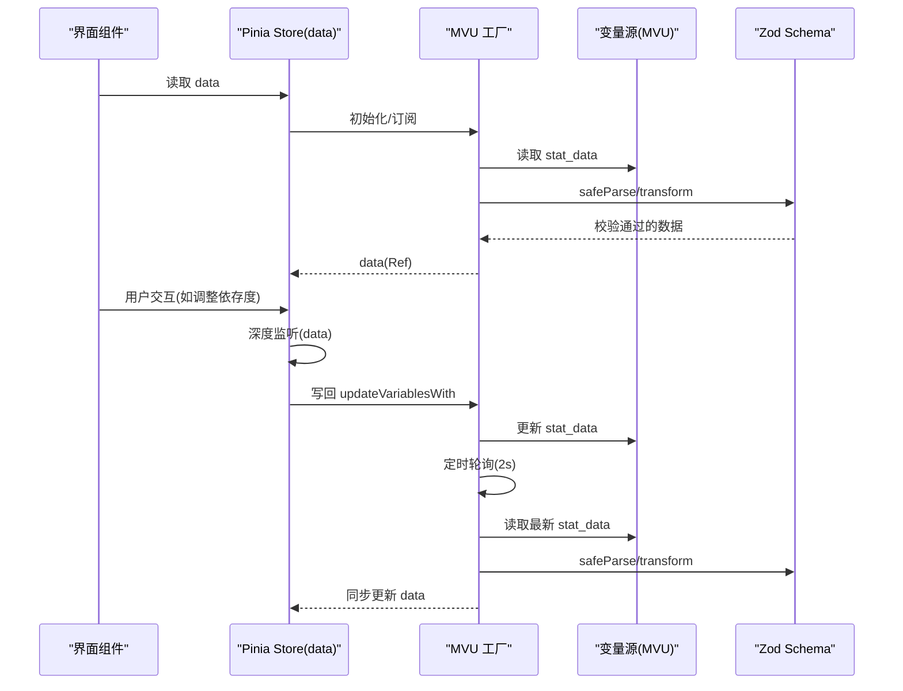
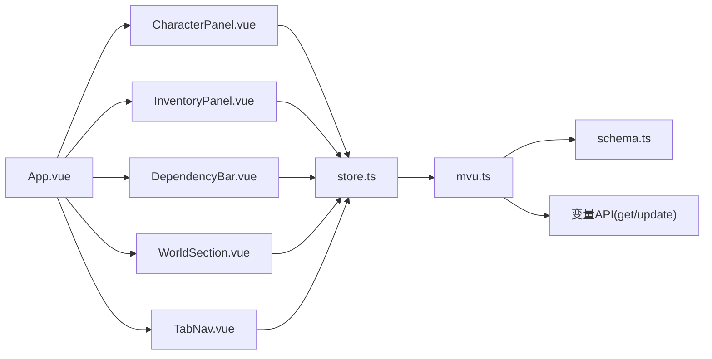

# 状态栏界面

<cite>
**本文引用的文件**
- [App.vue](file://示例\角色卡示例\界面\状态栏\App.vue)
- [store.ts](file://示例\角色卡示例\界面\状态栏\store.ts)
- [CharacterPanel.vue](file://示例\角色卡示例\界面\状态栏\components\CharacterPanel.vue)
- [InventoryPanel.vue](file://示例\角色卡示例\界面\状态栏\components\InventoryPanel.vue)
- [DependencyBar.vue](file://示例\角色卡示例\界面\状态栏\components\DependencyBar.vue)
- [TabNav.vue](file://示例\角色卡示例\界面\状态栏\components\TabNav.vue)
- [WorldSection.vue](file://示例\角色卡示例\界面\状态栏\components\WorldSection.vue)
- [index.ts](file://示例\角色卡示例\界面\状态栏\index.ts)
- [global.css](file://示例\角色卡示例\界面\状态栏\global.css)
- [schema.ts](file://示例\角色卡示例\schema.ts)
- [mvu.ts](file://util\mvu.ts)
- [variables.d.ts](file://@types\function\variables.d.ts)
- [index.html](file://示例\角色卡示例\界面\状态栏\index.html)
</cite>

## 目录
1. [简介](#简介)
2. [项目结构](#项目结构)
3. [核心组件](#核心组件)
4. [架构总览](#架构总览)
5. [详细组件分析](#详细组件分析)
6. [依赖关系分析](#依赖关系分析)
7. [性能考量](#性能考量)
8. [故障排查指南](#故障排查指南)
9. [结论](#结论)
10. [附录](#附录)

## 简介
本技术文档围绕“状态栏界面”系统展开，系统以 Vue 3 + Pinia + Zod Schema 为核心，结合 MVU（消息楼层变量）机制，实现角色状态的可视化展示与交互。系统包含世界信息区、依存度条、角色与物品面板、标签页导航等模块，并通过统一的 MVU 数据存储实现数据的双向同步与自动校验。

## 项目结构
状态栏界面位于“示例/角色卡示例/界面/状态栏”目录下，采用按功能分层的组织方式：
- 入口与挂载：index.ts 负责等待全局初始化与变量可用后挂载应用；index.html 提供挂载点。
- 主组件：App.vue 组织布局与子组件，负责标签页状态与本地持久化。
- 子组件：WorldSection、DependencyBar、TabNav、CharacterPanel、InventoryPanel 各司其职。
- 状态管理：store.ts 基于 MVU 工厂函数定义 Pinia Store，实现 Schema 校验与数据同步。
- 样式：global.css 定义主题配色与字体，各组件样式局部作用域化。
- 数据模型：schema.ts 定义三层数据结构（世界、白娅、主角），并包含派生字段与转换逻辑。

图表来源
- [index.ts:1-10](file://示例\角色卡示例\界面\状态栏\index.ts#L1-L10)
- [index.html:1-5](file://示例\角色卡示例\界面\状态栏\index.html#L1-L5)
- [App.vue:1-77](file://示例\角色卡示例\界面\状态栏\App.vue#L1-L77)
- [store.ts:1-5](file://示例\角色卡示例\界面\状态栏\store.ts#L1-L5)
- [mvu.ts:1-66](file://util\mvu.ts#L1-L66)
- [schema.ts:1-52](file://示例\角色卡示例\schema.ts#L1-L52)
- [global.css:1-18](file://示例\角色卡示例\界面\状态栏\global.css#L1-L18)

章节来源
- [index.ts:1-10](file://示例\角色卡示例\界面\状态栏\index.ts#L1-L10)
- [index.html:1-5](file://示例\角色卡示例\界面\状态栏\index.html#L1-L5)
- [App.vue:1-77](file://示例\角色卡示例\界面\状态栏\App.vue#L1-L77)
- [store.ts:1-5](file://示例\角色卡示例\界面\状态栏\store.ts#L1-L5)
- [mvu.ts:1-66](file://util\mvu.ts#L1-L66)
- [schema.ts:1-52](file://示例\角色卡示例\schema.ts#L1-L52)
- [global.css:1-18](file://示例\角色卡示例\界面\状态栏\global.css#L1-L18)

## 核心组件
- App.vue：主容器，负责布局与标签页切换，使用本地存储保持用户上次选择的标签页。
- store.ts：基于 MVU 的 Pinia Store，封装数据读取、Schema 校验、定时同步与写回。
- schema.ts：Zod Schema 定义三类数据域（世界、白娅、主角），包含派生字段与转换逻辑。
- mvu.ts：MVU 数据存储工厂，负责从变量源读取数据、解析与校验、定时轮询与双向同步。
- 各子组件：WorldSection 展示世界元信息与事件；DependencyBar 展示并调整依存度；TabNav 控制面板切换；CharacterPanel 展示角色称号与着装；InventoryPanel 展示物品清单。

章节来源
- [App.vue:1-77](file://示例\角色卡示例\界面\状态栏\App.vue#L1-L77)
- [store.ts:1-5](file://示例\角色卡示例\界面\状态栏\store.ts#L1-L5)
- [schema.ts:1-52](file://示例\角色卡示例\schema.ts#L1-L52)
- [mvu.ts:1-66](file://util\mvu.ts#L1-L66)

## 架构总览
系统采用“数据驱动视图”的单向数据流：
- 数据源：消息楼层变量（MVU）通过 getVariables 读取，经 Zod Schema 解析与转换。
- 状态中心：Pinia Store 暴露 data 引用，组件通过响应式读取。
- 同步机制：watchIgnorable 监听 store.data 变更，safeParse 校验后写回变量源；useIntervalFn 定时轮询，确保与外部变量源一致。
- 视图层：各组件仅负责渲染与简单交互，交互事件通过 store 修改数据，触发自动同步。

图表来源
- [mvu.ts:29-60](file://util\mvu.ts#L29-L60)
- [store.ts:4-4](file://示例\角色卡示例\界面\状态栏\store.ts#L4-L4)
- [schema.ts:1-52](file://示例\角色卡示例\schema.ts#L1-L52)

## 详细组件分析

### App.vue 主组件
- 结构职责
  - 顶部区域：WorldSection 展示日期、时间、地点与近期事务。
  - 中部区域：DependencyBar 展示并调整依存度。
  - 标签导航：TabNav 支持在“角色情报”和“持有物品”之间切换。
  - 内容区：根据激活标签动态渲染 CharacterPanel 或 InventoryPanel。
- 状态管理
  - 使用 useLocalStorage 保存 active_tab，实现跨刷新记忆。
  - tabs 定义标签集合，label 用于 UI 显示。
- 样式与动画
  - 卡片容器与内容区采用统一配色与字体。
  - 标签页切换使用淡入动画，提升交互体验。

章节来源
- [App.vue:1-77](file://示例\角色卡示例\界面\状态栏\App.vue#L1-L77)

### store.ts 状态管理
- 设计要点
  - 基于 defineMvuDataStore(Schema, { type: 'message', message_id: getCurrentMessageId() }) 创建 Store。
  - 通过 getVariables 读取 stat_data，Zod 校验与 transform 后赋值给 data。
  - 使用 watchIgnorable 监听 data 深度变化，safeParse 后写回变量源。
  - 使用 useIntervalFn 每 2 秒轮询变量源，若数据变化则同步到 data 并回写。
- 生命周期
  - 初始化时解析 stat_data；后续由轮询与监听驱动更新。
- 错误处理
  - safeParse 失败时忽略更新，避免污染 store。

章节来源
- [store.ts:1-5](file://示例\角色卡示例\界面\状态栏\store.ts#L1-L5)
- [mvu.ts:15-64](file://util\mvu.ts#L15-L64)

### schema.ts 数据模型
- 世界域
  - 当前时间、当前地点、近期事务（事务名 -> 描述）。
- 白娅域
  - 依存度：数值，经 clamp 限制在 0-100。
  - 着装：枚举槽位（上装/下装/内衣/袜子/鞋子/饰品）到描述。
  - 称号：称号名 -> {效果, 自我评价}，transform 依据依存度派生生效称号集与 $依存度阶段。
- 主角域
  - 物品栏：物品名 -> {描述, 数量}，transform 过滤数量<=0 的条目。

章节来源
- [schema.ts:1-52](file://示例\角色卡示例\schema.ts#L1-L52)

### WorldSection.vue 世界章节
- 功能
  - 渲染日期、时间、地点。
  - 展示近期事务列表，支持横向滚动。
  - 无事务时显示占位提示。
- 计算属性
  - 从当前时间字符串中提取日期与时间片段，增强可读性。

章节来源
- [WorldSection.vue:1-111](file://示例\角色卡示例\界面\状态栏\components\WorldSection.vue#L1-L111)

### DependencyBar.vue 依存度条
- 功能
  - 展示依存度百分比与进度条。
  - 提供 + / - 按钮调整依存度，边界限制在 0-100。
- 交互
  - adjustDependency(delta) 直接修改 store.data.白娅.依存度。
  - 进度条宽度随数值变化，具备过渡动画。

章节来源
- [DependencyBar.vue:1-111](file://示例\角色卡示例\界面\状态栏\components\DependencyBar.vue#L1-L111)

### TabNav.vue 标签导航
- 功能
  - 接收 tabs 列表与 v-model 绑定的当前激活 id。
  - 点击切换激活态，支持重复点击关闭。
- 样式
  - 采用分隔线与悬停/激活态视觉反馈。

章节来源
- [TabNav.vue:1-67](file://示例\角色卡示例\界面\状态栏\components\TabNav.vue#L1-L67)

### CharacterPanel.vue 角色面板
- 功能
  - 展示 $依存度阶段（由 Schema transform 派生）。
  - 渲染称号网格，每个称号包含效果与自我评价。
  - 展示着装记录，按部位分组。
- 交互
  - 无直接交互，纯展示组件。

章节来源
- [CharacterPanel.vue:1-110](file://示例\角色卡示例\界面\状态栏\components\CharacterPanel.vue#L1-L110)
- [schema.ts:20-37](file://示例\角色卡示例\schema.ts#L20-L37)

### InventoryPanel.vue 库存面板
- 功能
  - 展示主角物品清单，每项包含图标、名称、描述与数量。
  - 空背包时显示提示文案。
- 图标生成
  - 根据物品名关键字映射为简短图标，否则取前两字符大写。

章节来源
- [InventoryPanel.vue:1-101](file://示例\角色卡示例\界面\状态栏\components\InventoryPanel.vue#L1-L101)

### MVU 数据工厂（mvu.ts）
- 关键流程
  - 初始化：读取变量源 stat_data，Zod 解析与 transform，设置 data。
  - 监听：watchIgnorable 深度监听 data，safeParse 校验后写回变量源。
  - 轮询：useIntervalFn 每 2 秒读取变量源，safeParse 后与 data 比较，不同则同步。
  - 参数兼容：message 类型且 message_id 为 latest 时转为 -1。
- 错误与幂等
  - safeParse 失败跳过；isEqual 判断避免重复写回。

章节来源
- [mvu.ts:1-66](file://util\mvu.ts#L1-L66)

### 变量 API 类型（variables.d.ts）
- VariableOption 支持多种变量源类型：chat/preset/global/character/message/script/extension。
- 提供 getVariables、updateVariablesWith、replaceVariables、insertOrAssignVariables、deleteVariable 等方法签名，用于读写变量。

章节来源
- [variables.d.ts:1-207](file://@types\function\variables.d.ts#L1-L207)

## 依赖关系分析
- 组件耦合
  - App.vue 与各子组件松耦合，通过 store 读取数据，交互通过 store 修改。
  - 子组件间无直接通信，全部通过共享 store。
- 外部依赖
  - Pinia：提供响应式 Store。
  - Zod：Schema 定义与运行时校验。
  - Lodash：数据处理与比较（_.isEqual、_.get、_.set、_.pickBy、_.clamp、_.entries、_.takeRight、_.fromPairs）。
  - 酒馆助手变量 API：getVariables、updateVariablesWith 等。
- 循环依赖
  - 无循环导入；store 作为唯一数据源，避免相互依赖。

图表来源
- [App.vue:1-77](file://示例\角色卡示例\界面\状态栏\App.vue#L1-L77)
- [store.ts:1-5](file://示例\角色卡示例\界面\状态栏\store.ts#L1-L5)
- [mvu.ts:15-64](file://util\mvu.ts#L15-L64)
- [schema.ts:1-52](file://示例\角色卡示例\schema.ts#L1-L52)

章节来源
- [App.vue:1-77](file://示例\角色卡示例\界面\状态栏\App.vue#L1-L77)
- [store.ts:1-5](file://示例\角色卡示例\界面\状态栏\store.ts#L1-L5)
- [mvu.ts:15-64](file://util\mvu.ts#L15-L64)
- [schema.ts:1-52](file://示例\角色卡示例\schema.ts#L1-L52)

## 性能考量
- 渲染优化
  - 子组件均使用 scoped 样式，避免全局污染；列表渲染使用 v-for + key，减少重排。
- 数据同步
  - 2 秒轮询频率适中，兼顾实时性与性能；safeParse 与 isEqual 避免无效写回。
- 计算属性
  - WorldSection 的日期/时间提取使用 computed，避免重复计算。
- 交互反馈
  - 依赖条与物品项 hover 有轻微位移与背景变化，动画时长短，不阻塞主线程。

## 故障排查指南
- 应用无法挂载
  - 检查 index.ts 是否等待全局初始化与变量可用；确认变量源中存在 stat_data。
- 依赖条不可用
  - 确认 store.data.白娅.依存度 是否存在且为数字；检查 clamp transform 是否生效。
- 称号/着装为空
  - 检查变量源中对应字段是否正确；确认 Schema transform 是否按依存度截取称号。
- 物品数量异常
  - 检查物品栏 transform 是否过滤了数量<=0 的条目；确认写回变量源后是否被其他脚本覆盖。
- 样式异常
  - 确认 global.css 是否加载；检查浏览器 CSS 变量是否被覆盖。

章节来源
- [index.ts:5-9](file://示例\角色卡示例\界面\状态栏\index.ts#L5-L9)
- [mvu.ts:29-43](file://util\mvu.ts#L29-L43)
- [schema.ts:20-37](file://示例\角色卡示例\schema.ts#L20-L37)
- [schema.ts:40-49](file://示例\角色卡示例\schema.ts#L40-L49)
- [global.css:7-17](file://示例\角色卡示例\界面\状态栏\global.css#L7-L17)

## 结论
状态栏界面以 MVU 为核心，结合 Pinia 与 Zod Schema，实现了角色状态的可视化与交互。系统结构清晰、组件职责明确、数据流稳定可靠。通过统一的 Store 与 Schema，既保证了数据一致性，又便于扩展与维护。

## 附录

### 使用示例与集成步骤
- 集成步骤
  - 在页面中引入 index.html 的挂载点。
  - 确保变量源已提供 stat_data，并满足 schema 定义。
  - 在 index.ts 中等待全局初始化后挂载应用。
- 定制建议
  - 扩展 schema.ts 以增加新的角色或世界字段。
  - 在 store.ts 中调整变量源选项（如切换 message_id 或类型）。
  - 在 App.vue 中增减子组件或调整标签页。

章节来源
- [index.html:1-5](file://示例\角色卡示例\界面\状态栏\index.html#L1-L5)
- [index.ts:5-9](file://示例\角色卡示例\界面\状态栏\index.ts#L5-L9)
- [store.ts:4-4](file://示例\角色卡示例\界面\状态栏\store.ts#L4-L4)
- [schema.ts:1-52](file://示例\角色卡示例\schema.ts#L1-L52)
- [App.vue:27-32](file://示例\角色卡示例\界面\状态栏\App.vue#L27-L32)