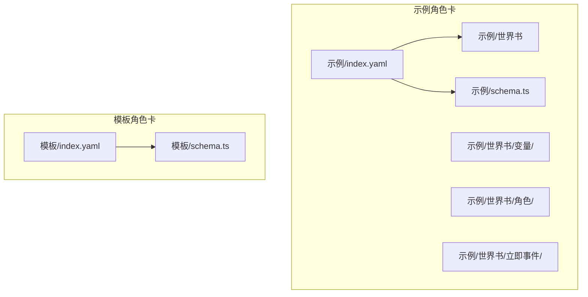
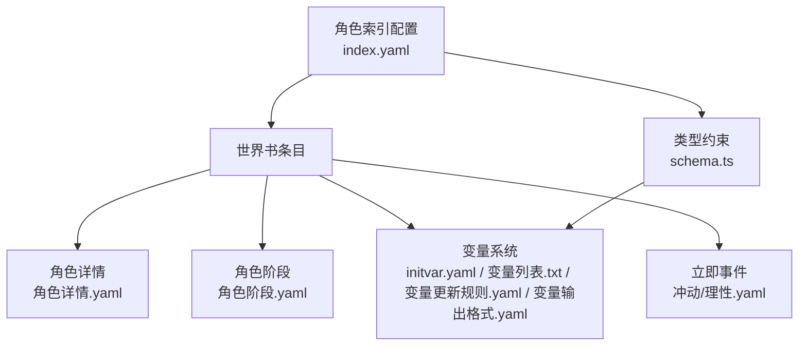
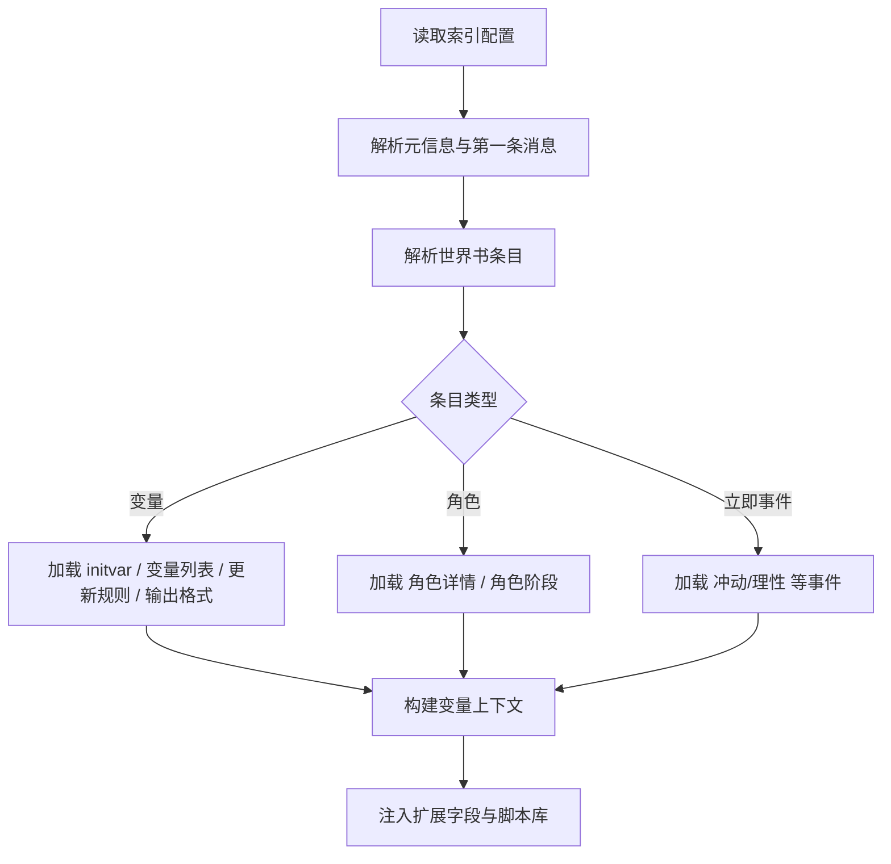
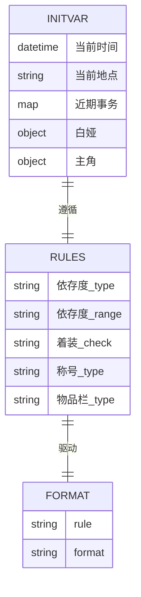
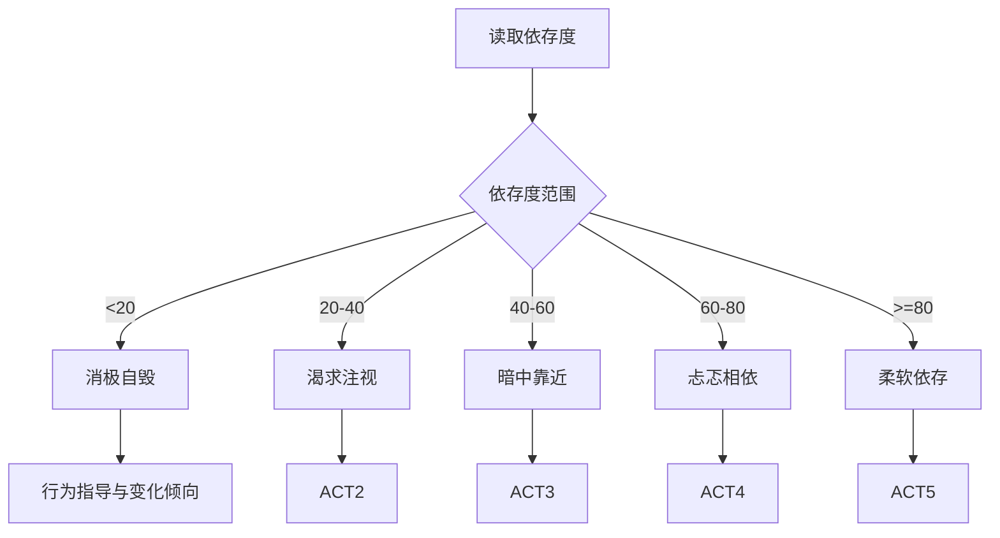
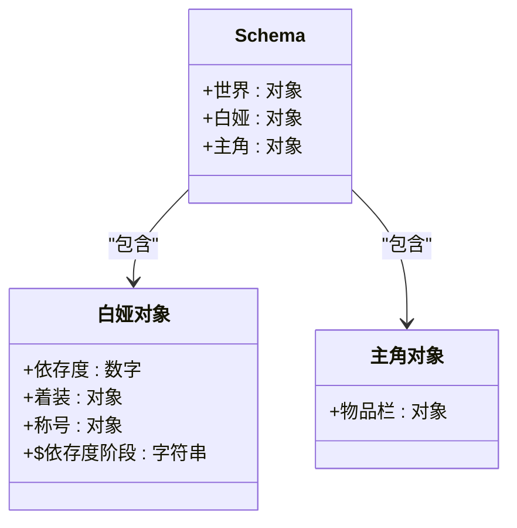
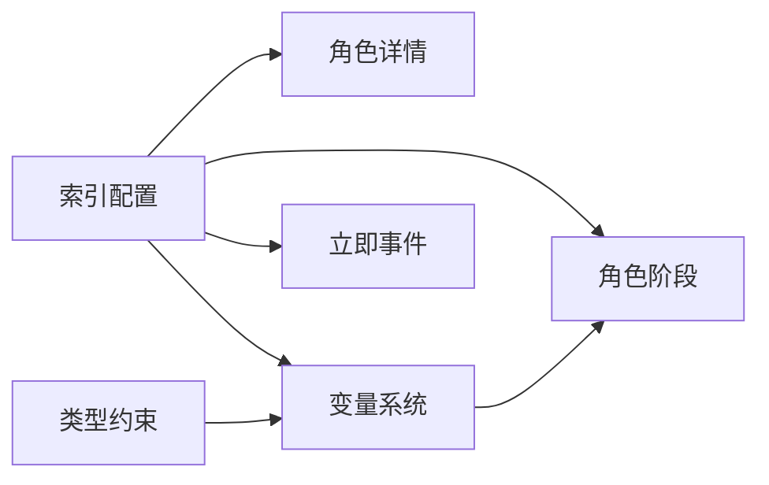

# 角色卡数据模型

<cite>
**本文档引用的文件**
- [index.yaml](file://初始模板/角色卡/新建为src文件夹中的文件夹/index.yaml)
- [schema.ts](file://初始模板/角色卡/新建为src文件夹中的文件夹/schema.ts)
- [index.yaml](file://示例/角色卡示例/index.yaml)
- [schema.ts](file://示例/角色卡示例/schema.ts)
- [角色详情.yaml](file://示例/角色卡示例/世界书/角色/角色详情.yaml)
- [角色阶段.yaml](file://示例/角色卡示例/世界书/角色/角色阶段.yaml)
- [initvar.yaml](file://示例/角色卡示例/世界书/变量/initvar.yaml)
- [变量列表.txt](file://示例/角色卡示例/世界书/变量/变量列表.txt)
- [变量更新规则.yaml](file://示例/角色卡示例/世界书/变量/变量更新规则.yaml)
- [变量输出格式.yaml](file://示例/角色卡示例/世界书/变量/变量输出格式.yaml)
- [冲动啊，请平息吧.yaml](file://示例/角色卡示例/世界书/立即事件/冲动啊，请平息吧.yaml)
- [理性啊，请不要冻结.yaml](file://示例/角色卡示例/世界书/立即事件/理性啊，请不要冻结.yaml)
</cite>

## 目录
1. [简介](#简介)
2. [项目结构](#项目结构)
3. [核心组件](#核心组件)
4. [架构总览](#架构总览)
5. [详细组件分析](#详细组件分析)
6. [依赖关系分析](#依赖关系分析)
7. [性能考虑](#性能考虑)
8. [故障排除指南](#故障排除指南)
9. [结论](#结论)
10. [附录](#附录)

## 简介
本文件系统性阐述“角色卡数据模型”的技术设计与实现，覆盖角色详情、角色阶段、世界书变量体系、索引配置与类型约束等核心要素。文档基于仓库中的示例角色卡与模板角色卡，解析其数据结构、配置语法与运行机制，并提供可视化图示帮助理解。

## 项目结构
角色卡相关文件主要分布在“示例/角色卡示例”与“初始模板/角色卡”两个目录中，前者提供了完整的可运行示例，后者提供最小可用模板与基础类型定义。

图表来源
- [index.yaml:1-313](file://示例/角色卡示例/index.yaml#L1-L313)
- [schema.ts:1-52](file://示例/角色卡示例/schema.ts#L1-L52)
- [index.yaml:1-171](file://初始模板/角色卡/新建为src文件夹中的文件夹/index.yaml#L1-L171)
- [schema.ts:1-4](file://初始模板/角色卡/新建为src文件夹中的文件夹/schema.ts#L1-L4)

章节来源
- [index.yaml:1-313](file://示例/角色卡示例/index.yaml#L1-L313)
- [schema.ts:1-52](file://示例/角色卡示例/schema.ts#L1-L52)
- [index.yaml:1-171](file://初始模板/角色卡/新建为src文件夹中的文件夹/index.yaml#L1-L171)
- [schema.ts:1-4](file://初始模板/角色卡/新建为src文件夹中的文件夹/schema.ts#L1-L4)

## 核心组件
- 角色索引配置：统一管理角色卡元信息、世界书条目、锚点与扩展字段、酒馆助手脚本库等。
- 世界书变量系统：以 YAML 结构化存储角色状态、物品、称号等变量，并通过规则与输出格式驱动更新。
- 角色详情与阶段：分别定义角色背景、性格、语言风格、社交关系与行为倾向，以及依存度驱动的行为阶段。
- 类型约束与校验：通过 Zod Schema 对变量结构进行类型约束与运行时转换，确保数据一致性与可预测性。

章节来源
- [index.yaml:1-313](file://示例/角色卡示例/index.yaml#L1-L313)
- [schema.ts:1-52](file://示例/角色卡示例/schema.ts#L1-L52)
- [角色详情.yaml:1-59](file://示例/角色卡示例/世界书/角色/角色详情.yaml#L1-L59)
- [角色阶段.yaml:1-60](file://示例/角色卡示例/世界书/角色/角色阶段.yaml#L1-L60)
- [initvar.yaml:1-34](file://示例/角色卡示例/世界书/变量/initvar.yaml#L1-L34)
- [变量更新规则.yaml:1-52](file://示例/角色卡示例/世界书/变量/变量更新规则.yaml#L1-L52)
- [变量输出格式.yaml:1-32](file://示例/角色卡示例/世界书/变量/变量输出格式.yaml#L1-L32)

## 架构总览
角色卡数据模型采用“索引配置 + 世界书条目 + 变量系统 + 类型约束”的分层架构。索引配置负责组织与加载世界书条目；变量系统提供状态与动态更新能力；类型约束保障数据结构稳定；角色详情与阶段提供行为与心理驱动。

图表来源
- [index.yaml:1-313](file://示例/角色卡示例/index.yaml#L1-L313)
- [schema.ts:1-52](file://示例/角色卡示例/schema.ts#L1-L52)
- [角色详情.yaml:1-59](file://示例/角色卡示例/世界书/角色/角色详情.yaml#L1-L59)
- [角色阶段.yaml:1-60](file://示例/角色卡示例/世界书/角色/角色阶段.yaml#L1-L60)
- [initvar.yaml:1-34](file://示例/角色卡示例/世界书/变量/initvar.yaml#L1-L34)
- [变量列表.txt:1-5](file://示例/角色卡示例/世界书/变量/变量列表.txt#L1-L5)
- [变量更新规则.yaml:1-52](file://示例/角色卡示例/世界书/变量/变量更新规则.yaml#L1-L52)
- [变量输出格式.yaml:1-32](file://示例/角色卡示例/世界书/变量/变量输出格式.yaml#L1-L32)
- [冲动啊，请平息吧.yaml:1-16](file://示例/角色卡示例/世界书/立即事件/冲动啊，请平息吧.yaml#L1-L16)
- [理性啊，请不要冻结.yaml:1-17](file://示例/角色卡示例/世界书/立即事件/理性啊，请不要冻结.yaml#L1-L17)

## 详细组件分析

### 角色索引配置（index.yaml）
- 元信息与同步提示：包含头像、版本、作者、备注等元信息，并通过语言服务器指令绑定远程模式校验。
- 第一条消息：指定角色首次对话的文本来源。
- 世界书名称与条目：通过“文件夹+条目”的层级组织，挂载变量、角色详情、角色阶段、立即事件等条目。
- 锚点与扩展字段：支持多种激活策略与插入位置，扩展字段提供正则替换与酒馆助手脚本库集成。
- 酒馆助手：集中声明外部脚本库，便于运行时加载与更新。

图表来源
- [index.yaml:1-313](file://示例/角色卡示例/index.yaml#L1-L313)
- [index.yaml:1-171](file://初始模板/角色卡/新建为src文件夹中的文件夹/index.yaml#L1-L171)

章节来源
- [index.yaml:1-313](file://示例/角色卡示例/index.yaml#L1-L313)
- [index.yaml:1-171](file://初始模板/角色卡/新建为src文件夹中的文件夹/index.yaml#L1-L171)

### 世界书变量系统
- 初始化变量（initvar.yaml）：定义初始状态，如世界时间、地点、近期事务，以及角色的依存度、着装、称号、主角物品栏等。
- 变量列表（变量列表.txt）：定义状态栏或界面中展示的变量输出模板。
- 变量更新规则（变量更新规则.yaml）：定义变量类型、范围、更新检查逻辑，确保变量变化符合角色心理与情境。
- 变量输出格式（变量输出格式.yaml）：定义更新分析与 JSON Patch 格式，支持增量更新与严格操作集。

图表来源
- [initvar.yaml:1-34](file://示例/角色卡示例/世界书/变量/initvar.yaml#L1-L34)
- [变量更新规则.yaml:1-52](file://示例/角色卡示例/世界书/变量/变量更新规则.yaml#L1-L52)
- [变量输出格式.yaml:1-32](file://示例/角色卡示例/世界书/变量/变量输出格式.yaml#L1-L32)

章节来源
- [initvar.yaml:1-34](file://示例/角色卡示例/世界书/变量/initvar.yaml#L1-L34)
- [变量列表.txt:1-5](file://示例/角色卡示例/世界书/变量/变量列表.txt#L1-L5)
- [变量更新规则.yaml:1-52](file://示例/角色卡示例/世界书/变量/变量更新规则.yaml#L1-L52)
- [变量输出格式.yaml:1-32](file://示例/角色卡示例/世界书/变量/变量输出格式.yaml#L1-L32)

### 角色详情（角色详情.yaml）
- 角色身份与背景：如“父母双亡的女高中生，寄居在父母朋友家中”。
- 性格特征：包括依存症、自毁倾向、占有欲、矛盾心理等。
- 外观与语言风格：描述体型、着装、说话语气等。
- 社交关系：对不同对象的关系与互动模式。
- 行为倾向：在亲密关系中的占有性、自我伤害、逃避善意等。
- 访谈片段：通过具体对话展现角色心理与动机。

章节来源
- [角色详情.yaml:1-59](file://示例/角色卡示例/世界书/角色/角色详情.yaml#L1-L59)

### 角色阶段（角色阶段.yaml）
- 依存度驱动的行为阶段：根据依存度阈值划分多个阶段，每个阶段给出行为指导与变化倾向。
- 示例阶段：消极自毁、渴求注视、暗中靠近、忐忑相依、柔软依存。
- 阶段切换：依存度上升或下降时，角色行为倾向随之改变，影响对话与互动体验。

图表来源
- [角色阶段.yaml:1-60](file://示例/角色卡示例/世界书/角色/角色阶段.yaml#L1-L60)

章节来源
- [角色阶段.yaml:1-60](file://示例/角色卡示例/世界书/角色/角色阶段.yaml#L1-L60)

### 类型约束与校验（schema.ts）
- 使用 Zod 定义变量结构：包含世界、白娅、主角等命名空间与字段。
- 类型约束与转换：如依存度数值约束与范围夹取、称号集合截取、物品栏过滤等。
- 运行时派生字段：通过 transform 注入派生字段（如依存度阶段），简化后续逻辑。

图表来源
- [schema.ts:1-52](file://示例/角色卡示例/schema.ts#L1-L52)
- [schema.ts:1-4](file://初始模板/角色卡/新建为src文件夹中的文件夹/schema.ts#L1-L4)

章节来源
- [schema.ts:1-52](file://示例/角色卡示例/schema.ts#L1-L52)
- [schema.ts:1-4](file://初始模板/角色卡/新建为src文件夹中的文件夹/schema.ts#L1-L4)

### 立即事件（立即事件.yaml）
- 冲动事件：描述白娅因失去关注而绝食，包含过程、要求与强制触发规则。
- 理性事件：描述白娅将自身视为<user>一部分，无条件接受命令，包含过程、要求与强制触发规则。
- 事件优先级：最高优先级，触发时停止其他剧情，需合理引入。

章节来源
- [冲动啊，请平息吧.yaml:1-16](file://示例/角色卡示例/世界书/立即事件/冲动啊，请平息吧.yaml#L1-L16)
- [理性啊，请不要冻结.yaml:1-17](file://示例/角色卡示例/世界书/立即事件/理性啊，请不要冻结.yaml#L1-L17)

## 依赖关系分析
- 索引配置依赖世界书条目：通过条目路径加载角色详情、阶段、变量与事件。
- 类型约束依赖变量系统：schema.ts 的结构决定 initvar.yaml 的合法性与运行时转换。
- 行为阶段依赖变量系统：角色阶段根据依存度动态选择行为指导。
- 扩展字段与脚本库：通过索引配置注入正则与脚本，增强界面与交互。

图表来源
- [index.yaml:1-313](file://示例/角色卡示例/index.yaml#L1-L313)
- [schema.ts:1-52](file://示例/角色卡示例/schema.ts#L1-L52)
- [角色详情.yaml:1-59](file://示例/角色卡示例/世界书/角色/角色详情.yaml#L1-L59)
- [角色阶段.yaml:1-60](file://示例/角色卡示例/世界书/角色/角色阶段.yaml#L1-L60)
- [initvar.yaml:1-34](file://示例/角色卡示例/世界书/变量/initvar.yaml#L1-L34)

章节来源
- [index.yaml:1-313](file://示例/角色卡示例/index.yaml#L1-L313)
- [schema.ts:1-52](file://示例/角色卡示例/schema.ts#L1-L52)

## 性能考虑
- 变量更新批处理：通过 JSON Patch 操作批量更新，减少重复渲染与计算。
- 依存度派生字段：在 schema.ts 中一次性计算派生阶段，避免运行时重复计算。
- 正则替换与脚本库：合理设置最大深度与作用域，避免对用户输入与 AI 输出造成过度影响。
- 事件触发优先级：立即事件最高优先级，确保关键剧情不受其他流程干扰。

## 故障排除指南
- 变量更新无效：检查变量更新规则与输出格式是否匹配，确认 JSON Patch 操作路径正确。
- 依存度阶段异常：检查 schema.ts 中 transform 逻辑与 clamp 范围，确保数值在 0~100。
- 界面状态栏不显示：检查扩展字段中的正则替换与脚本库加载路径。
- 立即事件未触发：确认事件激活策略与关键字匹配，检查优先级与触发条件。

章节来源
- [变量更新规则.yaml:1-52](file://示例/角色卡示例/世界书/变量/变量更新规则.yaml#L1-L52)
- [变量输出格式.yaml:1-32](file://示例/角色卡示例/世界书/变量/变量输出格式.yaml#L1-L32)
- [schema.ts:1-52](file://示例/角色卡示例/schema.ts#L1-L52)
- [index.yaml:187-313](file://示例/角色卡示例/index.yaml#L187-L313)

## 结论
角色卡数据模型通过“索引配置 + 世界书条目 + 变量系统 + 类型约束 + 行为阶段 + 立即事件”的协同，实现了角色行为的动态控制与可维护的数据结构。建议在实际使用中：
- 明确变量更新规则与输出格式，确保数据一致性；
- 利用类型约束与派生字段降低运行时复杂度；
- 通过阶段与事件驱动角色心理与行为变化；
- 合理配置扩展字段与脚本库，提升交互体验。

## 附录
- 实际使用示例路径
  - 角色索引配置：[示例/index.yaml:1-313](file://示例/角色卡示例/index.yaml#L1-L313)
  - 类型约束定义：[示例/schema.ts:1-52](file://示例/角色卡示例/schema.ts#L1-L52)
  - 角色详情：[角色详情.yaml:1-59](file://示例/角色卡示例/世界书/角色/角色详情.yaml#L1-L59)
  - 角色阶段：[角色阶段.yaml:1-60](file://示例/角色卡示例/世界书/角色/角色阶段.yaml#L1-L60)
  - 变量系统：[initvar.yaml:1-34](file://示例/角色卡示例/世界书/变量/initvar.yaml#L1-L34)、[变量列表.txt:1-5](file://示例/角色卡示例/世界书/变量/变量列表.txt#L1-L5)、[变量更新规则.yaml:1-52](file://示例/角色卡示例/世界书/变量/变量更新规则.yaml#L1-L52)、[变量输出格式.yaml:1-32](file://示例/角色卡示例/世界书/变量/变量输出格式.yaml#L1-L32)
  - 立即事件：[冲动啊，请平息吧.yaml:1-16](file://示例/角色卡示例/世界书/立即事件/冲动啊，请平息吧.yaml#L1-L16)、[理性啊，请不要冻结.yaml:1-17](file://示例/角色卡示例/世界书/立即事件/理性啊，请不要冻结.yaml#L1-L17)