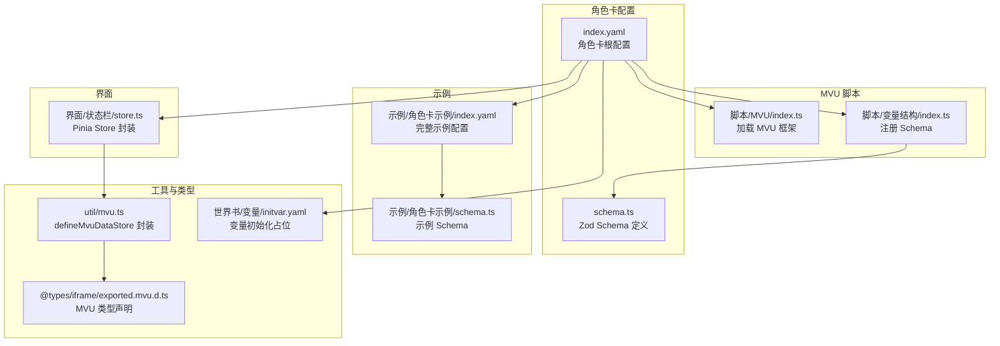
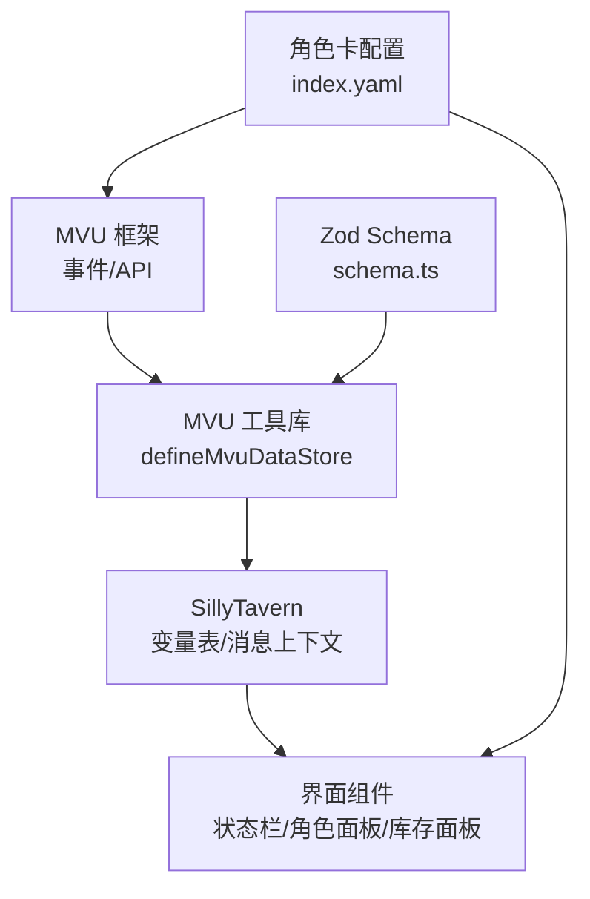
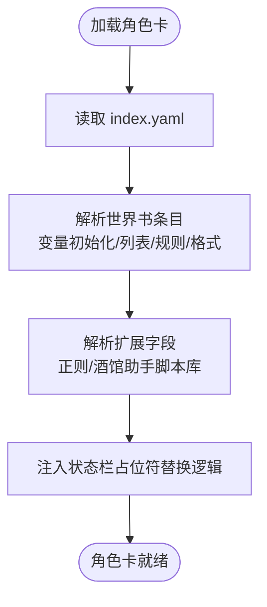
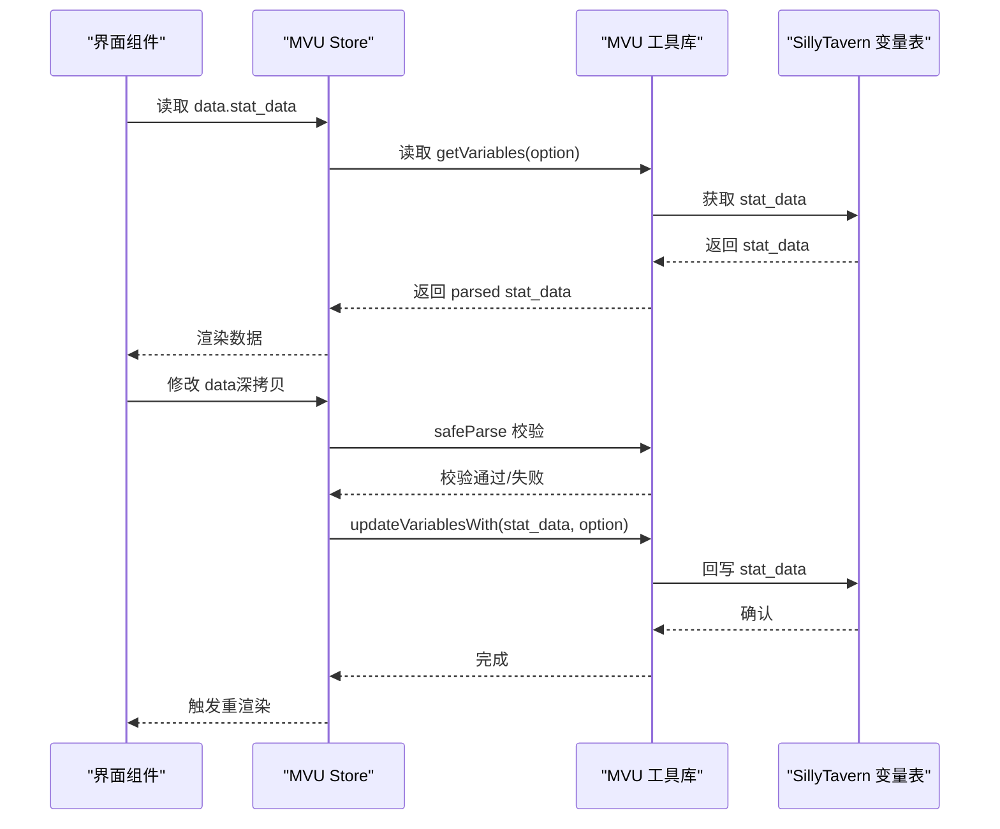
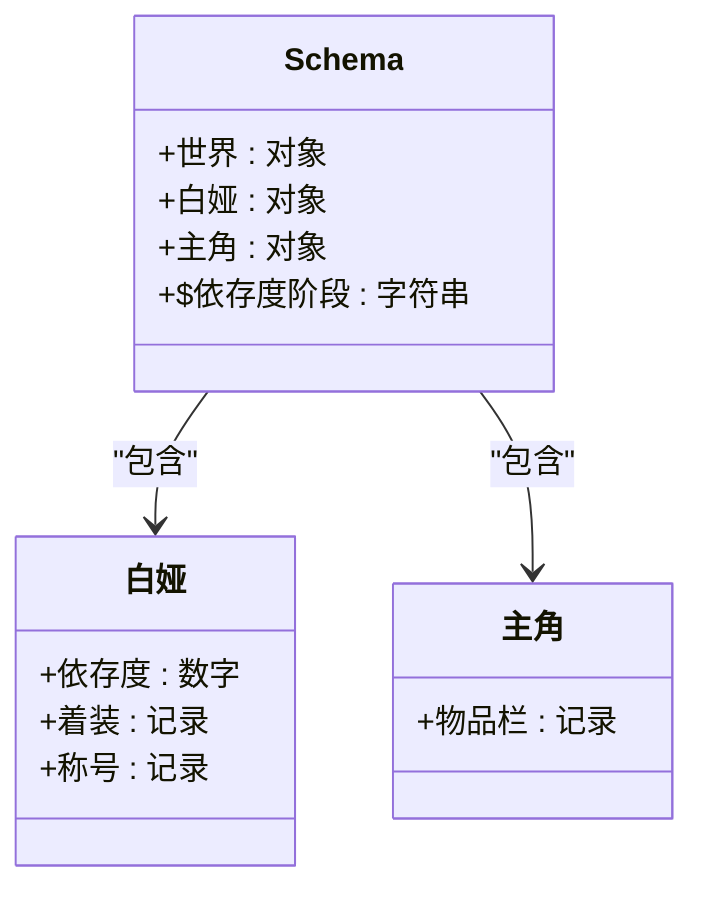
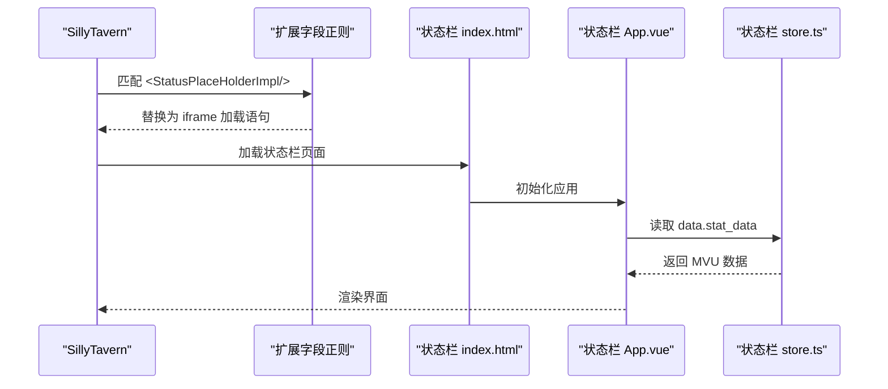
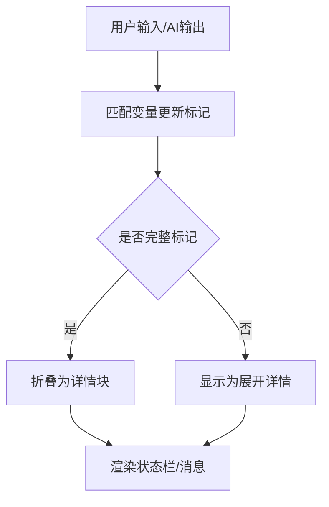
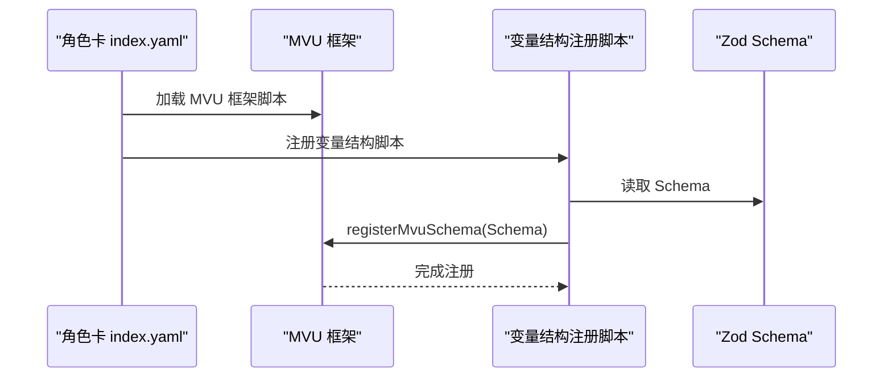
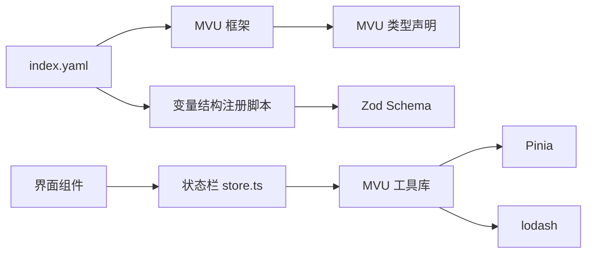

# 角色卡集成

<cite>
**本文引用的文件**
- [index.yaml（初始模板）](file://初始模板/角色卡/新建为src文件夹中的文件夹/index.yaml)
- [schema.ts（初始模板）](file://初始模板/角色卡/新建为src文件夹中的文件夹/schema.ts)
- [index.ts（MVU脚本入口，初始模板）](file://初始模板/角色卡/新建为src文件夹中的文件夹/脚本/MVU/index.ts)
- [index.ts（变量结构注册，初始模板）](file://初始模板/角色卡/新建为src文件夹中的文件夹/脚本/变量结构/index.ts)
- [store.ts（状态栏数据存储，初始模板）](file://初始模板/角色卡/新建为src文件夹中的文件夹/界面/状态栏/store.ts)
- [index.yaml（示例角色卡）](file://示例/角色卡示例/index.yaml)
- [schema.ts（示例角色卡）](file://示例/角色卡示例/schema.ts)
- [mvu.ts（MVU工具库）](file://util/mvu.ts)
- [exported.mvu.d.ts（MVU类型声明）](file://@types/iframe/exported.mvu.d.ts)
- [initvar.yaml（初始模板：变量初始化）](file://初始模板/角色卡/新建为src文件夹中的文件夹/世界书/变量/initvar.yaml)
</cite>

## 目录
1. [简介](#简介)
2. [项目结构](#项目结构)
3. [核心组件](#核心组件)
4. [架构总览](#架构总览)
5. [详细组件分析](#详细组件分析)
6. [依赖关系分析](#依赖关系分析)
7. [性能考量](#性能考量)
8. [故障排查指南](#故障排查指南)
9. [结论](#结论)
10. [附录](#附录)

## 简介
本技术文档围绕“角色卡集成”主题，系统阐述角色卡系统与SillyTavern的集成方式，重点覆盖以下方面：
- 角色卡数据结构与Zod Schema校验
- 世界书变量系统与MVU状态管理
- 角色状态栏界面、角色面板、库存面板等组件的实现与使用
- 世界书变量的配置与使用流程（变量定义、更新规则、输出格式化）
- 与快速情节编排系统的集成思路
- 开发角色卡的完整示例与最佳实践

## 项目结构
角色卡相关的核心目录与文件组织如下：
- 角色卡根配置与世界书条目：index.yaml
- Zod Schema定义：schema.ts
- MVU脚本入口与变量结构注册：脚本/MVU/index.ts、脚本/变量结构/index.ts
- 界面状态栏的数据存储：界面/状态栏/store.ts
- 示例角色卡：示例/角色卡示例/index.yaml、schema.ts
- MVU工具库与类型声明：util/mvu.ts、@types/iframe/exported.mvu.d.ts
- 世界书变量初始化文件：世界书/变量/initvar.yaml

图表来源
- [index.yaml（初始模板）:1-171](file://初始模板/角色卡/新建为src文件夹中的文件夹/index.yaml#L1-L171)
- [schema.ts（初始模板）:1-4](file://初始模板/角色卡/新建为src文件夹中的文件夹/schema.ts#L1-L4)
- [index.ts（MVU脚本入口，初始模板）:1-2](file://初始模板/角色卡/新建为src文件夹中的文件夹/脚本/MVU/index.ts#L1-L2)
- [index.ts（变量结构注册，初始模板）:1-7](file://初始模板/角色卡/新建为src文件夹中的文件夹/脚本/变量结构/index.ts#L1-L7)
- [store.ts（状态栏数据存储，初始模板）:1-5](file://初始模板/角色卡/新建为src文件夹中的文件夹/界面/状态栏/store.ts#L1-L5)
- [index.yaml（示例角色卡）:1-313](file://示例/角色卡示例/index.yaml#L1-L313)
- [schema.ts（示例角色卡）:1-52](file://示例/角色卡示例/schema.ts#L1-L52)
- [mvu.ts（MVU工具库）:1-66](file://util/mvu.ts#L1-L66)
- [exported.mvu.d.ts（MVU类型声明）:1-190](file://@types/iframe/exported.mvu.d.ts#L1-L190)
- [initvar.yaml（初始模板：变量初始化）:1-4](file://初始模板/角色卡/新建为src文件夹中的文件夹/世界书/变量/initvar.yaml#L1-L4)

章节来源
- [index.yaml（初始模板）:1-171](file://初始模板/角色卡/新建为src文件夹中的文件夹/index.yaml#L1-L171)
- [index.yaml（示例角色卡）:1-313](file://示例/角色卡示例/index.yaml#L1-L313)

## 核心组件
- 角色卡根配置（index.yaml）
  - 定义角色卡元信息、第一条消息、锚点、世界书条目与扩展字段（正则替换、酒馆助手脚本库）
  - 世界书条目包含变量初始化、变量列表、变量更新规则、变量输出格式等
  - 扩展字段中的正则用于在用户输入/AI输出中处理变量更新标记与状态栏占位符
- Zod Schema（schema.ts）
  - 使用Zod定义角色卡变量的数据结构，支持类型约束、转换与派生字段
  - 示例Schema包含世界、角色、主角等命名空间与复杂嵌套结构
- MVU脚本与变量结构注册
  - MVU脚本入口加载外部MVU框架
  - 变量结构注册脚本将Zod Schema注册到MVU框架，确保变量解析与校验一致
- 状态栏数据存储（store.ts）
  - 基于MVU工具库封装Pinia Store，绑定当前消息上下文，实现stat_data的双向同步与定时刷新
- MVU工具库（mvu.ts）
  - 提供defineMvuDataStore工厂方法，负责从SillyTavern变量表读取stat_data、进行Schema校验与更新回写
  - 内置watch与定时器，确保UI与变量表保持一致
- MVU类型声明（exported.mvu.d.ts）
  - 暴露MvuData结构、事件枚举、API（获取/替换/解析变量）与事件回调签名
- 世界书变量初始化（initvar.yaml）
  - 作为变量初始化占位文件，配合pnpm watch生成schema.json以辅助校验

章节来源
- [index.yaml（初始模板）:1-171](file://初始模板/角色卡/新建为src文件夹中的文件夹/index.yaml#L1-L171)
- [schema.ts（初始模板）:1-4](file://初始模板/角色卡/新建为src文件夹中的文件夹/schema.ts#L1-L4)
- [index.ts（MVU脚本入口，初始模板）:1-2](file://初始模板/角色卡/新建为src文件夹中的文件夹/脚本/MVU/index.ts#L1-L2)
- [index.ts（变量结构注册，初始模板）:1-7](file://初始模板/角色卡/新建为src文件夹中的文件夹/脚本/变量结构/index.ts#L1-L7)
- [store.ts（状态栏数据存储，初始模板）:1-5](file://初始模板/角色卡/新建为src文件夹中的文件夹/界面/状态栏/store.ts#L1-L5)
- [mvu.ts（MVU工具库）:1-66](file://util/mvu.ts#L1-L66)
- [exported.mvu.d.ts（MVU类型声明）:1-190](file://@types/iframe/exported.mvu.d.ts#L1-L190)
- [initvar.yaml（初始模板：变量初始化）:1-4](file://初始模板/角色卡/新建为src文件夹中的文件夹/世界书/变量/initvar.yaml#L1-L4)

## 架构总览
角色卡系统与SillyTavern的集成采用“配置驱动 + MVU状态管理 + 前端界面”的架构模式：
- 配置层：index.yaml定义世界书条目与扩展字段，统一挂载变量初始化、更新规则、输出格式与界面占位符
- 状态层：MVU框架提供全局/聊天/消息/脚本维度的变量表；MVU工具库封装Store，实现stat_data的读取、校验、更新与回写
- 类型层：Zod Schema与MVU类型声明确保数据结构一致性与IDE智能提示
- 界面层：状态栏组件通过store.ts绑定MVU数据，渲染角色面板、库存面板等

图表来源
- [index.yaml（示例角色卡）:187-313](file://示例/角色卡示例/index.yaml#L187-L313)
- [mvu.ts（MVU工具库）:3-66](file://util/mvu.ts#L3-L66)
- [exported.mvu.d.ts（MVU类型声明）:54-177](file://@types/iframe/exported.mvu.d.ts#L54-L177)
- [schema.ts（示例角色卡）:1-52](file://示例/角色卡示例/schema.ts#L1-L52)

## 详细组件分析

### 组件A：角色卡配置与世界书条目
- 作用：集中定义角色卡元信息、第一条消息、锚点、世界书条目与扩展字段
- 关键点：
  - 世界书条目包含变量初始化、变量列表、变量更新规则、变量输出格式等
  - 扩展字段中的正则用于在用户输入/AI输出中处理变量更新标记与状态栏占位符
  - 酒馆助手脚本库加载MVU框架与变量结构注册脚本

图表来源
- [index.yaml（示例角色卡）:38-313](file://示例/角色卡示例/index.yaml#L38-L313)

章节来源
- [index.yaml（示例角色卡）:1-313](file://示例/角色卡示例/index.yaml#L1-L313)

### 组件B：MVU状态管理与数据同步
- 作用：提供MVU数据的读取、校验、更新与回写能力，确保UI与变量表一致
- 关键点：
  - defineMvuDataStore根据VariableOption选择上下文（消息/聊天/角色/全局），默认latest消息
  - 定时器每2秒拉取变量表stat_data，进行Schema安全解析，若变化则回写并触发UI更新
  - 双向watch：UI侧变更通过safeParse校验后回写变量表，避免无效数据污染

图表来源
- [mvu.ts（MVU工具库）:3-66](file://util/mvu.ts#L3-L66)
- [exported.mvu.d.ts（MVU类型声明）:138-177](file://@types/iframe/exported.mvu.d.ts#L138-L177)

章节来源
- [mvu.ts（MVU工具库）:1-66](file://util/mvu.ts#L1-L66)
- [exported.mvu.d.ts（MVU类型声明）:1-190](file://@types/iframe/exported.mvu.d.ts#L1-L190)

### 组件C：Zod Schema与派生字段
- 作用：定义角色卡变量的数据结构，支持类型约束、转换与派生字段
- 关键点：
  - 示例Schema包含世界、角色、主角等命名空间
  - transform与coerce结合，实现数值范围限制与过滤（如物品栏数量>0）
  - 派生字段（如$依存度阶段）基于现有字段计算，便于UI直接消费

图表来源
- [schema.ts（示例角色卡）:1-52](file://示例/角色卡示例/schema.ts#L1-L52)

章节来源
- [schema.ts（示例角色卡）:1-52](file://示例/角色卡示例/schema.ts#L1-L52)

### 组件D：界面状态栏与组件设计
- 作用：通过状态栏占位符替换，将Vue组件注入到聊天界面
- 关键点：
  - 扩展字段中的正则将占位符替换为iframe加载状态栏界面
  - 状态栏store绑定当前消息上下文，实现与MVU数据的联动
  - 组件可包含角色面板、库存面板、依赖条等，具体实现位于界面/状态栏目录

图表来源
- [index.yaml（示例角色卡）:261-279](file://示例/角色卡示例/index.yaml#L261-L279)
- [store.ts（状态栏数据存储，初始模板）:1-5](file://初始模板/角色卡/新建为src文件夹中的文件夹/界面/状态栏/store.ts#L1-L5)

章节来源
- [index.yaml（示例角色卡）:187-313](file://示例/角色卡示例/index.yaml#L187-L313)
- [store.ts（状态栏数据存储，初始模板）:1-5](file://初始模板/角色卡/新建为src文件夹中的文件夹/界面/状态栏/store.ts#L1-L5)

### 组件E：世界书变量的配置与使用
- 变量定义：通过世界书条目挂载initvar、变量列表、变量更新规则、变量输出格式
- 更新规则：MVU事件（如COMMAND_PARSED/VARIABLE_UPDATE_ENDED）允许在变量更新前后进行干预
- 输出格式化：通过正则替换将变量更新标记折叠为可读的细节块，或在状态栏中展示

图表来源
- [index.yaml（示例角色卡）:188-235](file://示例/角色卡示例/index.yaml#L188-L235)

章节来源
- [index.yaml（示例角色卡）:187-235](file://示例/角色卡示例/index.yaml#L187-L235)

### 组件F：MVU脚本与变量结构注册
- MVU脚本入口：加载外部MVU框架，提供事件与API
- 变量结构注册：将Zod Schema注册到MVU框架，确保变量解析与校验一致

图表来源
- [index.ts（MVU脚本入口，初始模板）:1-2](file://初始模板/角色卡/新建为src文件夹中的文件夹/脚本/MVU/index.ts#L1-L2)
- [index.ts（变量结构注册，初始模板）:1-7](file://初始模板/角色卡/新建为src文件夹中的文件夹/脚本/变量结构/index.ts#L1-L7)
- [schema.ts（示例角色卡）:1-52](file://示例/角色卡示例/schema.ts#L1-L52)

章节来源
- [index.ts（MVU脚本入口，初始模板）:1-2](file://初始模板/角色卡/新建为src文件夹中的文件夹/脚本/MVU/index.ts#L1-L2)
- [index.ts（变量结构注册，初始模板）:1-7](file://初始模板/角色卡/新建为src文件夹中的文件夹/脚本/变量结构/index.ts#L1-L7)
- [schema.ts（示例角色卡）:1-52](file://示例/角色卡示例/schema.ts#L1-L52)

## 依赖关系分析
- 角色卡配置依赖MVU框架与变量结构注册脚本
- MVU工具库依赖Pinia与lodash，负责数据读取、校验与回写
- 界面组件依赖状态栏store与MVU数据
- Zod Schema与MVU类型声明共同保障数据一致性

图表来源
- [index.yaml（示例角色卡）:280-313](file://示例/角色卡示例/index.yaml#L280-L313)
- [mvu.ts（MVU工具库）:1-66](file://util/mvu.ts#L1-L66)
- [exported.mvu.d.ts（MVU类型声明）:1-190](file://@types/iframe/exported.mvu.d.ts#L1-L190)
- [store.ts（状态栏数据存储，初始模板）:1-5](file://初始模板/角色卡/新建为src文件夹中的文件夹/界面/状态栏/store.ts#L1-L5)

章节来源
- [index.yaml（示例角色卡）:1-313](file://示例/角色卡示例/index.yaml#L1-L313)
- [mvu.ts（MVU工具库）:1-66](file://util/mvu.ts#L1-L66)
- [exported.mvu.d.ts（MVU类型声明）:1-190](file://@types/iframe/exported.mvu.d.ts#L1-L190)
- [store.ts（状态栏数据存储，初始模板）:1-5](file://初始模板/角色卡/新建为src文件夹中的文件夹/界面/状态栏/store.ts#L1-L5)

## 性能考量
- 定时刷新频率：默认每2秒拉取一次变量表，可根据实际需求调整间隔
- 深度监听：Store对data进行深监听，避免频繁回写；safeParse失败时跳过更新
- 变量初始化与更新事件：利用VARIABLE_INITIALIZED与VARIABLE_UPDATE_ENDED事件批量修正数据，减少UI抖动
- 正则替换：在扩展字段中对变量更新标记进行折叠，降低消息渲染负担

## 故障排查指南
- 变量未生效
  - 检查MVU框架是否正确加载与初始化
  - 确认变量结构注册脚本已执行
  - 校验Zod Schema是否与stat_data结构一致
- 界面不显示状态栏
  - 检查扩展字段正则是否正确替换占位符
  - 确认iframe加载路径指向正确的index.html
- 数据异常或越界
  - 使用transform/coerce约束数值范围
  - 在VARIABLE_UPDATE_ENDED事件中进行边界修正
- 更新冲突
  - 监听COMMAND_PARSED事件修复特殊字符或繁简转换问题
  - 在BEFORE_MESSAGE_UPDATE事件中合并/清理变量更新

章节来源
- [exported.mvu.d.ts（MVU类型声明）:54-189](file://@types/iframe/exported.mvu.d.ts#L54-L189)
- [mvu.ts（MVU工具库）:29-60](file://util/mvu.ts#L29-L60)

## 结论
角色卡集成通过“配置驱动 + MVU状态管理 + 前端界面”的架构，实现了角色卡与SillyTavern的深度整合。Zod Schema确保数据结构一致性，MVU工具库提供稳定的状态同步机制，界面组件通过状态栏占位符无缝接入聊天界面。借助MVU事件与扩展字段正则，系统具备强大的可扩展性与可维护性。

## 附录

### 开发角色卡的完整示例步骤
- 准备工作
  - 在角色卡根目录创建index.yaml，配置元信息、第一条消息、锚点与世界书条目
  - 编写schema.ts，定义角色卡变量结构与派生字段
  - 在世界书/变量目录准备initvar.yaml、变量列表、变量更新规则、变量输出格式
- 集成MVU
  - 在index.yaml中加载MVU框架与变量结构注册脚本
  - 在脚本/MVU/index.ts加载MVU框架
  - 在脚本/变量结构/index.ts注册Zod Schema
- 界面集成
  - 在扩展字段中配置状态栏占位符替换逻辑
  - 在界面/状态栏/store.ts创建MVU Store并绑定当前消息上下文
- 验证与调试
  - 使用VARIABLE_INITIALIZED/VARIABLE_UPDATE_ENDED事件验证数据流转
  - 通过正则折叠变量更新标记，检查状态栏渲染效果

章节来源
- [index.yaml（示例角色卡）:1-313](file://示例/角色卡示例/index.yaml#L1-L313)
- [schema.ts（示例角色卡）:1-52](file://示例/角色卡示例/schema.ts#L1-L52)
- [index.ts（MVU脚本入口，初始模板）:1-2](file://初始模板/角色卡/新建为src文件夹中的文件夹/脚本/MVU/index.ts#L1-L2)
- [index.ts（变量结构注册，初始模板）:1-7](file://初始模板/角色卡/新建为src文件夹中的文件夹/脚本/变量结构/index.ts#L1-L7)
- [store.ts（状态栏数据存储，初始模板）:1-5](file://初始模板/角色卡/新建为src文件夹中的文件夹/界面/状态栏/store.ts#L1-L5)
- [initvar.yaml（初始模板：变量初始化）:1-4](file://初始模板/角色卡/新建为src文件夹中的文件夹/世界书/变量/initvar.yaml#L1-L4)