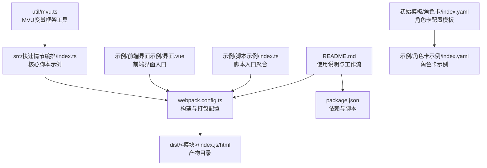
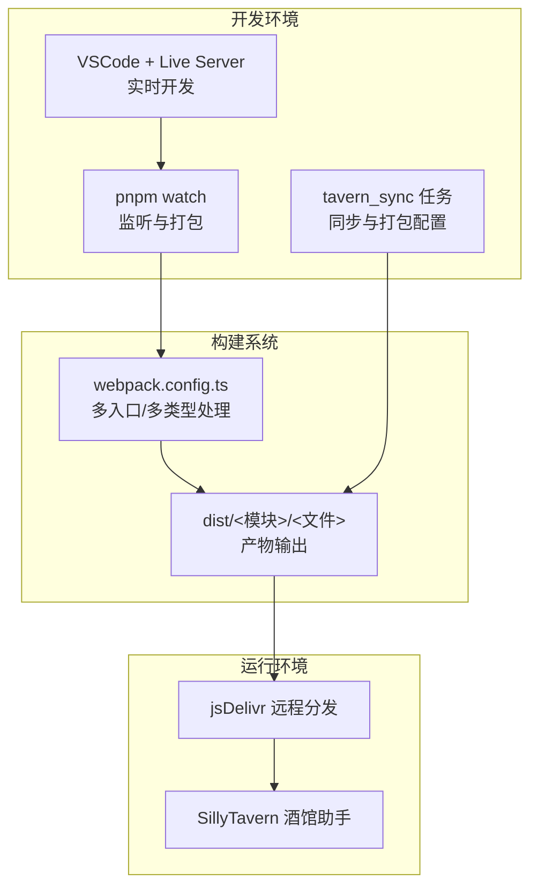
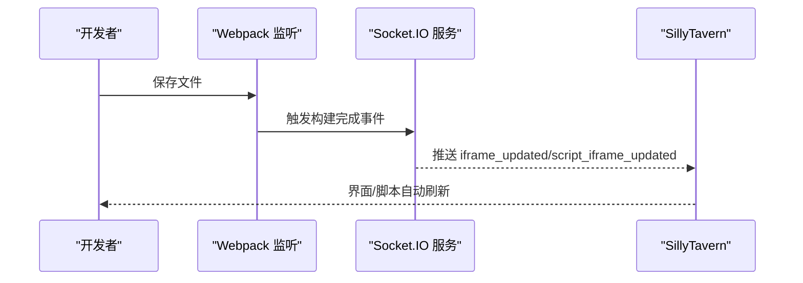
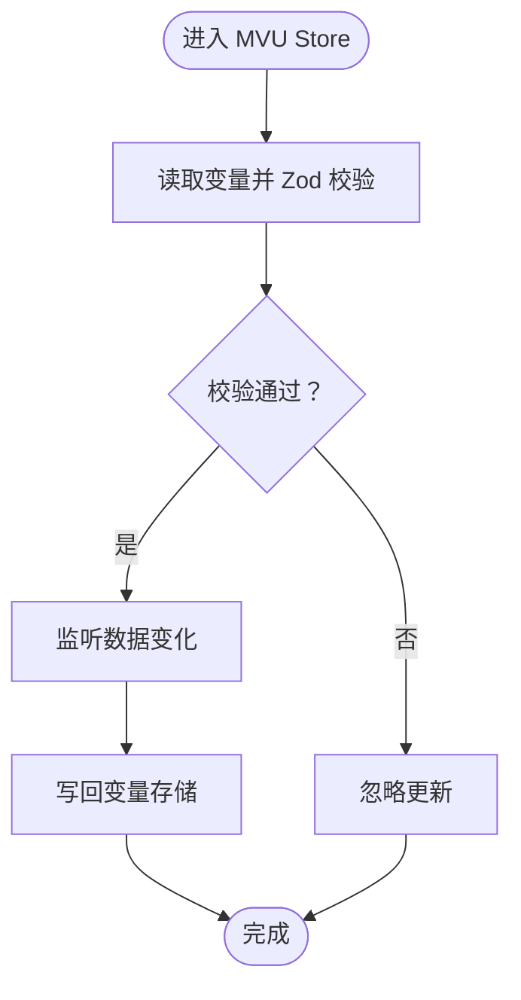
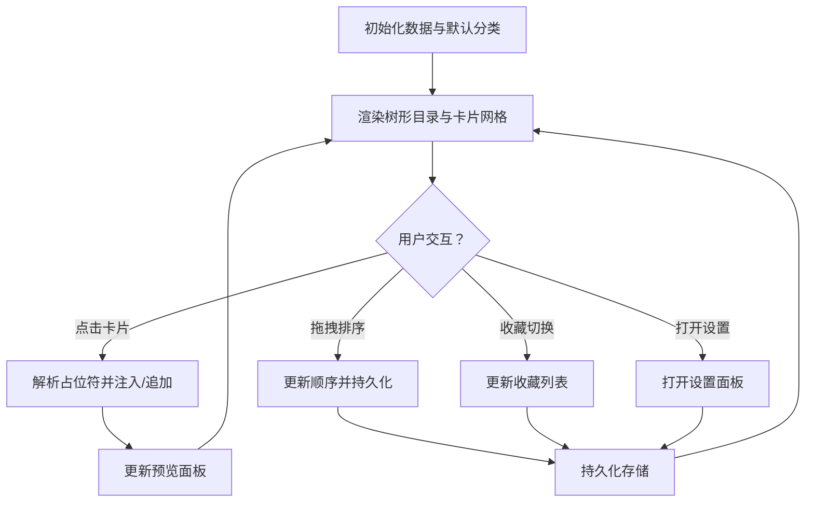
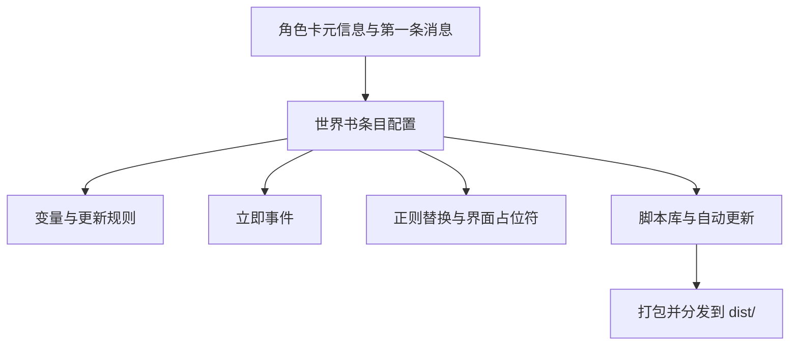
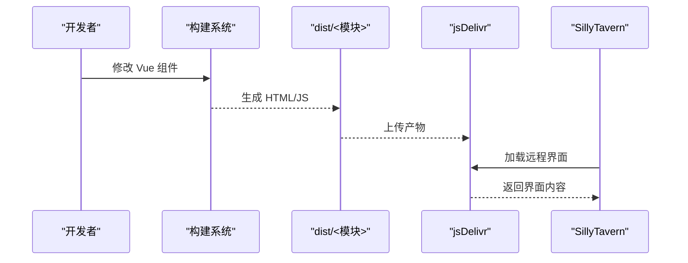
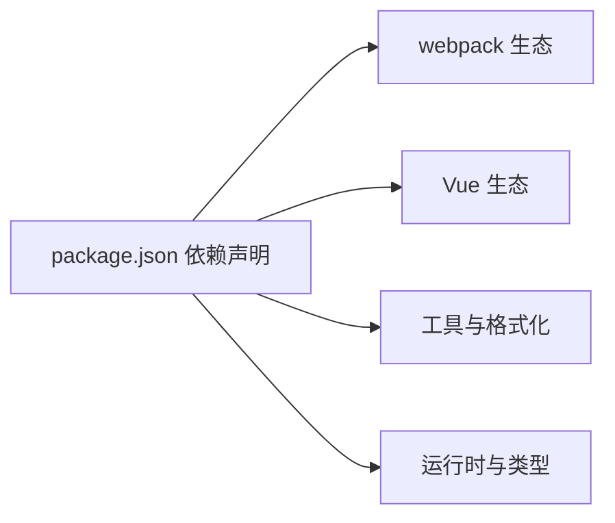

# 目标用户

<cite>
**本文引用的文件**
- [README.md](file://README.md)
- [package.json](file://package.json)
- [AGENTS.md](file://AGENTS.md)
- [CLAUDE.md](file://CLAUDE.md)
- [webpack.config.ts](file://webpack.config.ts)
- [src/快速情节编排/index.ts](file://src/快速情节编排/index.ts)
- [util/mvu.ts](file://util/mvu.ts)
- [初始模板/角色卡/新建为src文件夹中的文件夹/index.yaml](file://初始模板/角色卡/新建为src文件夹中的文件夹/index.yaml)
- [示例/角色卡示例/index.yaml](file://示例/角色卡示例/index.yaml)
- [示例/脚本示例/index.ts](file://示例/脚本示例/index.ts)
- [示例/前端界面示例/界面.vue](file://示例/前端界面示例/界面.vue)
</cite>

## 目录
1. [引言](#引言)
2. [项目结构](#项目结构)
3. [核心组件](#核心组件)
4. [架构总览](#架构总览)
5. [详细组件分析](#详细组件分析)
6. [依赖分析](#依赖分析)
7. [性能考虑](#性能考虑)
8. [故障排除指南](#故障排除指南)
9. [结论](#结论)
10. [附录](#附录)

## 引言
本项目是面向“酒馆助手（SillyTavern）”生态的模板与工具集，旨在帮助开发者、内容创作者与游戏主持人（GM）高效构建与维护前端界面、脚本、角色卡与世界书。项目提供从本地开发到云端分发的一体化工作流，支持实时热更新、自动打包与版本管理，降低协作与维护成本。

## 项目结构
项目采用“模板 + 示例 + 工具链”的组织方式：
- 模板与示例：包含前端界面、脚本、角色卡与世界书的可直接使用的示例，便于快速上手与二次开发。
- 工具链：通过构建配置与脚本实现自动打包、版本控制、远程分发与同步更新。
- 类型与接口：提供 @types 与接口定义，确保在不同环境下的一致性与可维护性。

**图表来源**
- [README.md:1-105](file://README.md#L1-L105)
- [webpack.config.ts:1-572](file://webpack.config.ts#L1-L572)
- [package.json:1-120](file://package.json#L1-L120)
- [示例/脚本示例/index.ts:1-7](file://示例/脚本示例/index.ts#L1-L7)
- [示例/前端界面示例/界面.vue:1-4](file://示例/前端界面示例/界面.vue#L1-L4)
- [src/快速情节编排/index.ts:1-800](file://src/快速情节编排/index.ts#L1-L800)
- [util/mvu.ts:1-66](file://util/mvu.ts#L1-L66)
- [初始模板/角色卡/新建为src文件夹中的文件夹/index.yaml:1-171](file://初始模板/角色卡/新建为src文件夹中的文件夹/index.yaml#L1-L171)
- [示例/角色卡示例/index.yaml:1-313](file://示例/角色卡示例/index.yaml#L1-L313)

**章节来源**
- [README.md:1-105](file://README.md#L1-L105)
- [webpack.config.ts:1-572](file://webpack.config.ts#L1-L572)
- [package.json:1-120](file://package.json#L1-L120)

## 核心组件
- 构建与打包系统：基于 webpack 的多入口配置，支持 TypeScript/Vue/Markdown/YAML 等资源处理，自动内联与优化产物，支持生产/开发模式与混淆选项。
- 实时开发与监听：内置 Socket.IO 服务，监听构建完成事件并向酒馆助手推送更新，实现“保存即生效”的实时开发体验。
- 角色卡与世界书模板：提供 YAML 配置模板与示例，涵盖变量、立即事件、正则替换、脚本库等，便于一键导入与自动更新。
- MVU 变量框架：通过 Pinia Store 封装变量读写与校验，提供响应式数据层，简化变量结构与更新逻辑。
- 快速情节编排脚本：提供可视化工作台，支持分类、收藏、占位符解析、注入/追加模式切换与预览面板，提升剧情创作效率。

**章节来源**
- [webpack.config.ts:77-183](file://webpack.config.ts#L77-L183)
- [util/mvu.ts:3-66](file://util/mvu.ts#L3-L66)
- [src/快速情节编排/index.ts:12-78](file://src/快速情节编排/index.ts#L12-L78)
- [初始模板/角色卡/新建为src文件夹中的文件夹/index.yaml:1-171](file://初始模板/角色卡/新建为src文件夹中的文件夹/index.yaml#L1-L171)
- [示例/角色卡示例/index.yaml:1-313](file://示例/角色卡示例/index.yaml#L1-L313)

## 架构总览
整体架构围绕“模板—工具链—产物—分发”展开，强调自动化与可复用性。

**图表来源**
- [AGENTS.md:18-38](file://AGENTS.md#L18-L38)
- [README.md:49-100](file://README.md#L49-L100)
- [webpack.config.ts:108-183](file://webpack.config.ts#L108-L183)

## 详细组件分析

### 组件A：实时开发与监听（Socket.IO）
- 功能概述：在开发模式下启动 Socket.IO 服务，监听构建完成事件，向酒馆助手推送更新，实现“保存即生效”的实时开发体验。
- 关键流程：
  - 启动监听服务并等待连接。
  - 构建完成后触发推送事件。
  - 酒馆助手侧接收事件并刷新界面/脚本。

**图表来源**
- [webpack.config.ts:82-107](file://webpack.config.ts#L82-L107)

**章节来源**
- [webpack.config.ts:82-107](file://webpack.config.ts#L82-L107)
- [AGENTS.md:18-38](file://AGENTS.md#L18-L38)

### 组件B：MVU 变量框架（Pinia Store + Zod 校验）
- 功能概述：封装变量读取、写入与校验，提供响应式数据层，保证变量结构一致性与类型安全。
- 关键流程：
  - 初始化 Store，读取变量并进行 Zod 校验。
  - 定时轮询与响应式更新，自动同步至变量存储。
  - 提供额外设置回调，便于扩展业务逻辑。

**图表来源**
- [util/mvu.ts:15-65](file://util/mvu.ts#L15-L65)

**章节来源**
- [util/mvu.ts:1-66](file://util/mvu.ts#L1-L66)

### 组件C：快速情节编排脚本（UI 工作台）
- 功能概述：提供可视化工作台，支持分类、收藏、占位符解析、注入/追加模式切换与预览面板，提升剧情创作效率。
- 关键流程：
  - 初始化数据结构与默认分类。
  - 渲染树形目录与卡片网格。
  - 处理用户交互（点击、拖拽、收藏、设置）。
  - 将内容注入或追加到输入框，支持预览与提示气泡。

**图表来源**
- [src/快速情节编排/index.ts:307-426](file://src/快速情节编排/index.ts#L307-L426)
- [src/快速情节编排/index.ts:787-800](file://src/快速情节编排/index.ts#L787-L800)

**章节来源**
- [src/快速情节编排/index.ts:12-78](file://src/快速情节编排/index.ts#L12-L78)
- [src/快速情节编排/index.ts:428-445](file://src/快速情节编排/index.ts#L428-L445)
- [src/快速情节编排/index.ts:655-729](file://src/快速情节编排/index.ts#L655-L729)

### 组件D：角色卡与世界书模板（YAML 配置）
- 功能概述：提供角色卡与世界书的 YAML 模板与示例，包含变量、立即事件、正则替换、脚本库等，便于一键导入与自动更新。
- 关键流程：
  - 定义角色卡元信息与第一条消息。
  - 配置世界书条目（变量、角色、立即事件）。
  - 注入正则替换与脚本库，支持状态栏界面与自动更新。

**图表来源**
- [初始模板/角色卡/新建为src文件夹中的文件夹/index.yaml:1-171](file://初始模板/角色卡/新建为src文件夹中的文件夹/index.yaml#L1-L171)
- [示例/角色卡示例/index.yaml:1-313](file://示例/角色卡示例/index.yaml#L1-L313)

**章节来源**
- [初始模板/角色卡/新建为src文件夹中的文件夹/index.yaml:1-171](file://初始模板/角色卡/新建为src文件夹中的文件夹/index.yaml#L1-L171)
- [示例/角色卡示例/index.yaml:1-313](file://示例/角色卡示例/index.yaml#L1-L313)

### 组件E：前端界面示例（Vue + 路由）
- 功能概述：提供最小化的 Vue 前端界面示例，包含路由视图与基础布局，便于快速搭建界面原型。
- 关键流程：
  - 入口文件引入路由视图。
  - 通过构建配置生成 HTML 与 JS 产物。
  - 通过 jsDelivr 远程加载界面。

**图表来源**
- [示例/前端界面示例/界面.vue:1-4](file://示例/前端界面示例/界面.vue#L1-L4)
- [README.md:49-70](file://README.md#L49-L70)

**章节来源**
- [示例/前端界面示例/界面.vue:1-4](file://示例/前端界面示例/界面.vue#L1-L4)
- [README.md:49-70](file://README.md#L49-L70)

## 依赖分析
- 开发与构建：webpack、ts-loader、vue-loader、postcss、sass、terser 等，覆盖多类型资源处理与产物优化。
- 前端与状态：vue、pinia、@vueuse、react、pixi.js 等，提供组件化与响应式能力。
- 工具与格式化：eslint、prettier、remark、yaml-loader 等，保障代码质量与文档处理。
- 运行时与类型：jquery、lodash、toastr、zod 等，提供 DOM 操作、工具函数与类型校验。

**图表来源**
- [package.json:15-107](file://package.json#L15-L107)

**章节来源**
- [package.json:15-107](file://package.json#L15-L107)

## 性能考虑
- 产物体积与加载速度：通过 SplitChunks、LimitChunkCount 与生产模式压缩，减少重复与冗余代码；CDN 分发提升加载速度。
- 实时开发体验：Socket.IO 推送与构建监听结合，缩短反馈周期；自动内联 CSS/JS，减少网络请求。
- 数据更新与渲染：MVU Store 使用定时轮询与响应式更新，避免频繁写回；快速情节编排对预览与持久化进行节流处理。

## 故障排除指南
- CORS 跨域错误：统一使用 127.0.0.1，确保 Live Server 配置允许跨域头。
- Live Server 未启动：确认 VSCode 右下角显示端口，检查端口占用与防火墙设置。
- 依赖未安装：首次运行需执行安装命令；若提示命令未找到，检查包管理器与 PATH。
- 构建失败：检查 TypeScript 与 Vue Loader 配置；确认资源查询参数（raw/url）正确。
- 自动更新失效：确认 dist 冲突策略与合并配置；必要时执行指定 Git 命令以避免冲突。

**章节来源**
- [AGENTS.md:26-32](file://AGENTS.md#L26-L32)
- [README.md:96-100](file://README.md#L96-L100)

## 结论
本项目通过完善的模板、工具链与示例，为酒馆助手生态提供了从开发到分发的一体化解决方案。其自动化与可复用特性显著降低了门槛，适合不同层次的用户快速上手并持续迭代。

## 附录

### 目标用户与使用场景
- 初学者
  - 学习路径：先阅读使用说明与实时开发流程，再参考示例文件逐步实践。
  - 易用性：提供一键下载与模板仓库两种使用方式；示例文件与脚本入口聚合便于快速上手。
- 有经验的开发者
  - 高级功能：利用 MVU 变量框架、Socket.IO 实时监听、自动打包与 CDN 分发，构建复杂界面与脚本。
  - 技术深度：深入理解构建配置、类型系统与接口契约，结合示例文件进行二次开发。
- 内容创作者与 GM
  - 使用场景：通过角色卡模板与示例，快速搭建角色与世界书；利用快速情节编排提升剧情创作效率。
  - 自动更新：借助 tavern_sync 与 jsDelivr，实现角色卡与界面的自动更新与分发。

**章节来源**
- [README.md:5-48](file://README.md#L5-L48)
- [AGENTS.md:18-38](file://AGENTS.md#L18-L38)
- [示例/脚本示例/index.ts:1-7](file://示例/脚本示例/index.ts#L1-L7)
- [示例/前端界面示例/界面.vue:1-4](file://示例/前端界面示例/界面.vue#L1-L4)
- [src/快速情节编排/index.ts:12-78](file://src/快速情节编排/index.ts#L12-L78)
- [util/mvu.ts:1-66](file://util/mvu.ts#L1-L66)