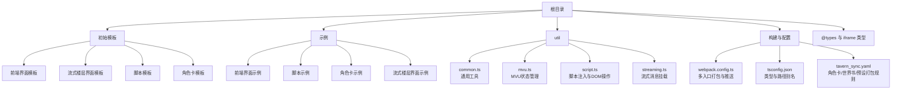
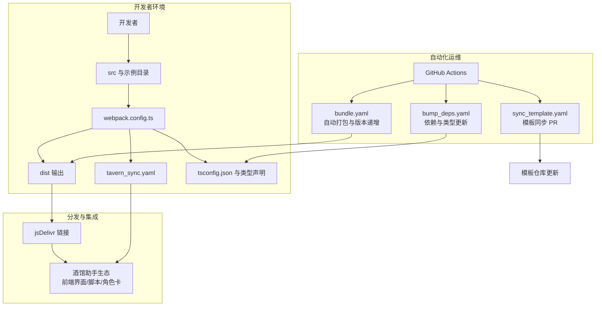
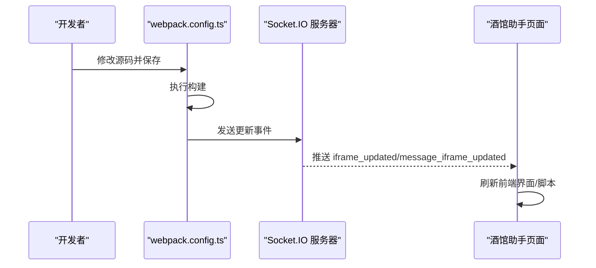
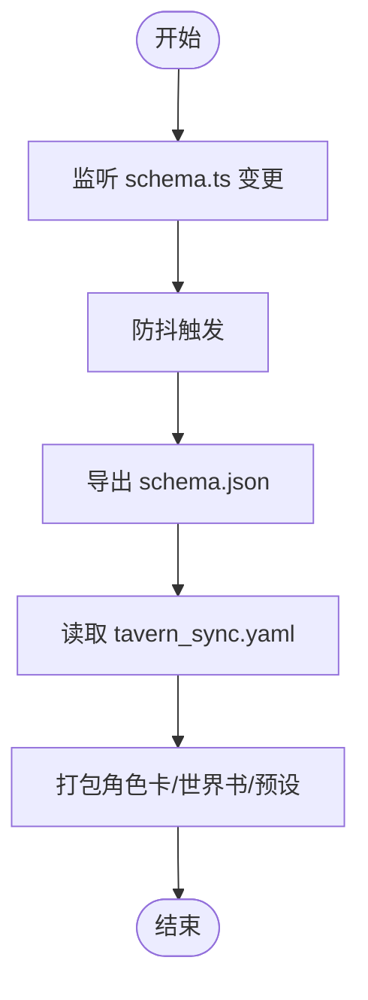
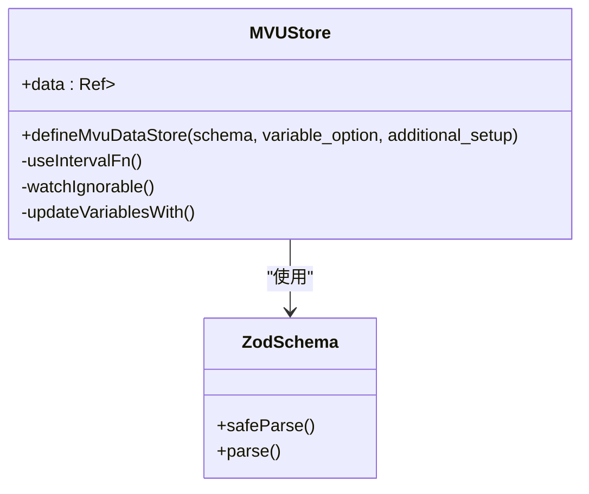
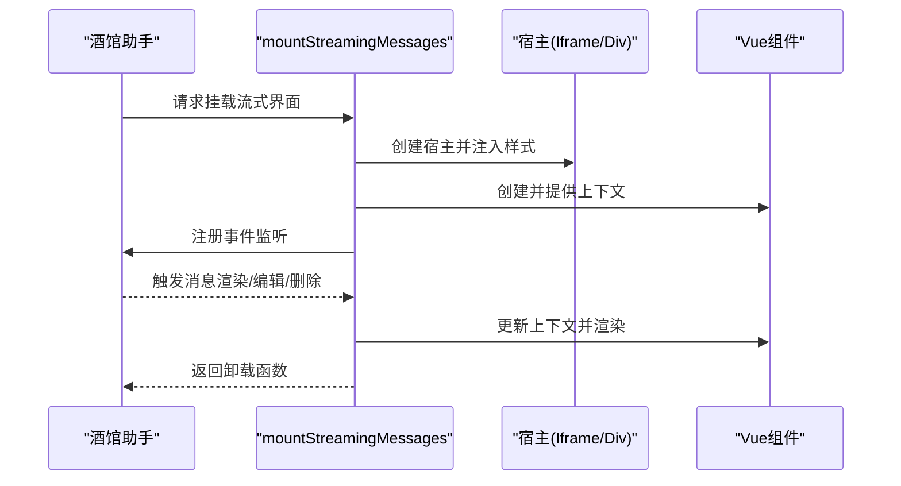
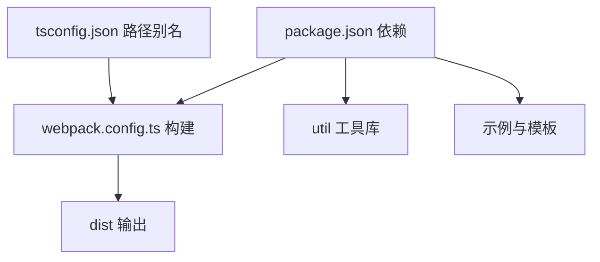

# 项目介绍

<cite>
**本文档引用的文件**
- [README.md](file://README.md)
- [package.json](file://package.json)
- [webpack.config.ts](file://webpack.config.ts)
- [tsconfig.json](file://tsconfig.json)
- [tavern_sync.yaml](file://tavern_sync.yaml)
- [util/common.ts](file://util/common.ts)
- [util/mvu.ts](file://util/mvu.ts)
- [util/script.ts](file://util/script.ts)
- [util/streaming.ts](file://util/streaming.ts)
- [示例/前端界面示例/界面.vue](file://示例/前端界面示例/界面.vue)
- [示例/脚本示例/index.ts](file://示例/脚本示例/index.ts)
- [示例/角色卡示例/index.yaml](file://示例/角色卡示例/index.yaml)
- [示例/角色卡示例/界面/状态栏/App.vue](file://示例/角色卡示例/界面/状态栏/App.vue)
- [示例/流式楼层界面示例/App.vue](file://示例/流式楼层界面示例/App.vue)
</cite>

## 目录
1. [引言](#引言)
2. [项目结构](#项目结构)
3. [核心组件](#核心组件)
4. [架构总览](#架构总览)
5. [详细组件分析](#详细组件分析)
6. [依赖关系分析](#依赖关系分析)
7. [性能考虑](#性能考虑)
8. [故障排除指南](#故障排除指南)
9. [结论](#结论)
10. [附录](#附录)

## 引言
本项目是为酒馆助手（SillyTavern）生态设计的前端界面与脚本开发模板，旨在帮助开发者快速创建、调试与部署各类前端界面、脚本与角色卡。项目提供两种使用模式：
- 仅本地使用：适合快速原型与离线开发，无法通过 jsDelivr 实现自动更新与自动化打包。
- 作为 GitHub 仓库：可借助 GitHub Actions 实现自动打包、依赖更新与模板同步，同时通过 jsDelivr 提供可自动更新的资源链接。

项目的核心价值在于：
- 快速开发：提供标准化的工程化构建流程与模板文件，降低上手成本。
- 自动化运维：通过 CI 工作流实现打包、依赖更新与模板同步，减少重复劳动。
- 生态集成：与酒馆助手生态紧密耦合，支持角色卡、世界书、预设的打包与导入。
- 开放扩展：通过 jsDelivr 链接，用户可直接引用仓库中的前端界面与脚本，实现“所见即所得”的自动更新体验。

## 项目结构
项目采用“模板 + 示例 + 工具库 + 构建配置”的组织方式，主要目录与职责如下：
- 初始模板：提供前端界面、流式楼层界面、脚本与角色卡的最小可用模板，便于开发者快速起步。
- 示例：包含前端界面示例、脚本示例、角色卡示例与流式楼层界面示例，展示常见用法与最佳实践。
- util：封装通用工具函数，如 MVU 状态管理、脚本注入与流式消息挂载等。
- 构建与配置：webpack.config.ts 定义多入口打包、热更新推送、Schema 导出与 Tavern 同步；tsconfig.json 提供类型与路径别名配置；tavern_sync.yaml 定义角色卡/世界书/预设的打包与导入规则。
- 类型声明：@types 与 iframe 目录提供与酒馆助手生态相关的类型定义，确保开发时的类型安全。

图表来源
- [webpack.config.ts:77-80](file://webpack.config.ts#L77-L80)
- [tsconfig.json:16-23](file://tsconfig.json#L16-L23)
- [tavern_sync.yaml:6-28](file://tavern_sync.yaml#L6-L28)

章节来源
- [README.md:5-105](file://README.md#L5-L105)
- [webpack.config.ts:77-80](file://webpack.config.ts#L77-L80)
- [tsconfig.json:16-23](file://tsconfig.json#L16-L23)
- [tavern_sync.yaml:6-28](file://tavern_sync.yaml#L6-L28)

## 核心组件
- 多入口构建系统：基于 webpack 的多入口扫描与打包，自动识别 src 与示例目录下的 index.{ts,tsx,js,jsx}，并按目录结构输出至 dist，支持热更新推送与生产优化。
- 自动化推送与监听：在开发模式下，构建完成后通过 Socket.IO 向酒馆助手推送更新事件，实现前端界面与脚本的实时刷新。
- Schema 导出与 Tavern 同步：监听 schema.ts 的变更，自动导出为 schema.json；同时通过 tavern_sync.yaml 配置角色卡/世界书/预设的打包与导入路径。
- MVU 状态管理：提供基于 Pinia 的 MVU 数据存储定义，自动从变量系统读取与回写状态，保证界面与变量的双向一致性。
- 流式消息挂载：提供 mountStreamingMessages API，将 Vue 组件挂载到酒馆的流式消息楼层，支持 iframe 与 div 两种宿主模式，自动处理编辑态切换与样式隔离。
- 脚本注入与 DOM 操作：提供脚本注入、样式传送、聊天切换重载等工具，简化脚本与界面的集成。

章节来源
- [webpack.config.ts:51-75](file://webpack.config.ts#L51-L75)
- [webpack.config.ts:82-107](file://webpack.config.ts#L82-L107)
- [webpack.config.ts:115-129](file://webpack.config.ts#L115-L129)
- [webpack.config.ts:137-183](file://webpack.config.ts#L137-L183)
- [util/mvu.ts:3-66](file://util/mvu.ts#L3-L66)
- [util/streaming.ts:41-238](file://util/streaming.ts#L41-L238)
- [util/script.ts:1-47](file://util/script.ts#L1-L47)

## 架构总览
项目整体架构围绕“模板-构建-同步-分发”展开，结合 GitHub Actions 实现自动化运维，最终通过 jsDelivr 为用户提供可自动更新的资源链接。

图表来源
- [README.md:71-89](file://README.md#L71-L89)
- [webpack.config.ts:137-183](file://webpack.config.ts#L137-L183)
- [tavern_sync.yaml:6-28](file://tavern_sync.yaml#L6-L28)

章节来源
- [README.md:71-89](file://README.md#L71-L89)
- [webpack.config.ts:137-183](file://webpack.config.ts#L137-L183)
- [tavern_sync.yaml:6-28](file://tavern_sync.yaml#L6-L28)

## 详细组件分析

### 组件一：多入口构建与热更新推送
- 功能概述：扫描 src 与示例目录，自动识别 index.{ts,tsx,js,jsx} 作为入口，构建至 dist；在开发模式下，构建完成后通过 Socket.IO 推送更新事件，触发酒馆助手页面刷新。
- 关键点：
  - 入口扫描与去重：避免同一目录的重复入口。
  - 输出路径映射：保持与源目录一致的层级结构。
  - 热更新推送：区分 HTML 与脚本两类入口，分别推送对应事件。
- 适用场景：前端界面与脚本的快速迭代与实时预览。

图表来源
- [webpack.config.ts:82-107](file://webpack.config.ts#L82-L107)

章节来源
- [webpack.config.ts:51-75](file://webpack.config.ts#L51-L75)
- [webpack.config.ts:82-107](file://webpack.config.ts#L82-L107)

### 组件二：Schema 导出与 Tavern 同步
- 功能概述：监听 schema.ts 的变更，自动导出为 schema.json；通过 tavern_sync.yaml 配置角色卡/世界书/预设的打包与导入路径，支持一键打包并生成可导入文件。
- 关键点：
  - Debounce 导出：避免频繁写入。
  - 子进程监听：在 watch 模式下启动同步进程，实时输出日志。
  - 进程清理：优雅退出与信号处理。
- 适用场景：角色卡/世界书/预设的持续维护与批量导出。

图表来源
- [webpack.config.ts:115-129](file://webpack.config.ts#L115-L129)
- [webpack.config.ts:137-183](file://webpack.config.ts#L137-L183)
- [tavern_sync.yaml:6-28](file://tavern_sync.yaml#L6-L28)

章节来源
- [webpack.config.ts:115-129](file://webpack.config.ts#L115-L129)
- [webpack.config.ts:137-183](file://webpack.config.ts#L137-L183)
- [tavern_sync.yaml:6-28](file://tavern_sync.yaml#L6-L28)

### 组件三：MVU 状态管理
- 功能概述：基于 Zod Schema 定义 MVU 数据存储，自动从变量系统读取 stat_data，提供响应式更新与持久化回写，支持额外初始化逻辑。
- 关键点：
  - 变量选项：支持消息级变量与最新消息快捷方式。
  - 定时同步：每 2 秒轮询变量系统，保持界面与变量一致。
  - 深度监听：对数据进行深度比较，避免不必要的回写。
- 适用场景：角色卡状态栏、变量面板等需要与变量系统强耦合的界面。

图表来源
- [util/mvu.ts:3-66](file://util/mvu.ts#L3-L66)

章节来源
- [util/mvu.ts:3-66](file://util/mvu.ts#L3-L66)

### 组件四：流式消息挂载
- 功能概述：将 Vue 组件挂载到酒馆的流式消息楼层，支持 iframe 与 div 两种宿主模式；自动处理编辑态切换、样式隔离与组件生命周期。
- 关键点：
  - 宿主选择：iframe 隔离样式，div 继承样式但需注意类名冲突。
  - 上下文注入：通过 provide/inject 传递消息上下文。
  - 事件监听：监听消息渲染、编辑、删除与更多消息加载事件，动态挂载/卸载组件。
- 适用场景：对话流式渲染、消息高亮与交互增强。

图表来源
- [util/streaming.ts:41-238](file://util/streaming.ts#L41-L238)

章节来源
- [util/streaming.ts:41-238](file://util/streaming.ts#L41-L238)

### 组件五：脚本注入与 DOM 操作
- 功能概述：提供脚本注入、样式传送、聊天切换重载等工具，简化脚本与界面的集成。
- 关键点：
  - 样式传送：将页面样式传送到 iframe 或指定容器，避免样式污染。
  - 聊天切换重载：检测聊天变化后自动刷新页面。
  - DOM 安全：通过唯一标识符隔离脚本 DOM。
- 适用场景：脚本与界面的桥接、样式隔离与页面联动。

章节来源
- [util/script.ts:1-47](file://util/script.ts#L1-L47)

### 组件六：示例与模板
- 前端界面示例：展示路由视图与基础布局。
- 脚本示例：演示加载/卸载、事件绑定、消息监听、设置界面与消息楼层调整等常见模式。
- 角色卡示例：包含角色描述、锚点、世界书条目、变量与立即事件等，展示角色卡的完整结构与 jsDelivr 链接使用。
- 流式楼层界面示例：展示如何将消息内容拆分为前/中/后三段，并在中间段插入交互组件。

章节来源
- [示例/前端界面示例/界面.vue:1-4](file://示例/前端界面示例/界面.vue#L1-L4)
- [示例/脚本示例/index.ts:1-7](file://示例/脚本示例/index.ts#L1-L7)
- [示例/角色卡示例/index.yaml:1-313](file://示例/角色卡示例/index.yaml#L1-L313)
- [示例/流式楼层界面示例/App.vue:1-72](file://示例/流式楼层界面示例/App.vue#L1-L72)

## 依赖关系分析
项目通过 package.json 管理开发与运行时依赖，构建配置通过 tsconfig.json 提供路径别名与类型支持，webpack.config.ts 实现多入口打包与外部依赖按需加载。

图表来源
- [package.json:15-107](file://package.json#L15-L107)
- [tsconfig.json:16-23](file://tsconfig.json#L16-L23)
- [webpack.config.ts:51-75](file://webpack.config.ts#L51-L75)

章节来源
- [package.json:15-107](file://package.json#L15-L107)
- [tsconfig.json:16-23](file://tsconfig.json#L16-L23)
- [webpack.config.ts:51-75](file://webpack.config.ts#L51-L75)

## 性能考虑
- 代码分割与懒加载：通过 SplitChunks 将第三方库与默认模块分离，减少首屏体积。
- 生产优化：启用 Terser 压缩与混淆，保留必要全局变量的引用，兼顾可读性与体积。
- 外部依赖按需加载：通过 externals 将常用库指向 CDN，减少打包体积并提升缓存命中率。
- 防抖与节流：Schema 导出与 Tavern 同步采用防抖策略，避免频繁写入与进程启动。
- 热更新推送：仅在 HTML 入口构建完成后推送事件，减少不必要的刷新。

章节来源
- [webpack.config.ts:484-520](file://webpack.config.ts#L484-L520)
- [webpack.config.ts:521-568](file://webpack.config.ts#L521-L568)
- [webpack.config.ts:115-129](file://webpack.config.ts#L115-L129)
- [webpack.config.ts:137-183](file://webpack.config.ts#L137-L183)

## 故障排除指南
- 仅本地使用模式无法自动更新：
  - 现象：无法通过 jsDelivr 实现前端界面或脚本的自动更新。
  - 处理：使用本地下载 ZIP 包进行开发，或创建 GitHub 仓库以启用自动化功能。
- dist 冲突问题：
  - 现象：自动打包导致分支冲突。
  - 处理：在 .gitattributes 中设置冲突策略为使用当前版本；执行全局 merge.ours.driver 配置以启用该策略。
- jsDelivr 链接失效：
  - 现象：通过 jsDelivr 访问的资源返回 404。
  - 处理：确认仓库已正确打包并上传至 dist；检查 CI 是否成功执行；核对链接中的仓库路径与分支。
- 开发时热更新不生效：
  - 现象：修改源码后页面未刷新。
  - 处理：确认开发模式下 Socket.IO 服务已启动；检查控制台是否有连接失败日志；验证推送事件是否被触发。
- Tavern 同步进程异常：
  - 现象：schema.ts 变更未导出或同步未执行。
  - 处理：检查子进程输出日志；确认 tavern_sync.yaml 配置正确；重启开发服务器后重试。

章节来源
- [README.md:22-31](file://README.md#L22-L31)
- [README.md:90-100](file://README.md#L90-L100)
- [README.md:49-69](file://README.md#L49-L69)
- [webpack.config.ts:82-107](file://webpack.config.ts#L82-L107)
- [webpack.config.ts:137-183](file://webpack.config.ts#L137-L183)

## 结论
本模板项目通过工程化构建、自动化运维与生态集成，为酒馆助手的前端界面与脚本开发提供了高效、稳定且可扩展的解决方案。开发者既可以选择仅本地使用以快速迭代，也可选择作为 GitHub 仓库以获得自动打包、依赖更新与模板同步能力，并通过 jsDelivr 实现资源的自动更新与分发。配合 MVU 状态管理与流式消息挂载等工具，能够显著提升开发效率与用户体验。

## 附录
- 适用场景：
  - 快速搭建前端界面与脚本原型。
  - 维护角色卡、世界书与预设的持续集成流程。
  - 需要与酒馆助手生态深度集成的交互增强功能。
- 目标用户：
  - 酒馆助手生态的开发者与内容创作者。
  - 希望通过自动化工具提升开发效率的团队与个人。