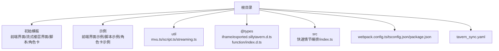
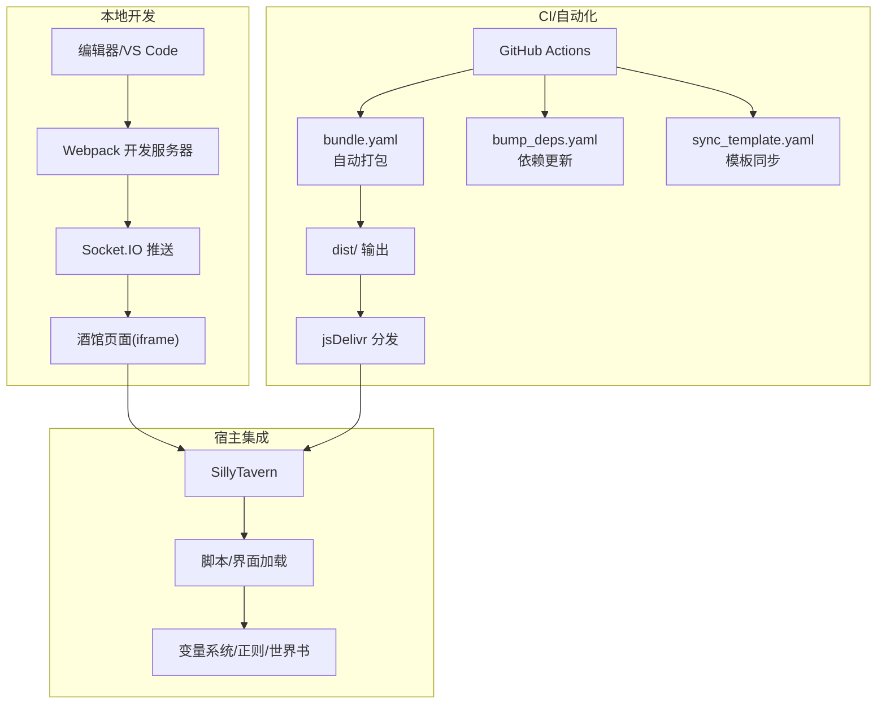
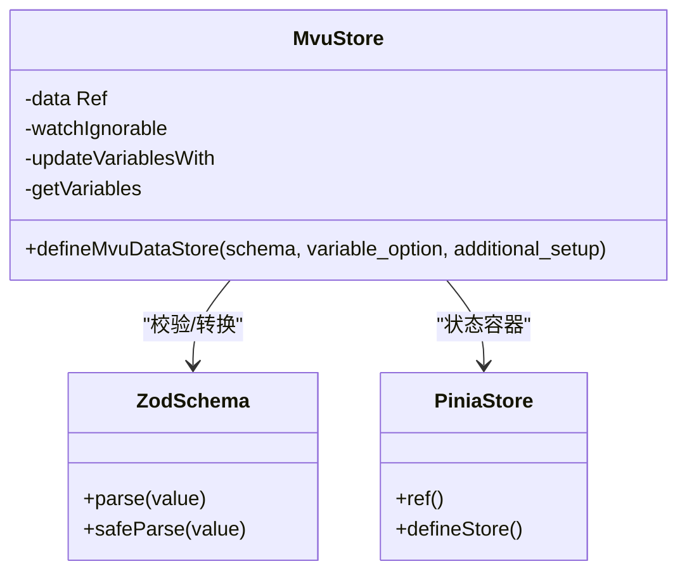
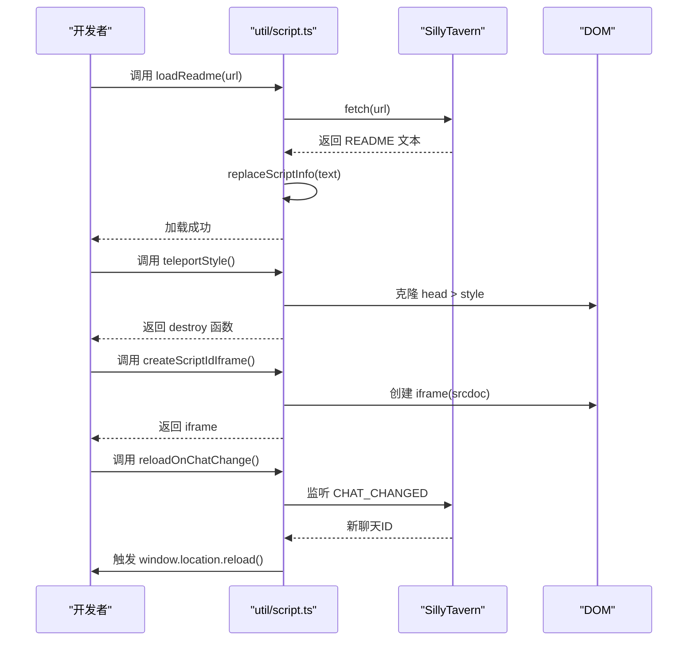
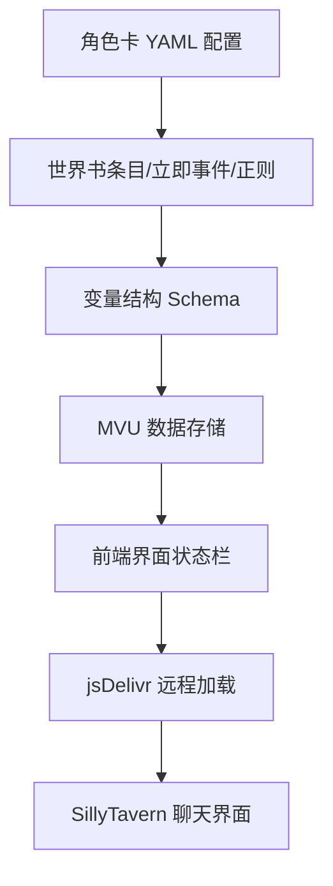
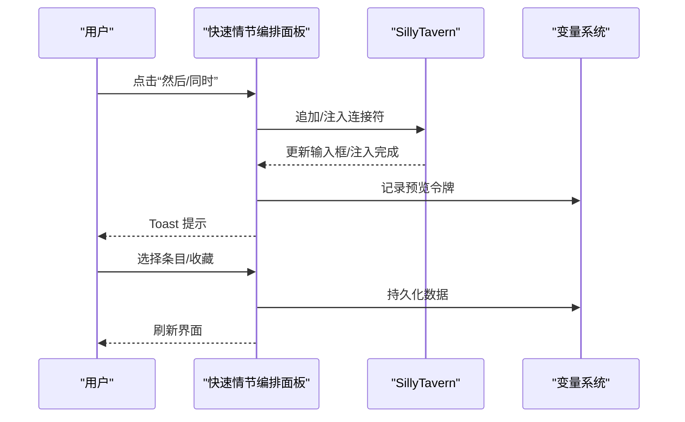
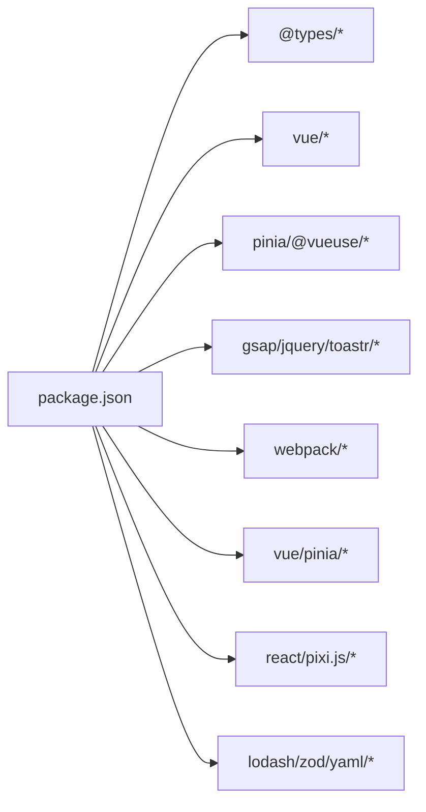

# 项目概述

<cite>
**本文档引用的文件**
- [README.md](file://README.md)
- [package.json](file://package.json)
- [webpack.config.ts](file://webpack.config.ts)
- [tsconfig.json](file://tsconfig.json)
- [src/快速情节编排/index.ts](file://src/快速情节编排/index.ts)
- [util/mvu.ts](file://util/mvu.ts)
- [util/script.ts](file://util/script.ts)
- [@types/iframe/exported.sillytavern.d.ts](file://@types/iframe/exported.sillytavern.d.ts)
- [@types/function/index.d.ts](file://@types/function/index.d.ts)
- [示例/角色卡示例/index.yaml](file://示例/角色卡示例/index.yaml)
- [示例/角色卡示例/schema.ts](file://示例/角色卡示例/schema.ts)
- [tavern_sync.yaml](file://tavern_sync.yaml)
</cite>

## 目录
1. [引言](#引言)
2. [项目结构](#项目结构)
3. [核心组件](#核心组件)
4. [架构总览](#架构总览)
5. [详细组件分析](#详细组件分析)
6. [依赖分析](#依赖分析)
7. [性能考虑](#性能考虑)
8. [故障排查指南](#故障排查指南)
9. [结论](#结论)
10. [附录](#附录)

## 引言
本项目是面向酒馆助手（SillyTavern）生态的前端界面与脚本开发模板，旨在帮助开发者快速搭建可热更新、可打包、可自动同步的交互式界面与脚本。项目提供从模板工程到示例实现的完整链路：包括本地开发、CI 自动化打包、jsDelivr 分发、角色卡/世界书/预设的同步与打包、以及与酒馆助手接口的深度集成。

项目核心价值主张：
- 快速原型：提供可直接导入酒馆的前端界面与脚本模板，降低上手成本。
- 自动化流水线：通过 GitHub Actions 实现自动打包、版本号递增、依赖更新与模板同步。
- 生态集成：内置对 SillyTavern 与酒馆助手接口的类型声明与使用范式，确保脚本与界面与宿主环境稳定兼容。
- 可扩展的数据模型：通过 Zod Schema 与 MVU（消息-视图-更新）模式，构建可演进的状态管理与变量系统。

## 项目结构
项目采用“模板 + 示例 + 工具 + 类型声明”的组织方式，便于开发者复制、定制与复用。

图表来源
- [webpack.config.ts:1-572](file://webpack.config.ts#L1-L572)
- [tsconfig.json:1-54](file://tsconfig.json#L1-L54)
- [package.json:1-120](file://package.json#L1-L120)

章节来源
- [README.md:1-105](file://README.md#L1-L105)
- [webpack.config.ts:1-572](file://webpack.config.ts#L1-L572)
- [tsconfig.json:1-54](file://tsconfig.json#L1-L54)
- [package.json:1-120](file://package.json#L1-L120)

## 核心组件
- 构建与打包
  - Webpack 配置支持多入口、Vue 单文件组件、TypeScript、样式内联与外链、资源内联与模块化输出；内置 Socket.IO 监听与推送，实现“热更新”体验。
  - 支持自动 schema 导出、tavern_sync 监听与打包，以及混淆与最小化策略。
- 类型与接口
  - 提供 SillyTavern 与酒馆助手的 TypeScript 声明文件，覆盖消息、角色卡、世界书、正则、变量、脚本等接口，保障脚本与界面与宿主 API 的一致性。
- 工具库
  - MVU 数据存储：基于 Pinia 的 MVU 封装，结合 Zod Schema 校验与变量系统，实现数据持久化与双向同步。
  - 脚本工具：提供 README 加载、样式传送、iframe 创建、聊天切换重载等实用函数。
- 示例与模板
  - 提供前端界面、流式楼层界面、脚本与角色卡模板，以及角色卡 YAML 配置与 Schema 定义，便于快速落地。

章节来源
- [webpack.config.ts:185-572](file://webpack.config.ts#L185-L572)
- [@types/iframe/exported.sillytavern.d.ts:1-698](file://@types/iframe/exported.sillytavern.d.ts#L1-L698)
- [@types/function/index.d.ts:1-170](file://@types/function/index.d.ts#L1-L170)
- [util/mvu.ts:1-66](file://util/mvu.ts#L1-L66)
- [util/script.ts:1-47](file://util/script.ts#L1-L47)
- [示例/角色卡示例/index.yaml:1-313](file://示例/角色卡示例/index.yaml#L1-L313)
- [示例/角色卡示例/schema.ts:1-52](file://示例/角色卡示例/schema.ts#L1-L52)

## 架构总览
项目整体架构围绕“模板-构建-分发-集成”展开，通过本地开发与 CI 两条路径，实现脚本与界面的自动化交付与版本管理。

图表来源
- [README.md:71-89](file://README.md#L71-L89)
- [webpack.config.ts:82-107](file://webpack.config.ts#L82-L107)

章节来源
- [README.md:5-105](file://README.md#L5-L105)
- [webpack.config.ts:82-107](file://webpack.config.ts#L82-L107)

## 详细组件分析

### 组件A：MVU 数据存储（util/mvu.ts）
该组件封装了基于 Pinia 的 MVU 模式，结合 Zod Schema 对变量数据进行校验与持久化，实现“数据驱动”的状态管理。

图表来源
- [util/mvu.ts:3-66](file://util/mvu.ts#L3-L66)

章节来源
- [util/mvu.ts:1-66](file://util/mvu.ts#L1-L66)

### 组件B：脚本工具（util/script.ts）
提供脚本开发常用能力：README 动态加载、样式传送、iframe 创建、聊天切换重载等，提升脚本与界面的可移植性与用户体验。

图表来源
- [util/script.ts:1-47](file://util/script.ts#L1-L47)
- [@types/iframe/exported.sillytavern.d.ts:406-414](file://@types/iframe/exported.sillytavern.d.ts#L406-L414)

章节来源
- [util/script.ts:1-47](file://util/script.ts#L1-L47)
- [@types/iframe/exported.sillytavern.d.ts:382-698](file://@types/iframe/exported.sillytavern.d.ts#L382-L698)

### 组件C：角色卡与变量系统（示例/角色卡示例）
角色卡示例展示了如何通过 YAML 配置角色卡、世界书条目、立即事件与正则脚本，并通过“前端界面状态栏”脚本将远程界面注入到聊天中。

图表来源
- [示例/角色卡示例/index.yaml:1-313](file://示例/角色卡示例/index.yaml#L1-L313)
- [示例/角色卡示例/schema.ts:1-52](file://示例/角色卡示例/schema.ts#L1-L52)
- [@types/function/index.d.ts:138-145](file://@types/function/index.d.ts#L138-L145)

章节来源
- [示例/角色卡示例/index.yaml:1-313](file://示例/角色卡示例/index.yaml#L1-L313)
- [示例/角色卡示例/schema.ts:1-52](file://示例/角色卡示例/schema.ts#L1-L52)
- [@types/function/index.d.ts:138-145](file://@types/function/index.d.ts#L138-L145)

### 组件D：快速情节编排（src/快速情节编排/index.ts）
这是一个独立的脚本示例，演示了如何在酒馆中嵌入一个可拖拽、可收藏、可预览的“情节编排”面板，支持“然后/同时”连接符与注入/追加两种消息模式。

图表来源
- [src/快速情节编排/index.ts:583-664](file://src/快速情节编排/index.ts#L583-L664)
- [src/快速情节编排/index.ts:641-655](file://src/快速情节编排/index.ts#L641-L655)

章节来源
- [src/快速情节编排/index.ts:1-800](file://src/快速情节编排/index.ts#L1-L800)

## 依赖分析
项目依赖分为两类：开发依赖与运行依赖。开发依赖覆盖构建、格式化、类型检查、样式处理与打包优化；运行依赖覆盖前端框架、状态管理、动画、UI 组件与数据校验等。

图表来源
- [package.json:15-107](file://package.json#L15-L107)

章节来源
- [package.json:1-120](file://package.json#L1-L120)

## 性能考虑
- 构建优化
  - 分割异步代码块、限制最大分块数量，减少首屏体积。
  - 生产模式启用 Terser 最小化与保留关键标识符，开发模式开启可读源码映射。
  - 外部依赖通过 CDN 模块导入，减小打包体积。
- 运行优化
  - MVU 模式使用深拷贝与防抖更新，避免频繁渲染。
  - 预览令牌与 Toast 容器按需创建，减少 DOM 操作。
- CI 优化
  - dist 冲突策略使用“当前版本”，避免无意义的合并冲突。
  - 自动版本号递增，加速 jsDelivr 缓存刷新。

章节来源
- [webpack.config.ts:484-520](file://webpack.config.ts#L484-L520)
- [webpack.config.ts:521-568](file://webpack.config.ts#L521-L568)
- [README.md:90-101](file://README.md#L90-L101)

## 故障排查指南
- 打包冲突
  - 现象：dist 文件夹频繁出现合并冲突。
  - 处理：在本地执行配置命令以启用“当前版本优先”的合并策略。
  - 参考：[README.md:96-101](file://README.md#L96-L101)
- CI 自动化
  - 现象：自动打包/同步未生效。
  - 处理：确认 Actions 权限与工作流状态；检查 tavern_sync 配置与打包命令。
  - 参考：[README.md:20-89](file://README.md#L20-L89)，[tavern_sync.yaml:1-28](file://tavern_sync.yaml#L1-L28)
- 热更新失效
  - 现象：修改代码后页面未自动刷新。
  - 处理：确认开发服务器与 Socket.IO 监听是否启动；检查浏览器跨域与 CSP 设置。
  - 参考：[webpack.config.ts:82-107](file://webpack.config.ts#L82-L107)
- 类型错误
  - 现象：TS 类型检查报错。
  - 处理：核对 @types 声明与实际宿主接口；确保 tsconfig 路径别名与 include/exclude 配置正确。
  - 参考：[@types/iframe/exported.sillytavern.d.ts:1-698](file://@types/iframe/exported.sillytavern.d.ts#L1-L698)，[tsconfig.json:16-23](file://tsconfig.json#L16-L23)

章节来源
- [README.md:20-101](file://README.md#L20-L101)
- [webpack.config.ts:82-107](file://webpack.config.ts#L82-L107)
- [tsconfig.json:16-23](file://tsconfig.json#L16-L23)
- [tavern_sync.yaml:1-28](file://tavern_sync.yaml#L1-L28)

## 结论
本项目以“模板-工具-示例-类型声明”为核心，构建了面向酒馆助手生态的前端界面与脚本开发闭环。通过本地开发与 CI 自动化双通道，实现从代码到远端分发的无缝衔接；通过 MVU 与 Zod Schema，提供可演进、可校验、可持久化的状态管理方案；通过完善的类型声明与示例角色卡，降低接入门槛并提升开发效率。适合希望在酒馆环境中快速构建交互式界面与脚本的初学者与专业开发者。

## 附录
- 术语对照
  - 酒馆助手：SillyTavern 的扩展生态，提供变量、正则、世界书、脚本等接口。
  - MVU：消息-视图-更新模式，强调单向数据流与可预测的状态变更。
  - jsDelivr：静态资源分发网络，用于远程加载脚本与界面。
- 适用场景
  - 快速搭建聊天辅助界面（如状态栏、工具面板）。
  - 构建可热更新的脚本（如变量更新、立即事件、正则处理）。
  - 角色卡与世界书的结构化管理与自动化同步。
- 目标用户
  - 初学者：通过模板与示例快速上手，理解脚本与界面的集成方式。
  - 专业开发者：基于 MVU 与类型声明，构建复杂状态管理与数据校验逻辑。